

    

<h3 align="center">UNIVERSIDAD PERUANA DE CIENCIAS APLICADAS</h3>

<h3 align="center">FACULTAD DE INGENIERÍA</h3>
<h3 align="center">INGENIERÍA DE SOFTWARE</h3>
<h4 align="center">CICLO 5</h4>
<h4 align="center">1ASI0729 - DESARROLLO DE APLICACIONES OPEN SOURCE</h4>
<h4 align="center"><strong>NRC:</strong> 7729</h4>
<h4 align="center"><strong>PROFESOR:</strong> Mori Paiva, Hugo Allan</h4>

<h3 align="center">INFORME DE TRABAJO FINAL</h3>
<h4 align="center"><strong>CICLO:</strong> 2026-20</h4>
<h4 align="center"><strong>STARTUP:</strong> NexoStock</h4>
<h4 align="center"><strong>PRODUCTO:</strong> SmartStock</h4>

<h4 align="center"><strong>INTEGRANTES:</strong></h4>

<h4 align="center">U20221G181 - Crispin Valdivia, Angel Gabriel</h4>
<h4 align="center">U20241F946 - Lopez Rimachi, Sebastian Leonardo</h4>
<h4 align="center">U202421125 - Montañez Salinas, Lorena Ariana</h4>
<h4 align="center">U20251I477 - Tuesta Girón, Kiara Lucia</h4>
<h4 align="center">U20241F205 - Vizcarra Mamani, Candy Milagros</h4>

<h4 align="center"><i>SETIEMBRE 2026</i></h4>

# **Registro de Versiones del Informe**

| Versión | Fecha | Autor | Descripción de modificación |
|:--------|:------|:------|:----------------------------|
| 1.0 | 2026-09-06 | • Crispin Valdivia, Angel Gabriel • Lopez Rimachi, Sebastian Leonardo • Montañez Salinas, Lorena Ariana • Tuesta Girón, Kiara Lucia • Vizcarra Mamani, Candy Milagros | Creación del informe a partir de la estructura definida en el enunciado del trabajo final, incluyendo la carátula, el Registro de Versiones, el Project Report Collaboration Insights, la tabla de contenidos y la sección Student Outcome. |
| 1.1 | 2026-09-06 | _Pendiente de confirmar por el equipo_ | Redacción del Capítulo I, con el Startup Profile, el Solution Profile, el análisis de las 5 W y 2 H, el Lean UX Process completo y los segmentos objetivo. |
| 1.2 | 2026-09-08 | _Pendiente de confirmar por el equipo_ | Redacción de las secciones 2.1 Competidores y 2.1.1 Análisis competitivo, con el Competitive Analysis Landscape frente a Trax Retail, Trigo Retail y Pensa Systems. |
| 1.3 | 2026-09-09 | _Pendiente de confirmar por el equipo_ | Redacción de la sección 2.1.2 Estrategias y tácticas frente a competidores. |
| 1.4 | 2026-09-10 | _Pendiente de confirmar por el equipo_ | Redacción de la sección 2.2 Entrevistas, incluyendo el diseño de entrevistas por segmento, el registro de las seis entrevistas realizadas y su análisis. |
| 1.5 | 2026-09-11 | • Crispin Valdivia, Angel Gabriel | Redacción de la sección 3.1 User Stories, con las nueve Epics, las User Stories de las aplicaciones web, las User Stories del sitio web estático y las Technical Stories del API RESTful. |
| 1.6 | 2026-09-12 | • Crispin Valdivia, Angel Gabriel | Consolidación del informe en un único archivo README.md, corrección de los enlaces de la tabla de contenidos que no resolvían y normalización de los niveles de esquema de los capítulos. |
| 1.7 | 2026-09-12 | • Crispin Valdivia, Angel Gabriel | Redacción de la sección 5.1 Software Configuration Management, con la configuración del ambiente de desarrollo, la gestión del código fuente bajo GitFlow, las convenciones de estilo de código y la configuración de despliegue. |
| 1.8 | 2026-09-12 | • Crispin Valdivia, Angel Gabriel | Incorporación de la estructura de los Capítulos IV y V, de las secciones de Conclusiones, Bibliografía y Anexos, y de la sección de Anexo de Videos de Exposiciones. |
| 1.9 | 2026-09-14 | • Crispin Valdivia, Angel Gabriel | Incorporación del URL del repositorio del Landing Page en la sección 5.1.2, del URL del sitio desplegado en GitHub Pages en la sección 5.1.4, de la evidencia de despliegue del Sprint 1 en la sección 5.2.1.7 y del enlace correspondiente en el Anexo B. |
| 1.10 | 2026-09-14 | • Crispin Valdivia, Angel Gabriel | Redacción de las secciones 4.1 Style Guidelines, con el branding, el tono de comunicación, la paleta de colores con sus relaciones de contraste, la tipografía y el espaciado, y 4.2 Information Architecture, con los sistemas de organización, etiquetado, SEO, búsqueda y navegación. Incorporación de las capturas de las vistas implementadas en la sección 5.2.1.5 y de la configuración de despliegue en la sección 5.2.1.7. |
| 1.11 | 2026-09-14 | • Crispin Valdivia, Angel Gabriel | Incorporación en la sección 5.2.1.5 de la evidencia de internacionalización del Landing Page, con la captura de la experiencia conmutada a español latinoamericano. |

# **Project Report Collaboration Insights**

**Repositorio de documentación del proyecto:** [https://github.com/NexoStock/smartstock-docs](https://github.com/NexoStock/smartstock-docs)

El informe del proyecto se elabora de forma colaborativa en un único archivo `README.md` alojado en el repositorio de documentación de la organización NexoStock. El equipo aplica GitFlow sobre este repositorio: la rama `main` conserva la versión entregada de cada hito, la rama `develop` integra el avance en curso y cada sección del informe se redacta en una rama `feature/` independiente que se integra a `develop` mediante un Pull Request. Los mensajes de commit siguen la especificación de Conventional Commits, de modo que el historial permite identificar qué sección aportó cada integrante y en qué momento.

**AV1**

Durante la primera entrega, el equipo distribuyó la redacción del informe por capítulos. La consolidación del informe en un único archivo, la corrección de la tabla de contenidos, la normalización de la estructura de los capítulos y la redacción de las secciones 3.1 User Stories y 5.1 Software Configuration Management estuvieron a cargo de Crispin Valdivia. _Pendiente: completar la distribución de la redacción de los Capítulos I y II según el registro real de aportes de cada integrante, verificable en el historial de commits del repositorio._

_Pendiente: incorporar las capturas de imagen de los analíticos de colaboración y de commits de GitHub correspondientes a AV1 (pestañas Insights → Contributors e Insights → Commits del repositorio `smartstock-docs`)._

# **Contenido**

- <a href="#registro-de-versiones-del-informe">Registro de Versiones del Informe</a>

- <a href="#project-report-collaboration-insights">Project Report Collaboration Insights</a>

- <a href="#contenido">Contenido</a>

- <a href="#student-outcome">Student Outcome</a>

- <a href="#capitulo-i-introduccion">Capítulo I: Introducción</a>
    - <a href="#11-startup-profile">1.1. Startup Profile</a>
        - <a href="#111-descripcion-de-la-startup">1.1.1. Descripción de la Startup</a>
        - <a href="#112-perfiles-de-integrantes-del-equipo">1.1.2. Perfiles de integrantes del equipo</a>
    - <a href="#12-solution-profile">1.2. Solution Profile</a>
        - <a href="#121-antecedentes-y-problematica">1.2.1. Antecedentes y problemática</a>
        - <a href="#122-lean-ux-process">1.2.2. Lean UX Process</a>
            - <a href="#1221-lean-ux-problem-statements">1.2.2.1. Lean UX Problem Statements</a>
            - <a href="#1222-lean-ux-assumptions">1.2.2.2. Lean UX Assumptions</a>
            - <a href="#1223-lean-ux-hypothesis-statements">1.2.2.3. Lean UX Hypothesis Statements</a>
            - <a href="#1224-lean-ux-canvas">1.2.2.4. Lean UX Canvas</a>
    - <a href="#13-segmentos-objetivo">1.3. Segmentos objetivo</a>

- <a href="#capitulo-ii-requirements-elicitation-analysis">Capítulo II: Requirements Elicitation &amp; Analysis</a>
    - <a href="#21-competidores">2.1. Competidores</a>
        - <a href="#211-analisis-competitivo">2.1.1. Análisis competitivo</a>
        - <a href="#212-estrategias-y-tacticas-frente-a-competidores">2.1.2. Estrategias y tácticas frente a competidores</a>
    - <a href="#22-entrevistas">2.2. Entrevistas</a>
        - <a href="#221-diseno-de-entrevistas">2.2.1. Diseño de entrevistas</a>
        - <a href="#222-registro-de-entrevistas">2.2.2. Registro de entrevistas</a>
        - <a href="#223-analisis-de-entrevistas">2.2.3. Análisis de entrevistas</a>
    - <a href="#23-needfinding">2.3. Needfinding</a>
        - <a href="#231-user-personas">2.3.1. User Personas</a>
        - <a href="#232-user-task-matrix">2.3.2. User Task Matrix</a>
        - <a href="#233-user-journey-mapping">2.3.3. User Journey Mapping</a>
        - <a href="#234-empathy-mapping">2.3.4. Empathy Mapping</a>
    - <a href="#24-big-picture-event-storming">2.4. Big Picture Event Storming</a>
    - <a href="#25-ubiquitous-language">2.5. Ubiquitous Language</a>

- <a href="#capitulo-iii-requirements-specification">Capítulo III: Requirements Specification</a>
    - <a href="#31-user-stories">3.1. User Stories</a>
    - <a href="#32-impact-mapping">3.2. Impact Mapping</a>
    - <a href="#33-product-backlog">3.3. Product Backlog</a>

- <a href="#capitulo-iv-product-design">Capítulo IV: Product Design</a>
    - <a href="#41-style-guidelines">4.1. Style Guidelines</a>
        - <a href="#411-general-style-guidelines">4.1.1. General Style Guidelines</a>
        - <a href="#412-web-style-guidelines">4.1.2. Web Style Guidelines</a>
    - <a href="#42-information-architecture">4.2. Information Architecture</a>
        - <a href="#421-organization-systems">4.2.1. Organization Systems</a>
        - <a href="#422-labeling-systems">4.2.2. Labeling Systems</a>
        - <a href="#423-seo-tags-and-meta-tags">4.2.3. SEO Tags and Meta Tags</a>
        - <a href="#424-searching-systems">4.2.4. Searching Systems</a>
        - <a href="#425-navigation-systems">4.2.5. Navigation Systems</a>
    - <a href="#43-landing-page-ui-design">4.3. Landing Page UI Design</a>
        - <a href="#431-landing-page-wireframe">4.3.1. Landing Page Wireframe</a>
        - <a href="#432-landing-page-mock-up">4.3.2. Landing Page Mock-up</a>
    - <a href="#44-web-applications-ux-ui-design">4.4. Web Applications UX/UI Design</a>
        - <a href="#441-web-applications-wireframes">4.4.1. Web Applications Wireframes</a>
        - <a href="#442-web-applications-wireflow-diagrams">4.4.2. Web Applications Wireflow Diagrams</a>
        - <a href="#443-web-applications-mock-ups">4.4.3. Web Applications Mock-ups</a>
        - <a href="#444-web-applications-user-flow-diagrams">4.4.4. Web Applications User Flow Diagrams</a>
    - <a href="#45-web-applications-prototyping">4.5. Web Applications Prototyping</a>
    - <a href="#46-domain-driven-software-architecture">4.6. Domain-Driven Software Architecture</a>
        - <a href="#461-design-level-event-storming">4.6.1. Design-Level Event Storming</a>
        - <a href="#462-software-architecture-context-diagram">4.6.2. Software Architecture Context Diagram</a>
        - <a href="#463-software-architecture-container-diagrams">4.6.3. Software Architecture Container Diagrams</a>
        - <a href="#464-software-architecture-components-diagrams">4.6.4. Software Architecture Components Diagrams</a>
    - <a href="#47-software-object-oriented-design">4.7. Software Object-Oriented Design</a>
        - <a href="#471-class-diagrams">4.7.1. Class Diagrams</a>
    - <a href="#48-database-design">4.8. Database Design</a>
        - <a href="#481-database-diagrams">4.8.1. Database Diagrams</a>

- <a href="#capitulo-v-product-implementation-validation-deployment">Capítulo V: Product Implementation, Validation &amp; Deployment</a>
    - <a href="#51-software-configuration-management">5.1. Software Configuration Management</a>
        - <a href="#511-software-development-environment-configuration">5.1.1. Software Development Environment Configuration</a>
        - <a href="#512-source-code-management">5.1.2. Source Code Management</a>
        - <a href="#513-source-code-style-guide-conventions">5.1.3. Source Code Style Guide &amp; Conventions</a>
        - <a href="#514-software-deployment-configuration">5.1.4. Software Deployment Configuration</a>
    - <a href="#52-landing-page-services-applications-implementation">5.2. Landing Page, Services &amp; Applications Implementation</a>
        - <a href="#521-sprint-1">5.2.1. Sprint 1</a>
            - <a href="#5211-sprint-planning-1">5.2.1.1. Sprint Planning 1</a>
            - <a href="#5212-aspect-leaders-and-collaborators">5.2.1.2. Aspect Leaders and Collaborators</a>
            - <a href="#5213-sprint-backlog-1">5.2.1.3. Sprint Backlog 1</a>
            - <a href="#5214-development-evidence-for-sprint-review">5.2.1.4. Development Evidence for Sprint Review</a>
            - <a href="#5215-execution-evidence-for-sprint-review">5.2.1.5. Execution Evidence for Sprint Review</a>
            - <a href="#5216-services-documentation-evidence-for-sprint-review">5.2.1.6. Services Documentation Evidence for Sprint Review</a>
            - <a href="#5217-software-deployment-evidence-for-sprint-review">5.2.1.7. Software Deployment Evidence for Sprint Review</a>
            - <a href="#5218-team-collaboration-insights-during-sprint">5.2.1.8. Team Collaboration Insights during Sprint</a>
    - <a href="#53-validation-interviews">5.3. Validation Interviews</a>
        - <a href="#531-diseno-de-entrevistas">5.3.1. Diseño de Entrevistas</a>
        - <a href="#532-registro-de-entrevistas">5.3.2. Registro de Entrevistas</a>
        - <a href="#533-evaluaciones-segun-heuristicas">5.3.3. Evaluaciones según heurísticas</a>
    - <a href="#54-video-about-the-product">5.4. Video About-the-Product</a>

- <a href="#conclusiones">Conclusiones</a>
    - <a href="#conclusiones-y-recomendaciones">Conclusiones y recomendaciones</a>
    - <a href="#video-about-the-team">Video About-the-Team</a>

- <a href="#bibliografia">Bibliografía</a>

- <a href="#anexos">Anexos</a>

# **Student Outcome**

El curso contribuye al cumplimiento del Student Outcome ABET:

**ABET – EAC - Student Outcome 3**

Criterio: _Capacidad de comunicarse efectivamente con un rango de audiencias._

En el siguiente cuadro se describe las acciones realizadas y enunciados de conclusiones por parte del grupo, que permiten sustentar el haber alcanzado el logro del ABET – EAC - Student Outcome 3.

| Criterio específico | Acciones realizadas | Conclusiones |
|:--------------------|:--------------------|:-------------|
| **Comunica oralmente con efectividad a diferentes rangos de audiencia.** | **Crispin Valdivia, Angel Gabriel** _AV1_ Condujo la sesión de trabajo en la que el equipo acordó el flujo de trabajo GitFlow, las convenciones de Conventional Commits y el esquema de versionado semántico, explicando a los integrantes el motivo de cada convención y cómo aplicarla. Expuso ante el equipo la estructura del informe exigida por el enunciado y la correspondencia entre cada sección y la entrega en la que se evalúa. _Pendiente de completar con la participación en el video de exposición de AV1._  **Lopez Rimachi, Sebastian Leonardo** _AV1_ _Pendiente de completar por el integrante._  **Montañez Salinas, Lorena Ariana** _AV1_ _Pendiente de completar por la integrante._  **Tuesta Girón, Kiara Lucia** _AV1_ _Pendiente de completar por la integrante._  **Vizcarra Mamani, Candy Milagros** _AV1_ _Pendiente de completar por la integrante._ | _AV1_ El equipo comprobó que acordar las convenciones de trabajo en una sesión conjunta, en lugar de documentarlas y esperar que cada integrante las leyera, redujo las diferencias de criterio al momento de registrar los aportes en el repositorio. _Pendiente de ampliar la conclusión grupal una vez grabado el video de exposición y realizada la sustentación._ |
| **Comunica por escrito con efectividad a diferentes rangos de audiencia.** | **Crispin Valdivia, Angel Gabriel** _AV1_ Consolidó el informe del proyecto en un único archivo README.md, normalizó los niveles de esquema de los capítulos y corrigió los enlaces de la tabla de contenidos que no resolvían, de modo que el documento pueda ser recorrido por el docente sin rutas rotas. Redactó la sección 3.1 User Stories, dirigida a una audiencia técnica, especificando nueve Epics y treinta historias con criterios de aceptación bajo la estructura Gherkin, incluyendo las Technical Stories del API RESTful con el rol Developer. Redactó la sección 5.1 Software Configuration Management, documentando el ambiente de desarrollo, las convenciones de ramificación, de mensajes de commit y de estilo de código que el equipo aplica en los cuatro repositorios. Redactó los términos y condiciones de servicio del Landing Page, dirigidos a una audiencia no técnica, evidenciando los principios del código de ética de ACM/IEEE y del Colegio de Ingenieros del Perú. Documentó el design system del producto en una guía de estilos consultable, de modo que las decisiones visuales queden disponibles para el resto del equipo sin depender de explicaciones verbales.  **Lopez Rimachi, Sebastian Leonardo** _AV1_ _Pendiente de completar por el integrante._  **Montañez Salinas, Lorena Ariana** _AV1_ _Pendiente de completar por la integrante._  **Tuesta Girón, Kiara Lucia** _AV1_ _Pendiente de completar por la integrante._  **Vizcarra Mamani, Candy Milagros** _AV1_ _Pendiente de completar por la integrante._ | _AV1_ El equipo verificó que redactar el informe en Markdown dentro de un repositorio de control de versiones permite que la autoría de cada sección quede registrada de forma verificable, y no solo declarada en un cuadro. La elaboración de artefactos dirigidos a audiencias distintas —criterios de aceptación en Gherkin para una audiencia técnica, términos y condiciones para el visitante del sitio web— evidenció que el registro y el nivel de detalle deben ajustarse al lector antes que al autor. _Pendiente de ampliar la conclusión grupal con los aportes escritos del resto de integrantes._ |

# Capítulo I: Introducción

## 1.1. Startup Profile

Actualmente, muchas bodegas y minimarkets realizan el control de sus productos mediante registros manuales o sistemas que no reflejan de manera inmediata la cantidad física disponible en sus estantes. Esta situación puede generar diferencias entre el inventario registrado y el inventario real, dificultando la identificación de productos agotados o con niveles bajos de stock y afectando la planificación del abastecimiento.

La falta de información actualizada también puede provocar pérdidas de ventas, compras innecesarias, acumulación de productos y dificultades para coordinar oportunamente la reposición con los proveedores. Además, los administradores deben dedicar tiempo a realizar verificaciones manuales para conocer qué productos necesitan ser reabastecidos.

Frente a esta problemática surge **NexoStock**, una startup orientada al desarrollo de soluciones tecnológicas para mejorar la gestión de inventarios en bodegas y minimarkets mediante tecnologías web e Internet de las Cosas (IoT). Nuestro propósito es facilitar el monitoreo del inventario físico y proporcionar información que permita tomar decisiones de abastecimiento de manera más rápida y organizada.

Como parte de esta propuesta, desarrollamos **SmartStock**, una plataforma web que utiliza sensores de peso conectados a dispositivos IoT para obtener información sobre la cantidad física disponible de determinados productos. El sistema permite comparar estos datos con el stock registrado, detectar diferencias o niveles bajos de inventario y generar alertas para apoyar la reposición de productos.

Además, SmartStock busca mejorar el proceso de reposición mediante alertas automáticas y notificaciones. A partir de las alertas generadas por la plataforma, los propietarios y administradores podrán identificar los productos que requieren abastecimiento y recibir un aviso oportuno (por correo o WhatsApp) para coordinar externamente la reposición con sus proveedores.

### 1.1.1. Descripción de la Startup

**NexoStock** es una startup tecnológica orientada al desarrollo de soluciones digitales para mejorar la gestión de inventarios en bodegas y minimarkets. Nuestra propuesta integra tecnologías web e Internet de las Cosas (IoT) para conectar la información registrada en el sistema con la cantidad física de productos disponible en los establecimientos.

Como parte de esta iniciativa, desarrollamos **SmartStock**, una plataforma web que utiliza sensores de peso conectados a dispositivos IoT para monitorear el inventario en tiempo real. La información obtenida permite comparar el stock físico con el registrado, detectar productos con niveles bajos de existencia, identificar diferencias de inventario y generar alertas para facilitar una reposición oportuna.

Asimismo, la plataforma permite consultar información sobre la rotación de productos, mermas y comportamiento histórico del inventario, apoyando a los administradores en la toma de decisiones. Además, SmartStock incorpora funcionalidades orientadas a facilitar la reposición de productos. Los propietarios y administradores podrán identificar necesidades de abastecimiento mediante las alertas del sistema y utilizar esta información para coordinar oportunamente la reposición con sus proveedores.

De esta manera, **NexoStock** busca contribuir a una gestión de inventarios más eficiente, reducir pérdidas económicas y mejorar la coordinación entre los pequeños comercios y sus proveedores.

A continuación, se presentan la misión, visión y valores que guían a nuestra startup:

| **Misión** | **Visión** | **Valores** |
| --- | --- | --- |
| Brindar soluciones tecnológicas que permitan a bodegas y minimarkets gestionar sus inventarios de manera eficiente mediante tecnologías web e IoT, facilitando el monitoreo de productos y la coordinación oportuna con sus proveedores. | Convertirnos en una startup referente en soluciones inteligentes para la gestión de inventarios en pequeños comercios, contribuyendo a su transformación digital, eficiencia operativa y crecimiento sostenible. | **Innovación:** buscamos mejorar continuamente nuestras soluciones tecnológicas.  **Confianza:** brindamos información clara y confiable para la toma de decisiones.  **Eficiencia:** promovemos una mejor gestión de recursos e inventarios.  **Responsabilidad:** desarrollamos soluciones orientadas a las necesidades reales de los usuarios.  **Colaboración:** fomentamos una mejor coordinación entre comercios y proveedores. |

### 1.1.2. Perfiles de integrantes del equipo

## 1.2. Solution Profile

Nuestra solución, **SmartStock**, es una plataforma web inteligente orientada a mejorar la gestión de inventarios en bodegas y minimarkets mediante el uso de tecnologías web e Internet de las Cosas (IoT). La plataforma utiliza sensores de peso conectados a dispositivos IoT para obtener información sobre la cantidad física disponible de determinados productos y compararla con el stock registrado en el sistema.

A partir de esta información, SmartStock permite detectar productos con niveles bajos de existencia, diferencias entre el inventario físico y el registrado y posibles necesidades de reposición. Asimismo, el sistema genera alertas que permiten a los administradores identificar oportunamente qué productos requieren abastecimiento y consultar información relacionada con la rotación, mermas y comportamiento histórico del inventario para apoyar la toma de decisiones.

Además, la plataforma incorpora funcionalidades orientadas a la gestión de la reposición. Los propietarios y administradores podrán visualizar las necesidades de abastecimiento de los productos, generar alertas ante posibles faltantes y utilizar esta información para coordinar la reposición con sus proveedores. De esta manera, se busca reducir el tiempo necesario para identificar y atender necesidades de abastecimiento.

El principal valor diferencial de **SmartStock** radica en integrar el monitoreo del inventario físico mediante dispositivos IoT con una plataforma web que centraliza la información y facilita su consulta. A diferencia de los métodos tradicionales basados principalmente en revisiones manuales o registros que pueden no reflejar inmediatamente la cantidad física disponible, SmartStock busca proporcionar información actualizada que contribuya a reducir pérdidas económicas, mejorar la disponibilidad de productos y facilitar una gestión de inventarios más eficiente.

### 1.2.1. Antecedentes y problemática

En el contexto de las bodegas y minimarkets, el control de inventarios constituye una actividad crítica para garantizar la disponibilidad de productos, reducir pérdidas y coordinar de manera oportuna el abastecimiento. Sin embargo, en muchos pequeños comercios el seguimiento del stock todavía depende de conteos manuales, registros parciales o verificaciones periódicas que no siempre reflejan con precisión la cantidad física disponible en los estantes o zonas de almacenamiento.

Esta situación puede generar diferencias entre el inventario registrado y el inventario físico, lo que dificulta detectar a tiempo productos con niveles bajos de existencia, faltantes no identificados o reposiciones pendientes. Como consecuencia, los negocios pueden enfrentar quiebres de stock, pérdida de ventas, acumulación innecesaria de mercadería y uso ineficiente del tiempo del personal encargado del control.

Asimismo, la problemática no solo afecta a los administradores de los establecimientos, sino también a los proveedores, ya que una comunicación tardía sobre la falta de stock retrasa la reposición y reduce la capacidad de respuesta ante la demanda. Por ello, el proceso de inventario requiere no solo mayor precisión, sino también una mejor articulación entre los actores involucrados.

A nivel nacional, esta problemática también se refleja en la disponibilidad de productos en el punto de venta. Según Ñaupari et al. (2021), con datos registrados en 2014, el 61.76% de los productos no repuestos en góndola se relaciona con responsabilidades internas de la cadena, mientras que el 38.24% corresponde a responsabilidades del proveedor. Esto evidencia que los problemas de disponibilidad no dependen únicamente del abastecimiento externo, sino también de los procesos internos de control y reposición del establecimiento.

Frente a esta necesidad surge SmartStock, producto desarrollado por la startup NexoStock, como una plataforma web inteligente orientada a mejorar la gestión del inventario físico en bodegas y minimarkets mediante sensores de peso conectados a dispositivos IoT. La solución busca comparar automáticamente la cantidad física disponible con el stock registrado, detectar diferencias o niveles bajos de inventario y generar alertas que faciliten la reposición. Estas alertas permitirán a los responsables de minimarkets y bodegas de barrio identificar oportunamente las necesidades de abastecimiento y recibir un aviso a tiempo para gestionar la reposición con sus proveedores.

El análisis de la responsabilidad en la falta de reposición de productos, presentado en el Gráfico 1, permite dimensionar con mayor precisión el origen del problema dentro del sector retail peruano, evidenciando la necesidad de mecanismos de monitoreo interno como el que propone SmartStock.

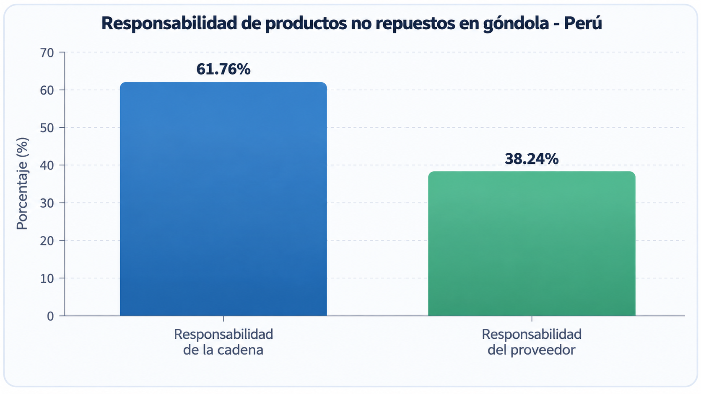

*Gráfico 1. Responsabilidad de los productos no repuestos en góndola en el Perú. Fuente: Ñaupari et al. (2021), con datos nacionales de 2014. Elaboración propia.*

#### Conclusiones a partir del Gráfico 1:

- El 61.76% de los productos no repuestos en góndola se relaciona con responsabilidades internas de la cadena, mientras que el 38.24% corresponde a responsabilidades del proveedor.

- Esto evidencia que los problemas de disponibilidad no dependen únicamente del abastecimiento externo, sino también de los procesos internos de control y reposición del establecimiento.

- Una mejor coordinación entre los comercios y sus proveedores puede contribuir a reducir los faltantes y mejorar la disponibilidad de productos.

Complementariamente, el siguiente gráfico muestra cómo la mejora de los procesos de recepción y reposición puede incrementar la disponibilidad de productos en góndola, evidenciando la importancia de contar con mecanismos adecuados de control y abastecimiento.

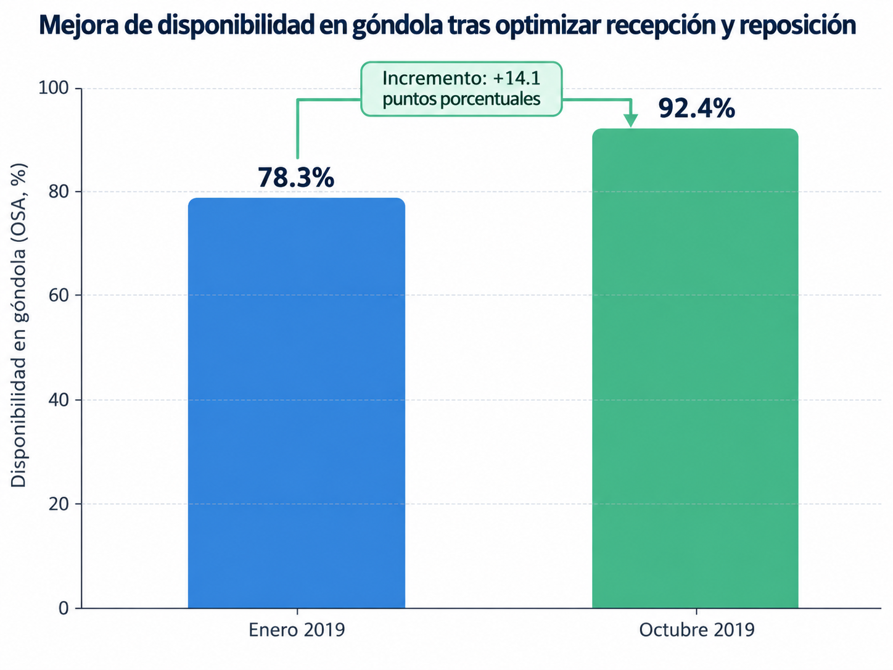

*Gráfico 2. Evolución de la disponibilidad en góndola (OSA) después de mejorar los procesos de recepción y reposición. Fuente: Ñaupari et al. (2021). Elaboración propia.*

#### Conclusiones a partir del Gráfico 2:

- La disponibilidad en góndola aumentó de 78.3% en enero de 2019 a 92.4% en octubre de 2019.

- Esto representa una mejora de 14.1 puntos porcentuales en la disponibilidad de productos.

- Los resultados evidencian que mejorar los procesos de recepción, control y reposición puede reducir los problemas de falta de productos y favorecer una gestión más eficiente del inventario.

En conjunto, ambos gráficos evidencian que los problemas de disponibilidad de productos están relacionados tanto con los procesos internos de los establecimientos como con la participación de los proveedores. Asimismo, se observa que una gestión adecuada de la recepción y reposición puede mejorar significativamente la disponibilidad en góndola. Desde una perspectiva causal, el siguiente Diagrama de Ishikawa sintetiza las principales causas de la problemática.

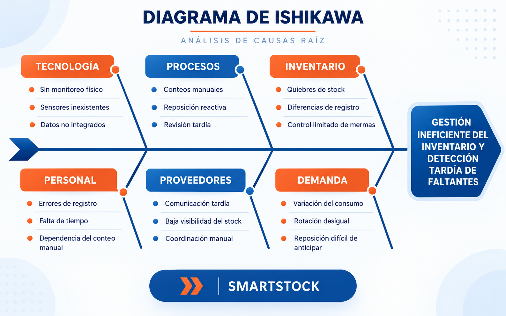

*Gráfico 3. Diagrama de Ishikawa sobre las causas de la gestión ineficiente del inventario en bodegas y minimarkets. (2026). Elaboración propia.*

#### Conclusiones a partir del Gráfico 3:

- La problemática del inventario es multifactorial, ya que intervienen factores tecnológicos, operativos, humanos, de coordinación con proveedores y de comportamiento de la demanda.

- La dimensión tecnológica resulta crítica, debido a que la ausencia de monitoreo físico automatizado y de integración entre datos limita la visibilidad del inventario real.

- La coordinación con proveedores constituye un factor relevante, puesto que una detección tardía de faltantes también retrasa el proceso de reposición y afecta la disponibilidad de productos.

El flujo del problema puede describirse de la siguiente manera: durante la operación diaria se producen ventas y salidas de productos, pero si no existe un mecanismo de monitoreo automático del stock físico, las diferencias entre lo registrado y lo realmente disponible pueden pasar desapercibidas. Esto lleva a revisiones tardías, quiebres de stock y una reposición demorada. El siguiente diagrama resume este ciclo e indica el punto en el que SmartStock interviene.

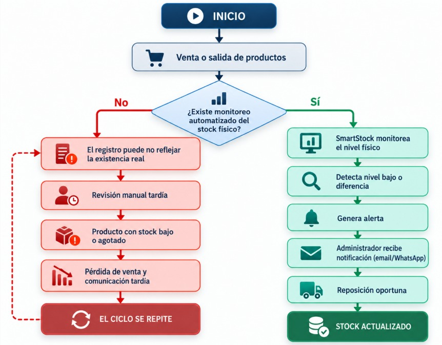

*Gráfico 4. Diagrama de flujo sobre el ciclo de detección tardía y reposición del inventario en bodegas y minimarkets. (2026). Elaboración propia.*

#### Conclusiones a partir del Gráfico 4:

- Sin un sistema de monitoreo automatizado, el negocio entra en un ciclo repetitivo de desactualización del inventario, revisión tardía y reposición reactiva.

- SmartStock actúa como punto de quiebre al detectar niveles bajos de stock o diferencias entre el inventario físico y el registrado antes de que se produzca una afectación mayor.

- La generación de alertas y la visibilidad compartida con administradores y proveedores permiten transformar un proceso reactivo en uno preventivo y mejor coordinado.

#### The 5W's and 2H's

#### 1. What – ¿Cuál es el problema?

El problema consiste en la dificultad de bodegas y minimarkets para mantener actualizado el control de su inventario físico, lo que puede generar diferencias con el stock registrado y provocar que los productos con niveles bajos o agotados sean identificados de manera tardía.

#### 2. When – ¿Cuándo ocurre?

La problemática se presenta durante las operaciones diarias del establecimiento, especialmente cuando se realizan ventas, recepción de mercadería, reposiciones o movimientos frecuentes que modifican continuamente las existencias disponibles.

#### 3. Where – ¿Dónde ocurre?

Se presenta principalmente en bodegas y minimarkets donde el control del inventario físico depende de verificaciones manuales o de sistemas que no están conectados directamente con las existencias reales en estantes o zonas de almacenamiento.

#### 4. Who – ¿Quiénes están involucrados?

Los principales involucrados son los propietarios o administradores de bodegas y minimarkets, encargados del control y reposición del inventario, así como los proveedores responsables de abastecer los productos comercializados por estos establecimientos.

#### 5. Why – ¿Por qué ocurre?

Ocurre debido a la dependencia de conteos manuales, errores durante el registro de movimientos, falta de sincronización entre inventario físico y digital, variaciones en la demanda y una comunicación que puede darse tardíamente entre comercios y proveedores.

#### 6. How – ¿Cómo se puede solucionar?

La solución propuesta, SmartStock, plantea utilizar sensores de peso conectados a dispositivos IoT para monitorear las existencias físicas de determinados productos. La plataforma web procesa estos datos para compararlos con el inventario registrado, detectar niveles bajos de stock, generar alertas y facilitar la coordinación de reposición.

#### 7. How much – ¿Cuánto impacto genera / cuánto cuesta la solución?

La falta de un control adecuado del inventario puede generar pérdidas por quiebres de stock, compras innecesarias, exceso de existencias y tiempo empleado en verificaciones manuales. En cuanto a la solución, el costo dependerá de la escala de implementación, cantidad de sensores y alcance del servicio; sin embargo, su propósito es reducir costos operativos y mejorar la disponibilidad de productos.

*Gráfico 5. Equipo NexoStock. The 5 W’s y 2H’s sobre la problemática de la gestión de inventarios en bodegas y minimarkets. (2026). Elaboración propia.*

### 1.2.2. Lean UX Process

#### 1.2.2.1. Lean UX Problem Statements

Actualmente, la gestión de inventarios en **minimarkets y bodegas de barrio** depende en gran medida de conteos manuales, registros realizados por los administradores y verificaciones periódicas de los productos disponibles. Esta forma de trabajo puede generar diferencias entre el inventario registrado y el inventario físico, dificultando la detección oportuna de productos con niveles bajos de stock o agotados.

Asimismo, los propietarios y administradores necesitan conocer constantemente qué productos requieren reposición para mantener una adecuada disponibilidad de mercadería. Sin embargo, cuando la información del inventario no se encuentra actualizada, la identificación de faltantes puede realizarse de manera tardía, generando quiebres de stock, pérdida de oportunidades de venta y mayor tiempo dedicado a verificaciones manuales.

Las soluciones tradicionales de gestión de inventarios se enfocan principalmente en registrar entradas y salidas de productos, pero no necesariamente permiten conocer de manera automática la cantidad física disponible. Además, algunas soluciones tecnológicas existentes están orientadas a operaciones de retail de mayor escala, lo que puede dificultar su adopción en pequeños establecimientos debido a su complejidad o costos de implementación.

Nuestra solución, **SmartStock**, busca cubrir esta brecha mediante una plataforma web que integre sensores de peso conectados a dispositivos IoT para monitorear las existencias físicas de determinados productos, compararlas con el stock registrado y generar alertas ante niveles bajos o diferencias de inventario. La información obtenida también permitirá apoyar la planificación de la reposición mediante notificaciones automáticas que informen oportunamente a los usuarios sobre las necesidades de abastecimiento, facilitando así su coordinación posterior con los proveedores.

Nuestro enfoque inicial estará dirigido a los **propietarios y administradores de minimarkets**, considerados como el segmento principal debido al mayor volumen de productos y movimientos de inventario que gestionan. Como segmento secundario, se consideran los **propietarios y administradores de bodegas de barrio**, quienes también requieren mejorar el control de sus existencias, aunque pueden presentar una menor capacidad de inversión y necesidades operativas diferentes.

Consideraremos que la solución es exitosa cuando los usuarios de ambos segmentos puedan detectar con mayor rapidez productos con bajo stock, identificar diferencias entre el inventario físico y el registrado, reducir el tiempo dedicado a verificaciones manuales y mejorar la planificación de la reposición de productos.

De acuerdo con lo anterior, planteamos el siguiente Problem Statement:

> *¿De qué manera podríamos mejorar la gestión de inventarios en minimarkets y bodegas de barrio para que sus propietarios y administradores puedan conocer oportunamente los niveles reales de stock, detectar faltantes y diferencias de inventario, y gestionar la reposición de productos mediante una solución automatizada basada en tecnologías IoT?*

---

#### 1.2.2.2. Lean UX Assumptions

Para abordar la problemática relacionada con la gestión de inventarios en minimarkets y bodegas de barrio, se han definido supuestos que orientan el desarrollo de SmartStock. Estos supuestos consideran las necesidades de ambos segmentos objetivo, los resultados esperados del negocio y las funcionalidades necesarias para validar la propuesta.

##### Business Assumptions

- Creemos que los minimarkets necesitan mejorar el control de su inventario físico debido al volumen de productos y movimientos que gestionan diariamente.
- Suponemos que los propietarios y administradores de minimarkets valorarán una solución que reduzca el tiempo dedicado a conteos y verificaciones manuales.
- Creemos que las bodegas de barrio también presentan dificultades para mantener actualizado su inventario y requieren una solución sencilla y de bajo esfuerzo operativo.
- Suponemos que los minimarkets constituyen el segmento principal de SmartStock por la priorización comercial definida por el equipo y por una mayor capacidad de pago mensual esperada.
- Creemos que las bodegas de barrio constituyen un segmento secundario con un mercado amplio, pero con mayor sensibilidad al costo de adopción.
- Suponemos que un modelo de suscripción escalable, acompañado de una implementación gradual de sensores, puede adaptarse a las posibilidades de ambos segmentos.

##### Business Outcome Assumptions

- Creemos que SmartStock permitirá reducir las diferencias entre el inventario físico y el inventario registrado.
- Suponemos que las alertas de stock bajo permitirán disminuir los casos en los que un producto se agota sin ser detectado oportunamente.
- Creemos que la plataforma permitirá reducir el tiempo destinado a verificaciones manuales del inventario.
- Suponemos que la información generada por SmartStock facilitará una reposición más oportuna de productos.
- Creemos que una interfaz sencilla favorecerá la adopción de SmartStock en minimarkets y bodegas de barrio.
- Suponemos que una oferta escalable permitirá captar inicialmente minimarkets y posteriormente ampliar la adopción hacia bodegas de barrio.

##### User Assumptions

- Creemos que el segmento principal estará conformado por propietarios y administradores de minimarkets responsables del control de inventario y la reposición.
- Suponemos que el segmento secundario estará conformado por propietarios y administradores de bodegas de barrio que realizan el control de sus productos de manera directa.
- Creemos que los responsables de minimarkets necesitan visualizar rápidamente el estado de un inventario con mayor cantidad de productos y movimientos.
- Suponemos que los responsables de bodegas de barrio necesitan una solución simple, fácil de aprender y que no incremente significativamente su carga operativa.
- Creemos que ambos segmentos necesitan información clara y actualizada para identificar productos con bajo stock.
- Suponemos que ambos segmentos presentan distintos niveles de experiencia tecnológica, por lo que la plataforma debe ser intuitiva y accesible.

##### User Outcome and Benefit Assumptions

- Creemos que los responsables de minimarkets podrán identificar con mayor rapidez los productos que requieren reposición.
- Suponemos que los responsables de bodegas de barrio podrán reducir el tiempo empleado en conteos y verificaciones manuales.
- Creemos que ambos segmentos podrán detectar con mayor facilidad diferencias entre las existencias físicas y las registradas.
- Suponemos que los usuarios podrán tomar decisiones de reposición con información más actualizada.
- Creemos que las alertas permitirán anticipar faltantes antes de que los productos se agoten.
- Suponemos que los reportes e información histórica ayudarán a comprender mejor la rotación y el comportamiento del inventario.

##### Feature Assumptions

- Creemos que el monitoreo mediante sensores de peso IoT permitirá obtener información sobre las existencias físicas de determinados productos.
- Creemos que la comparación automática entre el stock físico y el stock registrado permitirá identificar diferencias de inventario.
- Creemos que las alertas automáticas de stock bajo ayudarán a detectar oportunamente necesidades de reposición.
- Suponemos que la configuración de niveles mínimos de stock permitirá adaptar las alertas a las necesidades de cada establecimiento.
- Creemos que un dashboard de inventario facilitará la visualización del estado general de los productos.
- Suponemos que el historial de alertas, movimientos y reportes de rotación permitirá realizar un mejor seguimiento del inventario.
- Creemos que una función de gestión de reposición permitirá registrar necesidades de abastecimiento y facilitar la coordinación con proveedores externos.

---

#### 1.2.2.3. Lean UX Hypothesis Statements

De acuerdo con los supuestos definidos previamente, planteamos las siguientes hipótesis para validar si las funcionalidades propuestas de SmartStock generan beneficios para los propietarios y administradores de minimarkets, como segmento principal, y para los propietarios y administradores de bodegas de barrio, como segmento secundario. Se plantea un Hypothesis Statement por cada Feature Assumption definido.

##### Hipótesis de negocio

1. **Creemos que** implementar el monitoreo del inventario físico mediante sensores de peso IoT permitirá reducir las diferencias entre el stock físico y el stock registrado en minimarkets y bodegas de barrio. **Sabremos que hemos tenido éxito cuando veamos que al menos el 80% de los productos monitoreados** presentan información consistente entre las existencias físicas detectadas y las registradas durante las pruebas de validación.

2. **Creemos que** comparar automáticamente el stock físico con el stock registrado permitirá a los propietarios y administradores identificar diferencias de inventario con mayor rapidez. **Sabremos que hemos tenido éxito cuando veamos que al menos el 75% de los usuarios** logra identificar correctamente una diferencia de inventario mediante la plataforma sin necesidad de realizar previamente un conteo manual.

3. **Creemos que** implementar alertas automáticas de stock bajo permitirá reducir los casos en los que un producto se agota sin que el propietario o administrador lo detecte oportunamente. **Sabremos que hemos tenido éxito cuando veamos que al menos el 80% de los usuarios** considera que las alertas le permiten anticipar una necesidad de reposición antes de que el producto se agote.

4. **Creemos que** permitir la configuración de niveles mínimos de stock por producto facilitará una gestión preventiva del inventario según las necesidades de cada establecimiento. **Sabremos que hemos tenido éxito cuando veamos que al menos el 75% de los propietarios y administradores** logra configurar correctamente los niveles mínimos de sus productos y utilizar las alertas generadas para planificar su reposición.

##### Hipótesis de usuario

1. **Creemos que** ofrecer un dashboard web de inventario permitirá a los propietarios y administradores de minimarkets y bodegas de barrio consultar con mayor rapidez el estado de sus productos. **Sabremos que hemos tenido éxito cuando veamos que al menos el 85% de los usuarios** logra identificar productos con stock suficiente, bajo o agotado sin requerir asistencia.

2. **Creemos que** proporcionar un historial de movimientos, alertas y reportes de rotación permitirá a los propietarios y administradores comprender mejor el comportamiento de su inventario y tomar decisiones de reposición. **Sabremos que hemos tenido éxito cuando veamos que al menos el 70% de los usuarios** considera que la información histórica y los reportes son útiles para planificar el abastecimiento de sus productos.

3. **Creemos que** incorporar herramientas para gestionar y dar seguimiento a las necesidades de reposición permitirá a los propietarios y administradores organizar mejor el abastecimiento de sus establecimientos y coordinar oportunamente con sus proveedores. **Sabremos que hemos tenido éxito cuando veamos que al menos el 75% de los usuarios** logra identificar una necesidad de reposición, consultar su estado y registrar la acción correspondiente mediante SmartStock.

#### 1.2.2.4. Lean UX Canvas

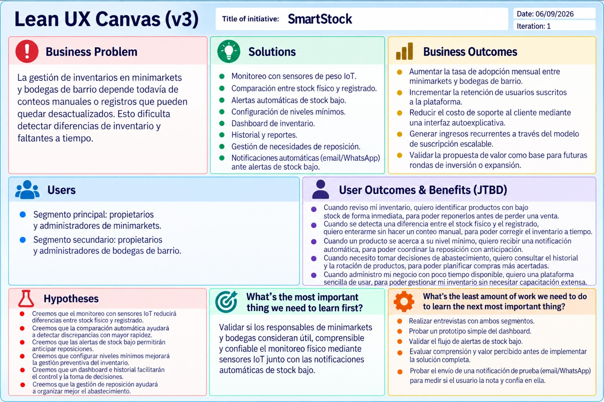

**Link:** 
https://cdn.phototourl.com/free/2026-09-08-d660dc5a-3d44-49dd-b0be-72bf9878d110.jpg

## 1.3. Segmentos objetivo

### Propietarios y administradores de minimarkets

Son personas responsables de gestionar las operaciones diarias de minimarkets, incluyendo el control del inventario, revisión de existencias, reposición de productos y coordinación del abastecimiento. Debido al mayor volumen de productos y movimientos que suelen manejar estos establecimientos, necesitan identificar con rapidez diferencias entre el stock registrado y las existencias físicas. Para el proyecto, este segmento se prioriza como principal por su volumen de operación y por una mayor capacidad de pago mensual esperada para adoptar una solución tecnológica de monitoreo de inventario. Buscan contar con información actualizada que facilite la reposición, reduzca los quiebres de stock y disminuya el tiempo dedicado a verificaciones manuales.

Como contexto empresarial, PRODUCE reporta que en 2024 existían 2 331 173 Mipyme formales en el Perú, equivalentes al 99,3 % de las empresas formales operativas. Este dato permite dimensionar la importancia de las micro y pequeñas empresas dentro de la actividad empresarial nacional.

**Fuente:**  
https://drive.google.com/file/d/1cA56NNQ19692vqOC5qiFTh7LyHq6A3dG/view?usp=sharing

### Propietarios y administradores de bodegas de barrio

Son personas responsables de gestionar las operaciones diarias de bodegas de barrio, incluyendo el control de productos, revisión de existencias y reposición. Este segmento se considera secundario debido a que, aunque representa un mercado amplio para la solución, se espera una menor capacidad de pago mensual y una mayor sensibilidad al costo de implementación. En muchos casos, el control de inventario depende de conteos manuales o registros simples, lo que puede generar diferencias entre el stock registrado y el real y dificultar la identificación oportuna de productos agotados. Buscan una solución sencilla que permita conocer el estado de sus productos y reducir el tiempo dedicado a verificaciones manuales.

Como contexto del sector comercial, el INEI señala que en Lima Metropolitana y Callao, durante el cuarto trimestre de 2024, el 42,6 % de las nuevas empresas registradas correspondió a comercio y reparación de vehículos, lo que evidencia la relevancia de las actividades comerciales dentro de la dinámica empresarial. 

**Fuente:**  
https://www.gob.pe/institucion/inei/informes-publicaciones/6550169-demografia-empresarial-en-el-peru-iv-trimestre-2024

# Capítulo II: Requirements Elicitation & Analysis

## 2.1. Competidores

### Trax Retail

Trax Retail es una solución tecnológica orientada al análisis y monitoreo de productos en tiendas mediante visión por computadora e inteligencia artificial. Su plataforma permite digitalizar los estantes, identificar productos, verificar su ubicación y analizar información relacionada con disponibilidad, cumplimiento y desempeño de los SKU. Además, genera métricas y reportes que ayudan a mejorar la gestión del inventario y las decisiones dentro del establecimiento. A diferencia de SmartStock, Trax se basa principalmente en reconocimiento de imágenes e inteligencia artificial, mientras que SmartStock propone utilizar sensores de peso IoT y enfocarse en bodegas y minimarkets. 

### Trigo Retail

Trigo Retail desarrolla soluciones basadas en visión por computadora e inteligencia artificial para modernizar las operaciones de tiendas físicas. Su tecnología permite obtener información en tiempo real sobre las actividades dentro del establecimiento y generar datos que apoyan la gestión operativa y la toma de decisiones. Trigo está orientado a soluciones avanzadas de retail y tiendas inteligentes, mientras que SmartStock busca una alternativa más sencilla para pequeños comercios mediante sensores IoT, alertas de inventario y coordinación con proveedores. 

### Pensa Systems

Pensa Systems es una solución especializada en digitalizar el inventario disponible en los estantes mediante inteligencia artificial y visión computacional. Su tecnología permite identificar la disponibilidad real de productos, detectar productos agotados, conocer su ubicación y mejorar la precisión del inventario. Al igual que SmartStock, busca proporcionar mayor visibilidad sobre las existencias físicas; sin embargo, Pensa utiliza principalmente análisis visual mediante IA, mientras que SmartStock propone sensores de peso IoT y funcionalidades dirigidas específicamente a la relación entre bodegas, minimarkets y proveedores.

### 2.1.1. Análisis competitivo

#### Competitive Analysis Landscape

*¿Por qué llevar a cabo este análisis?*

Permite identificar cómo funcionan las soluciones actuales de gestión de inventarios, reconocer sus limitaciones y diferenciar a SmartStock mediante el monitoreo con sensores IoT, alertas de stock y una mejor coordinación con proveedores.

#### Logos

<table>
  <thead>
    <tr>
      <th>SmartStock</th>
      <th>Trax Retail</th>
      <th>Trigo Retail</th>
      <th>Pensa Systems</th>
    </tr>
  </thead>
  <tbody>
    <tr>
      <td align="center">
        
      </td>
      <td align="center">
        
      </td>
      <td align="center">
        
      </td>
      <td align="center">
        
      </td>
    </tr>
  </tbody>
</table>

#### Perfil

| | **SmartStock** | **Trax Retail** | **Trigo Retail** | **Pensa Systems** |
| --- | --- | --- | --- | --- |
| **Overview** | SmartStock es una plataforma web orientada a bodegas y minimarkets que utiliza sensores de peso IoT para monitorear el inventario físico, compararlo con el stock registrado y generar alertas ante faltantes o niveles bajos. Además, incorpora funcionalidades para facilitar la coordinación con proveedores. | Trax Retail ofrece soluciones de reconocimiento de imágenes, visión computacional e inteligencia artificial para analizar productos en tiendas. Permite obtener información sobre disponibilidad en estantes, ubicación de productos, cumplimiento de planogramas, precios y promociones. | Trigo Retail desarrolla soluciones para tiendas físicas mediante Computer Vision AI. Su tecnología utiliza cámaras e infraestructura de visión computacional para reconocer productos y actividades dentro de la tienda y proporcionar información operacional en tiempo real. | Pensa Systems utiliza Vision AI para digitalizar los estantes de tiendas físicas. Su tecnología identifica productos, disponibilidad, ubicación, stockouts y condiciones del estante, convirtiendo esta información en acciones y análisis para retailers y marcas. |
| **Ventaja competitiva ¿Qué valor ofrece a los clientes?** | • Monitoreo mediante sensores de peso IoT. • Alertas de stock bajo. • Comparación entre inventario físico y registrado. • Gestión de reposición mediante alertas y notificaciones automáticas. • Enfoque específico en bodegas y minimarkets. | • Reconocimiento de productos mediante IA. • Información sobre disponibilidad, distribución, precios y promociones. • Analítica avanzada para la ejecución comercial. • Experiencia con grandes marcas y cadenas de retail. | • Computer Vision AI. • Puede aprovechar infraestructura CCTV existente. • Procesamiento en tiempo real. • Alta escalabilidad y adaptación a operaciones de retail. | • Digitalización del estante físico. • Detección de stockouts. • Análisis de ubicación y surtido. • Información accionable para corregir problemas de disponibilidad. |

#### Perfil de marketing

| | **SmartStock** | **Trax Retail** | **Trigo Retail** | **Pensa Systems** |
| --- | --- | --- | --- | --- |
| **Mercado Objetivo** | Propietarios y administradores de minimarkets como segmento principal y propietarios y administradores de bodegas de barrio como segmento secundario. Ambos requieren mejorar el control del inventario físico y detectar oportunamente productos con bajo stock. | Empresas de productos de consumo masivo, retailers, supermercados, tiendas de conveniencia y equipos encargados de ejecución comercial. | Retailers y cadenas de tiendas físicas interesadas en automatización, inteligencia operacional, prevención de pérdidas y soluciones de retail autónomo. | Retailers, empresas de productos de consumo masivo y marcas que necesitan conocer con mayor precisión la disponibilidad y ejecución de sus productos en estantes. |
| **Estrategias de Marketing** | • Marketing digital mediante redes sociales y contenido sobre gestión de inventarios. • Demostraciones del producto. • Pruebas piloto en establecimientos. • Alianzas con proveedores y distribuidores. • Modelo de suscripción adaptable al tamaño del negocio. | • Marketing B2B. • Casos de éxito. • Demostraciones y contacto comercial. • Contenido especializado sobre retail, IA y disponibilidad de productos. | • Alianzas estratégicas. • Venta empresarial. • Ecosistemas tecnológicos y cloud. • Posicionamiento en innovación aplicada al retail. | • Demostraciones comerciales. • Casos de estudio, webinars y recursos especializados. • Marketing B2B para retailers y empresas CPG. • Alianzas tecnológicas. |

#### Perfil de producto

| | **SmartStock** | **Trax Retail** | **Trigo Retail** | **Pensa Systems** |
| --- | --- | --- | --- | --- |
| **Productos y Servicios** | Plataforma web para monitorear inventarios mediante sensores de peso IoT. Incluye niveles de stock, comparación entre inventario físico y registrado, alertas, historial de movimientos, reportes de rotación y mermas, y funcionalidades para gestionar la reposición y coordinar pedidos con proveedores externos. | Plataforma de reconocimiento de imágenes e inteligencia de retail para analizar disponibilidad, ubicación de SKU, precios, promociones, cumplimiento de exhibiciones y otros indicadores de ejecución comercial. | Soluciones de Computer Vision AI para retail, incluyendo inteligencia operacional, prevención de pérdidas y retail autónomo. Analiza imágenes de cámaras para identificar productos y actividades dentro de las tiendas. | Soluciones de Vision AI orientadas a Shelf Intelligence. Permite identificar disponibilidad, stockouts, ubicación, surtido, cumplimiento de planogramas y condiciones físicas del estante. |
| **Precios y costos** | Se plantea un modelo de suscripción cuyos planes podrán variar según la cantidad de productos, sensores y funcionalidades contratadas. También debe considerarse el costo inicial de los dispositivos IoT. | No presenta precios públicos estandarizados. El servicio se comercializa mediante contacto y reuniones con clientes empresariales. | No presenta un tarifario público; la solución se adapta a la infraestructura y necesidades de cada retailer. | No publica precios estandarizados. Los clientes pueden solicitar una demostración y contactar directamente con el equipo comercial. |
| **Canales de distribución (Web y/o móvil)** | **Web:** plataforma principal para propietarios y administradores de minimarkets y bodegas de barrio. **IoT:** sensores instalados físicamente en los establecimientos. | Web/Cloud y móvil: plataforma, dashboards y aplicaciones utilizadas por personal de campo y administradores. | Plataforma empresarial: integración con infraestructura de tiendas, cámaras CCTV y sistemas de procesamiento; también puede operar mediante ecosistemas cloud. | Web/Plataforma: dashboards y herramientas de análisis conectados a su sistema de captura y Vision AI. |

#### Análisis SWOT

| | **SmartStock** | **Trax Retail** | **Trigo Retail** | **Pensa Systems** |
| --- | --- | --- | --- | --- |
| **Fortalezas** | • Sensores IoT para monitorear directamente cambios en el inventario físico. • Enfoque específico en bodegas y minimarkets. • Alertas automáticas de stock bajo. • Integración entre inventario físico y digital. • Coordinación con proveedores durante el proceso de reposición. • Plataforma web sencilla y accesible. | • Tecnología consolidada de visión computacional e IA. •Reconocimiento detallado de SKU y condiciones de estante. • Amplia variedad de indicadores y análisis. • Experiencia con grandes marcas y empresas internacionales. | • Tecnología avanzada de Computer Vision AI. • Procesamiento en tiempo real. • Puede aprovechar infraestructura CCTV existente. • Alta escalabilidad y adaptación a grandes operaciones de retail. | • Especialización en inteligencia de estantes. • Detección de disponibilidad y stockouts. • Información sobre ubicación y desempeño de productos. • Automatización de tareas relacionadas con auditorías físicas. |
| **Debilidades** | • Dependencia de sensores físicos. • Necesidad de instalación y calibración adecuada. • No todos los tipos de productos pueden monitorearse fácilmente mediante peso. • Menor experiencia y volumen de datos al ser una propuesta nueva. | • Dependencia de imágenes y condiciones adecuadas de captura. • Puede resultar más compleja que lo requerido por una bodega pequeña. • Su enfoque empresarial puede representar una barrera para pequeños negocios. | • Requiere infraestructura de cámaras y procesamiento de visión computacional. • Está enfocada principalmente en operaciones de retail de mayor escala. • La complejidad técnica puede dificultar su implementación en pequeños establecimientos. | • Dependencia de visión artificial y captura adecuada de imágenes. • Propuesta dirigida principalmente a retailers y empresas CPG. • Puede ofrecer más funcionalidades de las necesarias para pequeños comercios. |
| **Oportunidades** | • Crecimiento de la digitalización de bodegas y minimarkets. • Mayor disponibilidad y reducción de costos de dispositivos IoT. • Necesidad de mejorar el control de inventarios en pequeños negocios. • Alianzas con distribuidores y proveedores. • Expansión futura hacia recomendaciones automáticas y análisis predictivo. • Integración con nuevos tipos de sensores. | • Mayor adopción de IA en retail. • Crecimiento de la demanda por información de disponibilidad en tiempo real. • Expansión hacia nuevas cadenas y mercados. | • Crecimiento de tiendas inteligentes y retail autónomo. • Mayor utilización de cámaras e IA para analizar operaciones. • Integración con ecosistemas cloud y plataformas empresariales. | • Mayor interés por digitalizar los estantes físicos. • Expansión de soluciones de IA para gestión de inventarios. • Integración de Vision AI con dispositivos móviles y otras tecnologías de retail. |
| **Amenazas** | • Aparición de nuevas soluciones de inventario IoT a bajo costo. • Competidores consolidados con mayor capacidad tecnológica y financiera. • Resistencia de pequeños comercios a invertir en dispositivos adicionales. • Fallos o deterioro de sensores. • Rápida evolución de tecnologías de visión artificial que podrían ofrecer alternativas sin sensores de peso. | • Aparición de tecnologías alternativas de monitoreo sin reconocimiento de imágenes. • Competencia creciente en Computer Vision para retail. • Cambios rápidos en tecnologías de inteligencia artificial. | • Alta competencia en automatización y visión computacional aplicada al retail. • Costos y complejidad de implementaciones empresariales. • Aparición de soluciones más simples y económicas para pequeños establecimientos. | • Crecimiento de competidores con funcionalidades similares mediante Vision AI. • Rápida evolución de sistemas de monitoreo IoT y visión artificial. • Dependencia de la capacidad de los retailers para adoptar e integrar nuevas tecnologías. |

### 2.1.2. Estrategias y tácticas frente a competidores

#### 1. Diferenciación mediante sensores IoT y monitoreo del inventario físico en tiempo real

A diferencia de soluciones como Trax Retail, Trigo Retail y Pensa Systems, que utilizan principalmente visión computacional e inteligencia artificial para analizar productos en tiendas, SmartStock propone el uso de sensores de peso IoT instalados en los espacios donde se almacenan o exhiben determinados productos, permitiendo:

- Monitoreo continuo de las existencias físicas.
- Detección de niveles bajos de stock.
- Comparación entre el inventario físico y el inventario registrado.
- Generación automática de alertas ante posibles faltantes.

Esto permite ofrecer una solución orientada al control directo del inventario físico y adaptada a las necesidades de bodegas y minimarkets.

#### 2. Solución accesible y escalable para pequeños comercios

Mientras que varios competidores están orientados principalmente a grandes cadenas de retail y requieren infraestructura de cámaras, procesamiento de imágenes o soluciones empresariales más complejas, SmartStock busca implementar un modelo progresivo y adaptable:

- Implementación inicial con una cantidad reducida de sensores.
- Incorporación gradual de nuevos productos y dispositivos IoT.
- Escalabilidad según el tamaño y necesidades del establecimiento.
- Modelo de suscripción adaptable a las funcionalidades utilizadas.

Este enfoque busca reducir las barreras tecnológicas y económicas para la adopción de la solución en pequeños comercios.

#### 3. Notificaciones oportunas para la gestión de la reposición

SmartStock permitirá que los propietarios y administradores de minimarkets y bodegas de barrio utilicen la información de inventario para gestionar oportunamente sus necesidades de abastecimiento. La plataforma permitirá:

- Identificar productos que requieren reposición.
- Registrar necesidades de abastecimiento.
- Generar alertas relacionadas con faltantes.
- Enviar notificaciones automáticas por correo electrónico o WhatsApp, mediante un servicio de terceros, cuando el stock de un producto alcance un nivel crítico.

De esta manera, la coordinación directa con los proveedores la sigue realizando el usuario fuera de la plataforma; SmartStock actúa como el sistema que le avisa oportunamente cuándo hacerlo, manteniendo a los proveedores como actores externos del abastecimiento sin convertirlos en un segmento objetivo o usuario de la plataforma.

#### 4. Experiencia de usuario centrada en información inmediata

La plataforma busca facilitar la toma de decisiones mediante una interfaz web sencilla e intuitiva que permita consultar rápidamente:

- Productos con stock suficiente, bajo o agotado.
- Alertas pendientes de reposición.
- Diferencias entre el inventario físico y el registrado.
- Estado de los dispositivos IoT.
- Información relevante según el tipo de usuario.

De esta manera, los propietarios y administradores de minimarkets y bodegas de barrio podrán acceder a la información necesaria sin realizar procesos complejos de consulta.

#### 5. Gestión preventiva del inventario mediante alertas

SmartStock busca reemplazar un modelo reactivo de reposición por uno preventivo mediante la detección anticipada de niveles bajos de inventario. El sistema permitirá:

- Configurar niveles mínimos de stock por producto.
- Generar alertas cuando las existencias alcancen dichos niveles.
- Identificar diferencias entre el inventario registrado y el físico.
- Anticipar necesidades de reposición antes de que un producto se agote.

Este enfoque puede contribuir a reducir quiebres de stock y mejorar la disponibilidad de productos en bodegas y minimarkets.

#### 6. Analítica de inventario y apoyo a la toma de decisiones

SmartStock incorporará información histórica que permita a los administradores analizar el comportamiento de sus productos mediante:

- Reportes de rotación de productos.
- Registro de mermas.
- Historial de alertas y movimientos.
- Identificación de productos con mayor necesidad de reposición.
- Seguimiento del comportamiento del inventario.

Esta información permitirá complementar el monitoreo en tiempo real con datos que apoyen la planificación del abastecimiento y la toma de decisiones.

---

## 2.2. Entrevistas

### 2.2.1. Diseño de entrevistas

Las guías de entrevista para ambos segmentos combinan preguntas demográficas con preguntas sobre gestión del  inventario y comportamiento del negocio, orientadas a sustentar la construcción de los User Persona.

#### Primer Segmento Objetivo (Propietarios y administradores de minimarkets)

#### Preguntas demográficas

1. ¿Cuál es su nombre completo?

2. ¿Qué edad tiene?

3. ¿En qué distrito reside?

4. ¿Cuál es su estado civil?

5. ¿A qué se dedica usted (ocupación) y qué rol cumple en el negocio (dueño, administrador, etc.)?

6. ¿Hace cuánto tiempo tiene o administra el negocio?

7. ¿Qué dispositivo usa con más frecuencia para temas del negocio (celular, laptop, computadora de escritorio)?

8. ¿Qué aplicaciones o redes sociales usa habitualmente?

---

#### Preguntas sobre gestión del inventario / comportamiento del negocio

9. ¿Cómo realiza actualmente el control del inventario de los productos de su minimarket?

10. ¿Con qué frecuencia revisa físicamente las existencias disponibles?

11. ¿Qué dificultades encuentra al mantener actualizado el inventario?

12. ¿Con qué frecuencia encuentra diferencias entre el stock registrado y la cantidad física disponible?

13. ¿Qué problemas se presentan cuando un producto se agota sin ser detectado a tiempo?

14. ¿Cómo determina cuándo debe realizar una reposición de productos?

15. ¿Qué productos o categorías son más difíciles de controlar por su rotación?

16. ¿Cómo se comunica actualmente con sus proveedores para solicitar reposiciones?

17. ¿Qué herramientas o sistemas utiliza actualmente para gestionar el inventario?

18. ¿Qué limitaciones encuentra en esas herramientas o métodos?

19. ¿Qué información considera más importante visualizar al revisar el inventario?

20. ¿Qué tipo de alertas le resultarían útiles para detectar productos con bajo stock?

21. ¿Qué importancia tendría para usted saber en todo momento si existen diferencias entre lo que su sistema registra y lo que realmente tiene en tienda?

22. ¿Qué le gustaría que una herramienta de inventario le resuelva o facilite, sin importar la tecnología que use?

23. ¿Qué haría que usted decida invertir en una nueva herramienta para gestionar su negocio?
 
#### Segundo Segmento Objetivo (Propietarios y administradores de bodegas de barrio)

#### Preguntas demográficas

1. ¿Cuál es su nombre completo?

2. ¿Qué edad tiene?

3. ¿En qué distrito reside?

4. ¿Cuál es su estado civil?

5. ¿A qué se dedica usted (ocupación) y qué rol cumple en el negocio (dueño, administrador, etc.)?

6. ¿Hace cuánto tiempo tiene o administra el negocio?

7. ¿Qué dispositivo usa con más frecuencia para temas del negocio (celular, laptop, computadora de escritorio)?

8. ¿Qué aplicaciones o redes sociales usa habitualmente?

---

#### Preguntas sobre gestión del inventario / comportamiento del negocio

9. ¿Cómo controla actualmente los productos disponibles en su bodega?

10. ¿Utiliza cuaderno, Excel, sistema digital u otro método para registrar su inventario?

11. ¿Con qué frecuencia realiza conteos o revisiones manuales de sus productos?

12. ¿Qué dificultades tiene para saber qué productos están por agotarse?

13. ¿Le ha ocurrido que el stock registrado no coincida con la cantidad real disponible? ¿Con qué frecuencia?

14. ¿Qué problemas genera en su negocio quedarse sin un producto de alta demanda?

15. ¿Cómo decide qué productos debe reponer y en qué momento?

16. ¿Cómo realiza actualmente sus pedidos a proveedores?

17. ¿Qué parte del control de inventario le toma más tiempo o le resulta más complicada?

18. ¿Qué tan cómodo se siente utilizando aplicaciones o plataformas web para gestionar su negocio?

19. ¿Qué información le gustaría ver en una pantalla para conocer rápidamente el estado de sus productos?

20. ¿Qué tipo de alerta le sería útil cuando un producto está por agotarse?

21. ¿Qué tan importante sería para usted enterarse automáticamente cuando un producto está por agotarse, sin tener que revisarlo usted mismo?

22. ¿Qué beneficio tendría que ofrecer una herramienta de inventario para que usted la use de manera frecuente?

23. ¿Qué haría que usted decida invertir en una nueva herramienta para gestionar su negocio?

### 2.2.2. Registro de entrevistas

**Needfinding Interviews Link:** https://upcedupe-my.sharepoint.com/personal/u20241f205_upc_edu_pe/_layouts/15/stream.aspx?id=%2Fpersonal%2Fu20241f205%5Fupc%5Fedu%5Fpe%2FDocuments%2Fupc%2Dpre%2D202620%2D1asi0729%2D7729%2Dnexostock%2D%20needfinding%2Dsprint%2D1%2Emp4&nav=eyJyZWZlcnJhbEluZm8iOnsicmVmZXJyYWxBcHAiOiJTdHJlYW1XZWJBcHAiLCJyZWZlcnJhbFZpZXciOiJTaGFyZURpYWxvZy1MaW5rIiwicmVmZXJyYWxBcHBQbGF0Zm9ybSI6IldlYiIsInJlZmVycmFsTW9kZSI6InZpZXcifX0&ga=1&referrer=StreamWebApp%2EWeb&referrerScenario=AddressBarCopied%2Eview%2E15d230b6%2D7311%2D4af1%2D98c3%2D9e89f4a52af9

---

#### Primer Segmento Objetivo (Propietarios y administradores de minimarkets)

#### Entrevista 1

| Información | Detalle |
| --- | --- |
| **Screenshot:** |  |
| **Inicia:** | 00:00 |
| **Duración:** | 17:10 |
| **Nombre completo:** | José Martín Montañez |
| **Edad:** | 52 años |
| **Distrito:** | Pueblo Libre |
| **Resumen:** | José nos indica que está a cargo de la administración de un minimarket desde hace aproximadamente 1 año. Utiliza principalmente el celular y la laptop, y actualmente cuenta con un sistema de inventario adaptado a las necesidades de su negocio. Realiza revisiones físicas del stock semanalmente y también de manera aleatoria durante la semana para mantener un mayor control. Entre las principales dificultades menciona posibles fallas de hardware o software, problemas logísticos y diferencias entre el stock registrado y el stock físico, las cuales dependen de la rotación de los productos y del manejo del personal. Cuando se agota un producto de alta rotación, puede afectar las ventas y generar molestias en los clientes, especialmente cuando se trata de productos que generan venta cruzada. Para decidir las reposiciones utiliza reportes del sistema sobre consumos diarios, semanales y productos de alta rotación, contrastándolos con el stock físico. Los pedidos a proveedores se realizan principalmente mediante WhatsApp y llamadas. Los productos más difíciles de controlar son los pequeños, como caramelos y chocolates, debido a que están al alcance de los clientes. Considera importante visualizar el stock y los productos de alta rotación, además de contar con alertas de bajo stock y reportes de consumos máximos y mínimos. También considera muy importante detectar diferencias entre el stock registrado y el físico para evitar compras innecesarias. Finalmente, señala que una nueva herramienta debería ser amigable, eficiente, accesible desde diferentes plataformas, permitir consultar información y reportes en cualquier momento, facilitar la comunicación con proveedores y ayudar a controlar el stock de manera eficiente. |

---

#### Entrevista 2

| Información | Detalle |
| --- | --- |
| **Screenshot:** |  |
| **Inicia:** | 17:16 |
| **Duración:** | 06:25 |
| **Nombre completo:** | Cristopher Benavides |
| **Edad:** | 23 años |
| **Distrito:** | Jesús María |
| **Resumen:** | Cristopher nos indica que la gestión del inventario se realiza principalmente de manera manual, mediante revisiones físicas y anotaciones, complementándose con Excel, aunque este no siempre se encuentra actualizado. Señala que las principales dificultades aparecen cuando las ventas no se registran inmediatamente o se cometen errores al anotar las cantidades, generando diferencias entre el stock registrado y el físico, especialmente en productos de alta rotación. Las bebidas, snacks y productos de consumo son los más difíciles de controlar debido a su rápida salida. Para realizar reposiciones, se comunica con sus proveedores mediante WhatsApp y llamadas, enviándoles la lista de productos necesarios. Considera útil contar con alertas cuando un producto llegue a una cantidad mínima de stock y poder detectar diferencias entre el inventario registrado y el real. Finalmente, considera importante que una nueva herramienta sea fácil de usar, ahorre tiempo, tenga un precio accesible y ayude a evitar el agotamiento de productos. |

---

#### Entrevista 3

| Información | Detalle |
| --- | --- |
| **Screenshot:** |  |
| **Inicia:** | 23:47 |
| **Duración:** | 07:16 |
| **Nombre completo:** | Yngrid Ruiz |
| **Edad:** | 23 años |
| **Distrito:** | Pueblo Libre |
| **Resumen:** | Yngrid nos indica que es administradora de un minimarket y cuenta con aproximadamente 2 años de experiencia en el negocio. Actualmente controla el inventario comparando los productos disponibles en tienda con las ventas registradas en el sistema y realizando conteos manuales. Revisa físicamente el inventario una o dos veces por semana, dando mayor atención a los productos de mayor venta. Señala que la gran cantidad de productos y el movimiento diario pueden generar diferencias entre el inventario registrado y el físico, especialmente en productos de alta rotación. Las bebidas, snacks, productos de limpieza y alimentos básicos son los más difíciles de controlar. Para comunicarse con los proveedores utiliza principalmente WhatsApp y llamadas, mediante las cuales consulta precios, disponibilidad y realiza pedidos. Considera importante visualizar las unidades disponibles y los productos próximos a agotarse, además de recibir alertas cuando lleguen a una cantidad mínima. Finalmente, considera que una herramienta de inventario debería ayudar a ahorrar tiempo, reducir errores, detectar productos que necesitan reposición y mostrar información clara y ordenada. Estaría dispuesta a invertir si la herramienta permite reducir pérdidas, ahorrar tiempo y evitar quiebres de stock, siempre que tenga un precio razonable. |

---

#### Segundo Segmento Objetivo (Propietarios y administradores de bodegas de barrio)

#### Entrevista 1

| Información | Detalle |
| --- | --- |
| **Screenshot:** |  |
| **Inicia:** | 31:08 |
| **Duración:** | 06:39 |
| **Nombre completo:** | Lincoln Bruno |
| **Edad:** | 49 años |
| **Distrito:** | Comas |
| **Resumen:** | Lincoln nos indica que es dueño de una bodega y cuenta con 10 años de experiencia en el negocio. Actualmente utiliza un sistema de caja, pero mantiene gran parte del control del inventario de manera manual. Los productos de mayor venta son revisados casi todos los días, mientras que los demás se revisan durante la semana. Señala que pueden existir diferencias entre el stock registrado y la cantidad real debido a errores durante las ventas o al registrar los productos. Cuando un producto de alta demanda se agota, se pueden perder ventas y afectar la atención al cliente. Los pedidos a proveedores se realizan mediante WhatsApp o llamadas. Considera que lo que más tiempo requiere es contar y verificar los productos con lo registrado, especialmente cuando existe bastante movimiento. Le gustaría visualizar el stock disponible, los productos con bajo stock y aquellos que necesitan reposición, además de recibir alertas cuando un producto esté por agotarse. Finalmente, considera importante que una nueva herramienta sea fácil de usar, tenga un precio accesible, permita ahorrar tiempo y muestre información clara y sencilla. |

---

#### Entrevista 2

| Información | Detalle |
| --- | --- |
| **Screenshot:** |  |
| **Inicia:** | 37:53 |
| **Duración:** | 05:12 |
| **Nombre completo:** | Ian San Martin |
| **Edad:** | 20 años |
| **Distrito:** | Santiago de Surco |
| **Resumen:** | Ian nos indica que administra una bodega de barrio desde hace aproximadamente tres años y que actualmente controla el inventario mediante revisiones de los estantes y el almacén, utilizando principalmente un cuaderno y, en algunas ocasiones, Excel. Realiza revisiones rápidas todos los días y un conteo más completo una vez por semana; sin embargo, señala que existen diferencias entre el stock registrado y el real aproximadamente una o dos veces por semana debido a ventas no anotadas, productos dañados u otros inconvenientes. También menciona que una de las principales dificultades es revisar uno por uno los productos para identificar cuáles están por agotarse y controlar sus fechas de vencimiento. Considera que quedarse sin productos de alta demanda genera pérdida de ventas y puede afectar la confianza de los clientes. Por ello, le sería útil contar con una plataforma sencilla y rápida que muestre las cantidades disponibles, los productos próximos a agotarse o vencer y los más vendidos. Además, valora recibir notificaciones en su celular cuando el stock llegue a un nivel mínimo. Estaría dispuesto a invertir en una herramienta de inventario si tiene un precio accesible, es fácil de usar, mejora realmente el control del negocio y ofrece una prueba gratuita o soporte. |

---

#### Entrevista 3

| Información | Detalle |
| --- | --- |
| **Screenshot:** |  |
| **Inicia:** | 43:10 |
| **Duración:** | 05:15 |
| **Nombre completo:** | Pablo Ludeña |
| **Edad:** | 21 años |
| **Distrito:** | Los Olivos |
| **Resumen:** | Pablo nos indica que actualmente trabaja como asistente de ventas en un minimarket, donde el control de los productos se realiza de manera manual, utilizando principalmente papel y cálculos básicos, sin contar con un sistema digital de inventario. Señala que revisan los productos aproximadamente una vez por semana y que, al tratarse de un negocio minorista, suelen identificar visualmente qué productos están por agotarse. Sin embargo, reconoce que no tienen un registro exacto del stock real. También menciona que una herramienta digital sería de gran ayuda, especialmente para conocer qué productos faltan, sus fechas de vencimiento, cuándo deben reponerse y el estado de los ingresos y egresos. Considera muy útil recibir notificaciones en el celular cuando un producto esté por agotarse. Para que utilice frecuentemente una herramienta de inventario, esta tendría que ser cómoda, sencilla y fácil de usar. Además, estaría dispuesto a invertir en este tipo de sistema principalmente si el minimarket crece y aumenta la cantidad de productos, ya que el método de papel y lápiz dejaría de ser suficiente. |

### 2.2.3. Análisis de entrevistas

#### Primer Segmento Objetivo (Propietarios y administradores de minimarkets)

Este segmento está conformado por personas responsables de gestionar y supervisar el inventario de minimarkets. Las entrevistas realizadas muestran que el control de existencias combina sistemas digitales, Excel, conteos manuales y verificaciones físicas periódicas. A pesar de contar con algunas herramientas de apoyo, los entrevistados señalaron que todavía se presentan diferencias entre el inventario registrado y las existencias reales, principalmente por errores en el registro, alta rotación de productos y movimientos frecuentes de mercadería.

Asimismo, se identificó que productos como bebidas, snacks, productos de consumo frecuente, productos de limpieza y alimentos básicos requieren mayor atención debido a su rápida rotación. Los entrevistados también indicaron que la comunicación con proveedores se realiza principalmente mediante WhatsApp y llamadas, y que disponer de información más actualizada facilitaría la reposición de productos.

*¿Quiénes son?*

Se trata de propietarios, administradores o responsables de minimarkets que participan directamente en el control del inventario, revisión de existencias y reposición de productos.

- Utilizan una combinación de sistemas de inventario, Excel, anotaciones y verificaciones manuales.
- Realizan conteos físicos periódicos para comprobar las existencias disponibles.
- Gestionan establecimientos con una cantidad considerable de productos y movimientos diarios.
- Se comunican con proveedores principalmente mediante WhatsApp y llamadas.
- Necesitan revisar con mayor frecuencia los productos de alta rotación.

*¿Qué les preocupa y anhelan?*

- **Diferencias de inventario:** Les preocupa que el stock registrado no coincida con las existencias físicas reales.
- **Productos agotados:** La falta de detección oportuna de productos con bajo stock puede ocasionar pérdida de ventas y molestias en los clientes.
- **Alta rotación:** Determinadas categorías requieren revisiones constantes debido a su rápido movimiento.
- **Tiempo dedicado al control:** Los conteos y verificaciones manuales demandan tiempo que podría utilizarse en otras actividades del negocio.
- **Errores de registro:** Las ventas o movimientos que no se registran inmediatamente pueden afectar la precisión del inventario.
- **Reposición tardía:** Buscan identificar con anticipación qué productos necesitan abastecimiento.
- **Información clara:** Desean visualizar rápidamente las existencias disponibles, productos próximos a agotarse y diferencias de inventario.
- **Facilidad de uso:** Esperan que una nueva herramienta sea amigable, accesible y sencilla de utilizar.
- **Precio razonable:** La disposición a adoptar la solución depende de que su costo sea acorde con los beneficios obtenidos.

*Requisitos del producto*

A partir de los hallazgos obtenidos en las entrevistas, SmartStock debería considerar los siguientes requisitos:

- Mostrar de manera clara el stock disponible de los productos.
- Detectar diferencias entre el inventario físico y el inventario registrado.
- Generar alertas cuando un producto alcance un nivel mínimo de stock.
- Permitir configurar niveles mínimos según cada producto.
- Facilitar la identificación de productos de alta rotación.
- Mostrar reportes relacionados con consumo, rotación y movimientos del inventario.
- Facilitar la identificación de productos que necesitan reposición.
- Permitir consultar información desde diferentes dispositivos.
- Presentar una interfaz sencilla, ordenada y fácil de aprender.
- Apoyar la coordinación de pedidos y reposiciones con proveedores.
- Reducir el tiempo empleado en verificaciones y conteos manuales.

---

#### Segundo Segmento Objetivo (Propietarios y administradores de bodegas de barrio)

Este segmento comprende a personas que administran pequeños establecimientos y que participan directamente en el control de productos, revisión de existencias y reposición. Las entrevistas muestran una mayor dependencia de procedimientos manuales, sistemas básicos de caja, cuadernos, anotaciones y, en algunos casos, Excel. El control suele realizarse mediante observación directa de estantes y almacenes, complementado con conteos periódicos.

Los entrevistados señalaron que uno de los principales problemas es identificar oportunamente qué productos están por agotarse, especialmente cuando existe mucho movimiento de mercadería. También mencionaron dificultades para mantener un registro exacto del stock, controlar fechas de vencimiento y detectar productos faltantes o dañados. La reposición se coordina principalmente mediante WhatsApp o llamadas con los proveedores.

*¿Quiénes son?*

Se trata de propietarios, administradores o trabajadores que participan directamente en las actividades de control y reposición de productos de pequeños comercios.

- Realizan gran parte del control de inventario de manera manual.
- Revisan físicamente estantes y zonas de almacenamiento.
- Utilizan sistemas de caja, cuadernos, anotaciones o Excel como apoyo.
- Realizan conteos periódicos para verificar productos disponibles.
- Se comunican con proveedores mediante WhatsApp o llamadas.
- Tienen distintos niveles de familiaridad con herramientas digitales.

*¿Qué les preocupa y anhelan?*

- **Control manual:** El conteo y revisión física de productos puede tomar bastante tiempo.
- **Diferencias de stock:** Pueden existir diferencias entre el registro disponible y las cantidades físicas.
- **Productos próximos a agotarse:** Necesitan conocer con anticipación cuáles requieren reposición.
- **Productos de alta demanda:** Quedarse sin productos de alta rotación puede ocasionar pérdidas de ventas y afectar la atención al cliente.
- **Fechas de vencimiento:** Algunos entrevistados manifestaron la necesidad de controlar productos próximos a vencer.
- **Productos dañados o faltantes:** Requieren mayor visibilidad sobre estas situaciones.
- **Facilidad de uso:** Buscan herramientas sencillas, rápidas y comprensibles.
- **Accesibilidad económica:** El precio es un factor importante para decidir si adoptarían una solución tecnológica.
- **Notificaciones:** Existe interés en recibir alertas en el celular cuando el stock alcance niveles bajos.
- **Información visual:** Desean identificar rápidamente cantidades disponibles, productos próximos a agotarse y artículos de mayor venta.

*Requisitos del producto*

De acuerdo con los hallazgos de este segmento, SmartStock debería:

- Mostrar de manera sencilla las cantidades disponibles de los productos.
- Identificar productos con niveles bajos de stock.
- Generar alertas cuando un producto esté próximo a agotarse.
- Enviar notificaciones relacionadas con necesidades de reposición.
- Facilitar la comparación entre el stock registrado y las existencias reales.
- Permitir conocer qué productos necesitan ser repuestos.
- Mostrar información sobre los productos de mayor movimiento.
- Facilitar el seguimiento de fechas de vencimiento cuando corresponda.
- Presentar una interfaz simple y fácil de utilizar para usuarios con distintos niveles de experiencia tecnológica.
- Reducir el tiempo destinado a conteos y verificaciones manuales.
- Ser accesible económicamente para pequeños comercios.
- Facilitar la coordinación de pedidos con proveedores.

## 2.3. Needfinding

_Pendiente de elaborar. En esta sección el equipo explica y presenta los artefactos resultantes del proceso de análisis de la información recolectada en las entrevistas, incluyendo los User Personas, el User Task Matrix, los User Journey Maps y los Empathy Maps._

### 2.3.1. User Personas

_Pendiente de elaborar en UXPressia. La sección inicia con una introducción que explica la relación entre los artefactos presentados y las principales características consideradas a partir del análisis de entrevistas y del análisis competitivo. Se elabora una ficha de User Persona por cada segmento objetivo: propietarios y administradores de minimarkets, y propietarios y administradores de bodegas de barrio._

### 2.3.2. User Task Matrix

_Pendiente de elaborar. La sección inicia con una introducción que establece los segmentos considerados. El cuadro debe incluir como columna cada User Persona y, para cada una, como sub-columnas la Frecuencia y la Importancia de cada tarea. Como filas se colocan las tareas identificadas, entendidas como actividades que los segmentos realizan independientemente de la existencia de la solución de software. Luego del cuadro se explica cuáles son las tareas con mayor frecuencia e importancia, y las principales diferencias y coincidencias entre los User Personas._

### 2.3.3. User Journey Mapping

_Pendiente de elaborar en UXPressia. La sección inicia con una introducción que resume el end-to-end journey que se pretende ilustrar. Se elabora un User Journey Map por cada User Persona, en su versión As-Is, es decir, el journey de cada segmento en la situación actual, sin que exista la solución. Cada User Journey Map debe vincularse con el User Persona correspondiente._

### 2.3.4. Empathy Mapping

_Pendiente de elaborar en UXPressia. La sección debe resumir el proceso de elaboración y presentar las capturas de los Empathy Maps de cada User Persona, respondiendo a las preguntas sobre con quién se está empatizando, qué necesita hacer, qué está diciendo, qué está viendo, qué está haciendo, qué está escuchando, y cómo se siente y qué piensa, e identificando los Pains y Gains correspondientes._

## 2.4. Big Picture Event Storming

_Pendiente de elaborar en Miro. La sección debe introducir y resumir el proceso realizado por el equipo y presentar las capturas y explicaciones de cada etapa del Big Picture Event Storming, en el que el equipo se enfoca en entender el dominio del negocio en general, plasmando los eventos significativos y sus relaciones, identificando los procesos clave y exponiendo potenciales problemas u oportunidades._

## 2.5. Ubiquitous Language

_Pendiente de elaborar. La sección debe contener el glosario de términos y conceptos del business domain de SmartStock, con definiciones sin ambigüedad. Los términos deben estar en inglés, pudiendo incluirse el equivalente en español entre paréntesis, y la definición puede estar en español. Solo deben incluirse términos del dominio del control de inventarios en bodegas y minimarkets, y no términos técnicos del área de ingeniería de software._

| Término | Definición |
|:--------|:-----------|
| _Pendiente_ | _Pendiente_ |

# Capítulo III: Requirements Specification

En este capítulo se especifican los requisitos de los productos digitales que conforman la solución, tomando como base el análisis de la información obtenida en las entrevistas a los segmentos objetivo y en el análisis competitivo del capítulo anterior. La especificación se organiza en tres secciones: los User Stories con sus criterios de aceptación, el Impact Mapping que vincula las metas del negocio con las historias identificadas, y el Product Backlog priorizado según el valor para el negocio.

## 3.1. User Stories

Para la definición de los requisitos funcionales, no funcionales y técnicos de SmartStock se identificaron nueve Epics que agrupan el conjunto de User Stories y Technical Stories del producto. Las historias funcionales consideran los roles específicos de usuario según el segmento (dueño de bodega de barrio, administrador de minimarket); dado que ambos segmentos comparten las mismas necesidades base de gestión de cuenta, monitoreo, alertas, catálogo y dashboard —confirmado en las entrevistas realizadas a ambos segmentos—, dichas historias se redactaron cubriendo a los dos roles. Las historias del sitio web estático (Landing Page) consideran el rol visitante, y sus variantes por segmento cuando el contenido de la sección lo requiere. Las Technical Stories consideran el rol Developer para los servicios expuestos por el API RESTful.

Cada User Story incluye uno o más Criterios de Aceptación redactados en tiempo presente, tercera persona y bajo la estructura Gherkin (Given-When-Then), salvo en los casos de reglas de negocio o restricciones que no dependen de condiciones. La tabla siguiente integra el conjunto completo de Epics y User Stories, dedicando una fila a cada una.

| Epic / Story ID | Título | Descripción | Criterios de Aceptación | Relacionado con (Epic ID) |
|:---|:---|:---|:---|:---|
| **EP01** | Gestión de cuenta y autenticación de usuarios | Como dueño de bodega de barrio o administrador de minimarket, quiero registrarme, iniciar sesión y recuperar el acceso a mi cuenta de forma segura, para gestionar mi inventario en SmartStock en cualquier momento. | — | — |
| **US01** | Registro de cuenta | Como dueño de bodega de barrio o administrador de minimarket, quiero registrarme en la plataforma SmartStock con mi correo electrónico y los datos de mi negocio, para poder acceder a los servicios de monitoreo de inventario. | **Escenario: Registro exitoso** **Dado que** el usuario ingresa un correo electrónico válido, una contraseña y los datos de su negocio, **Cuando** el usuario confirma el registro, **Entonces** el sistema crea la cuenta y la asocia al negocio registrado, y envía un correo de confirmación de registro.  **Escenario: Correo ya registrado** **Dado que** el correo electrónico ingresado ya está registrado en el sistema, **Cuando** el usuario intenta completar el registro, **Entonces** el sistema rechaza el registro e indica que el correo ya se encuentra en uso. | EP01 |
| **US02** | Inicio de sesión | Como dueño de bodega de barrio o administrador de minimarket, quiero iniciar sesión con mi correo electrónico y contraseña, para acceder al panel de monitoreo de mi inventario. | **Escenario: Inicio de sesión exitoso** **Dado que** el usuario cuenta con una cuenta registrada y activa, **Cuando** el usuario ingresa su correo y contraseña correctos, **Entonces** el sistema lo autentica y otorga acceso al panel de monitoreo.  **Escenario: Credenciales incorrectas** **Dado que** el usuario ingresa una contraseña incorrecta, **Cuando** el usuario intenta iniciar sesión, **Entonces** el sistema rechaza el inicio de sesión e indica que las credenciales son incorrectas. | EP01 |
| **US03** | Recuperación de contraseña | Como dueño de bodega de barrio o administrador de minimarket, quiero recuperar mi contraseña mediante un enlace enviado a mi correo electrónico, para volver a acceder a mi cuenta cuando la olvide. | **Escenario: Solicitud de recuperación válida** **Dado que** el usuario ingresa el correo electrónico asociado a su cuenta, **Cuando** el usuario solicita la recuperación de contraseña, **Entonces** el sistema envía un enlace de restablecimiento al correo registrado, el cual expira transcurridas 24 horas desde su generación. | EP01 |
| **EP02** | Configuración y vinculación de sensores IoT | Como dueño de bodega de barrio o administrador de minimarket, quiero vincular y configurar mis sensores de peso IoT sobre cada producto, para que el sistema monitoree automáticamente mi inventario físico. | — | — |
| **US04** | Vinculación de sensor IoT a un producto | Como dueño de bodega de barrio o administrador de minimarket, quiero vincular un sensor de peso IoT a un producto específico de mi inventario, para que el sistema registre su peso de referencia. | **Escenario: Vinculación exitosa** **Dado que** el usuario selecciona un sensor disponible y un producto sin sensor asignado, **Cuando** el usuario confirma la vinculación, **Entonces** el sistema asocia el sensor al producto y registra el peso inicial detectado como referencia.  **Escenario: Sensor ya vinculado** **Dado que** el sensor seleccionado ya está vinculado a otro producto, **Cuando** el usuario intenta vincularlo a un nuevo producto, **Entonces** el sistema rechaza la vinculación e indica que el sensor ya se encuentra en uso. | EP02 |
| **US05** | Configuración de umbral mínimo de stock | Como dueño de bodega de barrio o administrador de minimarket, quiero configurar el umbral mínimo de stock para cada producto vinculado a un sensor, para que el sistema me alerte cuando el nivel sea bajo. | **Regla de negocio:** El umbral mínimo configurado no puede ser mayor a la capacidad máxima registrada para el producto.  **Escenario: Configuración válida** **Dado que** el usuario ingresa un valor numérico mayor a cero como umbral mínimo, **Cuando** el usuario guarda la configuración, **Entonces** el sistema almacena el umbral asociado al producto y lo aplica a partir de la siguiente lectura del sensor. | EP02 |
| **US06** | Visualización del estado de conexión de sensores | Como dueño de bodega de barrio o administrador de minimarket, quiero ver el estado de conexión de cada sensor IoT instalado, para saber si alguno requiere revisión técnica. | **Escenario: Sensor conectado** **Dado que** un sensor envió una lectura en los últimos 5 minutos, **Cuando** el usuario consulta el estado de sus sensores, **Entonces** el sistema muestra el sensor con estado "en línea".  **Escenario: Sensor desconectado** **Dado que** un sensor no envió ninguna lectura en los últimos 5 minutos, **Cuando** el usuario consulta el estado de sus sensores, **Entonces** el sistema muestra el sensor con estado "desconectado". | EP02 |
| **EP03** | Monitoreo de inventario en tiempo real | Como dueño de bodega de barrio o administrador de minimarket, quiero visualizar el nivel de stock de mis productos en tiempo real a partir de las lecturas de los sensores, para tomar decisiones oportunas de reposición. | — | — |
| **US07** | Visualización del peso actual de un producto | Como dueño de bodega de barrio o administrador de minimarket, quiero visualizar el peso actual registrado por el sensor de cada producto, para conocer el nivel de stock físico en tiempo real. | **Escenario: Lectura disponible** **Dado que** el sensor de un producto envió al menos una lectura de peso, **Cuando** el usuario consulta el nivel de stock del producto, **Entonces** el sistema muestra el peso más reciente recibido y su cantidad equivalente en unidades. | EP03 |
| **US08** | Listado de productos por nivel de stock | Como dueño de bodega de barrio o administrador de minimarket, quiero visualizar un listado de todos mis productos monitoreados junto con su nivel de stock actual, para identificar cuáles necesitan reposición. | **Escenario: Listado con productos en distintos niveles** **Dado que** el usuario tiene productos con sensores vinculados, **Cuando** el usuario consulta el listado de productos, **Entonces** el sistema muestra cada producto con su nivel de stock clasificado como bajo, normal o sin datos. | EP03 |
| **EP04** | Alertas y notificaciones de stock bajo | Como dueño de bodega de barrio o administrador de minimarket, quiero recibir notificaciones automáticas por correo electrónico o WhatsApp cuando el stock de un producto llegue al umbral mínimo, para coordinar su reposición a tiempo. | — | — |
| **US09** | Notificación por correo electrónico de stock bajo | Como dueño de bodega de barrio o administrador de minimarket, quiero recibir una notificación por correo electrónico cuando el stock de un producto llegue al umbral mínimo, para coordinar su reposición con mi proveedor a tiempo. | **Escenario: Stock alcanza el umbral mínimo** **Dado que** el nivel de stock de un producto es igual o menor al umbral mínimo configurado, y el usuario tiene configurado el correo electrónico como canal de notificación, **Cuando** el sistema detecta la condición de stock bajo, **Entonces** el sistema envía una notificación por correo electrónico a la dirección registrada y registra la necesidad de reposición del producto. | EP04 |
| **US10** | Notificación por WhatsApp de stock bajo | Como dueño de bodega de barrio o administrador de minimarket, quiero recibir una notificación por WhatsApp cuando el stock de un producto llegue al umbral mínimo, para gestionar la reposición sin estar frente al sistema. | **Escenario: Stock alcanza el umbral mínimo** **Dado que** el nivel de stock de un producto es igual o menor al umbral mínimo configurado, y el usuario tiene configurado WhatsApp como canal de notificación, **Cuando** el sistema detecta la condición de stock bajo, **Entonces** el sistema envía una notificación por WhatsApp al número registrado y registra la necesidad de reposición del producto. | EP04 |
| **EP05** | Comparación de inventario físico vs. registrado | Como dueño de bodega de barrio o administrador de minimarket, quiero comparar el peso físico detectado por los sensores con la cantidad registrada en el sistema, para detectar mermas o errores de conteo a tiempo. | — | — |
| **US11** | Comparación entre inventario físico y registrado | Como dueño de bodega de barrio o administrador de minimarket, quiero comparar el peso físico detectado por los sensores con la cantidad registrada manualmente en el sistema, para detectar diferencias por mermas o errores de conteo. | **Escenario: Diferencia detectada** **Dado que** existe una cantidad registrada manualmente para un producto, **Cuando** el sistema recibe una nueva lectura del sensor asociado al producto, **Entonces** el sistema calcula la diferencia porcentual entre el peso físico y la cantidad registrada, y muestra el resultado al usuario. | EP05 |
| **US12** | Alerta por discrepancia de inventario | Como dueño de bodega de barrio o administrador de minimarket, quiero recibir una alerta automática cuando exista una discrepancia mayor al 10% entre el inventario físico y el registrado, para investigar la causa de la diferencia sin tener que revisarlo manualmente. | **Regla de negocio:** El sistema considera una discrepancia significativa cuando la diferencia entre el peso físico y la cantidad registrada supera el 10% del valor registrado.  **Escenario: Discrepancia mayor al umbral** **Dado que** la diferencia calculada entre el inventario físico y el registrado supera el 10%, **Cuando** el sistema finaliza el cálculo de comparación, **Entonces** el sistema genera una alerta de discrepancia, notifica al usuario por su canal configurado y registra la necesidad de reposición del producto. | EP05 |
| **EP06** | Gestión de catálogo de productos | Como dueño de bodega de barrio o administrador de minimarket, quiero registrar y editar los productos de mi catálogo, para mantener actualizada la información monitoreada por SmartStock. | — | — |
| **US13** | Registro de nuevo producto en el catálogo | Como dueño de bodega de barrio o administrador de minimarket, quiero registrar un nuevo producto en mi catálogo con su nombre, categoría y peso unitario, para empezar a monitorear su stock con un sensor IoT. | **Escenario: Registro exitoso** **Dado que** el usuario ingresa un nombre, categoría y peso unitario válidos para el producto, **Cuando** el usuario confirma el registro, **Entonces** el sistema agrega el producto al catálogo del negocio y queda disponible para ser vinculado a un sensor. | EP06 |
| **US14** | Edición de producto del catálogo | Como dueño de bodega de barrio o administrador de minimarket, quiero editar la información de un producto existente en mi catálogo, para mantener actualizados sus datos. | **Escenario: Edición exitosa** **Dado que** el usuario modifica uno o más datos de un producto existente, **Cuando** el usuario confirma los cambios, **Entonces** el sistema actualiza la información del producto y conserva el historial de lecturas asociado. | EP06 |
| **EP07** | Reportes y dashboard de inventario | Como dueño de bodega de barrio o administrador de minimarket, quiero visualizar un dashboard con el resumen general del estado de mi inventario, para tener una vista rápida de mi negocio sin revisar producto por producto. | — | — |
| **US15** | Visualización de dashboard resumen de inventario | Como dueño de bodega de barrio o administrador de minimarket, quiero visualizar un dashboard con el resumen de productos en stock bajo, stock normal y sin sensor asignado, para tener una vista general del estado de mi inventario. | **Escenario: Dashboard con datos disponibles** **Dado que** el negocio tiene al menos un producto registrado, **Cuando** el usuario consulta el dashboard, **Entonces** el sistema muestra la cantidad de productos en stock bajo, stock normal y sin sensor asignado. | EP07 |
| **EP08** | Sitio web estático (Landing Page) | Como visitante del sitio web de SmartStock, general o de un segmento específico (bodegas de barrio o minimarkets), quiero conocer la propuesta de valor, casos de uso, planes y evidencia social del producto, para decidir si me registro o solicito una demostración. | — | — |
| **US16** | Información general de SmartStock | Como visitante, quiero conocer en la página de inicio qué es SmartStock y qué problema resuelve, para evaluar rápidamente si el producto es útil para mi negocio. | **Escenario: Consulta de la página de inicio** **Dado que** un visitante ingresa al sitio web de SmartStock, **Cuando** el visitante accede a la página de inicio, **Entonces** el sistema muestra una descripción del producto y del problema de control de inventario que resuelve. | EP08 |
| **US17** | Casos de uso para bodegas de barrio | Como visitante del segmento bodegas de barrio, quiero ver una sección con casos de uso enfocados en negocios pequeños, para identificar si SmartStock se ajusta al tamaño de mi negocio. | **Escenario: Consulta de la sección de casos de uso** **Dado que** un visitante del segmento bodegas de barrio navega el sitio web, **Cuando** el visitante accede a la sección de casos de uso, **Entonces** el sistema muestra contenido dirigido a negocios de tipo bodega de barrio. | EP08 |
| **US18** | Casos de uso para minimarkets | Como visitante del segmento minimarkets, quiero ver una sección con casos de uso enfocados en negocios de mayor volumen, para evaluar si SmartStock puede manejar la escala de mi minimarket. | **Escenario: Consulta de la sección de casos de uso** **Dado que** un visitante del segmento minimarkets navega el sitio web, **Cuando** el visitante accede a la sección de casos de uso, **Entonces** el sistema muestra contenido dirigido a negocios de tipo minimarket. | EP08 |
| **US19** | Planes y precios | Como visitante, quiero ver una sección con los planes y precios de SmartStock, para decidir cuál se ajusta a mi presupuesto antes de contactar al equipo comercial. | **Escenario: Consulta de planes** **Dado que** un visitante navega el sitio web, **Cuando** el visitante accede a la sección de planes y precios, **Entonces** el sistema muestra los planes disponibles con sus características y costos. | EP08 |
| **US20** | Formulario de contacto para solicitar demostración | Como visitante, quiero completar un formulario con mi nombre, negocio y correo electrónico, para solicitar una demostración del producto. | **Escenario: Envío exitoso del formulario** **Dado que** un visitante completa el nombre, el negocio y un correo electrónico válido en el formulario de contacto, **Cuando** el visitante envía el formulario, **Entonces** el sistema registra la solicitud de demostración y envía una confirmación al correo ingresado.  **Escenario: Datos incompletos** **Dado que** un visitante deja al menos un campo obligatorio vacío en el formulario de contacto, **Cuando** el visitante intenta enviar el formulario, **Entonces** el sistema rechaza el envío e indica qué campos faltan por completar. | EP08 |
| **US21** | Preguntas frecuentes sobre instalación de sensores | Como visitante, quiero ver una sección de preguntas frecuentes sobre la instalación de los sensores IoT, para resolver mis dudas técnicas antes de contratar el servicio. | **Escenario: Consulta de preguntas frecuentes** **Dado que** un visitante navega el sitio web, **Cuando** el visitante accede a la sección de preguntas frecuentes, **Entonces** el sistema muestra las preguntas relacionadas con la instalación de sensores IoT junto con sus respuestas. | EP08 |
| **US22** | Testimonios de dueños de bodega | Como visitante del segmento bodegas de barrio, quiero ver testimonios de otros dueños de bodega que usan SmartStock, para generar confianza antes de registrarme. | **Escenario: Consulta de testimonios** **Dado que** un visitante del segmento bodegas de barrio navega el sitio web, **Cuando** el visitante accede a la sección de testimonios, **Entonces** el sistema muestra testimonios de clientes correspondientes al segmento bodegas de barrio. | EP08 |
| **US23** | Comparación frente a otras soluciones | Como visitante del segmento minimarkets, quiero ver una comparación de SmartStock frente a otras soluciones de control de inventario, para justificar la elección frente a mis socios o jefes. | **Escenario: Consulta de comparación** **Dado que** un visitante del segmento minimarkets navega el sitio web, **Cuando** el visitante accede a la sección de comparación de soluciones, **Entonces** el sistema muestra una tabla comparativa entre SmartStock y otras soluciones del mercado. | EP08 |
| **US24** | Acceso a registro desde el sitio web | Como visitante, quiero acceder a la opción de registro desde cualquier sección del sitio web, para crear mi cuenta sin necesidad de buscarla. | **Regla de negocio:** La opción de registro está disponible de forma permanente en todas las secciones del sitio web estático.  **Escenario: Acceso a la opción de registro** **Dado que** un visitante se encuentra en cualquier sección del sitio web, **Cuando** el visitante selecciona la opción de registro, **Entonces** el sistema redirige al visitante al formulario de creación de cuenta. | EP08 |
| **EP09** | Servicios RESTful del API (Technical Stories) | Como developer, quiero exponer los servicios RESTful necesarios para la recepción de lecturas de sensores, autenticación, consulta de stock, notificaciones y comparación de inventario, para soportar el funcionamiento de las aplicaciones web y de los dispositivos IoT. | — | — |
| **US25** | Endpoint de recepción de lecturas de sensores | Como developer, quiero exponer un endpoint `POST /api/sensores/{id}/lecturas` que reciba las lecturas de peso enviadas por el microcontrolador, para almacenar el dato en la base de datos. | **Escenario: Lectura válida recibida** **Dado que** el microcontrolador envía una solicitud `POST /api/sensores/{id}/lecturas` con un valor de peso numérico y un identificador de sensor existente, **Cuando** el sistema procesa la solicitud, **Entonces** el sistema almacena la lectura asociada al sensor y responde con el código de estado 201 y el identificador de la lectura creada.  **Escenario: Sensor inexistente** **Dado que** el microcontrolador envía una solicitud `POST /api/sensores/{id}/lecturas` con un identificador de sensor que no existe, **Cuando** el sistema procesa la solicitud, **Entonces** el sistema responde con el código de estado 404 y no almacena ninguna lectura. | EP09 |
| **US26** | Endpoint de consulta de stock de un producto | Como developer, quiero exponer un endpoint `GET /api/productos/{id}/stock` que retorne el nivel de stock actual de un producto, para que el frontend lo muestre en el panel de monitoreo. | **Escenario: Producto existente con lecturas** **Dado que** el cliente envía una solicitud `GET /api/productos/{id}/stock` con un identificador de producto existente, **Cuando** el sistema procesa la solicitud, **Entonces** el sistema responde con el código de estado 200 y el nivel de stock actual del producto.  **Escenario: Producto sin lecturas registradas** **Dado que** el producto consultado no tiene lecturas de sensor asociadas, **Cuando** el sistema procesa la solicitud `GET /api/productos/{id}/stock`, **Entonces** el sistema responde con el código de estado 200 y un nivel de stock indicado como "sin datos". | EP09 |
| **US27** | Endpoint de envío de notificaciones de stock bajo | Como developer, quiero exponer un endpoint `POST /api/notificaciones/stock-bajo` que dispare el envío de una alerta cuando el stock de un producto cruce el umbral mínimo, para automatizar las notificaciones del sistema. | **Escenario: Umbral cruzado** **Dado que** el sistema recibe una solicitud `POST /api/notificaciones/stock-bajo` con un identificador de producto cuyo stock es igual o menor al umbral configurado, **Cuando** el sistema procesa la solicitud, **Entonces** el sistema envía la notificación por el canal configurado por el usuario y responde con el código de estado 200.  **Escenario: Umbral no cruzado** **Dado que** el sistema recibe una solicitud `POST /api/notificaciones/stock-bajo` con un identificador de producto cuyo stock es mayor al umbral configurado, **Cuando** el sistema procesa la solicitud, **Entonces** el sistema no envía ninguna notificación y responde con el código de estado 200 indicando que no se cumple la condición de alerta. | EP09 |
| **US28** | Endpoint de autenticación de usuarios | Como developer, quiero exponer un endpoint `POST /api/auth/login` que valide las credenciales del usuario y retorne un token de autenticación, para proteger el acceso a los servicios del API. | **Escenario: Credenciales válidas** **Dado que** el cliente envía una solicitud `POST /api/auth/login` con un correo electrónico y una contraseña que coinciden con una cuenta registrada, **Cuando** el sistema valida las credenciales, **Entonces** el sistema responde con el código de estado 200 y un token de autenticación.  **Escenario: Credenciales inválidas** **Dado que** el cliente envía una solicitud `POST /api/auth/login` con una contraseña que no coincide con la cuenta registrada, **Cuando** el sistema valida las credenciales, **Entonces** el sistema responde con el código de estado 401 y no genera ningún token. | EP09 |
| **US29** | Endpoint de estado de conexión de un sensor | Como developer, quiero exponer un endpoint `GET /api/sensores/{id}/estado` que retorne si un sensor está en línea o desconectado, para que el frontend muestre el estado de conexión en tiempo real. | **Escenario: Sensor con lectura reciente** **Dado que** el sensor consultado envió una lectura en los últimos 5 minutos, **Cuando** el cliente envía una solicitud `GET /api/sensores/{id}/estado`, **Entonces** el sistema responde con el código de estado 200 y el estado "en línea".  **Escenario: Sensor sin lectura reciente** **Dado que** el sensor consultado no envió ninguna lectura en los últimos 5 minutos, **Cuando** el cliente envía una solicitud `GET /api/sensores/{id}/estado`, **Entonces** el sistema responde con el código de estado 200 y el estado "desconectado". | EP09 |
| **US30** | Endpoint de comparación de inventario físico y registrado | Como developer, quiero exponer un endpoint `GET /api/inventario/comparacion/{productoId}` que retorne la diferencia entre el peso físico detectado y la cantidad registrada, para que el sistema calcule automáticamente posibles mermas. | **Escenario: Diferencia calculada correctamente** **Dado que** el producto consultado tiene una cantidad registrada manualmente y al menos una lectura de sensor, **Cuando** el cliente envía una solicitud `GET /api/inventario/comparacion/{productoId}`, **Entonces** el sistema responde con el código de estado 200 y el porcentaje de diferencia entre ambos valores.  **Escenario: Producto sin cantidad registrada** **Dado que** el producto consultado no tiene una cantidad registrada manualmente, **Cuando** el cliente envía una solicitud `GET /api/inventario/comparacion/{productoId}`, **Entonces** el sistema responde con el código de estado 409 e indica que no puede calcularse la comparación sin una cantidad registrada. | EP09 |

## 3.2. Impact Mapping

_Pendiente de elaborar en UXPressia. La sección debe incluir las capturas del Impact Map del modelo de negocio digital, elaborado a partir de las fichas de User Persona de la sección 2.3.1, junto con la explicación correspondiente. El Impact Map debe considerar varios Business Goals redactados bajo criterios SMART, los Actors/Personas que contribuyen a cada meta, los Impacts esperados en su comportamiento, los Deliverables con los que el negocio digital provoca esos impactos y los User Stories asociados a cada Deliverable._

## 3.3. Product Backlog

_Pendiente de elaborar. La sección debe incluir la tabla de Product Backlog con la estructura `# Orden | User Story Id | Título | Descripción | Story Points (1/2/3/5/8)`, ordenada según el valor para el negocio, junto con la captura de imagen y el URL público del board en la herramienta de control de proyectos. Los User Stories del sitio web estático (US16 a US24) deben considerarse desde el primer sprint._

# Capítulo IV: Product Design

En este capítulo se presenta la propuesta de Software Architecture & Design de SmartStock, incluyendo el diseño UX/UI de la experiencia web, la arquitectura de software dirigida por el dominio, el diseño orientado a objetos y el diseño de la base de datos. La propuesta toma como base el conjunto de User Stories especificados en el Capítulo III y el Impact Map del modelo de negocio.

## 4.1. Style Guidelines

En esta sección se establecen las bases visuales y de comunicación compartidas por los productos digitales de SmartStock. El objetivo es contar con un repositorio central y organizado de decisiones de uso común para todo el equipo, de modo que el Landing Page y la Web Application se lean como una sola experiencia y no como dos productos distintos.

Las decisiones se expresan como variables CSS declaradas en un único archivo de estilos del Landing Page, lo que permite que cualquier ajuste de marca se realice en un solo lugar y se propague a toda la experiencia. El lenguaje de diseño adoptado es Material Design, y en la Web Application se materializa mediante Angular Material.

### 4.1.1. General Style Guidelines

**Branding**

SmartStock es el producto de la startup NexoStock. La marca se apoya en el azul marino, asociado a la confiabilidad y a la lectura de datos de instrumentación, y en una comunicación directa centrada en el control del inventario físico. El isotipo representa un estante contenido dentro de una forma hexagonal, acompañado del símbolo de conectividad inalámbrica, que sintetiza los dos elementos del producto: el inventario en el estante y el sensor que lo reporta.

El principio visual que gobierna toda la experiencia es que **el blanco predomina**. El color de marca no se usa como fondo de grandes superficies, sino reservado para titulares, acciones y enlaces. De esta manera el contenido —que en el caso de este producto es información de inventario— conserva siempre la mayor jerarquía visual.

**Tono de comunicación**

El equipo definió las siguientes dimensiones para el lenguaje aplicado en toda la experiencia:

| Dimensión | Decisión | Sustento |
| :-------- | :------- | :------- |
| Divertido / Serio | Serio | El usuario consulta la plataforma cuando un producto puede estar agotándose; el contenido informa, no entretiene. |
| Formal / Casual | Casual moderado | Los segmentos son dueños de bodega y administradores de minimarket, para quienes un lenguaje excesivamente formal genera distancia. |
| Respetuoso / Irreverente | Respetuoso | El producto se dirige a personas que conocen su negocio mejor que nosotros; el lenguaje las trata como pares y no como aprendices. |
| Entusiasta / Sereno | Sereno | Una alerta de stock bajo debe leerse con calma para no amplificar la urgencia de la operación diaria. |

Una consecuencia concreta de este tono es que la comunicación no exagera la precisión del producto. La lectura del sensor es un peso, y su conversión a unidades es una estimación; los textos lo declaran así en lugar de prometer un conteo exacto.

**Colores**

La paleta se organiza en una rampa de marca de azul marino con dos peldaños, separados por contraste y no por matiz. Ambos son legibles como texto sobre fondo blanco, lo que permite emplear el peldaño oscuro en titulares y el medio en enlaces y acciones secundarias sin recurrir a un tercer valor.

| Muestra | Token | Valor | Contraste sobre blanco | Rol |
| :------ | :---- | :---- | :--------------------- | :-- |
| 

 | `--navy` | `#0a2342` | 15.77:1 (AAA) | Color de marca. Titulares, fondo de botones primarios y logotipo. |
| 

 | `--blue` | `#1b4f8f` | 8.20:1 (AAA) | Enlaces, estado de hover de los botones y acentos de etiqueta. |

Las superficies y los colores de texto se resuelven con cuatro valores. La superficie apagada se pinta con un color opaco y no con una capa translúcida, de modo que no herede lo que tenga detrás al alternar secciones.

| Muestra | Token | Valor | Contraste sobre blanco | Rol |
| :------ | :---- | :---- | :--------------------- | :-- |
| 

 | — | `#ffffff` | — | Fondo de la página y de las tarjetas. Es el fondo predominante. |
| 

 | `--soft` | `#f7f9fb` | — | Superficie en segundo plano, únicamente para alternar secciones. |
| 

 | `--ink` | `#1c2430` | 15.62:1 (AAA) | Color de texto general, en reemplazo del negro puro. |
| 

 | `--muted` | `#5b6673` | 5.84:1 (AA) | Texto secundario: párrafos de apoyo y descripciones de tarjeta. |

Los neutros se reducen a un único rol de línea. A diferencia de una aplicación, donde conviene distinguir el borde de una tarjeta clicable del divisor interno de una lista, el sitio web estático no presenta esa variedad de elementos interactivos, por lo que multiplicar los valores de línea habría agregado tokens sin uso real.

| Muestra | Token | Valor | Rol |
| :------ | :---- | :---- | :-- |
| 

 | `--border` | `#e2e6ec` | Borde de tarjetas, campos de formulario, tablas y separadores. |

Los estados de retroalimentación del formulario emplean dos colores, ambos con contraste suficiente para texto sobre fondo blanco:

| Muestra | Valor | Contraste sobre blanco | Uso en SmartStock |
| :------ | :---- | :--------------------- | :---------------- |
| 

 | `#c0392b` | 5.44:1 (AA) | Mensaje de error de validación y borde del campo inválido. |
| 

 | `#1e7e46` | 5.09:1 (AA) | Confirmación de envío de la solicitud de demostración. |

Una decisión relevante es que el color de marca **no** se utiliza para comunicar estado. Siendo el azul marino el color de todas las acciones del sitio, un aviso azul dejaría de leerse como señal y se confundiría con un elemento de marca.

**Tipografía**

La familia tipográfica es Manrope, con una pila de respaldo de tipografías de sistema para el caso en que la fuente remota no cargue. La escala parte de una base de 16 píxeles y se expresa en `rem`, de modo que la preferencia de tamaño de texto configurada en el navegador escale la página completa y no solo algunas partes.

| Muestra | Tamaño | Peso | Uso |
| :------ | :----- | :--- | :-- |
| Aa | 2.75 rem · 44 px | 700 | Titular principal del Landing Page. |
| Aa | 1.875 rem · 30 px | 700 | Título de sección. |
| Aa | 1.125 rem · 18 px | 700 | Título de tarjeta y párrafo de entrada de sección. |
| Aa | 1 rem · 16 px | 400 | Cuerpo de texto por defecto. |
| Aa | 0.9375 rem · 15 px | 400 / 600 | Texto de tarjeta, botones y campos de formulario. |
| Aa | 0.875 rem · 14 px | 600 | Etiquetas de formulario, pie de página y nota de apoyo. |
| Aa | 0.75 rem · 12 px | 600 | Etiquetas de segmento y encabezados de tabla. |

Los pesos se limitan a tres valores (400, 600 y 700) y la altura de línea a dos: 1.25 para titulares y 1.6 para cuerpo de texto. En pantallas menores a 900 píxeles el titular principal desciende a 2.125 rem y el título de sección a 1.5 rem, para que un titular largo no ocupe la pantalla completa en un teléfono.

**Espaciado**

El sistema de espaciado utiliza una base de 4 píxeles expresada en `rem`. Toda separación entre elementos consume un valor de esta escala, lo que sostiene el ritmo vertical de las vistas y evita valores arbitrarios elegidos a ojo.

| Muestra | Valor | Uso habitual |
| :------ | :---- | :----------- |
| 

 | 0.375 rem · 6 px | Separación entre una etiqueta y su campo. |
| 

 | 0.625 rem · 10 px | Separación entre el título de una tarjeta y su texto. |
| 

 | 0.75 rem · 12 px | Relleno vertical de botones y separación entre acciones. |
| 

 | 1 rem · 16 px | Separación entre elementos de una lista de características. |
| 

 | 1.5 rem · 24 px | Separación entre tarjetas de una rejilla y márgenes laterales del contenedor. |
| 

 | 1.75 rem · 28 px | Relleno interno de una tarjeta y del formulario. |
| 

 | 2.5 rem · 40 px | Separación entre el encabezado de sección y su contenido. |
| 

 | 3 rem · 48 px | Relleno vertical de sección en vista móvil. |
| 

 | 4.5 rem · 72 px | Relleno vertical de sección en vista de escritorio. |
| 

 | 5.5 rem · 88 px | Espacio superior del encabezado principal. |

El radio de esquina es único, de 8 píxeles, y se aplica a botones, tarjetas, campos de formulario y contenedores de tabla. Un solo radio evita la mezcla de formas que ocurre cuando cada componente elige el suyo.

**Principios y elementos de diseño considerados**

| Principio o elemento | Aplicación en SmartStock |
| :------------------- | :----------------------- |
| Jerarquía | El tamaño y el peso tipográfico, y no el color, establecen el orden de lectura. El azul marino se reserva para lo accionable. |
| Contraste | Todos los colores de texto superan la relación 4.5:1 sobre blanco exigida por WCAG para texto normal; los titulares alcanzan nivel AAA. |
| Espacio en blanco | El blanco predomina y las secciones respiran con 72 píxeles de relleno vertical, de modo que cada bloque de contenido se lea de forma independiente. |
| Repetición | Un solo radio de esquina, un solo color de borde y una sola familia tipográfica se repiten en toda la experiencia. |
| Alineación | Todo el contenido se alinea dentro de un contenedor de 1040 píxeles de ancho máximo, centrado en la ventana. |
| Diseño inclusivo | El color nunca es el único portador de significado, el foco del teclado es siempre visible y la experiencia respeta las preferencias de tamaño de texto y de movimiento reducido del sistema operativo. |

### 4.1.2. Web Style Guidelines

En esta sección se explican los estándares visuales y de interacción aplicados a las interfaces web responsive de la solución.

**Rejilla y puntos de quiebre**

El contenido se organiza en un contenedor de 1040 píxeles de ancho máximo con 24 píxeles de margen lateral. Se definen dos puntos de quiebre, elegidos por el comportamiento del contenido y no por el modelo de un dispositivo concreto:

| Punto de quiebre | Comportamiento |
| :--------------- | :------------- |
| Mayor a 900 px | Rejillas de tres columnas para tarjetas de problema, planes y testimonios; de dos columnas para los casos de uso por segmento. |
| 900 px o menos | Todas las rejillas colapsan a una sola columna y la escala tipográfica de titulares se reduce. |
| 720 px o menos | La navegación se oculta tras un botón de menú, el relleno vertical de sección se reduce de 72 a 48 píxeles y los enlaces de navegación pasan a ocupar el ancho completo. |

**Componentes**

| Componente | Estándar adoptado |
| :--------- | :---------------- |
| Botón primario | Fondo azul marino, texto blanco, radio de 8 px, relleno de 12 px por 24 px. En hover cambia al azul medio. |
| Botón secundario | Fondo transparente, texto azul marino y borde gris. En hover adopta la superficie apagada y el borde azul marino. |
| Tarjeta | Fondo blanco, borde de 1 px y radio de 8 px. Sin sombra: la separación se comunica con el borde y con el espacio, no con elevación. |
| Tabla | Encabezado sin relleno de color, en versal con espaciado de letra aumentado; filas separadas por una línea inferior. En pantallas estrechas la tabla conserva su ancho mínimo dentro de un contenedor con desplazamiento horizontal propio. |
| Acordeón | El encabezado es un botón de ancho completo con un indicador `+` que cambia a `−` al expandirse. |
| Campo de formulario | Borde gris de 1 px y radio de 8 px. El campo inválido adopta el borde rojo y expone su mensaje de error inmediatamente debajo. |

**Interacción**

La validación de los campos del formulario se dispara al abandonar el campo y no mientras se escribe. Corregir a una persona a mitad de su correo electrónico marca cada dirección como inválida hasta la última letra, lo que se lee como un fallo del producto y no como una ayuda.

Al enviar el formulario con errores, el foco se traslada automáticamente al primer campo inválido, de modo que quien navega con teclado o con lector de pantalla llegue directamente al problema.

Todas las transiciones son breves y se anulan por completo cuando el sistema operativo declara la preferencia de movimiento reducido.

**Accesibilidad**

| Criterio | Implementación |
| :------- | :------------- |
| Navegación por teclado | Un enlace de salto al contenido es el primer elemento enfocable de la página. Todo elemento interactivo expone un anillo de foco visible mediante `:focus-visible`. |
| Atributos ARIA | El acordeón emplea `aria-expanded` y `aria-controls`; los mensajes de error usan `role="alert"`; el estado del envío usa `role="status"` con `aria-live="polite"`; el menú expone `aria-expanded` y el selector de idioma `aria-pressed`. |
| Texto alternativo | El logotipo es decorativo y se expone con texto alternativo vacío, ya que el nombre del producto lo acompaña como texto. |
| Color y significado | Ningún estado se comunica únicamente por color: el error va acompañado de su mensaje y la comparación de la tabla emplea las palabras «Sí» y «No» en lugar de símbolos. |
| Tamaño de texto | Toda la hoja de estilos está expresada en `rem`, de modo que la página escala de forma proporcionada al aumentar el tamaño de texto del navegador, sin recortar el contenido de los controles. |
| Idioma | El atributo `lang` del documento se actualiza al cambiar de idioma, para que el lector de pantalla emplee la pronunciación correcta. |

## 4.2. Information Architecture

En esta sección se plantean las decisiones que dirigen la manera como se organiza el contenido en el Landing Page y en la Web Application, junto con su sustento. Las decisiones buscan que el visitante y el usuario se adapten con facilidad a cada producto y encuentren lo que necesitan sin esfuerzo.

La distinción que gobierna toda la arquitectura es que los dos productos atienden momentos distintos. El Landing Page recibe a alguien que todavía está evaluando si SmartStock le sirve, por lo que su contenido se ordena para **persuadir**. La Web Application recibe a alguien que ya decidió y necesita saber el estado de su inventario, por lo que su contenido se ordena para **operar**. Una misma organización para ambos habría obligado a que uno de los dos leyera contenido que no le corresponde.

### 4.2.1. Organization Systems

**Organización visual del contenido**

| Grupo de información | Esquema aplicado | Sustento |
| :------------------- | :--------------- | :------- |
| Página de inicio del Landing Page | Jerárquica (visual hierarchy) | El visitante llega sin conocer el producto. El titular principal, la descripción y las acciones se ordenan de mayor a menor peso visual para que la propuesta de valor se comprenda antes de cualquier desplazamiento. |
| Secciones del Landing Page | Secuencial (step-by-step) | El recorrido sigue el orden de una decisión de compra: qué es el producto, qué problema resuelve, si aplica a mi tipo de negocio, cómo se compara, cuánto cuesta, qué dicen otros, qué dudas quedan y cómo solicitar una demostración. |
| Comparación frente a otras soluciones | Matricial | Cada fila es una capacidad y cada columna una alternativa del mercado. La matriz permite comparar en dos ejes sin que el visitante deba recordar lo leído en un bloque anterior. |
| Planes y precios | Matricial | Tres planes comparados sobre el mismo conjunto de características, ordenados de menor a mayor capacidad. |
| Preguntas frecuentes | Secuencial con revelación progresiva | Las preguntas se listan en orden de aparición durante la instalación, y cada respuesta permanece oculta hasta que el visitante la solicita, para que la lista completa sea abarcable de una sola mirada. |
| Panel de monitoreo de la Web Application | Jerárquica y matricial | El resumen del estado del inventario encabeza la vista y, bajo él, el listado de productos se organiza como matriz de producto por atributo: nivel de stock, estado del sensor y umbral configurado. |
| Configuración de sensores | Secuencial | La vinculación de un sensor a un producto es un procedimiento de pasos sucesivos: seleccionar el sensor, seleccionar el producto, confirmar el peso de referencia. |

**Esquemas de categorización del contenido**

| Esquema | Dónde se aplica | Sustento |
| :------ | :-------------- | :------- |
| Según audiencia | Sección de casos de uso del Landing Page, dividida en bodegas de barrio y minimarkets | Los dos segmentos objetivo tienen necesidades distintas de volumen y de personal. Separar el contenido permite que cada visitante se reconozca sin leer lo que corresponde al otro segmento. |
| Por tópicos | Navegación principal del Landing Page y agrupación de las preguntas frecuentes | El visitante busca un tema concreto —planes, comparación, instalación— y no un elemento identificable por nombre. |
| Cronológico | Historial de lecturas de un sensor y registro de alertas en la Web Application | Una lectura solo tiene sentido en relación con el momento en que se tomó; el orden inverso por fecha coloca primero la información vigente. |
| Alfabético | Catálogo de productos de la Web Application, como ordenamiento por defecto | Cuando el usuario ya sabe qué producto busca, el orden alfabético es el único que permite ubicarlo sin leer la lista completa. |

### 4.2.2. Labeling Systems

Las etiquetas se redactan con el mínimo número de palabras necesario y emplean los términos del Ubiquitous Language del dominio, de manera que la palabra que el usuario ve en pantalla sea la misma que usa en su negocio. El idioma por defecto de todas las etiquetas es el inglés, con su equivalente en español latinoamericano disponible mediante el selector de idioma.

**Etiquetas de navegación del Landing Page**

| Etiqueta (en_US) | Etiqueta (es_419) | Asociación que genera en el visitante |
| :--------------- | :---------------- | :------------------------------------ |
| Use cases | Casos de uso | Encontrará ejemplos aplicados a un tipo de negocio parecido al suyo. |
| Comparison | Comparación | Encontrará a SmartStock contrastado con otras alternativas del mercado. |
| Plans | Planes | Encontrará precios y el detalle de lo que incluye cada nivel de servicio. |
| FAQ | Preguntas | Encontrará respuestas a dudas concretas, sin tener que escribir a nadie. |
| Sign up | Crear cuenta | Iniciará el registro; es una acción, no un destino informativo. |
| Request a demo | Solicitar demostración | Contactará al equipo sin comprometerse a contratar. |
| Terms and conditions | Términos y condiciones | Encontrará las condiciones del servicio, el tratamiento de sus datos y la política de cancelación. |

**Etiquetas de estado del inventario**

Estas etiquetas son las de mayor consecuencia del producto, porque son las que el usuario lee para decidir si debe reponer. Se resolvieron con una sola palabra cada una y nunca se comunican solo por color.

| Etiqueta (en_US) | Etiqueta (es_419) | Significado |
| :--------------- | :---------------- | :---------- |
| Low | Bajo | El nivel de stock es igual o menor al umbral mínimo configurado para el producto. |
| Normal | Normal | El nivel de stock se encuentra por encima del umbral mínimo. |
| No sensor | Sin sensor | El producto está registrado en el catálogo pero no tiene un sensor vinculado, por lo que no se monitorea. |
| Online | En línea | El sensor reportó una lectura en los últimos cinco minutos. |
| Disconnected | Desconectado | El sensor no reporta lecturas desde hace más de cinco minutos. |

Se descartó la etiqueta «Agotado» para el nivel más bajo, porque el sensor no puede distinguir entre un producto agotado y un producto retirado temporalmente del estante. Declarar un agotamiento que el instrumento no puede confirmar habría sido una afirmación que el producto no sostiene.

**Etiquetas de los campos de formulario**

Los campos se etiquetan por el dato que piden y no por su formato: `Full name`, `Business name`, `Email address` y `Type of business`. Los mensajes de error indican qué hacer y no solo qué está mal: «Enter a valid email address» en lugar de «Formato inválido».

### 4.2.3. SEO Tags and Meta Tags

A continuación se especifican los valores asignados en las principales páginas de la experiencia. Los correspondientes al Landing Page se encuentran implementados en la versión desplegada; los de la Web Application constituyen la propuesta a implementar.

**Landing Page — Página de inicio**

| Etiqueta | Valor |
| :------- | :---- |
| `title` | SmartStock — IoT inventory monitoring for minimarkets and corner stores |
| `meta description` | SmartStock monitors your physical inventory with IoT weight sensors, compares it against your recorded stock and alerts you before a product runs out. |
| `meta keywords` | inventory management, IoT sensors, stock monitoring, minimarket, corner store, SmartStock, NexoStock |
| `meta author` | NexoStock |
| `lang` | `en-US`, actualizado dinámicamente a `es-419` al cambiar de idioma |

**Landing Page — Términos y condiciones**

| Etiqueta | Valor |
| :------- | :---- |
| `title` | Terms and conditions — SmartStock |
| `meta description` | Terms and conditions of service of SmartStock, the IoT inventory monitoring platform by NexoStock. |
| `meta keywords` | terms and conditions, SmartStock, NexoStock |
| `meta author` | NexoStock |

**Web Application — Propuesta**

| Vista | `title` | `meta description` |
| :---- | :------ | :----------------- |
| Inicio de sesión | Sign in — SmartStock | Sign in to SmartStock to monitor the physical inventory of your store in real time. |
| Registro | Create your account — SmartStock | Create a SmartStock account and start monitoring your shelves with IoT weight sensors. |
| Panel de monitoreo | Dashboard — SmartStock | Summary of your products by stock level, with the sensors that need attention. |
| Catálogo de productos | Products — SmartStock | Manage the catalogue of products monitored by SmartStock and their minimum thresholds. |
| Sensores | Sensors — SmartStock | Link, configure and check the connection status of your IoT weight sensors. |

En todas las vistas de la Web Application se mantiene `meta author` con el valor `NexoStock`. Las vistas que requieren autenticación se marcan con `meta robots` en `noindex, nofollow`, dado que su contenido es privado de cada negocio y no debe aparecer en resultados de búsqueda.

### 4.2.4. Searching Systems

**Landing Page**

El sitio web estático no incorpora un sistema de búsqueda. La decisión es deliberada: el contenido cabe en una sola página, la navegación superior permite alcanzar cualquier sección en un clic y el volumen de información no alcanza el umbral a partir del cual un visitante se siente perdido. Un buscador en este contexto habría agregado un control que nadie usaría.

**Web Application — Propuesta**

El volumen sí lo justifica en la aplicación, donde un minimarket puede tener más de cien productos monitoreados. Se proponen los siguientes medios de ayuda:

| Vista | Búsqueda | Filtros | Presentación de los resultados |
| :---- | :------- | :------ | :----------------------------- |
| Catálogo de productos | Campo de búsqueda por nombre del producto, con coincidencia parcial y resultados actualizados conforme se escribe | Categoría del producto · Nivel de stock (bajo, normal, sin datos) · Con o sin sensor vinculado | Listado con el nombre, la categoría, el nivel de stock y el estado del sensor. El término buscado se resalta dentro del nombre. |
| Sensores | Campo de búsqueda por identificador del sensor o por producto vinculado | Estado de conexión (en línea, desconectado) · Vinculado o disponible | Listado con el identificador, el producto vinculado, el estado de conexión y la fecha de la última lectura. |
| Historial de lecturas | — | Rango de fechas · Producto | Listado en orden cronológico inverso, agrupado por día. |

Tres decisiones acompañan a esta propuesta. Los filtros aplicados permanecen visibles como etiquetas removibles sobre el listado, de manera que el usuario nunca vea un listado incompleto sin saber por qué. Una búsqueda sin coincidencias no devuelve una pantalla vacía, sino el término buscado junto con la acción de limpiar los filtros. Y el estado de la búsqueda se conserva al volver desde el detalle de un producto, para no obligar a repetir el filtrado.

### 4.2.5. Navigation Systems

**Landing Page**

La navegación principal es una barra superior fija que acompaña al visitante durante todo el desplazamiento. Contiene cuatro destinos —casos de uso, comparación, planes y preguntas frecuentes— y dos controles permanentes: el selector de idioma y la acción de crear cuenta.

Que la acción de registro esté presente en todo momento responde a un requisito explícito del producto: el visitante debe poder crear su cuenta desde cualquier sección, sin tener que buscarla. En pantallas de 720 píxeles o menos, los destinos se repliegan tras un botón de menú, mientras que el selector de idioma y la acción de registro permanecen visibles, por ser los dos controles que no deben depender de que el visitante abra un menú.

El recorrido del contenido es de desplazamiento vertical continuo, con secciones que alternan fondo blanco y superficie apagada para marcar el límite entre una y otra sin necesidad de líneas divisorias. Los enlaces de la navegación operan como anclas dentro de la misma página, lo que evita recargas y conserva el contexto del visitante.

El pie de página cierra el recorrido con los dos destinos que no forman parte del proceso de decisión pero deben estar siempre disponibles: los términos y condiciones, y el repositorio público de la organización.

**Puentes hacia la Web Application**

Cada llamado a la acción del Landing Page conduce a la vista correspondiente de la Web Application, y lo hace transportando el contexto desde el que se originó:

| Origen en el Landing Page | Destino en la Web Application |
| :------------------------ | :---------------------------- |
| Acción de registro de la barra superior y del encabezado principal | `/sign-up` |
| Caso de uso de bodegas de barrio | `/sign-up?segment=corner-store` |
| Caso de uso de minimarkets | `/sign-up?segment=minimarket` |
| Plan Inicial | `/sign-up?plan=starter` |
| Plan Crecimiento | `/sign-up?plan=growth` |

De esta manera, el segmento o el plan que el visitante estaba evaluando llega al formulario de registro ya seleccionado, y la experiencia se percibe continua entre los dos productos en lugar de reiniciarse al cambiar de sitio.

**Web Application — Propuesta**

La navegación se resuelve con una barra lateral persistente que agrupa los destinos principales —panel de monitoreo, productos, sensores y alertas— y una barra superior que conserva la identidad del negocio, el selector de idioma y el acceso a la cuenta. Se incorpora además una ruta de navegación (breadcrumb) en las vistas de detalle, para que el usuario sepa en todo momento de qué listado proviene y pueda regresar a él sin usar el botón del navegador.

## 4.3. Landing Page UI Design

_Pendiente de elaborar. La sección inicia con una introducción en la que el equipo explica cómo traduce las decisiones de diseño y de arquitectura de información a la propuesta de interfaz del Landing Page._

### 4.3.1. Landing Page Wireframe

_Pendiente de elaborar en Figma. Debe presentar y explicar los wireframes del Landing Page en su versión para Desktop Web Browser y para Mobile Web Browser, evidenciando la aplicación de los principios y elementos de diseño, del diseño inclusivo y de la arquitectura de información._

### 4.3.2. Landing Page Mock-up

_Pendiente de elaborar en Figma. Debe presentar y explicar los mock-ups del Landing Page en su versión para Desktop Web Browser y para Mobile Web Browser, evidenciando además la aplicación del Design System establecido para los productos digitales._

## 4.4. Web Applications UX/UI Design

_Pendiente de elaborar. La sección presenta y explica la propuesta visual y de interacción de la Web Application de SmartStock._

### 4.4.1. Web Applications Wireframes

_Pendiente de elaborar en Figma. Debe presentar y explicar los wireframes de la Web Application, evidenciando la aplicación de los principios y elementos de diseño, del diseño inclusivo y de la arquitectura de información._

### 4.4.2. Web Applications Wireflow Diagrams

_Pendiente de elaborar en FigJam, LucidChart u Overflow. Debe considerarse un Wireflow por cada User goal de los User Persona identificados. Cada Wireflow requiere que se redacte el User goal y se complemente con una explicación del flujo. Los cambios de estado de una vista se representan agregando un paso con el wireframe del nuevo estado._

### 4.4.3. Web Applications Mock-ups

_Pendiente de elaborar en Figma. Debe presentar y explicar los mock-ups de la Web Application, evidenciando la aplicación del Design System establecido para los productos digitales._

### 4.4.4. Web Applications User Flow Diagrams

_Pendiente de elaborar en FigJam, LucidChart u Overflow. Debe considerarse un User Flow por cada User goal, consistente con el Wireflow del que se deriva, incluyendo los mock-ups de las vistas, la ruta esperada (happy path) y las rutas alternativas (unhappy paths), junto con el User goal redactado y la explicación de los flujos y condiciones._

> **Nota sobre la numeración.** El enunciado del trabajo final numera dos secciones consecutivas como 4.4.2 (Wireflow Diagrams y Mock-ups) y la siguiente como 4.4.3. En este informe se corrige la secuencia a 4.4.1 a 4.4.4 para evitar identificadores duplicados en la tabla de contenidos, conservando el orden y los títulos originales.

## 4.5. Web Applications Prototyping

_Pendiente de elaborar en Figma. La sección inicia con una introducción que explica los principales criterios de las decisiones de interacción y su relación con las decisiones de arquitectura de información, en particular sobre el sistema de navegación. Debe incluir prototipos de UI para Desktop y Mobile Web Browser con simulación de interacción y navegación, acordes con los paths de los User Flow Diagrams, junto con un screenshot del video y el enlace al video publicado en Microsoft Stream._

## 4.6. Domain-Driven Software Architecture

_Pendiente de elaborar. La sección parte de los resultados del Big Picture Event Storming de la sección 2.4 y profundiza en el modelado del dominio desde la perspectiva de Domain-Driven Design, hasta llegar a la representación de la arquitectura de software mediante C4 Model._

### 4.6.1. Design-Level Event Storming

_Pendiente de elaborar en FigJam, LucidChart o Miro. Debe explicar y evidenciar el proceso de Design-Level Event Storming, con la identificación de Bounded Contexts, Aggregates, Events, Commands y Queries. Se recomienda organizar la sesión con una duración de entre 1 y 2 horas. Al refinar los bounded contexts deben considerarse los sub-dominios típicos de una plataforma SaaS orientada a negocios de servicio, con los nombres que correspondan al Ubiquitous Language del dominio: Subscriptions and Payment Management, Identity and Access Management, Profiles and Preferences Management, Service Design and Planning, Resource and Asset Management, Service Execution and Monitoring, Dashboard and Analytics, y Loyalty and Engagement._

### 4.6.2. Software Architecture Context Diagram

_Pendiente de elaborar en Structurizr. Debe presentar el Context Diagram de C4 Model, con el sistema como un recuadro central rodeado por sus usuarios y por los otros sistemas con los que interactúa, junto con su explicación._

### 4.6.3. Software Architecture Container Diagrams

_Pendiente de elaborar en Structurizr. Debe presentar el Container Diagram con los elementos de alto nivel de la arquitectura, la distribución de responsabilidades entre ellos, las principales decisiones de tecnología y la forma en que los containers se comunican entre sí. Cada container representa una unidad de despliegue independiente._

### 4.6.4. Software Architecture Components Diagrams

_Pendiente de elaborar en Structurizr. Debe presentar un Component Diagram por cada Container considerado, mostrando los bloques estructurales que lo conforman, sus responsabilidades y los detalles de implementación y tecnología._

## 4.7. Software Object-Oriented Design

_Pendiente de elaborar. La sección incluye una introducción que resume las principales características consideradas en los diagramas de detalle de implementación de los componentes de cada bounded context._

### 4.7.1. Class Diagrams

_Pendiente de elaborar en LucidChart. Debe presentar el Class Diagram de UML para cada producto de software y, cuando sea aplicable, para cada bounded context. El nivel de detalle debe incluir clases, interfaces, enumeraciones y sus relaciones, junto con los miembros de cada clase (atributos y métodos) y el scope en cada caso (private, public, protected). Las relaciones deben incluir su calificación con nombres, la dirección cuando aplique y la multiplicidad._

## 4.8. Database Design

_Pendiente de elaborar. La sección incluye una introducción que resume las principales características consideradas en los diagramas de base de datos de cada bounded context._

### 4.8.1. Database Diagrams

_Pendiente de elaborar en ERDPlus, LucidChart, MySQL Workbench, DataGrip o Hackolade. Debe presentar el Database Diagram con los objetos que permiten la persistencia de la información de cada bounded context, especificando tablas, columnas, constraints (primary key, foreign key) y las relaciones entre tablas._

# Capítulo V: Product Implementation, Validation & Deployment

En este capítulo se explica y evidencia el proceso de implementar, comprobar, desplegar y validar la solución de SmartStock, compuesta por el Landing Page, los RESTful Web Services y la Frontend Web Application, todos ellos con diseño web responsive. El Landing Page presenta el modelo de negocio y da acceso a la aplicación web. Los procesos del negocio digital, tanto los procesos core como los de soporte (autenticación y autorización, suscripciones, entre otros), están soportados por la Frontend Web Application y los RESTful Web Services.

## 5.1. Software Configuration Management

En esta sección se establecen las decisiones y convenciones que permiten mantener la consistencia del producto durante todo su ciclo de vida, abarcando la configuración del ambiente de desarrollo, la gestión del código fuente, las convenciones de estilo de código y la configuración del despliegue.

### 5.1.1. Software Development Environment Configuration

A continuación se detallan los productos de software que utilizan los miembros del equipo para colaborar en el ciclo de vida del producto digital, agrupados por tipo de actividad, indicando el propósito de uso en el proyecto y la ruta de referencia o de descarga según corresponda.

**Project Management**

| Producto | Propósito de uso en el proyecto | Ruta |
|:---------|:--------------------------------|:-----|
| Trello | Gestión del Product Backlog y de los Sprint Backlogs mediante tableros por sprint, con el registro de los work-items y su estado. | [https://trello.com](https://trello.com) |
| Microsoft Teams | Realización de las sesiones síncronas del equipo, incluyendo Sprint Planning, Sprint Review y Retrospective. | [https://www.microsoft.com/microsoft-teams](https://www.microsoft.com/microsoft-teams) |

**Requirements Management**

| Producto | Propósito de uso en el proyecto | Ruta |
|:---------|:--------------------------------|:-----|
| UXPressia | Elaboración de los User Personas, Empathy Maps, User Journey Maps e Impact Maps de los segmentos objetivo. | [https://uxpressia.com](https://uxpressia.com) |
| Miro | Realización de las sesiones de Big Picture Event Storming y Design-Level Event Storming. | [https://miro.com](https://miro.com) |

**Product UX/UI Design**

| Producto | Propósito de uso en el proyecto | Ruta |
|:---------|:--------------------------------|:-----|
| Figma | Elaboración de los wireframes, mock-ups y prototipos del Landing Page y de la Web Application, en sus versiones para Desktop y Mobile Web Browser. | [https://www.figma.com](https://www.figma.com) |
| FigJam | Elaboración de los Wireflow Diagrams y de los User Flow Diagrams de la Web Application. | [https://www.figma.com/figjam](https://www.figma.com/figjam) |
| LucidChart | Elaboración de los Class Diagrams de UML y de los Database Diagrams de cada bounded context. | [https://www.lucidchart.com](https://www.lucidchart.com) |
| Structurizr | Elaboración de los diagramas de C4 Model en sus niveles de Context, Container y Component. | [https://structurizr.com](https://structurizr.com) |

**Software Development**

| Producto | Propósito de uso en el proyecto | Ruta |
|:---------|:--------------------------------|:-----|
| IntelliJ IDEA Ultimate | Entorno de desarrollo integrado para la implementación de los Web Services en Java con Spring Boot. Disponible mediante la JetBrains Educational License. | [https://www.jetbrains.com/idea/download](https://www.jetbrains.com/idea/download) |
| WebStorm | Entorno de desarrollo integrado para la implementación de la Frontend Web Application en Angular y del Landing Page. Disponible mediante la JetBrains Educational License. | [https://www.jetbrains.com/webstorm/download](https://www.jetbrains.com/webstorm/download) |
| Java Development Kit (JDK) 21 LTS | Kit de desarrollo del lenguaje Java utilizado para la implementación de los Web Services. | [https://adoptium.net/temurin/releases](https://adoptium.net/temurin/releases) |
| Spring Boot | Framework open source utilizado para la implementación del RESTful API, junto con Spring Data JPA para la persistencia. | [https://start.spring.io](https://start.spring.io) |
| Node.js y npm | Entorno de ejecución y gestor de paquetes requeridos por Angular CLI. | [https://nodejs.org/en/download](https://nodejs.org/en/download) |
| Angular CLI | Herramienta de línea de comandos para la creación, ejecución y construcción de la Frontend Web Application. | [https://angular.dev/tools/cli](https://angular.dev/tools/cli) |
| Angular Material | Biblioteca de componentes de interfaz de usuario basada en Material Design, utilizada en la Web Application. | [https://material.angular.io](https://material.angular.io) |
| MySQL Community Server | Sistema de gestión de base de datos relacional utilizado para la persistencia de los Web Services. | [https://dev.mysql.com/downloads/mysql](https://dev.mysql.com/downloads/mysql) |
| Postman | Verificación manual de las solicitudes y respuestas de los endpoints del RESTful API durante el desarrollo. | [https://www.postman.com/downloads](https://www.postman.com/downloads) |

**Software Documentation**

| Producto | Propósito de uso en el proyecto | Ruta |
|:---------|:--------------------------------|:-----|
| Swagger UI (springdoc-openapi) | Generación y publicación de la documentación del RESTful API bajo la especificación OpenAPI. | [https://springdoc.org](https://springdoc.org) |
| GitHub | Alojamiento del informe del proyecto en formato Markdown y de la documentación de cada repositorio. | [https://github.com/NexoStock](https://github.com/NexoStock) |

**Software Deployment**

| Producto | Propósito de uso en el proyecto | Ruta |
|:---------|:--------------------------------|:-----|
| GitHub Pages | Publicación del sitio web estático correspondiente al Landing Page. | [https://pages.github.com](https://pages.github.com) |
| Git | Sistema de control de versiones utilizado localmente por cada miembro del equipo. | [https://git-scm.com/downloads](https://git-scm.com/downloads) |

_Pendiente: confirmar el proveedor de despliegue de la Frontend Web Application y de los Web Services antes de la entrega en la que cada producto debe estar desplegado, y agregarlo a este cuadro._

### 5.1.2. Source Code Management

El equipo utiliza GitHub como plataforma de alojamiento y Git como sistema de control de versiones. Los repositorios del proyecto pertenecen a la organización pública [NexoStock](https://github.com/NexoStock) y se organizan en un repositorio por producto, además del repositorio de documentación del informe.

| Producto | Repositorio |
|:---------|:------------|
| Project Report | [https://github.com/NexoStock/smartstock-docs](https://github.com/NexoStock/smartstock-docs) |
| Landing Page | [https://github.com/NexoStock/smartstock-landing-page](https://github.com/NexoStock/smartstock-landing-page) |
| Frontend Web Application | _Pendiente de creación._ |
| Web Services | _Pendiente de creación._ En este repositorio se incluye el proyecto junto con los archivos de pruebas, tanto unitarias como de integración y aceptación. |

**GitFlow como workflow de control de versiones**

El equipo aplica GitFlow, siguiendo el modelo de ramificación descrito por Vincent Driessen. Cada repositorio mantiene las siguientes ramas:

| Rama | Propósito | Convención de nombre |
|:-----|:----------|:---------------------|
| `main` | Rama principal. Contiene únicamente las versiones entregadas y estables del producto. Cada integración a esta rama corresponde a un release etiquetado. | `main` |
| `develop` | Rama de integración. Concentra el avance acumulado de las features completadas que aún no forman parte de un release. | `develop` |
| Feature branches | Una rama por cada feature o sección en desarrollo. Nace de `develop` y se integra a `develop` mediante Pull Request. | `feature/<nombre-en-kebab-case>`, por ejemplo `feature/user-stories` o `feature/sensor-linking` |
| Release branches | Rama de preparación de una versión a entregar. Nace de `develop` y se integra tanto a `main` como a `develop`. | `release/<major>.<minor>.<patch>`, por ejemplo `release/1.0.0` |
| Hotfix branches | Rama de corrección urgente sobre una versión ya publicada. Nace de `main` y se integra tanto a `main` como a `develop`. | `hotfix/<nombre-en-kebab-case>`, por ejemplo `hotfix/broken-toc-links` |

**Semantic Versioning**

Los releases se nombran aplicando Semantic Versioning 2.0.0, bajo el formato `MAJOR.MINOR.PATCH`. Se incrementa la versión MAJOR ante cambios incompatibles con versiones previas, la versión MINOR ante la incorporación de funcionalidad compatible con versiones previas, y la versión PATCH ante correcciones compatibles con versiones previas. Cada release se registra como un tag de Git sobre `main`, bajo el formato `vMAJOR.MINOR.PATCH`.

**Conventional Commits**

Los mensajes de commit siguen la especificación de Conventional Commits, bajo la estructura `<type>(<scope>): <description>`. Los tipos utilizados por el equipo son los siguientes:

| Tipo | Uso |
|:-----|:----|
| `feat` | Incorporación de una nueva funcionalidad al producto o de una nueva sección al informe. |
| `fix` | Corrección de un defecto en el producto o de un error en el informe. |
| `docs` | Cambios que afectan únicamente a la documentación. |
| `style` | Cambios que no alteran el significado del código, como formato o espaciado. |
| `refactor` | Cambios en el código que no corrigen defectos ni agregan funcionalidad. |
| `test` | Incorporación o corrección de pruebas. |
| `chore` | Cambios en la configuración del proyecto o en las herramientas de soporte. |

La descripción se redacta en inglés, en modo imperativo y en minúsculas, sin punto final. El scope identifica la sección del informe o el módulo del producto afectado.

### 5.1.3. Source Code Style Guide & Conventions

El equipo adopta la nomenclatura en inglés para todos los lenguajes utilizados en la solución, así como las siguientes convenciones estándar de codificación:

| Lenguaje o tecnología | Convención adoptada | Referencia |
|:----------------------|:--------------------|:-----------|
| HTML5 | HTML Style Guide and Coding Conventions y Google HTML/CSS Style Guide. Elementos y atributos en minúsculas, comillas dobles en los valores de atributo, indentación de dos espacios y atributo `alt` obligatorio en las imágenes. | [W3Schools](https://www.w3schools.com/html/html5_syntax.asp) · [Google](https://google.github.io/styleguide/htmlcssguide.html) |
| CSS3 | Google HTML/CSS Style Guide. Nombres de clase en kebab-case, una declaración por línea, indentación de dos espacios y uso de propiedades personalizadas para los tokens del design system. | [Google HTML/CSS Style Guide](https://google.github.io/styleguide/htmlcssguide.html) |
| JavaScript | Nomenclatura en inglés, camelCase para variables y funciones, PascalCase para clases y UPPER_SNAKE_CASE para constantes. | [Google HTML/CSS Style Guide](https://google.github.io/styleguide/htmlcssguide.html) |
| TypeScript | Google TypeScript Style Guide y Angular coding style guide. Un elemento por archivo, nombres de archivo en kebab-case con sufijo de tipo, camelCase para propiedades y métodos, y PascalCase para clases e interfaces. | [Google](https://google.github.io/styleguide/tsguide.html) · [Angular](https://angular.dev/style-guide) |
| Java | Google Java Style Guide y las convenciones de Spring Boot Features. PascalCase para clases, camelCase para métodos y variables, UPPER_SNAKE_CASE para constantes, y paquetes en minúsculas organizados por bounded context. | [Google](https://google.github.io/styleguide/javaguide.html) · [Spring Boot](https://docs.spring.io/spring-boot/reference/features/index.html) |
| Gherkin | Gherkin Conventions for Readable Specifications. Criterios de aceptación redactados en tiempo presente, tercera persona, bajo la estructura Given-When-Then y sin referencias a elementos de la interfaz de usuario. | [SpecFlow](https://specflow.org/gherkin/gherkin-conventions-for-readable-specifications/) |

### 5.1.4. Software Deployment Configuration

**Landing Page**

El Landing Page se publica como sitio web estático en GitHub Pages, a partir del repositorio correspondiente de la organización NexoStock. Los pasos de configuración son los siguientes:

1. Integrar a la rama `main` del repositorio del Landing Page la versión a publicar, mediante una release branch.
2. En la configuración del repositorio, acceder a la sección Pages y seleccionar como fuente la rama `main` y el directorio raíz.
3. Confirmar la publicación y verificar el sitio en el URL asignado por GitHub Pages.
4. Verificar el correcto funcionamiento de los call-to-action que redirigen a la Web Application, del selector de idioma y del enlace a los términos y condiciones del footer.

El Landing Page se encuentra desplegado y accesible públicamente en el siguiente URL:

**[https://nexostock.github.io/smartstock-landing-page/](https://nexostock.github.io/smartstock-landing-page/)**

Al no requerir el sitio un proceso de construcción, GitHub Pages publica directamente el contenido de la rama `main`, de modo que cada integración de una release branch a dicha rama genera una nueva versión publicada sin pasos adicionales.

_Pendiente: incorporar las capturas de imagen de cada uno de los pasos de configuración realizados._

**Frontend Web Application**

_Pendiente de definir y documentar. Debe especificar los pasos necesarios para que, a partir del repositorio de código fuente, se logre la construcción de producción de la aplicación Angular y su publicación en el proveedor seleccionado, incluyendo la configuración del URL base del RESTful API por ambiente._

**Web Services**

_Pendiente de definir y documentar. Debe especificar los pasos necesarios para que, a partir del repositorio de código fuente, se logre la construcción del artefacto de la aplicación Spring Boot, su despliegue en el proveedor seleccionado, la configuración de las variables de entorno y de la conexión a la base de datos, y la publicación de la documentación OpenAPI mediante Swagger._

## 5.2. Landing Page, Services & Applications Implementation

En esta sección se explica y evidencia el proceso de implementación, pruebas, documentación y despliegue del Landing Page, los Web Services y la Frontend Web Application, organizado por sprints.

### 5.2.1. Sprint 1

#### 5.2.1.1. Sprint Planning 1

_Pendiente de elaborar. Debe incluir el cuadro de resumen del Sprint Planning Meeting con la estructura indicada en el enunciado._

| Sprint # | Sprint 1 |
|:---------|:---------|
| **Sprint Planning Background** | |
| Date | _Pendiente_ |
| Time | _Pendiente_ |
| Location | _Pendiente_ |
| Prepared By | _Pendiente_ |
| Attendees (to planning meeting) | Crispin Valdivia, Angel Gabriel / Lopez Rimachi, Sebastian Leonardo / Montañez Salinas, Lorena Ariana / Tuesta Girón, Kiara Lucia / Vizcarra Mamani, Candy Milagros |
| Sprint n – 1 Review Summary | No aplica. Sprint 1 es la primera iteración del proyecto. |
| Sprint n – 1 Retrospective Summary | No aplica. Sprint 1 es la primera iteración del proyecto. |
| **Sprint Goal & User Stories** | |
| Sprint 1 Goal | _Pendiente de definir por el equipo, aplicando la estructura: Our focus is on `<Outcome>`. We believe it delivers `<Impact>` to `<Customer(s)>`. This will be confirmed when `<Event happens>`._ |
| Sprint 1 Velocity | _Pendiente_ |
| Sum of Story Points | _Pendiente_ |

#### 5.2.1.2. Aspect Leaders and Collaborators

_Pendiente de elaborar. Debe incluir la Leadership-and-Collaboration Matrix (LACX), indicando por cada aspecto dentro del alcance del Sprint quién es el líder (L) y quiénes son colaboradores (C), junto con una introducción que explique cuáles son los principales aspectos considerados en el Sprint. La organización de líderes y colaboradores debe tener relación con la posterior selección de tasks._

| Team Member (Last Name, First Name) | GitHub Username | _Aspecto 1_ | _Aspecto 2_ | _Aspecto n_ |
|:------------------------------------|:----------------|:------------|:------------|:------------|
| Crispin Valdivia, Angel Gabriel | FaureGalliard | _Pendiente_ | _Pendiente_ | _Pendiente_ |
| Lopez Rimachi, Sebastian Leonardo | _Pendiente_ | _Pendiente_ | _Pendiente_ | _Pendiente_ |
| Montañez Salinas, Lorena Ariana | _Pendiente_ | _Pendiente_ | _Pendiente_ | _Pendiente_ |
| Tuesta Girón, Kiara Lucia | _Pendiente_ | _Pendiente_ | _Pendiente_ | _Pendiente_ |
| Vizcarra Mamani, Candy Milagros | _Pendiente_ | _Pendiente_ | _Pendiente_ | _Pendiente_ |

#### 5.2.1.3. Sprint Backlog 1

_Pendiente de elaborar. La sección debe iniciar con una introducción que resuma el objetivo principal del Sprint, presentar el screenshot del board del Sprint en Trello junto con su URL público, e incluir la tabla de control de estado con la estructura siguiente._

| Sprint # | Sprint 1 | | | | | | |
|:---|:---|:---|:---|:---|:---|:---|:---|
| **Story Id** | **Story Title** | **Task Id** | **Task Title** | **Task Description** | **Estimation (Hours)** | **Assigned To** | **Status** |
| _Pendiente_ | _Pendiente_ | _Pendiente_ | _Pendiente_ | _Pendiente_ | _Pendiente_ | _Pendiente_ | _Pendiente_ |

#### 5.2.1.4. Development Evidence for Sprint Review

_Pendiente de elaborar. La sección inicia con una introducción que resume los principales avances en la implementación, seguida de la tabla de commits relacionados con el alcance del Sprint._

| Repository | Branch | Commit Id | Commit Message | Commit Message Body | Commited on (Date) |
|:-----------|:-------|:----------|:---------------|:--------------------|:-------------------|
| _Pendiente_ | _Pendiente_ | _Pendiente_ | _Pendiente_ | _Pendiente_ | _Pendiente_ |

#### 5.2.1.5. Execution Evidence for Sprint Review

Durante el Sprint 1 se implementó y desplegó la primera versión del Landing Page, que cubre las User Stories del sitio web estático especificadas en la sección 3.1. El sitio se encuentra accesible en [https://nexostock.github.io/smartstock-landing-page/](https://nexostock.github.io/smartstock-landing-page/).

A continuación se presentan las principales vistas implementadas.

**Encabezado principal y propuesta de valor (US16, US24)**

El encabezado principal presenta qué es SmartStock y qué problema resuelve. La barra superior mantiene visibles de forma permanente el selector de idioma y la acción de crear cuenta, en cumplimiento de la regla de negocio de la US24.

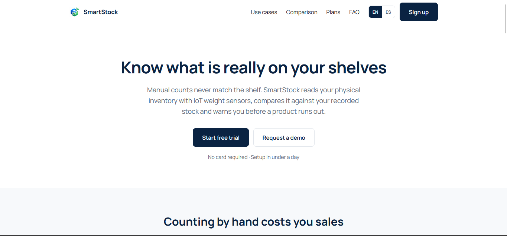

**Casos de uso por segmento objetivo (US17, US18)**

La sección de casos de uso separa el contenido dirigido a bodegas de barrio del dirigido a minimarkets. Cada bloque cierra con un call-to-action que redirige a la vista de registro de la Web Application transportando el segmento correspondiente.

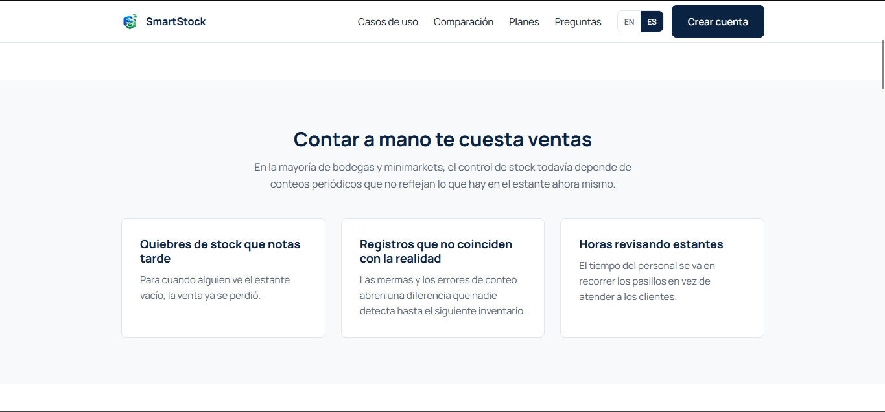

**Planes y precios (US19)**

Los tres planes se presentan sobre el mismo conjunto de características, ordenados de menor a mayor capacidad. Cada plan conduce al registro con el plan preseleccionado.

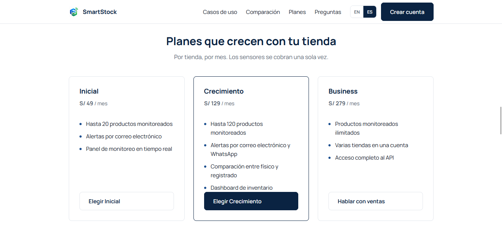

**Formulario de solicitud de demostración (US20)**

El formulario valida los campos obligatorios al abandonar cada campo y expone los mensajes de error mediante `role="alert"`, de modo que un lector de pantalla los anuncie.

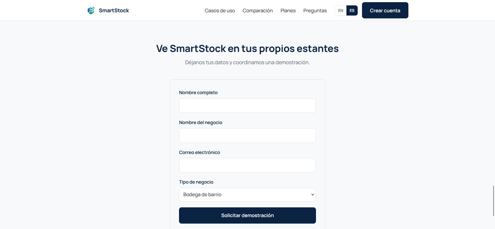

**Internacionalización de la experiencia (en_US / es_419)**

El idioma por defecto del sitio es el inglés, conforme a lo establecido en el enunciado. El selector de idioma de la barra superior conmuta toda la experiencia al español latinoamericano, incluyendo el título del documento, los textos de la interfaz y los mensajes de validación del formulario. La preferencia queda registrada en el navegador y el atributo `lang` del documento se actualiza, de modo que un lector de pantalla emplee la pronunciación correcta.

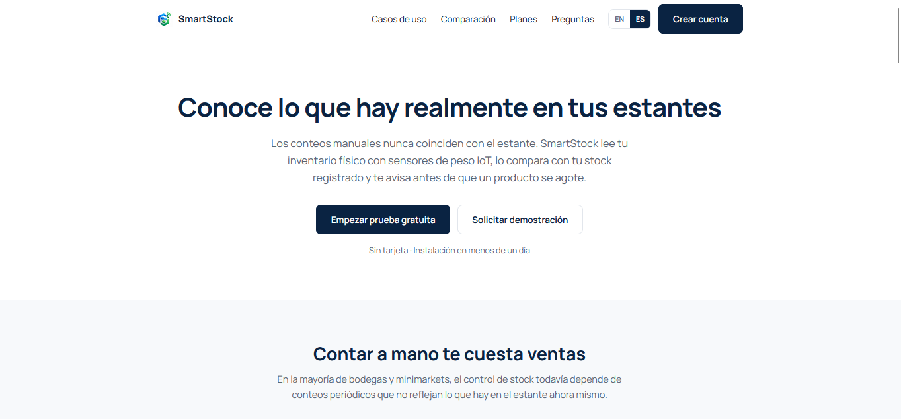

_Pendiente: incorporar el enlace al video que ilustra y explica la visualización y navegación logradas en este Sprint, junto con capturas de la experiencia en navegador móvil._

#### 5.2.1.6. Services Documentation Evidence for Sprint Review

_No aplica para el Sprint 1. El alcance de esta iteración corresponde al Landing Page, que es un sitio web estático y no expone Web Services. La documentación de endpoints con OpenAPI se incorpora a partir del Sprint en el que se inicia la implementación del RESTful API._

#### 5.2.1.7. Software Deployment Evidence for Sprint Review

Durante el Sprint 1, el alcance de despliegue correspondió al Landing Page. El equipo creó el repositorio `smartstock-landing-page` dentro de la organización NexoStock, aplicó sobre él el flujo de trabajo GitFlow e integró la versión 1.0.0 a la rama `main` mediante una release branch. A continuación, habilitó GitHub Pages tomando como fuente dicha rama y el directorio raíz del repositorio.

| Producto | Repositorio | URL desplegado | Estado |
|:---------|:------------|:---------------|:-------|
| Landing Page | [https://github.com/NexoStock/smartstock-landing-page](https://github.com/NexoStock/smartstock-landing-page) | [https://nexostock.github.io/smartstock-landing-page/](https://nexostock.github.io/smartstock-landing-page/) | Desplegado |
| Frontend Web Application | _Pendiente de despliegue._ | — | Fuera del alcance del Sprint 1 |
| Web Services | _Pendiente de despliegue._ | — | Fuera del alcance del Sprint 1 |

La configuración aplicada en el repositorio se muestra a continuación. La fuente de publicación es la rama `main` y el directorio raíz, y GitHub confirma la publicación del sitio. En el selector de ramas se aprecian además las ramas `main` y `develop`, que evidencian la aplicación de GitFlow sobre el repositorio.

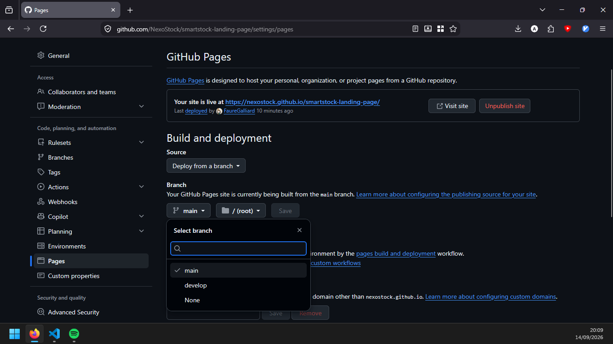

Se verificó que el sitio publicado responde correctamente tanto en la página de inicio como en la página de términos y condiciones, y que la hoja de estilos y el archivo de comportamiento se sirven sin errores.

_Pendiente: incorporar la captura del sitio publicado en navegador móvil._

#### 5.2.1.8. Team Collaboration Insights during Sprint

_Pendiente de elaborar. Debe explicar cómo se desarrollaron las actividades de implementación y presentar las capturas de imagen de los analíticos de colaboración y commits de GitHub realizados por los miembros del equipo durante el Sprint._

## 5.3. Validation Interviews

_Esta sección corresponde a la entrega AV2. En ella el equipo registra y explica las actividades de entrevistas de validación, en las que usuarios de los segmentos objetivo interactúan con el Landing Page y con las aplicaciones._

### 5.3.1. Diseño de Entrevistas

_Pendiente. Corresponde a la entrega AV2._

### 5.3.2. Registro de Entrevistas

_Pendiente. Corresponde a la entrega AV2._

### 5.3.3. Evaluaciones según heurísticas

_Pendiente. Corresponde a la entrega AV2. Debe seguir el formato de evaluación de User Experience según heurísticas indicado en el Anexo D del enunciado del trabajo final, cubriendo heurísticas de usabilidad, arquitectura de información y diseño inclusivo._

## 5.4. Video About-the-Product

_Pendiente. Corresponde a la entrega AV2._

# Conclusiones

## Conclusiones y recomendaciones

_Pendiente de elaborar. La sección debe enunciar las conclusiones del equipo sobre el trabajo, incluyendo los resultados alcanzados en relación con el Problem Statement especificado, los assumptions realizados frente al comportamiento real de los segmentos, los Hypothesis Statements establecidos y los criterios de éxito definidos en el Lean UX Process, contrastados con los resultados obtenidos de las validaciones. Debe incluir además las recomendaciones sobre los siguientes pasos en relación con el roadmap de los productos digitales que forman parte del alcance del modelo de negocio digital._

## Video About-the-Team

_Pendiente. Corresponde a la entrega AV2. La sección debe incluir el resumen de los aspectos más relevantes del video, la pauta de secuencias de contenido con el timing de inicio de cada sección, un cuadro de video representativo, y el URL de la versión publicada en Microsoft Stream junto con el de la versión publicada en YouTube utilizada para incrustarse en el Landing Page._

# Bibliografía

Brown, S. (2026). *The C4 model: Visualizing software architecture*.

Driessen, V. (2010). *A successful Git branching model*. https://nvie.com/posts/a-successful-git-branching-model/

Evans, E. (2003). *Domain-driven design: Tackling complexity in the heart of software*. Addison-Wesley.

Gothelf, J., & Seiden, J. (2021). *Lean UX: Designing great products with agile teams* (3rd ed.). O'Reilly Media.

Google. (s.f.). *Google HTML/CSS style guide*. https://google.github.io/styleguide/htmlcssguide.html

Google. (s.f.). *Google Java style guide*. https://google.github.io/styleguide/javaguide.html

Google. (s.f.). *Google TypeScript style guide*. https://google.github.io/styleguide/tsguide.html

Lauret, A. (2025). *The design of web APIs* (2nd ed.). Simon and Schuster.

Nielsen Norman Group. (2018). *Empathy mapping: The first step in design thinking*. https://www.nngroup.com/articles/empathy-mapping/

Preston-Werner, T. (s.f.). *Semantic Versioning 2.0.0*. https://semver.org/

Xesquevixos, W., Karanam, R. R., Larsson, M., & Turnquist, G. L. (2026). *Learning Spring Boot 4: Simplify the development of production-grade applications using Java and Spring*. Packt Publishing.

_Pendiente: completar la bibliografía en formato APA con todas las referencias utilizadas como base para el desarrollo del trabajo o citadas en las secciones del informe, incluyendo las fuentes estadísticas empleadas en la sección 1.2.1 Antecedentes y problemática._

# Anexos

## Anexo A. Videos de Exposiciones

| Entrega | Título del video | Enlace |
|:--------|:-----------------|:-------|
| AV1 | _Pendiente_ | _Pendiente_ |

_Esta relación de títulos y videos se expande con cada entrega del proyecto._

## Anexo B. Enlaces de los artefactos elaborados

| Artefacto | Herramienta | Enlace |
|:----------|:------------|:-------|
| User Personas, Empathy Maps, User Journey Maps e Impact Map | UXPressia | _Pendiente_ |
| Wireframes, Mock-ups y Prototipos | Figma | _Pendiente_ |
| Wireflow Diagrams y User Flow Diagrams | FigJam | _Pendiente_ |
| Big Picture Event Storming y Design-Level Event Storming | Miro | _Pendiente_ |
| Diagramas de C4 Model | Structurizr | _Pendiente_ |
| Class Diagrams y Database Diagrams | LucidChart | _Pendiente_ |
| Product Backlog y Sprint Backlogs | Trello | _Pendiente_ |
| Landing Page desplegado | GitHub Pages | [https://nexostock.github.io/smartstock-landing-page/](https://nexostock.github.io/smartstock-landing-page/) |
