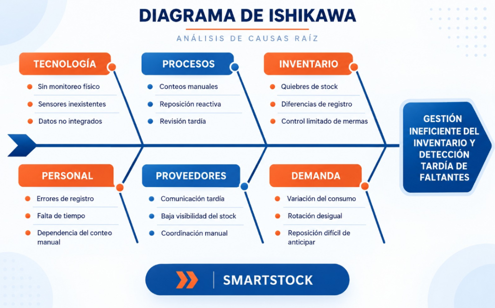
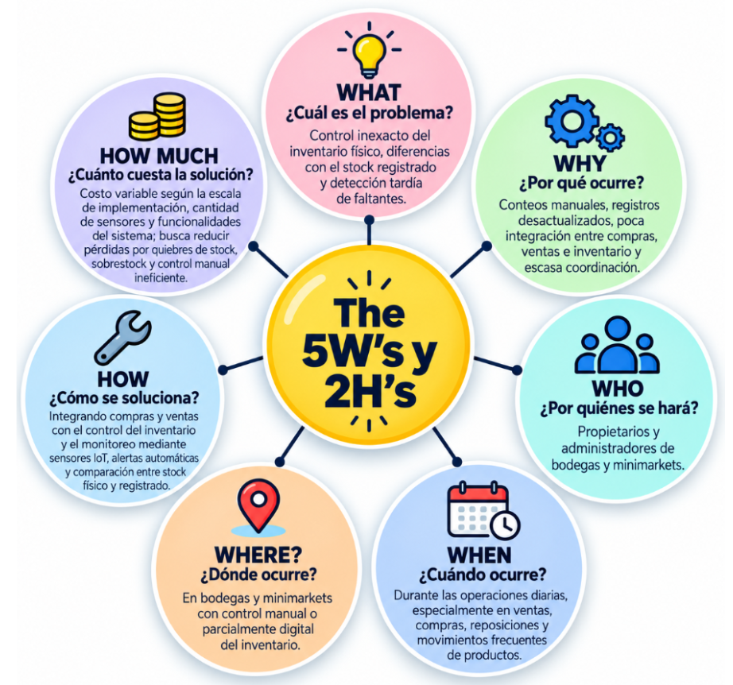
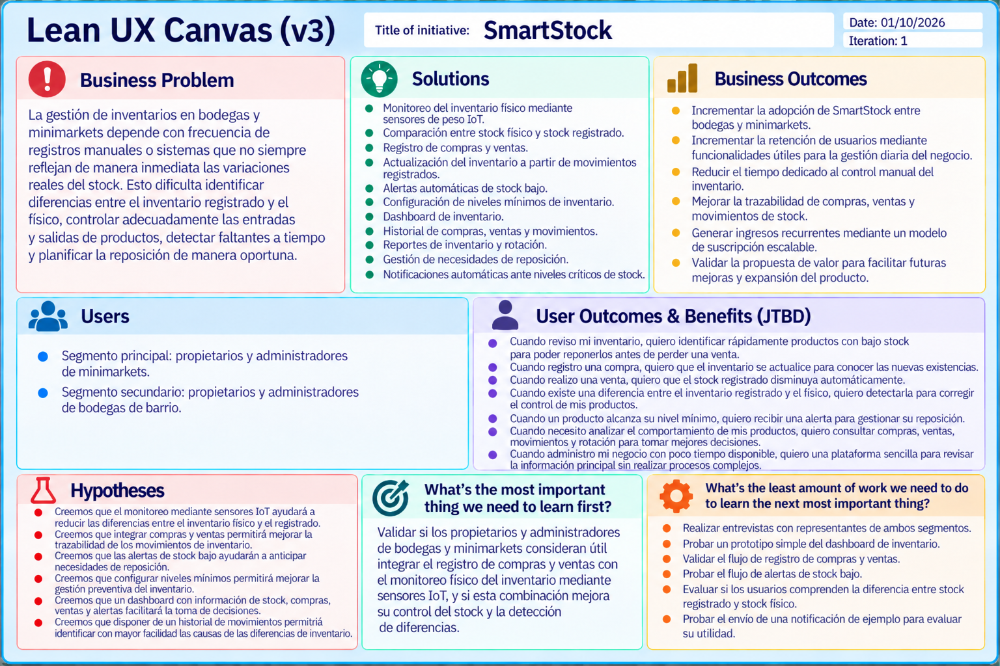

# Capítulo I: Introducción

### 1.1. Startup Profile

Actualmente, muchas bodegas y minimarkets realizan el control de sus productos mediante registros manuales o sistemas que no reflejan de manera inmediata la cantidad física disponible en sus estantes. Esta situación puede generar diferencias entre el inventario registrado y el inventario real, dificultando la identificación de productos agotados o con niveles bajos de stock y afectando la planificación del abastecimiento.

La falta de información actualizada también puede provocar pérdidas de ventas, compras innecesarias, acumulación de productos y dificultades para coordinar oportunamente la reposición con los proveedores. Además, los propietarios y administradores deben dedicar tiempo a realizar verificaciones manuales para conocer qué productos necesitan ser reabastecidos.

Frente a esta problemática surge **NexoStock**, una startup tecnológica orientada al desarrollo de soluciones digitales para mejorar la gestión de inventarios en bodegas y minimarkets mediante tecnologías web e Internet de las Cosas (IoT). Su propuesta busca conectar la información registrada en el sistema con información obtenida directamente del inventario físico, facilitando una gestión más rápida, organizada y trazable.

Como parte de esta propuesta, NexoStock desarrolla **SmartStock**, una plataforma web que utiliza sensores de peso conectados a dispositivos IoT para obtener información sobre la cantidad física disponible de determinados productos. El sistema permite comparar estos datos con el stock registrado, detectar diferencias o niveles bajos de inventario y generar alertas que apoyen la reposición de productos.

Además, SmartStock busca mejorar el proceso de reposición mediante alertas automáticas y notificaciones. A partir de las alertas generadas por la plataforma, los propietarios y administradores pueden identificar los productos que requieren abastecimiento y recibir un aviso oportuno para coordinar posteriormente la reposición con sus proveedores.

El propósito de NexoStock es facilitar la gestión de inventarios en pequeños comercios mediante herramientas digitales que permitan reducir la dependencia de conteos manuales, mejorar la disponibilidad de información y apoyar la toma de decisiones relacionadas con compras, ventas y reposición.

La startup busca diferenciarse mediante la integración de tecnologías IoT con una plataforma web de gestión de inventarios, permitiendo relacionar el inventario registrado digitalmente con información obtenida directamente del inventario físico. De esta manera, se busca ofrecer una solución orientada específicamente a las necesidades de minimarkets y bodegas de barrio.

El equipo de NexoStock está conformado por estudiantes de Ingeniería de Software que participan en el análisis, diseño, desarrollo, documentación y validación de SmartStock. Los integrantes son:

- **Crispin Valdivia, Angel Gabriel (U20221G181)**
- **Lopez Rimachi, Sebastian Leonardo (U20241F946)**
- **Montañez Salinas, Lorena Ariana (U202421125)**
- **Tuesta Girón, Kiara Lucia (U20251I477)**
- **Vizcarra Mamani, Candy Milagros (U20241F205)**

El trabajo del equipo se organiza mediante responsabilidades por contexto funcional, permitiendo que cada integrante lidere determinadas funcionalidades y coordine las dependencias necesarias con el resto del equipo. Asimismo, se emplean prácticas de trabajo colaborativo como GitFlow, ramas feature, Conventional Commits y Pull Requests para mantener la trazabilidad de los cambios y facilitar la revisión antes de integrar nuevas funcionalidades al proyecto.

En conjunto, NexoStock busca consolidarse como una propuesta tecnológica orientada a mejorar la gestión de inventarios en pequeños comercios, utilizando SmartStock como una solución que combina monitoreo físico mediante IoT, gestión digital del inventario y herramientas de apoyo para la reposición de productos.

### 1.1.1. Descripción de la Startup

**NexoStock** es una startup tecnológica orientada al desarrollo de soluciones digitales para mejorar la gestión de inventarios en bodegas y minimarkets. Nuestra propuesta integra tecnologías web e Internet de las Cosas (IoT) para conectar la información registrada en el sistema con la cantidad física de productos disponible en los establecimientos.

Como parte de esta iniciativa, desarrollamos **SmartStock**, una plataforma web que utiliza sensores de peso conectados a dispositivos IoT para monitorear el inventario en tiempo real. La información obtenida permite comparar el stock físico con el registrado, detectar productos con niveles bajos de existencia, identificar diferencias de inventario y generar alertas para facilitar una reposición oportuna.

Asimismo, la plataforma permite consultar información sobre la rotación de productos, mermas y comportamiento histórico del inventario, apoyando a los administradores en la toma de decisiones. Además, SmartStock incorpora funcionalidades orientadas a facilitar la reposición de productos. Los propietarios y administradores podrán identificar necesidades de abastecimiento mediante las alertas del sistema y recibir notificaciones automáticas (correo electrónico o WhatsApp) que les permitan actuar de manera oportuna frente a sus proveedores.

De esta manera, **NexoStock** busca contribuir a una gestión de inventarios más eficiente, reducir pérdidas económicas y mejorar la coordinación entre los pequeños comercios y sus proveedores.

A continuación, se presentan la misión, visión y valores que guían a nuestra startup:

| Misión | Visión | Valores |
|---|---|---|
| Brindar soluciones tecnológicas que permitan a bodegas y minimarkets gestionar sus inventarios de manera eficiente mediante tecnologías web e IoT, facilitando el monitoreo de productos y el envío de alertas oportunas para su reposición. | Convertirnos en una startup referente en soluciones inteligentes para la gestión de inventarios en pequeños comercios, contribuyendo a su transformación digital, eficiencia operativa y crecimiento sostenible. | **Innovación:** buscamos mejorar continuamente nuestras soluciones tecnológicas.  **Confianza:** brindamos información clara y confiable para la toma de decisiones.  **Eficiencia:** promovemos una mejor gestión de recursos e inventarios.  **Responsabilidad:** desarrollamos soluciones orientadas a las necesidades reales de los usuarios.  **Colaboración:** fomentamos una mejor comunicación entre los comercios y sus proveedores mediante información oportuna. |

### 1.1.2. Perfiles de integrantes del equipo

### 1.2. Solution Profile

Nuestra solución, **SmartStock**, es una plataforma web orientada a mejorar la gestión de inventarios en bodegas y minimarkets mediante el uso de tecnologías web e Internet de las Cosas (IoT). La plataforma busca reducir la dependencia de conteos manuales y facilitar el acceso a información actualizada sobre el estado de los productos.

SmartStock utiliza sensores de peso conectados a dispositivos IoT para obtener información sobre la cantidad física disponible de determinados productos y compararla con el stock registrado en el sistema. Esta integración permite detectar diferencias entre el inventario físico y el registrado, identificar productos con niveles bajos de existencia y generar alertas relacionadas con posibles necesidades de reposición.

Además, la plataforma incorpora funcionalidades para registrar y gestionar compras y ventas. Las compras permiten representar entradas de productos al inventario, mientras que las ventas representan salidas de stock. Estos movimientos contribuyen a mantener actualizado el inventario registrado y permiten posteriormente compararlo con la información obtenida mediante los sensores IoT.

SmartStock también incluye funcionalidades relacionadas con la gestión del catálogo de productos, registro de proveedores, configuración de niveles mínimos de stock, consulta del historial de movimientos, visualización de alertas, monitoreo del estado de dispositivos IoT y presentación de información mediante dashboards y reportes.

La solución busca apoyar el proceso de reposición mediante alertas automáticas y notificaciones. Cuando un producto alcanza un nivel bajo de stock o se detecta una posible necesidad de abastecimiento, el usuario puede identificar esta situación desde la plataforma y coordinar posteriormente con sus proveedores mediante canales externos como correo electrónico o WhatsApp.

El principal valor diferencial de SmartStock radica en integrar el monitoreo del inventario físico mediante dispositivos IoT con una plataforma web que centraliza la información registrada de productos, compras, ventas y movimientos de inventario. A diferencia de métodos tradicionales basados únicamente en revisiones manuales o registros que pueden no reflejar inmediatamente la cantidad física disponible, SmartStock busca proporcionar información más actualizada para apoyar la toma de decisiones.

El alcance actual de SmartStock comprende las siguientes funcionalidades principales:

- Registro y autenticación de usuarios.
- Gestión del catálogo de productos.
- Registro y edición de productos.
- Configuración de niveles mínimos de stock.
- Registro y consulta de proveedores.
- Registro y seguimiento de compras.
- Registro y consulta de ventas.
- Actualización del inventario mediante movimientos de entrada y salida.
- Vinculación de sensores IoT con productos.
- Consulta del estado de los dispositivos IoT.
- Comparación entre el inventario físico y el inventario registrado.
- Generación de alertas de stock bajo.
- Gestión de necesidades de reposición.
- Consulta del historial de movimientos.
- Visualización de dashboards e indicadores.
- Generación de reportes relacionados con inventario y rotación de productos.

Durante la etapa actual del proyecto, el Frontend Web Application utiliza servicios simulados para representar determinados flujos funcionales mientras se prepara la implementación e integración progresiva de los Web Services reales.

El alcance de SmartStock se concentra en apoyar la gestión, monitoreo y análisis del inventario. La plataforma no busca reemplazar directamente los medios externos utilizados para concretar pedidos con proveedores. Las alertas y notificaciones permiten informar una necesidad de reposición, pero la coordinación final con el proveedor puede realizarse mediante canales externos.

En conjunto, SmartStock busca ofrecer una solución integrada que permita a propietarios y administradores de minimarkets y bodegas de barrio controlar con mayor claridad sus productos, detectar posibles diferencias entre inventario físico y registrado, anticipar necesidades de reposición y consultar información que facilite la toma de decisiones relacionadas con su inventario.

### 1.2.1. Antecedentes y problemática

En el contexto de las bodegas y minimarkets, el control de inventarios constituye una actividad crítica para garantizar la disponibilidad de productos, reducir pérdidas y coordinar de manera oportuna el abastecimiento. Sin embargo, en muchos pequeños comercios el seguimiento del stock todavía depende de conteos manuales, registros parciales o verificaciones periódicas que no siempre reflejan con precisión la cantidad física disponible en los estantes o zonas de almacenamiento.

Esta situación puede generar diferencias entre el inventario registrado y el inventario físico, lo que dificulta detectar a tiempo productos con niveles bajos de existencia, faltantes no identificados o reposiciones pendientes. Como consecuencia, los negocios pueden enfrentar quiebres de stock, pérdida de ventas, acumulación innecesaria de mercadería y uso ineficiente del tiempo del personal encargado del control.

Asimismo, la problemática no solo afecta a los administradores de los establecimientos, sino también a los proveedores, ya que una comunicación tardía sobre la falta de stock retrasa la reposición y reduce la capacidad de respuesta ante la demanda. Por ello, el proceso de inventario requiere no solo mayor precisión, sino también una mejor articulación entre los actores involucrados.

A nivel nacional, esta problemática también se refleja en la disponibilidad de productos en el punto de venta. Según Ñaupari et al. (2021), con datos registrados en 2014, el 61.76% de los productos no repuestos en góndola se relaciona con responsabilidades internas de la cadena, mientras que el 38.24% corresponde a responsabilidades del proveedor. Esto evidencia que los problemas de disponibilidad no dependen únicamente del abastecimiento externo, sino también de los procesos internos de control y reposición del establecimiento.

Frente a esta necesidad surge **SmartStock**, producto desarrollado por la startup NexoStock, como una plataforma web inteligente orientada a mejorar la gestión del inventario físico en bodegas y minimarkets mediante sensores de peso conectados a dispositivos IoT. La solución busca comparar automáticamente la cantidad física disponible con el stock registrado, detectar diferencias o niveles bajos de inventario y generar alertas que faciliten la reposición. Estas alertas permitirán a los responsables de minimarkets y bodegas de barrio identificar oportunamente las necesidades de abastecimiento y recibir un aviso a tiempo para gestionar la reposición con sus proveedores.

El análisis de la responsabilidad en la falta de reposición de productos, presentado en el Gráfico 1, permite dimensionar con mayor precisión el origen del problema dentro del sector retail peruano, evidenciando la necesidad de mecanismos de monitoreo interno como el que propone SmartStock.

*Gráfico 1. Responsabilidad de los productos no repuestos en góndola en el Perú. Fuente: Ñaupari et al. (2021), con datos nacionales de 2014. Elaboración propia.*

**Conclusiones a partir del Gráfico 1:**

- El 61.76% de los productos no repuestos en góndola se relaciona con responsabilidades internas de la cadena, mientras que el 38.24% corresponde a responsabilidades del proveedor.
- Esto evidencia que los problemas de disponibilidad no dependen únicamente del abastecimiento externo, sino también de los procesos internos de control y reposición del establecimiento.
- Una mejor coordinación entre los comercios y sus proveedores puede contribuir a reducir los faltantes y mejorar la disponibilidad de productos.

Complementariamente, el siguiente gráfico muestra cómo la mejora de los procesos de recepción y reposición puede incrementar la disponibilidad de productos en góndola, evidenciando la importancia de contar con mecanismos adecuados de control y abastecimiento.

*Gráfico 2. Evolución de la disponibilidad en góndola (OSA) después de mejorar los procesos de recepción y reposición. Fuente: Ñaupari et al. (2021). Elaboración propia.*

**Conclusiones a partir del Gráfico 2:**

- La disponibilidad en góndola aumentó de 78.3% en enero de 2019 a 92.4% en octubre de 2019.
- Esto representa una mejora de 14.1 puntos porcentuales en la disponibilidad de productos.
- Los resultados evidencian que mejorar los procesos de recepción, control y reposición puede reducir los problemas de falta de productos y favorecer una gestión más eficiente del inventario.

En conjunto, ambos gráficos evidencian que los problemas de disponibilidad de productos están relacionados tanto con los procesos internos de los establecimientos como con la participación de los proveedores. Asimismo, se observa que una gestión adecuada de la recepción y reposición puede mejorar significativamente la disponibilidad en góndola. Desde una perspectiva causal, el siguiente Diagrama de Ishikawa sintetiza las principales causas de la problemática.

*Gráfico 3. Diagrama de Ishikawa sobre las causas de la gestión ineficiente del inventario en bodegas y minimarkets. (2026). Elaboración propia.*

**Conclusiones a partir del Gráfico 3:**

- La problemática del inventario es multifactorial, ya que intervienen factores tecnológicos, operativos, humanos, de coordinación con proveedores y de comportamiento de la demanda.
- La dimensión tecnológica resulta crítica, debido a que la ausencia de monitoreo físico automatizado y de integración entre datos limita la visibilidad del inventario real.
- La coordinación con proveedores constituye un factor relevante, puesto que una detección tardía de faltantes también retrasa el proceso de reposición y afecta la disponibilidad de productos.

El flujo del problema puede describirse de la siguiente manera: durante la operación diaria se producen ventas y salidas de productos, pero si no existe un mecanismo de monitoreo automático del stock físico, las diferencias entre lo registrado y lo realmente disponible pueden pasar desapercibidas. Esto lleva a revisiones tardías, quiebres de stock y una reposición demorada. El siguiente diagrama resume este ciclo e indica el punto en el que SmartStock interviene.

*Gráfico 4. Diagrama de flujo sobre el ciclo de detección tardía y reposición del inventario en bodegas y minimarkets. (2026). Elaboración propia.*

**Conclusiones a partir del Gráfico 4:**

- Sin un sistema de monitoreo automatizado, el negocio entra en un ciclo repetitivo de desactualización del inventario, revisión tardía y reposición reactiva.
- SmartStock actúa como punto de quiebre al detectar niveles bajos de stock o diferencias entre el inventario físico y el registrado antes de que se produzca una afectación mayor.
- La generación de alertas y la visibilidad compartida con administradores y proveedores permiten transformar un proceso reactivo en uno preventivo y mejor coordinado.

### The 5W's y 2H's

#### 1. What – ¿Cuál es el problema?

El problema consiste en la dificultad de bodegas y minimarkets para mantener actualizado el control de su inventario físico, lo que puede generar diferencias con el stock registrado y provocar que los productos con niveles bajos o agotados sean identificados de manera tardía.

#### 2. When – ¿Cuándo ocurre?

La problemática se presenta durante las operaciones diarias del establecimiento, especialmente cuando se realizan ventas, recepción de mercadería, reposiciones o movimientos frecuentes que modifican continuamente las existencias disponibles.

#### 3. Where – ¿Dónde ocurre?

Se presenta principalmente en bodegas y minimarkets donde el control del inventario físico depende de verificaciones manuales o de sistemas que no están conectados directamente con las existencias reales en estantes o zonas de almacenamiento.

#### 4. Who – ¿Quiénes están involucrados?

Los principales involucrados son los propietarios o administradores de bodegas y minimarkets, encargados del control y reposición del inventario, así como los proveedores responsables de abastecer los productos comercializados por estos establecimientos.

#### 5. Why – ¿Por qué ocurre?

Ocurre debido a la dependencia de conteos manuales, errores durante el registro de movimientos, falta de sincronización entre inventario físico y digital, variaciones en la demanda y una comunicación que puede darse tardíamente entre comercios y proveedores.

#### 6. How – ¿Cómo se puede solucionar?

La solución propuesta, SmartStock, plantea integrar el registro de compras y ventas con el control del inventario y el monitoreo físico mediante sensores de peso conectados a dispositivos IoT. La plataforma web procesará esta información para comparar el inventario registrado con las existencias físicas, detectar niveles bajos o diferencias de stock, generar alertas y facilitar la planificación de la reposición.

#### 7. How much – ¿Cuánto impacto genera / cuánto cuesta la solución?

La falta de un control adecuado del inventario puede generar pérdidas por quiebres de stock, compras innecesarias, exceso de existencias y tiempo empleado en verificaciones manuales. En cuanto a la solución, el costo dependerá de la escala de implementación, cantidad de sensores y alcance del servicio; sin embargo, su propósito es reducir costos operativos y mejorar la disponibilidad de productos.

*Gráfico 5. Equipo NexoStock. The 5 W's y 2H's sobre la problemática de la gestión de inventarios en bodegas y minimarkets. (2026). Elaboración propia.*

#### Alcance del proyecto

SmartStock comprende el desarrollo de una plataforma web orientada a propietarios y administradores de bodegas y minimarkets, cuyo propósito es mejorar el control del inventario mediante la integración de información registrada en el sistema con datos obtenidos del inventario físico.

Dentro del alcance de la solución se considera la gestión de usuarios y accesos, el catálogo de productos, el registro de compras y ventas, el control del inventario, la administración de dispositivos IoT, la configuración de niveles mínimos de stock, la generación de alertas de reposición y la consulta de información histórica mediante reportes y herramientas de análisis.

El registro de compras permitirá incrementar las existencias registradas de los productos, mientras que el registro de ventas permitirá reflejar sus respectivas salidas. Paralelamente, los sensores de peso IoT permitirán obtener información del inventario físico de determinados productos, con el objetivo de contrastarla con el stock registrado e identificar posibles diferencias o niveles bajos de existencia.

Asimismo, SmartStock permitirá generar alertas cuando un producto alcance los niveles mínimos configurados, facilitando que el propietario o administrador identifique oportunamente las necesidades de reposición. La coordinación y adquisición de productos con los proveedores continuará realizándose externamente por el usuario, por lo que los proveedores no forman parte de los usuarios directos de la plataforma.

La solución también contempla un dashboard con información relevante sobre el estado del inventario, historial de movimientos, compras, ventas, alertas y reportes que apoyen la toma de decisiones de los responsables del establecimiento.

Quedan fuera del alcance del proyecto la realización automática de pedidos a proveedores, la gestión de proveedores como usuarios de la plataforma, los procesos de contabilidad y facturación electrónica, la gestión de comercio electrónico y el monitoreo mediante sensores de todos los tipos de productos. Los sensores IoT serán aplicables principalmente a productos cuyas características permitan estimar adecuadamente sus existencias mediante el peso.

#### Diferenciación frente a la competencia

La principal diferenciación de SmartStock consiste en complementar la gestión digital de compras, ventas e inventario con el monitoreo del stock físico mediante sensores de peso IoT. Mientras que soluciones de punto de venta e inventario como Alegra POS y Vendty se orientan principalmente al registro de las operaciones realizadas en el sistema, SmartStock busca contrastar dicha información con las existencias físicas de determinados productos.

Esta integración permite que la solución no se limite a indicar cuánto inventario debería existir según los registros de compras y ventas, sino que también pueda detectar posibles diferencias entre el stock registrado y el inventario físico. A partir de esta información, SmartStock puede generar alertas relacionadas con niveles bajos de stock y apoyar una gestión preventiva de la reposición.

Frente al uso de hojas de cálculo, cuadernos y otros registros manuales, SmartStock incorpora una mayor automatización, centralización de la información, historial de movimientos y generación de alertas. Asimismo, a diferencia de soluciones tecnológicas de retail de mayor escala como Trax Retail, basadas principalmente en visión computacional e inteligencia artificial, SmartStock propone una alternativa enfocada específicamente en bodegas y minimarkets mediante sensores IoT y una implementación progresiva de acuerdo con las necesidades del establecimiento.

De esta manera, la propuesta de valor de SmartStock se basa en integrar **compras, ventas, inventario digital y monitoreo físico IoT** dentro de una misma solución orientada a pequeños comercios.

### 1.2.2. Lean UX Process

#### 1.2.2.1. Lean UX Problem Statements

Actualmente, la gestión de inventarios en **minimarkets y bodegas de barrio** depende en gran medida de conteos manuales, registros realizados por los administradores y verificaciones periódicas de los productos disponibles. Esta forma de trabajo puede generar diferencias entre el inventario registrado y el inventario físico, dificultando la detección oportuna de productos con niveles bajos de stock o agotados.

Asimismo, los propietarios y administradores necesitan conocer constantemente qué productos requieren reposición para mantener una adecuada disponibilidad de mercadería. Sin embargo, cuando la información del inventario no se encuentra actualizada, la identificación de faltantes puede realizarse de manera tardía, generando quiebres de stock, pérdida de oportunidades de venta y mayor tiempo dedicado a verificaciones manuales.

Las soluciones tradicionales de gestión de inventarios se enfocan principalmente en registrar entradas y salidas de productos, pero no necesariamente permiten conocer de manera automática la cantidad física disponible. Además, algunas soluciones tecnológicas existentes están orientadas a operaciones de retail de mayor escala, lo que puede dificultar su adopción en pequeños establecimientos debido a su complejidad o costos de implementación.

Frente a esta situación, SmartStock busca cubrir esta brecha mediante una plataforma web que integre sensores de peso conectados a dispositivos IoT para monitorear las existencias físicas de determinados productos, compararlas con el stock registrado y generar alertas ante niveles bajos o diferencias de inventario. La información obtenida también permitirá apoyar la planificación de la reposición mediante notificaciones automáticas que informen oportunamente sobre las necesidades de abastecimiento.

El **propósito** de SmartStock es mejorar la gestión de inventarios en pequeños comercios mediante la integración del inventario registrado con información obtenida directamente del inventario físico. De esta manera, se busca brindar a los propietarios y administradores información más actualizada que les permita identificar productos con bajo stock, detectar posibles discrepancias y tomar decisiones de reposición con mayor anticipación.

El **mercado objetivo** inicial está conformado principalmente por propietarios y administradores de minimarkets, considerados como el segmento principal debido al mayor volumen de productos y movimientos de inventario que gestionan. Como segmento secundario, se consideran los propietarios y administradores de bodegas de barrio, quienes también necesitan mejorar el control de sus existencias, aunque pueden presentar una menor capacidad de inversión y necesidades operativas diferentes.

La **oportunidad** identificada surge de la necesidad de estos establecimientos de reducir la dependencia de conteos manuales, disminuir los quiebres de stock y disponer de información más confiable para gestionar el abastecimiento. SmartStock busca aprovechar esta oportunidad mediante una solución enfocada específicamente en bodegas y minimarkets, combinando herramientas de gestión digital con monitoreo físico del inventario mediante IoT.

Consideraremos que la solución es exitosa cuando los usuarios de ambos segmentos puedan detectar con mayor rapidez productos con bajo stock, identificar diferencias entre el inventario físico y el registrado, reducir el tiempo dedicado a verificaciones manuales y mejorar la planificación de la reposición de productos.

De acuerdo con lo anterior, planteamos el siguiente **Problem Statement**:

> ¿De qué manera podríamos mejorar la gestión de inventarios en minimarkets y bodegas de barrio para que sus propietarios y administradores puedan conocer oportunamente los niveles reales de stock, detectar faltantes y diferencias de inventario, y gestionar la reposición de productos mediante una solución automatizada basada en tecnologías IoT?

#### 1.2.2.2. Lean UX Assumptions

Para abordar la problemática relacionada con la gestión de inventarios en minimarkets y bodegas de barrio, se han definido supuestos que orientarán el desarrollo de SmartStock. Estos supuestos consideran las necesidades de ambos segmentos objetivo, los resultados esperados del negocio y las funcionalidades necesarias para validar la propuesta.

##### Business Assumptions

- Creemos que los minimarkets necesitan mejorar el control de su inventario físico debido al volumen de productos y movimientos que gestionan diariamente.
- Suponemos que los propietarios y administradores de minimarkets valorarán una solución que reduzca el tiempo dedicado a conteos y verificaciones manuales.
- Creemos que las bodegas de barrio también presentan dificultades para mantener actualizado su inventario y requieren una solución sencilla y de bajo esfuerzo operativo.
- Suponemos que los minimarkets constituyen el segmento principal de SmartStock por la priorización comercial definida por el equipo y por una mayor capacidad de pago mensual esperada.
- Creemos que las bodegas de barrio constituyen un segmento secundario con un mercado amplio, pero con mayor sensibilidad al costo de adopción.
- Suponemos que un modelo de suscripción escalable, acompañado de una implementación gradual de sensores, puede adaptarse a las posibilidades de ambos segmentos.

##### Business Outcome Assumptions

- Creemos que SmartStock permitirá reducir las diferencias entre el inventario físico y el inventario registrado.
- Suponemos que las alertas de stock bajo permitirán disminuir los casos en los que un producto se agota sin ser detectado oportunamente.
- Creemos que la plataforma permitirá reducir el tiempo destinado a verificaciones manuales del inventario.
- Suponemos que la información generada por SmartStock facilitará una reposición más oportuna de productos.
- Creemos que una interfaz sencilla favorecerá la adopción de SmartStock en minimarkets y bodegas de barrio.
- Suponemos que una oferta escalable permitirá captar inicialmente minimarkets y posteriormente ampliar la adopción hacia bodegas de barrio.

##### User Assumptions

- Creemos que el segmento principal estará conformado por propietarios y administradores de minimarkets responsables del control de inventario y la reposición.
- Suponemos que el segmento secundario estará conformado por propietarios y administradores de bodegas de barrio que realizan el control de sus productos de manera directa.
- Creemos que los responsables de minimarkets necesitan visualizar rápidamente el estado de un inventario con mayor cantidad de productos y movimientos.
- Suponemos que los responsables de bodegas de barrio necesitan una solución simple, fácil de aprender y que no incremente significativamente su carga operativa.
- Creemos que ambos segmentos necesitan información clara y actualizada para identificar productos con bajo stock.
- Suponemos que ambos segmentos presentan distintos niveles de experiencia tecnológica, por lo que la plataforma debe ser intuitiva y accesible.

##### User Outcome and Benefit Assumptions

- Creemos que los responsables de minimarkets podrán identificar con mayor rapidez los productos que requieren reposición.
- Suponemos que los responsables de bodegas de barrio podrán reducir el tiempo empleado en conteos y verificaciones manuales.
- Creemos que ambos segmentos podrán detectar con mayor facilidad diferencias entre las existencias físicas y las registradas.
- Suponemos que los usuarios podrán tomar decisiones de reposición con información más actualizada.
- Creemos que las alertas permitirán anticipar faltantes antes de que los productos se agoten.
- Suponemos que los reportes e información histórica ayudarán a comprender mejor la rotación y el comportamiento del inventario.

##### Feature Assumptions

- Creemos que el monitoreo mediante sensores de peso IoT permitirá obtener información sobre las existencias físicas de determinados productos.
- Creemos que la comparación automática entre el stock físico y el stock registrado permitirá identificar diferencias de inventario.
- Creemos que las alertas automáticas de stock bajo ayudarán a detectar oportunamente necesidades de reposición.
- Suponemos que la configuración de niveles mínimos de stock permitirá adaptar las alertas a las necesidades de cada establecimiento.
- Creemos que un dashboard de inventario facilitará la visualización del estado general de los productos.
- Suponemos que el historial de alertas, movimientos y reportes de rotación permitirá realizar un mejor seguimiento del inventario.
- Creemos que una función de gestión de reposición, apoyada en notificaciones automáticas por correo electrónico o WhatsApp mediante un servicio externo de terceros, permitirá registrar necesidades de abastecimiento y que el usuario coordine oportunamente con sus proveedores.

##### Validation Metrics Assumptions

Para validar los supuestos planteados y determinar si SmartStock genera los resultados esperados para los segmentos objetivo, se establecen las siguientes métricas iniciales:

- Suponemos que al menos el **80 % de los productos monitoreados** podrá mostrar una correspondencia consistente entre el inventario físico detectado mediante sensores y el inventario registrado durante las pruebas.
- Creemos que al menos el **75 % de los usuarios** podrá identificar correctamente una diferencia entre el inventario físico y el inventario registrado utilizando la plataforma.
- Suponemos que al menos el **80 % de los usuarios** considerará que las alertas de stock bajo permiten anticipar adecuadamente una necesidad de reposición.
- Creemos que al menos el **85 % de los usuarios** podrá identificar productos con stock suficiente, bajo o agotado sin requerir asistencia adicional.
- Suponemos que al menos el **75 % de los usuarios** podrá configurar correctamente un nivel mínimo de stock para un producto.
- Creemos que al menos el **70 % de los usuarios** considerará útil la información histórica de movimientos, alertas y rotación para apoyar sus decisiones de reposición.
- Suponemos que el uso de SmartStock permitirá reducir el tiempo necesario para realizar verificaciones manuales del inventario en comparación con el proceso tradicional.
- Creemos que la información proporcionada por el sistema permitirá detectar con mayor rapidez productos que requieren reposición antes de que se produzcan quiebres de stock.

##### Definition of Done Assumptions

Se considerará que las funcionalidades principales relacionadas con los supuestos planteados cumplen con su **Definition of Done (DoD)** cuando:

- La funcionalidad se encuentre implementada e integrada en la Web Application de SmartStock.
- Los criterios de aceptación definidos para la User Story correspondiente hayan sido satisfechos.
- El flujo principal de la funcionalidad pueda ejecutarse sin errores críticos.
- Las validaciones de entrada y los mensajes de error funcionen correctamente.
- La información presentada al usuario sea comprensible y coherente con el estado real de la funcionalidad.
- La funcionalidad contemple estados de carga, vacío y error cuando corresponda.
- La interfaz pueda utilizarse correctamente en los idiomas español e inglés cuando la funcionalidad lo requiera.
- La funcionalidad se encuentre integrada con los demás bounded contexts necesarios para completar su flujo.
- Los cambios hayan sido registrados mediante commits siguiendo las convenciones definidas por el equipo.
- Los cambios hayan sido enviados mediante una rama feature y revisados a través de un Pull Request antes de integrarse a `develop`.
- La funcionalidad haya sido probada por el equipo y no presente errores críticos que impidan completar el flujo principal.
- La evidencia correspondiente haya sido documentada en el informe del proyecto cuando aplique.

#### 1.2.2.3. Lean UX Hypothesis Statements

De acuerdo con los supuestos definidos previamente, planteamos las siguientes hipótesis para validar si las funcionalidades propuestas de SmartStock generan beneficios para los propietarios y administradores de minimarkets, como segmento principal, y para los propietarios y administradores de bodegas de barrio, como segmento secundario.

Para formular las hipótesis se utiliza la siguiente estructura:

> **Creemos que** [acción o funcionalidad] **para** [usuario o segmento] **permitirá** [resultado esperado].  
> **Sabremos que hemos tenido éxito cuando** [métrica o criterio de validación].

A continuación, se presenta una hipótesis por cada Feature Assumption definido, complementada con hipótesis adicionales relacionadas con los resultados esperados del negocio y de los usuarios.

##### Hipótesis de negocio

1. **Creemos que** implementar el monitoreo del inventario físico mediante sensores de peso IoT para propietarios y administradores de minimarkets y bodegas de barrio **permitirá** reducir las diferencias entre el stock físico y el stock registrado. **Sabremos que hemos tenido éxito cuando** al menos el **80 % de los productos monitoreados** presente información consistente entre las existencias físicas detectadas y las registradas durante las pruebas de validación.

2. **Creemos que** comparar automáticamente el stock físico con el stock registrado para propietarios y administradores **permitirá** identificar diferencias de inventario con mayor rapidez. **Sabremos que hemos tenido éxito cuando** al menos el **75 % de los usuarios** logre identificar correctamente una diferencia de inventario mediante la plataforma sin necesidad de realizar previamente un conteo manual.

3. **Creemos que** implementar alertas automáticas de stock bajo para propietarios y administradores **permitirá** reducir los casos en los que un producto se agota sin ser detectado oportunamente. **Sabremos que hemos tenido éxito cuando** al menos el **80 % de los usuarios** considere que las alertas le permiten anticipar una necesidad de reposición antes de que el producto se agote.

4. **Creemos que** permitir la configuración de niveles mínimos de stock por producto para propietarios y administradores **permitirá** adaptar la gestión preventiva del inventario a las necesidades de cada establecimiento. **Sabremos que hemos tenido éxito cuando** al menos el **75 % de los usuarios** logre configurar correctamente los niveles mínimos de sus productos y utilizar las alertas generadas para planificar su reposición.

5. **Creemos que** proporcionar información actualizada sobre el inventario a propietarios y administradores **permitirá** reducir el tiempo destinado a verificaciones manuales. **Sabremos que hemos tenido éxito cuando** la mayoría de los usuarios indique que puede conocer el estado de sus productos en menos tiempo que mediante su proceso tradicional de revisión manual.

6. **Creemos que** integrar la información de compras y ventas con el inventario registrado **permitirá** mantener una visión más consistente de los movimientos de stock. **Sabremos que hemos tenido éxito cuando** las operaciones registradas de entrada y salida actualicen correctamente las existencias y los usuarios puedan identificar los cambios realizados sin inconsistencias críticas.

7. **Creemos que** ofrecer una solución escalable para minimarkets y bodegas de barrio **permitirá** adaptar SmartStock a establecimientos con diferentes volúmenes de productos y necesidades operativas. **Sabremos que hemos tenido éxito cuando** usuarios de ambos segmentos puedan completar los principales flujos de gestión de inventario sin requerir cambios estructurales en la plataforma.

##### Hipótesis de usuario

1. **Creemos que** ofrecer un dashboard web de inventario para propietarios y administradores de minimarkets y bodegas de barrio **permitirá** consultar con mayor rapidez el estado general de sus productos. **Sabremos que hemos tenido éxito cuando** al menos el **85 % de los usuarios** logre identificar productos con stock suficiente, bajo o agotado sin requerir asistencia.

2. **Creemos que** proporcionar un historial de movimientos, alertas y reportes de rotación para propietarios y administradores **permitirá** comprender mejor el comportamiento de su inventario y tomar decisiones de reposición. **Sabremos que hemos tenido éxito cuando** al menos el **70 % de los usuarios** considere que la información histórica y los reportes son útiles para planificar el abastecimiento de sus productos.

3. **Creemos que** incorporar herramientas para gestionar y dar seguimiento a las necesidades de reposición, junto con notificaciones automáticas de alerta, para propietarios y administradores **permitirá** organizar mejor el abastecimiento de sus establecimientos y coordinar oportunamente con sus proveedores. **Sabremos que hemos tenido éxito cuando** al menos el **75 % de los usuarios** logre identificar una necesidad de reposición, consultar su estado y registrar la acción correspondiente mediante SmartStock.

4. **Creemos que** presentar información clara sobre diferencias entre inventario físico y registrado para propietarios y administradores **permitirá** detectar posibles inconsistencias con menor esfuerzo. **Sabremos que hemos tenido éxito cuando** al menos el **75 % de los usuarios** interprete correctamente la diferencia mostrada y pueda determinar si es necesario realizar una verificación o ajuste.

5. **Creemos que** ofrecer una interfaz sencilla e intuitiva para propietarios y administradores con diferentes niveles de experiencia tecnológica **permitirá** reducir la dificultad de adopción de SmartStock. **Sabremos que hemos tenido éxito cuando** al menos el **80 % de los usuarios** pueda completar las tareas principales de la plataforma sin asistencia directa.

6. **Creemos que** permitir consultar alertas de stock bajo y necesidades de reposición desde una interfaz centralizada **permitirá** priorizar productos que requieren atención. **Sabremos que hemos tenido éxito cuando** al menos el **80 % de los usuarios** pueda identificar correctamente qué productos deben ser repuestos primero.

7. **Creemos que** integrar las funcionalidades de compras, ventas e inventario en una misma plataforma **permitirá** a los propietarios y administradores comprender mejor los movimientos que afectan sus existencias. **Sabremos que hemos tenido éxito cuando** al menos el **75 % de los usuarios** pueda reconocer si una variación del stock corresponde a una compra, una venta o una diferencia detectada en el inventario físico.

8. **Creemos que** mostrar el historial de movimientos de inventario para cada producto **permitirá** a los usuarios realizar un seguimiento más claro de las entradas y salidas. **Sabremos que hemos tenido éxito cuando** al menos el **75 % de los usuarios** pueda consultar el historial de un producto e identificar correctamente sus movimientos recientes.

##### Hipótesis relacionadas con las funcionalidades principales

1. **Creemos que** permitir el registro y edición de productos **permitirá** a los propietarios y administradores mantener actualizado su catálogo de inventario. **Sabremos que hemos tenido éxito cuando** al menos el **85 % de los usuarios** pueda registrar y modificar correctamente la información de un producto sin asistencia.

2. **Creemos que** permitir configurar un umbral mínimo de stock para cada producto **permitirá** generar alertas más acordes con las necesidades particulares del establecimiento. **Sabremos que hemos tenido éxito cuando** al menos el **75 % de los usuarios** pueda definir correctamente el nivel mínimo de un producto y comprender cuándo se genera una alerta.

3. **Creemos que** permitir el registro de proveedores **permitirá** organizar mejor la información necesaria para gestionar el abastecimiento. **Sabremos que hemos tenido éxito cuando** al menos el **80 % de los usuarios** pueda registrar y consultar correctamente los datos de un proveedor.

4. **Creemos que** permitir registrar compras y su recepción **permitirá** reflejar de manera más precisa las entradas de productos al inventario. **Sabremos que hemos tenido éxito cuando** al menos el **80 % de los usuarios** pueda completar correctamente el flujo de una compra y verificar posteriormente el incremento correspondiente en el stock registrado.

5. **Creemos que** permitir registrar ventas **permitirá** actualizar de manera oportuna las salidas de productos del inventario. **Sabremos que hemos tenido éxito cuando** al menos el **80 % de los usuarios** pueda completar una venta y verificar posteriormente la reducción correspondiente en el stock registrado.

6. **Creemos que** vincular sensores IoT con productos monitoreados **permitirá** obtener información física del inventario sin depender únicamente de registros manuales. **Sabremos que hemos tenido éxito cuando** al menos el **80 % de los dispositivos vinculados** pueda reportar correctamente su estado y asociarse al producto correspondiente durante las pruebas.

7. **Creemos que** mostrar el estado de los sensores IoT **permitirá** a los usuarios identificar rápidamente dispositivos activos, desconectados o con problemas. **Sabremos que hemos tenido éxito cuando** al menos el **85 % de los usuarios** pueda interpretar correctamente el estado mostrado para cada dispositivo.

8. **Creemos que** proporcionar reportes y visualizaciones analíticas del inventario **permitirá** apoyar la toma de decisiones sobre reposición y comportamiento de productos. **Sabremos que hemos tenido éxito cuando** al menos el **70 % de los usuarios** considere que los indicadores y reportes presentados aportan información útil para la gestión de su establecimiento.

#### 1.2.2.4. Lean UX Canvas

El Lean UX Canvas de SmartStock sintetiza los principales supuestos, problemas, usuarios, resultados esperados e hipótesis que orientan el desarrollo de la solución. Su construcción considera los hallazgos obtenidos durante las entrevistas de needfinding, los perfiles de usuario definidos para minimarkets y bodegas de barrio, así como los objetivos planteados para cada segmento.

El canvas se encuentra alineado con las Personas identificadas previamente. Por un lado, se considera como segmento principal a los **propietarios y administradores de minimarkets**, quienes gestionan una mayor cantidad de productos, movimientos de inventario, compras y ventas, y requieren información más rápida y precisa para controlar sus existencias. Por otro lado, se considera como segmento secundario a los **propietarios y administradores de bodegas de barrio**, quienes realizan una gestión más directa del negocio y requieren una solución sencilla, accesible y de bajo esfuerzo operativo.

En ambos casos, el problema principal identificado es la dependencia de conteos manuales y registros que no siempre reflejan inmediatamente la cantidad física disponible de los productos. Esta situación dificulta detectar diferencias entre el inventario registrado y el inventario físico, identificar productos próximos a agotarse y planificar la reposición de manera oportuna.

A partir de estas necesidades, el Lean UX Canvas plantea como soluciones principales el monitoreo del inventario físico mediante sensores de peso IoT, la comparación entre el stock físico y el stock registrado, el registro de compras y ventas, la actualización automática del inventario, las alertas de stock bajo, la configuración de niveles mínimos, el dashboard de inventario, el historial de movimientos, los reportes de inventario y rotación, la gestión de necesidades de reposición y las notificaciones automáticas.

Los **Business Outcomes** se orientan a incrementar la adopción y retención de SmartStock, reducir el tiempo dedicado al control manual del inventario, mejorar la trazabilidad de compras, ventas y movimientos de stock, generar ingresos recurrentes mediante un modelo de suscripción escalable y validar progresivamente la propuesta de valor.

Los **User Outcomes & Benefits** se relacionan directamente con las necesidades de las Personas. Los usuarios esperan identificar rápidamente productos con bajo stock, conocer nuevas existencias después de registrar una compra, visualizar la reducción automática del stock luego de una venta, detectar diferencias entre inventario físico y registrado, recibir alertas de reposición y consultar información histórica para tomar mejores decisiones.

Las hipótesis incluidas en el canvas se encuentran relacionadas con los supuestos definidos previamente. Estas hipótesis buscan validar si el uso de sensores IoT, la integración de compras y ventas, las alertas de stock bajo, la configuración de niveles mínimos, el dashboard y el historial de movimientos generan mejoras reales en el control del inventario.

Finalmente, el canvas prioriza como principal aprendizaje validar si los propietarios y administradores de minimarkets y bodegas de barrio consideran útil integrar el registro de compras y ventas con el monitoreo físico del inventario mediante sensores IoT. Para ello, se propone realizar entrevistas, probar prototipos, validar flujos de compra y venta, evaluar las alertas de stock bajo, comparar el stock registrado con el stock físico y probar el envío de notificaciones.

**Link:**  
[https://drive.google.com/file/d/1i2XQWFPxlGg8gTD2oAxxuiqZ7nckHCu0/view?usp=sharing](https://drive.google.com/file/d/1i2XQWFPxlGg8gTD2oAxxuiqZ7nckHCu0/view?usp=sharing)

*Figura 1. Lean UX Canvas.*

## 1.3. Segmentos objetivo

SmartStock está orientado principalmente a propietarios y administradores de minimarkets y bodegas de barrio que necesitan mejorar el control de sus productos, reducir verificaciones manuales y disponer de información más actualizada para gestionar sus inventarios.

Se han definido dos segmentos objetivo: un segmento principal conformado por propietarios y administradores de minimarkets y un segmento secundario conformado por propietarios y administradores de bodegas de barrio. Ambos segmentos comparten la necesidad de mejorar la gestión del inventario, aunque presentan diferencias en el volumen de productos, frecuencia de movimientos, capacidad de inversión y complejidad operativa.

- **Propietarios y administradores de minimarkets**

Son personas responsables de gestionar las operaciones diarias de minimarkets, incluyendo el control del inventario, revisión de existencias, registro de compras y ventas, reposición de productos y coordinación del abastecimiento.

Debido al mayor volumen de productos y movimientos que suelen manejar estos establecimientos, necesitan identificar con rapidez diferencias entre el stock registrado y las existencias físicas, detectar productos con niveles bajos de stock y mantener una mayor trazabilidad de las entradas y salidas del inventario.

Para el proyecto, este segmento se prioriza como principal por su volumen de operación y por una mayor capacidad de pago mensual esperada para adoptar una solución tecnológica de monitoreo de inventario.

Entre sus principales necesidades se encuentran:

- Conocer rápidamente el estado de su inventario.
- Identificar productos próximos a agotarse.
- Reducir el tiempo destinado a conteos y verificaciones manuales.
- Mantener trazabilidad de compras, ventas y movimientos.
- Detectar diferencias entre inventario físico y registrado.
- Planificar la reposición con mayor anticipación.
- Consultar información histórica para apoyar la toma de decisiones.

Como contexto empresarial, PRODUCE reporta que en 2024 existían **2 331 173 Mipyme formales en el Perú, equivalentes al 99,3 % de las empresas formales operativas**. Este dato permite dimensionar la importancia de las micro y pequeñas empresas dentro de la actividad empresarial nacional.

[https://www.gob.pe/institucion/produce/noticias/1299194-numero-de-mipyme-en-peru-ascendio-a-2-33-millones-al-cierre-del-2024-alcanzando-un-crecimiento-de-1-6](https://www.gob.pe/institucion/produce/noticias/1299194-numero-de-mipyme-en-peru-ascendio-a-2-33-millones-al-cierre-del-2024-alcanzando-un-crecimiento-de-1-6)

**User Journey - Propietarios y administradores de minimarkets**

El User Journey de este segmento representa el proceso que sigue un propietario o administrador desde que necesita conocer el estado de su inventario hasta que identifica y atiende una necesidad de reposición.

| Etapa | Acción del usuario | Necesidad | Problema identificado | Oportunidad para SmartStock |
| --- | --- | --- | --- | --- |
| **Revisión del inventario** | Consulta el estado de los productos disponibles. | Conocer rápidamente qué productos tienen stock suficiente, bajo o agotado. | Revisar manualmente una gran cantidad de productos requiere tiempo. | Mostrar el estado general mediante un dashboard de inventario. |
| **Detección de diferencias** | Compara lo registrado con las existencias reales. | Identificar posibles inconsistencias. | El inventario registrado puede diferir del inventario físico. | Comparar automáticamente el stock registrado con la información obtenida mediante sensores IoT. |
| **Identificación de bajo stock** | Detecta productos próximos a agotarse. | Anticipar necesidades de abastecimiento. | Los faltantes pueden identificarse demasiado tarde. | Generar alertas automáticas según niveles mínimos configurados. |
| **Registro de compras** | Registra productos recibidos de proveedores. | Mantener actualizado el inventario. | Las entradas pueden no registrarse oportunamente. | Registrar compras y reflejar las entradas correspondientes en el inventario. |
| **Registro de ventas** | Registra productos vendidos. | Mantener actualizado el stock disponible. | Los registros desactualizados pueden generar diferencias. | Registrar ventas y reflejar las salidas correspondientes en el inventario. |
| **Reposición** | Identifica qué productos necesitan abastecimiento. | Priorizar productos antes de que se agoten. | Puede ser difícil determinar qué productos atender primero. | Centralizar alertas y necesidades de reposición. |
| **Seguimiento** | Revisa movimientos y comportamiento del inventario. | Tomar mejores decisiones de abastecimiento. | La información histórica puede encontrarse dispersa. | Proporcionar historiales, dashboards y reportes. |

Este recorrido evidencia que los propietarios y administradores de minimarkets requieren una solución capaz de centralizar información y reducir el tiempo necesario para identificar diferencias, faltantes y necesidades de abastecimiento.

- **Propietarios y administradores de bodegas de barrio**

Son personas responsables de gestionar las operaciones diarias de bodegas de barrio, incluyendo el control del inventario, revisión de existencias, registro de ventas y reposición de productos.

Este segmento se considera secundario debido a que, aunque representa un mercado amplio para la solución, se espera una menor capacidad de pago mensual y una mayor sensibilidad al costo de implementación.

En muchos casos, el control de inventario depende de conteos manuales o registros simples, lo que puede generar diferencias entre el stock registrado y el real y dificultar la identificación oportuna de productos agotados.

Entre sus principales necesidades se encuentran:

- Utilizar una solución sencilla y fácil de aprender.
- Conocer el estado de sus productos sin realizar verificaciones constantes.
- Identificar productos con bajo stock.
- Reducir el tiempo dedicado al control manual.
- Recibir alertas oportunas.
- Organizar mejor sus necesidades de reposición.
- Evitar que la tecnología incremente significativamente su carga operativa.

Como contexto del sector comercial, el INEI señala que en Lima Metropolitana y Callao, durante el cuarto trimestre de 2024, el **42,6 % de las nuevas empresas registradas correspondió a comercio y reparación de vehículos**, lo que evidencia la relevancia de las actividades comerciales dentro de la dinámica empresarial.

[https://www.gob.pe/institucion/inei/informes-publicaciones/6550169-demografia-empresarial-en-el-peru-iv-trimestre-2024](https://www.gob.pe/institucion/inei/informes-publicaciones/6550169-demografia-empresarial-en-el-peru-iv-trimestre-2024)

**User Journey - Propietarios y administradores de bodegas de barrio**

El User Journey de este segmento representa un proceso de gestión más directo, en el cual el propietario o administrador suele encargarse personalmente del control de los productos y de la reposición.

| Etapa | Acción del usuario | Necesidad | Problema identificado | Oportunidad para SmartStock |
| --- | --- | --- | --- | --- |
| **Revisión de productos** | Verifica qué productos quedan disponibles. | Conocer las existencias sin realizar conteos frecuentes. | El control suele depender de observaciones y conteos manuales. | Mostrar información del inventario desde una interfaz sencilla. |
| **Detección de bajo stock** | Identifica productos que están por agotarse. | Saber qué productos debe reponer. | Puede detectar el faltante cuando el producto ya se agotó. | Generar alertas de stock bajo. |
| **Verificación física** | Revisa manualmente productos específicos. | Confirmar la cantidad disponible. | Los registros pueden no coincidir con la existencia real. | Utilizar sensores IoT para monitorear determinados productos. |
| **Registro de movimientos** | Registra compras o ventas realizadas. | Mantener actualizado el inventario. | Puede olvidar actualizar registros debido a otras tareas del negocio. | Simplificar el registro de compras, ventas y movimientos. |
| **Reposición** | Decide qué productos adquirir. | Organizar el abastecimiento con poco esfuerzo. | Puede no existir una lista clara de prioridades. | Mostrar necesidades de reposición generadas a partir de alertas. |
| **Coordinación con proveedores** | Contacta al proveedor para solicitar productos. | Realizar el pedido oportunamente. | La necesidad puede detectarse demasiado tarde. | Enviar notificaciones que permitan anticipar la coordinación externa. |
| **Seguimiento** | Revisa los productos después de la reposición. | Verificar que las existencias se hayan actualizado. | El proceso puede depender nuevamente de conteos manuales. | Consultar movimientos e inventario actualizado desde SmartStock. |

Este recorrido muestra que las bodegas de barrio requieren principalmente una experiencia simple, rápida y de bajo esfuerzo operativo. Por ello, SmartStock busca presentar información clara, automatizar alertas y facilitar las tareas principales sin exigir conocimientos técnicos avanzados.

Aunque ambos segmentos comparten la necesidad de mejorar el control del inventario, presentan diferencias relacionadas con su volumen de operación y la forma en que gestionan sus establecimientos.

| Aspecto | Minimarkets | Bodegas de barrio |
| --- | --- | --- |
| **Prioridad para SmartStock** | Segmento principal | Segmento secundario |
| **Volumen de productos** | Mayor | Menor o moderado |
| **Cantidad de movimientos** | Mayor frecuencia de compras y ventas | Menor frecuencia relativa |
| **Control actual** | Puede combinar registros digitales y verificaciones manuales | Mayor dependencia de métodos manuales o simples |
| **Necesidad principal** | Controlar eficientemente un inventario con mayor cantidad de movimientos | Simplificar el control del inventario |
| **Sensibilidad al costo** | Menor en comparación con el segmento secundario | Mayor |
| **Uso esperado de SmartStock** | Gestión integral, monitoreo, alertas, analítica y trazabilidad | Control sencillo, alertas y apoyo a la reposición |
| **Nivel de automatización esperado** | Mayor | Gradual |

La definición de ambos segmentos permite adaptar la propuesta de SmartStock a diferentes niveles de complejidad operativa. Los minimarkets constituyen el mercado inicial prioritario, mientras que las bodegas de barrio representan una oportunidad de expansión mediante una propuesta sencilla, accesible y escalable.