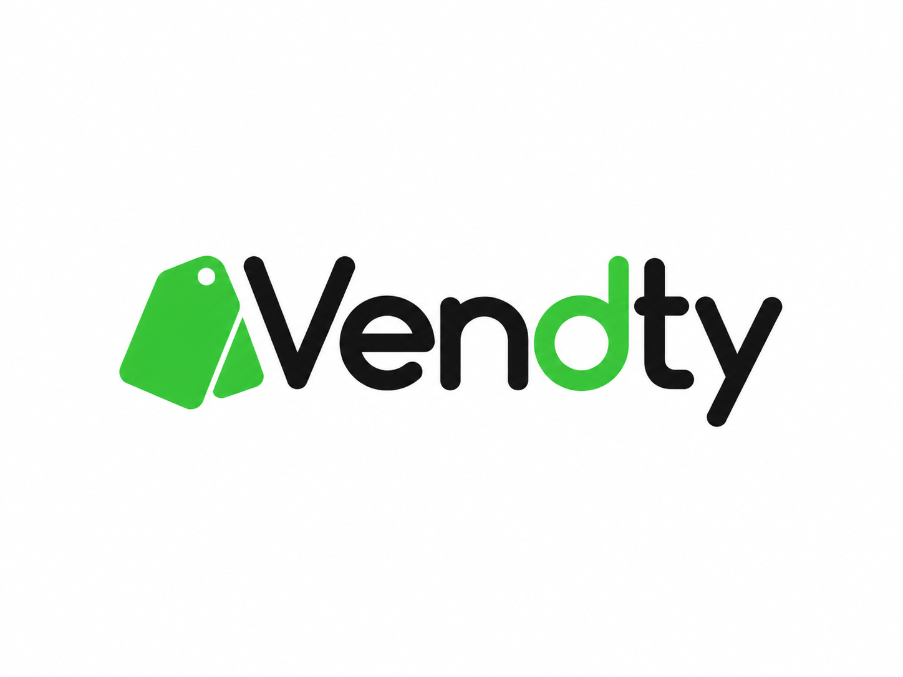
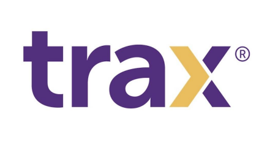

# Capítulo II: Requirements Elicitation & Analysis

## 2.1. Competidores

Para el análisis competitivo de SmartStock se consideran soluciones digitales que permiten gestionar ventas e inventarios en pequeños comercios, así como alternativas tradicionales utilizadas actualmente por bodegas y minimarkets. También se incluye una solución tecnológica de retail como referencia indirecta, con el propósito de identificar diferencias en el nivel de automatización y monitoreo del inventario físico.

- **Alegra POS:**  
  Alegra POS es una solución orientada a pequeños negocios que permite registrar ventas, administrar productos y controlar el inventario desde una plataforma digital. Su propuesta facilita la gestión del negocio y digitaliza el registro de ventas, productos e inventario. Sin embargo, el control del inventario se basa principalmente en la información registrada durante las operaciones. SmartStock busca complementar este enfoque mediante sensores IoT que permitan contrastar el inventario registrado con las existencias físicas y detectar diferencias de stock.

- **Vendty:**  
  Vendty es una plataforma de punto de venta que incorpora funcionalidades relacionadas con ventas, productos, inventarios y gestión comercial. Su propuesta permite centralizar diversas operaciones de un establecimiento en una solución digital. A diferencia de SmartStock, su enfoque se concentra principalmente en el registro transaccional de las operaciones, mientras que SmartStock incorpora sensores de peso IoT para monitorear cambios en las existencias físicas y generar alertas cuando se detecten niveles bajos o posibles diferencias de inventario.

- **Excel y registros manuales:**  
  El uso de hojas de cálculo, cuadernos y otros registros manuales representa una alternativa empleada por pequeños comercios para llevar el control de compras, ventas y existencias. Su principal ventaja es el bajo costo y la facilidad de implementación; sin embargo, requiere que el usuario actualice constantemente la información y puede estar expuesto a errores, omisiones o diferencias entre el inventario registrado y los productos realmente disponibles. SmartStock busca reducir estas limitaciones mediante la automatización del monitoreo y la generación de alertas basadas en información del inventario físico.

- **Trax Retail:**  
  Trax Retail es una solución tecnológica orientada al análisis de productos en establecimientos comerciales mediante visión computacional e inteligencia artificial. Su plataforma permite identificar productos, analizar su disponibilidad y obtener información relacionada con el desempeño de los SKU. En este análisis se considera como una referencia tecnológica indirecta, debido a que está orientada a operaciones de retail de mayor escala y emplea tecnologías distintas a las planteadas para SmartStock. Mientras Trax utiliza principalmente reconocimiento de imágenes e inteligencia artificial, SmartStock propone una solución basada en sensores de peso IoT enfocada específicamente en bodegas y minimarkets.

---

### 2.1.1. Análisis competitivo

#### Competitive Analysis Landscape

**¿Por qué llevar a cabo este análisis?**

El análisis competitivo permite identificar las principales alternativas que actualmente pueden utilizar las bodegas y minimarkets para gestionar sus ventas e inventarios, evaluar sus fortalezas y limitaciones, y determinar los elementos que diferencian a SmartStock. Para ello se consideran sistemas digitales de punto de venta e inventario, métodos tradicionales de registro y una solución tecnológica de retail como referencia indirecta. El análisis permitirá contrastar aspectos como mercado objetivo, funcionalidades, costos, canales de distribución y nivel de automatización del control de inventario.

#### Logos

| **SmartStock** | **Alegra POS** | **Vendty** | **Excel y registros manuales** | **Trax Retail** |
|---|---|---|---|---|
|  |  |  |  |  |

#### Perfil

|  | **SmartStock** | **Alegra POS** | **Vendty** | **Excel y registros manuales** | **Trax Retail** |
|---|---|---|---|---|---|
| **Overview** | SmartStock es una plataforma web orientada a bodegas y minimarkets que integra la gestión de productos, compras, ventas e inventario con sensores de peso IoT. El sistema permite contrastar las existencias físicas con el stock registrado y generar alertas ante niveles bajos o posibles diferencias de inventario. | Solución de punto de venta orientada a pequeños negocios que permite registrar ventas, gestionar productos y controlar inventarios desde una plataforma digital. | Plataforma de punto de venta y gestión comercial que centraliza operaciones relacionadas con ventas, productos e inventarios. | Alternativa basada en hojas de cálculo, cuadernos u otros registros que permiten llevar manualmente el control de compras, ventas y existencias. | Solución de retail basada en reconocimiento de imágenes, visión computacional e inteligencia artificial para analizar productos y condiciones de estantes. |
| **Ventaja competitiva / ¿Qué valor ofrece a los clientes?** | Monitoreo del inventario físico mediante sensores IoT; comparación entre stock físico y registrado; alertas automáticas; enfoque en bodegas y minimarkets; integración de compras, ventas e inventario. | Digitalización de ventas e inventario; gestión centralizada del negocio; plataforma orientada a pequeños comercios. | Centralización de operaciones comerciales; gestión de productos, ventas e inventarios desde una plataforma digital. | Bajo costo, facilidad de adopción y flexibilidad para negocios pequeños. | Automatización del análisis de estanterías mediante IA; reconocimiento de SKU; información sobre disponibilidad, ubicación y ejecución comercial. |

#### Perfil de marketing

|  | **SmartStock** | **Alegra POS** | **Vendty** | **Excel y registros manuales** | **Trax Retail** |
|---|---|---|---|---|---|
| **Mercado objetivo** | Propietarios y administradores de bodegas y minimarkets que requieren mejorar el control de inventario, compras y ventas. | Emprendedores, pequeñas empresas y comercios que requieren digitalizar ventas e inventarios. | Pequeños y medianos establecimientos comerciales que requieren gestionar sus operaciones mediante un sistema POS. | Pequeños negocios que buscan una alternativa económica y sencilla para registrar sus operaciones. | Retailers y empresas de productos de consumo que requieren analizar ejecución comercial y disponibilidad en estantes. |
| **Estrategias de marketing** | Redes sociales, contenido sobre gestión de inventarios, demostraciones, pruebas piloto, alianzas con distribuidores y modelo de suscripción. | Pruebas gratuitas, planes de suscripción, contenido digital y promoción orientada a pequeñas empresas. | Demostraciones del producto, presencia digital y oferta de soluciones para la gestión de comercios. | No posee una estrategia comercial propia; su adopción se debe principalmente a su disponibilidad y bajo costo. | Marketing B2B, demostraciones, casos de estudio, contenido especializado y venta empresarial. |

#### Perfil de producto

|  | **SmartStock** | **Alegra POS** | **Vendty** | **Excel y registros manuales** | **Trax Retail** |
|---|---|---|---|---|---|
| **Productos y servicios** | Gestión de productos, inventarios, compras y ventas; sensores IoT; alertas de stock; historial de movimientos; reportes y apoyo a la reposición. | Punto de venta, facturación, productos, inventario y otras herramientas administrativas. | Punto de venta, registro de ventas, productos, inventarios y funciones de gestión comercial. | Registro manual o semiautomatizado de compras, ventas, productos y cantidades disponibles. | Reconocimiento de imágenes, análisis de estantes, disponibilidad de productos, cumplimiento de exhibición e inteligencia comercial. |
| **Precios y costos** | Modelo de suscripción según funcionalidades y cantidad de dispositivos. Adicionalmente, se considera un costo inicial asociado al kit de sensores IoT. | Modelo de suscripción con distintos planes según funcionalidades y capacidad del negocio. | Modelo comercial basado en planes o servicios según las funcionalidades requeridas. | Bajo costo. Puede utilizar herramientas existentes como hojas de cálculo o registros físicos. | No se orienta a un esquema estándar para pequeños comercios; su comercialización está enfocada principalmente en clientes empresariales. |
| **Canales de distribución (Web y/o móvil)** | Plataforma web y dispositivos IoT instalados en el establecimiento. | Plataforma web/cloud accesible desde dispositivos conectados a Internet. | Plataforma digital utilizada en los puntos de venta y administración del negocio. | Computadora, dispositivos con hojas de cálculo o registros físicos en cuadernos. | Plataforma empresarial, aplicaciones y soluciones de captura y análisis de imágenes. |

#### Análisis SWOT

|  | **SmartStock** | **Alegra POS** | **Vendty** | **Excel y registros manuales** | **Trax Retail** |
|---|---|---|---|---|---|
| **Fortalezas** | • Sensores IoT para monitorear el inventario físico. • Enfoque específico en bodegas y minimarkets. • Alertas automáticas de stock bajo. • Integración entre compras, ventas e inventario. • Comparación entre stock físico y registrado. • Plataforma web orientada a pequeños comercios. | • Plataforma consolidada. • Digitalización de ventas e inventario. • Facilidad de acceso mediante la nube. • Funciones administrativas integradas. | • Gestión centralizada de ventas, productos e inventario. • Orientación a operaciones comerciales. • Digitalización del punto de venta. | • Bajo costo. • Facilidad de uso inicial. • Disponibilidad inmediata. • No requiere infraestructura especializada. | • Tecnología avanzada de visión computacional e IA. • Análisis detallado de SKU y estanterías. • Capacidad para generar información de ejecución comercial. |
| **Debilidades** | • Dependencia de sensores físicos. • Necesidad de instalación y calibración. • Costo inicial de hardware. • Algunos productos pueden ser difíciles de monitorear mediante peso. | • El inventario depende de que las operaciones sean correctamente registradas. • No contrasta directamente el stock registrado con las existencias físicas mediante sensores. | • Dependencia del registro correcto de operaciones. • No incorpora verificación física automatizada mediante sensores de peso. | • Actualización manual. • Mayor exposición a errores u omisiones. • Baja automatización. • Dificultad para detectar discrepancias en tiempo real. | • Mayor complejidad tecnológica. • Orientado principalmente a empresas de mayor escala. • Requiere infraestructura asociada a captura y procesamiento de imágenes. |
| **Oportunidades** | • Crecimiento de la digitalización de bodegas y minimarkets. • Reducción progresiva de los costos de dispositivos IoT. • Integración de compras y ventas con el control de inventario. • Posibilidad de incorporar análisis predictivo y recomendaciones automáticas. • Alianzas con proveedores y distribuidores. • Expansión hacia nuevos tipos de sensores y productos. | • IoT e integración de compras y ventas. • Análisis predictivo. • Alianzas con proveedores y distribuidores. • Crecimiento de la digitalización de pequeñas empresas. | • Mayor adopción de sistemas POS por pequeños y medianos negocios. • Integración con nuevas herramientas digitales. | • Continúa siendo una alternativa accesible para negocios con baja digitalización. | • Mayor adopción de IA y visión computacional en retail. • Crecimiento de la demanda por información de disponibilidad en tiempo real. |
| **Amenazas** | • POS consolidados. • Aparición de soluciones IoT económicas. • Resistencia de pequeños comerciantes a invertir en hardware. • Fallos o deterioro de sensores. | • Competencia de otros sistemas POS y soluciones con mayor automatización física del inventario. | • Alta competencia en plataformas POS y aparición de soluciones con IoT, IA y automatización. | • Sustitución progresiva por sistemas POS accesibles y soluciones automatizadas de gestión. | • Evolución rápida de tecnologías alternativas de monitoreo y competencia creciente en soluciones de IA para retail. |

---

### 2.1.2. Estrategias y tácticas frente a competidores

#### 1. Diferenciación mediante sensores IoT y monitoreo del inventario físico en tiempo real

A diferencia de soluciones como Alegra POS y Vendty, que se enfocan principalmente en el registro digital de ventas, productos e inventarios, SmartStock propone complementar la gestión transaccional mediante sensores de peso IoT instalados en los espacios donde se almacenan o exhiben determinados productos. Asimismo, frente a métodos como Excel y registros manuales, SmartStock busca reducir la dependencia de actualizaciones realizadas completamente por el usuario. El sistema permitirá:

- Monitorear continuamente las existencias físicas.
- Detectar niveles bajos de stock.
- Comparar el inventario físico con el inventario registrado.
- Generar alertas automáticas ante posibles faltantes o diferencias de inventario.

De esta manera, SmartStock busca ofrecer un control más automatizado del inventario físico, manteniendo un enfoque específico en las necesidades de bodegas y minimarkets.

#### 2. Solución accesible y escalable para pequeños comercios

Mientras que soluciones tecnológicas avanzadas como Trax Retail están orientadas principalmente a operaciones de retail de mayor escala y emplean infraestructura especializada para el análisis de productos, SmartStock plantea una implementación progresiva y adaptable a pequeños comercios. La solución contempla:

- Implementación inicial con una cantidad reducida de sensores.
- Incorporación gradual de nuevos productos y dispositivos IoT.
- Escalabilidad según el tamaño y las necesidades del establecimiento.
- Modelo de suscripción adaptable a las funcionalidades y cantidad de dispositivos utilizados.

Este enfoque busca reducir las barreras tecnológicas y económicas para la adopción de herramientas de monitoreo de inventario en bodegas y minimarkets.

#### 3. Integración de compras, ventas e inventario para mejorar la trazabilidad

SmartStock busca integrar el registro de compras y ventas con el control del inventario, permitiendo mantener una mayor trazabilidad de los movimientos de productos. A diferencia de los registros manuales, en los que la información puede depender completamente de la actualización realizada por el usuario, la plataforma permitirá relacionar las operaciones comerciales con las variaciones del stock. El sistema permitirá:

- Registrar compras de productos.
- Registrar ventas realizadas.
- Actualizar el inventario registrado según cada operación.
- Mantener un historial de movimientos.
- Contrastar los cambios registrados con la información obtenida mediante sensores IoT.

Esta integración permitirá identificar con mayor facilidad el origen de las variaciones de inventario y mejorar el seguimiento de las existencias disponibles.

#### 4. Notificaciones oportunas para la gestión de la reposición

SmartStock permitirá que los propietarios y administradores de bodegas y minimarkets utilicen la información del inventario para identificar oportunamente necesidades de abastecimiento. La plataforma permitirá:

- Identificar productos que requieren reposición.
- Detectar productos que alcanzan niveles mínimos de stock.
- Generar alertas relacionadas con faltantes.
- Enviar notificaciones automáticas mediante correo electrónico o servicios de mensajería integrados.

La coordinación directa con los proveedores continuará siendo realizada por el usuario; SmartStock actuará como una herramienta de apoyo que permitirá identificar cuándo es necesario gestionar una reposición.

#### 5. Experiencia de usuario centrada en información inmediata

La plataforma busca facilitar la toma de decisiones mediante una interfaz web sencilla que permita consultar rápidamente la información más relevante del negocio. Entre los principales elementos se consideran:

- Estado actual del stock de los productos.
- Alertas pendientes de reposición.
- Diferencias entre el inventario físico y el registrado.
- Historial de compras, ventas y movimientos.
- Estado de los dispositivos IoT.
- Información relevante según el tipo de usuario.

De esta manera, los propietarios y administradores podrán acceder a la información necesaria sin realizar procesos complejos de consulta.

#### 6. Analítica de inventario y apoyo a la toma de decisiones

SmartStock incorporará información histórica que permita a los administradores analizar el comportamiento de los productos y las operaciones del establecimiento. Entre los principales elementos de análisis se consideran:

- Reportes de rotación de productos.
- Historial de compras y ventas.
- Registro de mermas y diferencias de inventario.
- Historial de alertas y movimientos.
- Identificación de productos con mayor necesidad de reposición.
- Seguimiento del comportamiento del inventario.

Esta información permitirá complementar el monitoreo del inventario físico con datos históricos que apoyen la planificación del abastecimiento y la toma de decisiones.