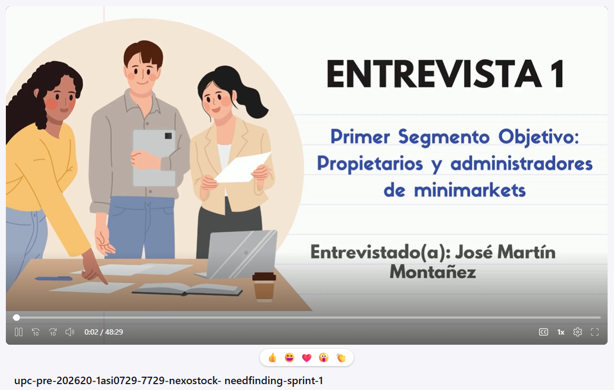
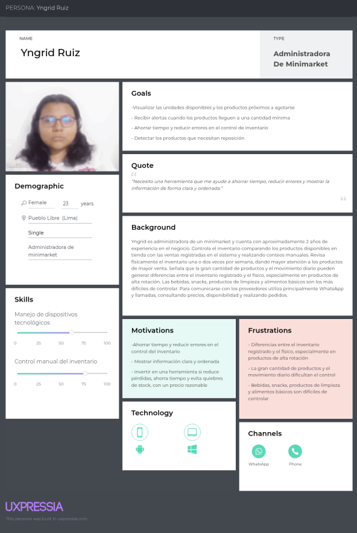
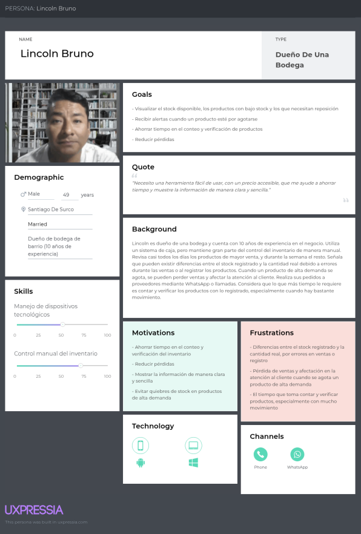
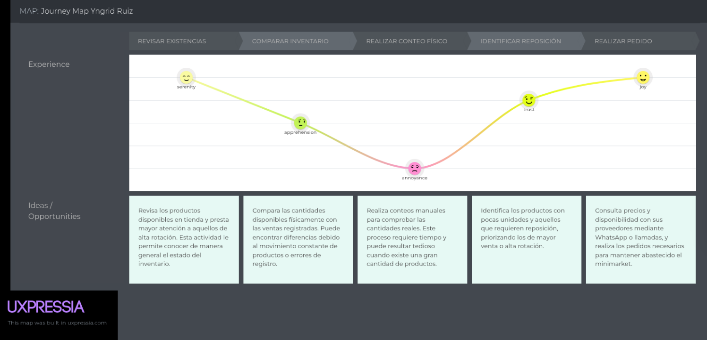
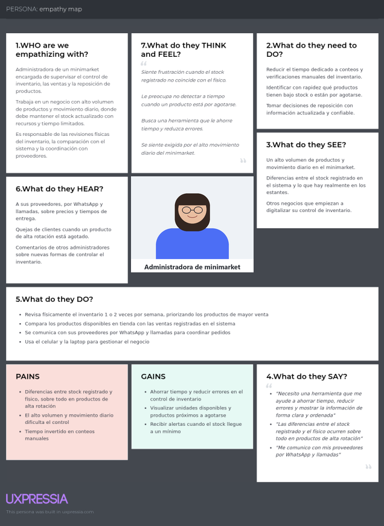
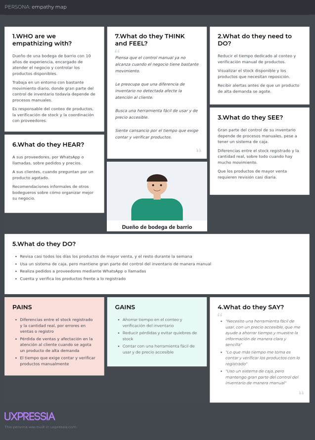
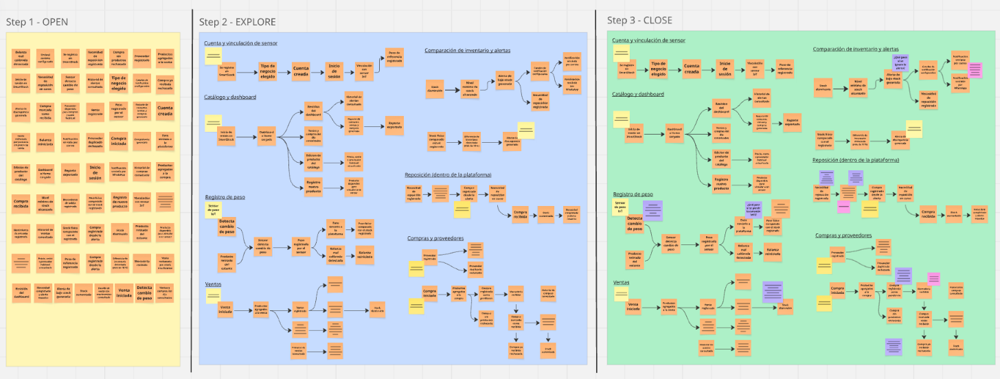

# Chapter II: Requirements Elicitation & Analysis

## 2.1. Competidores

Para el análisis competitivo de SmartStock se consideran soluciones digitales que permiten gestionar ventas e inventarios en pequeños comercios, así como alternativas tradicionales utilizadas actualmente por bodegas y minimarkets. También se incluye una solución tecnológica de retail como referencia indirecta, con el propósito de identificar diferencias en el nivel de automatización, monitoreo del inventario físico y costos de adopción.

Los competidores y alternativas analizados son **Alegra POS**, **Vendty**, **Microsoft Excel y registros manuales**, y **Trax Retail**.

### Alegra POS

Alegra POS es una solución orientada a pequeños negocios que permite registrar ventas, administrar productos, gestionar bodegas de inventario y consultar reportes desde una plataforma digital. Su propuesta facilita la digitalización de las operaciones comerciales y el control del stock.

En Perú, Alegra publica los siguientes planes mensuales para su solución de punto de venta:

- **Emprendedor:** S/ 81.00 al mes.
- **PYME:** S/ 93.00 al mes.
- **PRO:** S/ 164.00 al mes.
- **PLUS:** S/ 258.00 al mes.

Los precios incluyen IGV. Además, Alegra ofrece un descuento de 10 % cuando se selecciona el pago anual. :chatgpt-content-reference{index="0"}

A diferencia de SmartStock, Alegra se concentra principalmente en el registro digital de ventas e inventario. SmartStock busca complementar este enfoque mediante sensores de peso IoT que permitan contrastar el inventario registrado con las existencias físicas y detectar diferencias de stock.

- **Precio de referencia:** desde S/ 81.00 al mes.
- **Moneda:** Sol peruano (PEN).
- **Modalidad:** suscripción mensual o anual.
- **Fecha de consulta:** 06/10/2026.
- **Fuente:** Alegra Perú.
- **URL de costos:** [Planes de Alegra Punto de Venta](https://www.alegra.com/peru/punto-venta/precios/)

### Vendty

Vendty es una plataforma de punto de venta que incorpora funcionalidades relacionadas con ventas, productos, inventarios, compras y gestión comercial.

En su página oficial de precios se muestran diferentes planes. El plan **Emprendedor** se ofrece mediante pago mensual, mientras que los planes superiores incorporan modalidades de pago anual y mayores capacidades operativas. :chatgpt-content-reference{index="1"}

Vendty se enfoca principalmente en el registro transaccional y la gestión del punto de venta. SmartStock se diferencia por incorporar sensores de peso IoT para complementar el inventario registrado con información de las existencias físicas.

- **Precio de referencia:** consultar planes publicados por Vendty.
- **Moneda:** moneda indicada por el proveedor según el mercado.
- **Modalidad:** suscripción mensual o anual según el plan.
- **Fecha de consulta:** 06/10/2026.
- **Fuente:** Vendty.
- **URL de costos:** [Planes de Vendty](https://www.vendty.com/precios)

### Microsoft Excel y registros manuales

El uso de hojas de cálculo, cuadernos y otros registros manuales representa una alternativa frecuente en pequeños comercios para llevar el control de compras, ventas e inventario.

Su principal ventaja es la facilidad de implementación. Sin embargo, depende de que los usuarios actualicen constantemente la información y puede estar expuesto a errores, omisiones o diferencias entre el inventario registrado y las existencias reales.

Como referencia de costo para el uso formal de Excel mediante Microsoft 365, el plan **Microsoft 365 Personal** presenta un precio de **S/ 30.99 mensuales** o **S/ 308.99 anuales** en Perú. :chatgpt-content-reference{index="2"}

En el caso de cuadernos o formatos manuales, no existe un costo directo de software, aunque sí pueden existir costos indirectos relacionados con el tiempo invertido en conteos, actualización de registros y corrección de errores.

SmartStock busca reducir estas limitaciones mediante el registro digital de movimientos, alertas de stock y monitoreo físico mediante sensores IoT.

- **Precio de referencia de Excel:** S/ 30.99 al mes o S/ 308.99 al año.
- **Moneda:** Sol peruano (PEN).
- **Modalidad:** suscripción mensual o anual.
- **Registros manuales:** sin costo directo de software.
- **Fecha de consulta:** 06/10/2026.
- **Fuente:** Microsoft Perú.
- **URL de costos:** [Microsoft 365 Personal](https://www.microsoft.com/es-pe/microsoft-365/buy/microsoft-365-family)

### Trax Retail

Trax Retail es una solución tecnológica orientada al análisis de productos en establecimientos comerciales mediante visión computacional, reconocimiento de imágenes e inteligencia artificial.

Su plataforma se utiliza como referencia tecnológica indirecta debido a que trabaja con monitoreo y análisis físico del retail, aunque está orientada a operaciones de mayor escala y utiliza tecnologías diferentes a SmartStock.

Trax Retail no publica una tarifa estándar para sus soluciones empresariales en su página de contacto. Para obtener información comercial, la empresa solicita completar un formulario y coordinar una reunión con su equipo. :chatgpt-content-reference{index="3"}

Mientras Trax emplea principalmente visión computacional e inteligencia artificial, SmartStock propone sensores de peso IoT dirigidos específicamente a bodegas y minimarkets.

- **Precio público:** no disponible.
- **Modelo de precios:** cotización personalizada.
- **Moneda:** no especificada públicamente.
- **Modalidad:** contratación empresarial.
- **Fecha de consulta:** 06/10/2026.
- **Fuente:** Trax Retail.
- **URL de costos / contacto:** [Trax Retail - Contacto](https://traxretail.com/es/get-in-touch/)

### Benchmark de precios

| Solución | Precio de referencia | Moneda | Modalidad | Fecha de consulta | Fuente / URL |
| --- | --- | --- | --- | --- | --- |
| **Alegra POS** | Desde S/ 81.00/mes | PEN | Suscripción mensual o anual | 06/10/2026 | [Alegra Perú](https://www.alegra.com/peru/punto-venta/precios/) |
| **Vendty** | Según plan publicado | Según mercado | Suscripción mensual o anual | 06/10/2026 | [Vendty](https://www.vendty.com/precios) |
| **Microsoft 365 Personal / Excel** | S/ 30.99/mes o S/ 308.99/año | PEN | Suscripción | 06/10/2026 | [Microsoft Perú](https://www.microsoft.com/es-pe/microsoft-365/buy/microsoft-365-family) |
| **Registros manuales** | Sin costo directo de software | — | Manual | 06/10/2026 | Alternativa tradicional |
| **Trax Retail** | No publicado | — | Cotización personalizada | 06/10/2026 | [Trax Retail](https://traxretail.com/es/get-in-touch/) |

A partir del benchmark se observa que las soluciones dirigidas a pequeños negocios utilizan principalmente modelos de suscripción, mientras que las soluciones empresariales como Trax Retail requieren cotización personalizada. SmartStock busca diferenciarse al integrar la gestión digital del inventario con el monitoreo físico mediante sensores IoT, orientándose específicamente a bodegas y minimarkets.

### 2.1.1. Competitive Analysis

#### Competitive Analysis Landscape

**¿Por qué llevar a cabo este análisis?**

El análisis competitivo permite identificar las principales alternativas que actualmente pueden utilizar las bodegas y minimarkets para gestionar sus ventas e inventarios, evaluar sus fortalezas y limitaciones, y determinar los elementos que diferencian a SmartStock. Para ello se consideran sistemas digitales de punto de venta e inventario, métodos tradicionales de registro y una solución tecnológica de retail como referencia indirecta. El análisis permitirá contrastar aspectos como mercado objetivo, funcionalidades, costos, canales de distribución y nivel de automatización del control de inventario.

**Logos**

| SmartStock | Alegra POS | Vendty | Excel y registros manuales | Trax Retail |
|---|---|---|---|---|
|  |  |  |  |  |

**Perfil**

| | SmartStock | Alegra POS | Vendty | Excel y registros manuales | Trax Retail |
|---|---|---|---|---|---|
| **Overview** | SmartStock es una plataforma web orientada a bodegas y minimarkets que integra la gestión de productos, compras, ventas e inventario mediante sensores IoT. El sistema permite contrastar las existencias físicas con el stock registrado y generar alertas ante niveles bajos o posibles diferencias de inventario. | Solución de punto de venta orientada a pequeños negocios que permite registrar ventas, gestionar productos y controlar inventarios mediante una plataforma digital. | Plataforma de punto de venta y gestión comercial que centraliza operaciones relacionadas con ventas, productos e inventarios. | Alternativa basada en hojas de cálculo, cuadernos u otros registros que permiten llevar manualmente el control de compras, ventas y existencias. | Solución de retail basada en reconocimiento de imágenes, visión computacional e inteligencia artificial para analizar productos y condiciones de estantes. |
| **Ventaja competitiva (¿Qué valor ofrece a los clientes?)** | • Monitoreo del inventario físico mediante sensores IoT. • Comparación entre stock físico y registrado. • Alertas automáticas de stock bajo. • Integración entre compras, ventas e inventario. • Enfoque específico en bodegas y minimarkets. | • Digitalización de ventas e inventario. • Plataforma consolidada. • Facilidad de acceso mediante la nube. • Funciones administrativas integradas. | • Centralización de operaciones comerciales. • Gestión de productos, ventas e inventarios desde una plataforma digital. • Orientación a operaciones comerciales. • Digitalización del punto de venta. | • Bajo costo. • Facilidad de uso. • Disponibilidad inmediata. • No requiere infraestructura especializada. | • Automatización del análisis de estanterías mediante IA. • Reconocimiento de SKU. • Información sobre disponibilidad, ubicación y ejecución comercial. |

**Perfil de marketing**

| | SmartStock | Alegra POS | Vendty | Excel y registros manuales | Trax Retail |
|---|---|---|---|---|---|
| **Mercado objetivo** | Propietarios y administradores de bodegas y minimarkets que requieren mejorar el control de inventario, compras y ventas. | Emprendedores, pequeñas empresas y comercios que requieren digitalizar ventas e inventarios. | Pequeños y medianos establecimientos comerciales que requieren gestionar sus operaciones mediante un sistema POS. | Pequeños negocios que buscan una alternativa económica y sencilla para registrar sus operaciones. | Retailers y empresas de productos de consumo que requieren analizar ejecución comercial y disponibilidad en estantes. |
| **Estrategias de marketing** | • Redes sociales. • Contenido sobre gestión de inventarios. • Demostraciones del producto. • Pruebas piloto. • Alianzas con proveedores y distribuidores. • Modelo de suscripción. | • Pruebas gratuitas. • Planes de suscripción. • Promoción orientada a pequeñas empresas. | • Demostraciones del producto. • Presencia digital. • Oferta de soluciones para la gestión de comercios. | • No posee una estrategia comercial propia. • Su adopción se debe principalmente a su disponibilidad y bajo costo. | • Marketing B2B. • Demostraciones. • Casos de estudio. • Contenido especializado. • Venta empresarial. |

**Perfil de producto**

| | SmartStock | Alegra POS | Vendty | Excel y registros manuales | Trax Retail |
|---|---|---|---|---|---|
| **Productos y servicios** | Gestión de productos, inventarios, compras y ventas; sensores IoT; alertas de stock; historial de movimientos; reportes y apoyo a la reposición. | Punto de venta, facturación, productos, inventario y otras herramientas administrativas. | Punto de venta, registro de ventas, productos, inventarios y funciones de gestión comercial. | Registro manual o semiautomatizado de compras, ventas, productos y cantidades disponibles. | Reconocimiento de imágenes, análisis de estantes, disponibilidad de productos, cumplimiento de exhibición e inteligencia comercial. |
| **Precios y costos** | Modelo de suscripción según funcionalidades y cantidad de dispositivos. Adicionalmente, se considera un costo inicial asociado al kit de sensores IoT. | Modelo de suscripción con distintos planes según funcionalidades y capacidad del negocio. | Modelo comercial basado en planes o servicios según las funcionalidades requeridas. | Bajo costo. Puede utilizar herramientas existentes como hojas de cálculo o registros físicos. | No se orienta a un esquema estándar para pequeños comercios; su comercialización está enfocada principalmente en clientes empresariales. |
| **Canales de distribución (Web y/o móvil)** | **Web:** plataforma principal para propietarios y administradores de bodegas y minimarkets. **IoT:** sensores instalados físicamente en los establecimientos. | **Web/Cloud:** plataforma accesible desde dispositivos conectados a Internet. | **Plataforma digital:** utilizada en los puntos de venta y para la administración del negocio. | **Computadora:** dispositivos con hojas de cálculo o registros físicos en cuadernos. | **Plataforma empresarial:** aplicaciones y soluciones de captura y análisis de imágenes. |

**Análisis SWOT**

| | SmartStock | Alegra POS | Vendty | Excel y registros manuales | Trax Retail |
|---|---|---|---|---|---|
| **Fortalezas** | • Sensores IoT para monitorear el inventario físico. • Enfoque específico en bodegas y minimarkets. • Alertas automáticas de stock bajo. • Integración entre compras, ventas e inventario. • Comparación entre el stock físico y el stock registrado. • Plataforma web orientada a pequeños comercios. | • Alertas automáticas. • Integración entre compras, ventas e inventario. • Comparación entre stock físico y registrado. • Plataforma consolidada. • Digitalización de ventas e inventario. • Facilidad de acceso mediante la nube. • Funciones administrativas integradas. | • Gestión centralizada de ventas, productos e inventario. • Orientación a operaciones comerciales. • Digitalización del punto de venta. | • Bajo costo. • Facilidad de uso inicial. • Disponibilidad inmediata. • No requiere infraestructura especializada. | • Tecnología avanzada de visión computacional e IA. • Análisis detallado de SKU y estanterías. • Capacidad para generar información de ejecución comercial. |
| **Debilidades** | • Dependencia de sensores físicos. • Necesidad de instalación y calibración. • Costo inicial de hardware. • Algunos productos pueden ser difíciles de monitorear mediante sensores de peso. | • El inventario depende de que las operaciones sean correctamente registradas. • No contrasta directamente el stock registrado con las existencias físicas mediante sensores. • Requiere registro adecuado de las operaciones. | • Dependencia del registro correcto de operaciones. • Riesgo de errores u omisiones. • Baja automatización. • Dificultad para detectar discrepancias en tiempo real. | • Actualización manual. • Mayor exposición a errores y omisiones. • Baja verificación automatizada. • Dificultad para detectar discrepancias en tiempo real. | • Mayor complejidad tecnológica. • Instalación y mantenimiento. • Orientado principalmente a empresas de mayor escala. • Requiere infraestructura asociada a la captura y procesamiento de imágenes. |
| **Oportunidades** | • Crecimiento de la digitalización de bodegas y minimarkets. • Reducción progresiva de los costos de dispositivos IoT. • Integración de los procesos de compras y ventas con el control de inventario. • Posibilidad de incorporar análisis predictivo y recomendaciones automáticas. • Alianzas con proveedores y distribuidores. • Expansión hacia nuevos tipos de sensores y productos. | • IoT. • Integración de compras y ventas. • Análisis predictivo. • Alianzas con proveedores y distribuidores. • Crecimiento de la digitalización de pequeñas empresas. • Expansión de servicios administrativos y comerciales. | • Mayor adopción de sistemas POS por pequeños y medianos negocios. • Integración con nuevas herramientas digitales. | • Continúa siendo una alternativa accesible para negocios con baja digitalización. | • Mayor adopción de IA y visión computacional en retail. • Crecimiento de la demanda por información de disponibilidad en tiempo real. |
| **Amenazas** | • POS consolidados. • Aparición de soluciones IoT económicas. • Resistencia de pequeños comerciantes a invertir en hardware. • Fallos o deterioro de sensores. | • Competencia de otros sistemas POS y plataformas con mayor automatización física del inventario. | • Alta competencia en plataformas POS. • Aparición de soluciones con IoT, IA y automatización. | • Sustitución progresiva por sistemas POS accesibles y soluciones automatizadas de gestión. | • Evolución rápida de tecnologías alternativas de monitoreo. • Competencia creciente en soluciones de IA para retail. |

### 2.1.2. Estrategias y tácticas frente a competidores

**1. Diferenciación mediante sensores IoT y monitoreo del inventario físico en tiempo real:**

A diferencia de soluciones como Alegra POS y Vendty, que se enfocan principalmente en el registro digital de ventas, productos e inventarios, SmartStock propone complementar la gestión transaccional mediante sensores de peso IoT instalados en los espacios donde se almacenan o exhiben determinados productos. Asimismo, frente a métodos como Excel y registros manuales, SmartStock busca reducir la dependencia de actualizaciones realizadas completamente por el usuario.

El sistema permitirá:

- Monitorear continuamente las existencias físicas.
- Detectar niveles bajos de stock.
- Comparar el inventario físico con el inventario registrado.
- Generar alertas automáticas ante posibles faltantes o diferencias de inventario.

De esta manera, SmartStock busca ofrecer un control más automatizado del inventario físico, manteniendo un enfoque específico en las necesidades de bodegas y minimarkets.

---

**2. Solución accesible y escalable para pequeños comercios:**

Mientras que soluciones tecnológicas avanzadas como Trax Retail están orientadas principalmente a operaciones de retail de mayor escala y emplean infraestructura especializada para el análisis de productos, SmartStock plantea una implementación progresiva y adaptable a pequeños comercios.

La solución contempla:

- Implementación inicial con una cantidad reducida de sensores.
- Incorporación gradual de nuevos productos y dispositivos IoT.
- Escalabilidad según el tamaño y las necesidades del establecimiento.
- Modelo de suscripción adaptable a las funcionalidades y cantidad de dispositivos utilizados.

Este enfoque busca reducir las barreras tecnológicas y económicas para la adopción de herramientas de monitoreo de inventario en bodegas y minimarkets.

---

**3. Integración de compras, ventas e inventario para mejorar la trazabilidad:**

SmartStock busca integrar el registro de compras y ventas con el control del inventario, permitiendo mantener una mayor trazabilidad de los movimientos de productos. A diferencia de los registros manuales, en los que la información puede depender completamente de la actualización realizada por el usuario, la plataforma permitirá relacionar las operaciones comerciales con las variaciones del stock.

El sistema permitirá:

- Registrar compras de productos.
- Registrar ventas realizadas.
- Actualizar el inventario registrado según cada operación.
- Mantener un historial de movimientos.
- Contrastar los cambios registrados con la información obtenida mediante sensores IoT.

Esta integración permitirá identificar con mayor facilidad el origen de las variaciones de inventario y mejorar el seguimiento de las existencias disponibles.

---

**4. Notificaciones oportunas para la gestión de la reposición:**

SmartStock permitirá que los propietarios y administradores de bodegas y minimarkets utilicen la información del inventario para identificar oportunamente necesidades de abastecimiento.

La plataforma permitirá:

- Identificar productos que requieren reposición.
- Detectar productos que alcanzan niveles mínimos de stock.
- Generar alertas relacionadas con faltantes.
- Enviar notificaciones automáticas mediante correo electrónico o servicios de mensajería integrados.

La coordinación directa con los proveedores continuará siendo realizada por el usuario; SmartStock actuará como una herramienta de apoyo que permitirá identificar cuándo es necesario gestionar una reposición.

---

**5. Experiencia de usuario centrada en información inmediata:**

La plataforma busca facilitar la toma de decisiones mediante una interfaz web sencilla que permita consultar rápidamente la información más relevante del negocio.

Entre los principales elementos se consideran:

- Estado actual del stock de los productos.
- Alertas pendientes de reposición.
- Diferencias entre el inventario físico y el registrado.
- Historial de compras, ventas y movimientos.
- Estado de los dispositivos IoT.
- Información relevante según el tipo de usuario.

De esta manera, los propietarios y administradores podrán acceder a la información necesaria sin realizar procesos complejos de consulta.

---

**6. Analítica de inventario y apoyo a la toma de decisiones:**

SmartStock incorporará información histórica que permita a los administradores analizar el comportamiento de los productos y las operaciones del establecimiento.

Entre los principales elementos de análisis se consideran:

- Reportes de rotación de productos.
- Historial de compras y ventas.
- Registro de mermas y diferencias de inventario.
- Historial de alertas y movimientos.
- Identificación de productos con mayor necesidad de reposición.
- Seguimiento del comportamiento del inventario.

Esta información permitirá complementar el monitoreo del inventario físico con datos históricos que apoyen la planificación del abastecimiento y la toma de decisiones.

## 2.2. Interviews

### 2.2.1. Interview Design

Las guías de entrevista para ambos segmentos combinan preguntas demográficas con preguntas sobre gestión del inventario y comportamiento del negocio, orientadas a sustentar la construcción de los User Persona. Las preguntas son abiertas y se apoyan en experiencias concretas y recientes del entrevistado, de modo que no sugieren una respuesta ni presentan la solución propuesta. La guía del segundo segmento se adapta a la rutina de la bodega, donde el propietario atiende a los clientes y repone la mercadería con el distribuidor o el mayorista.

#### Primer Segmento Objetivo (Propietarios y administradores de minimarkets)

**Preguntas demográficas**

1. ¿Cuál es su nombre completo?
2. ¿Qué edad tiene?
3. ¿En qué distrito reside?
4. ¿Cuál es su estado civil?
5. ¿A qué se dedica usted (ocupación) y qué rol cumple en el negocio (dueño, administrador, etc.)?
6. ¿Hace cuánto tiempo tiene o administra el negocio?
7. ¿Qué dispositivo usa con más frecuencia para temas del negocio (celular, laptop, computadora de escritorio)?
8. ¿Qué aplicaciones o redes sociales usa habitualmente?

**Preguntas sobre gestión del inventario / comportamiento del negocio**

9. ¿Cómo realiza actualmente el control del inventario de los productos de su minimarket?
10. ¿Con qué frecuencia revisa físicamente las existencias disponibles?
11. ¿Qué dificultades encuentra al mantener actualizado el inventario?
12. Cuénteme la última vez que el stock registrado no coincidió con la cantidad física disponible. ¿Cómo se dio cuenta?
13. ¿Qué ocurrió la última vez que un producto se agotó sin que lo detectara a tiempo?
14. ¿Cómo determina cuándo debe realizar una reposición de productos?
15. ¿Qué productos o categorías son más difíciles de controlar por su rotación?
16. ¿Cómo se comunica actualmente con sus proveedores para solicitar reposiciones?
17. ¿Qué herramientas o sistemas utiliza actualmente para gestionar el inventario?
18. ¿Qué limitaciones encuentra en esas herramientas o métodos?
19. Cuando revisa el inventario, ¿qué información busca primero y por qué?
20. ¿Cómo se entera hoy de que un producto está por agotarse? ¿Qué le funciona y qué no?
21. Cuando detecta que lo registrado no coincide con lo que tiene en tienda, ¿qué hace y qué consecuencias tiene para su negocio?
22. ¿Qué tarea del control de inventario le gustaría dejar de hacer o hacer de otra manera?
23. ¿Ha invertido antes en alguna herramienta para su negocio? ¿Qué lo llevó a hacerlo o a descartarla?

#### Segundo Segmento Objetivo (Propietarios y administradores de bodegas de barrio)

**Preguntas demográficas**

1. ¿Cuál es su nombre completo?
2. ¿Qué edad tiene?
3. ¿En qué distrito reside?
4. ¿Cuál es su estado civil?
5. ¿A qué se dedica usted (ocupación) y qué rol cumple en el negocio (dueño, administrador, etc.)?
6. ¿Hace cuánto tiempo tiene o administra la bodega?
7. ¿Qué dispositivo usa con más frecuencia para temas de la bodega (celular, laptop, computadora de escritorio)?
8. ¿Qué aplicaciones o redes sociales usa habitualmente?

**Preguntas sobre gestión del inventario / comportamiento del negocio**

9. ¿Cómo controla actualmente los productos disponibles en su bodega mientras atiende a los clientes?
10. ¿Dónde y cómo anota los productos que entran y salen de su bodega?
11. ¿Cada cuánto revisa o cuenta sus productos y cómo lo hace?
12. ¿Qué dificultades tiene para saber qué productos están por agotarse?
13. Cuénteme la última vez que lo que tenía anotado no coincidió con lo que había en el estante. ¿Cómo se dio cuenta?
14. ¿Qué ocurrió la última vez que se quedó sin un producto de alta demanda?
15. ¿Cómo decide qué productos debe reponer y en qué momento (por ejemplo, cuando pasa el distribuidor o cuando va a comprar al mayorista)?
16. Cuénteme cómo consigue la mercadería cuando necesita reponer.
17. ¿Qué parte del control de sus productos le toma más tiempo o le resulta más complicada?
18. ¿Qué aplicaciones usa hoy para su bodega (cobros, pedidos, mensajes) y qué le resulta fácil o difícil de ellas?
19. Cuando quiere saber cómo están sus productos, ¿qué datos necesita conocer primero?
20. ¿Cómo se entera hoy de que un producto está por agotarse?
21. ¿Qué hace cuando un cliente le pide un producto que ya no tiene? ¿Cada cuánto le ocurre?
22. ¿Qué tendría que ofrecerle una herramienta para que la use todos los días en su bodega?
23. ¿Ha invertido antes en alguna herramienta para su bodega? ¿Qué lo llevó a hacerlo o a descartarla?

### 2.2.2. Interview Recording

**Needfinding Interviews Link:** [upc-pre-202620-1asi0729-7729-nexostock- needfinding-sprint-1](https://upcedupe-my.sharepoint.com/:v:/g/personal/u20241f205_upc_edu_pe/IQAv4Fpj5KQORod7BZT5LtxkAfyOpDpCzMJ6LMflgGguH1w?e=9x1CUM&nav=eyJyZWZlcnJhbEluZm8iOnsicmVmZXJyYWxBcHAiOiJTdHJlYW1XZWJBcHAiLCJyZWZlcnJhbFZpZXciOiJTaGFyZURpYWxvZy1MaW5rIiwicmVmZXJyYWxBcHBQbGF0Zm9ybSI6IldlYiIsInJlZmVycmFsTW9kZSI6InZpZXcifX0%3D)

#### Primer Segmento Objetivo (Propietarios y administradores de minimarkets)

**Entrevista 1**

| Campo | Detalle |
|---|---|
| **Screenshot** |  |
| **URL** | [upc-pre-202620-1asi0729-7729-nexostock- needfinding-sprint-1](https://upcedupe-my.sharepoint.com/:v:/g/personal/u20241f205_upc_edu_pe/IQAv4Fpj5KQORod7BZT5LtxkAfyOpDpCzMJ6LMflgGguH1w?e=9x1CUM&nav=eyJyZWZlcnJhbEluZm8iOnsicmVmZXJyYWxBcHAiOiJTdHJlYW1XZWJBcHAiLCJyZWZlcnJhbFZpZXciOiJTaGFyZURpYWxvZy1MaW5rIiwicmVmZXJyYWxBcHBQbGF0Zm9ybSI6IldlYiIsInJlZmVycmFsTW9kZSI6InZpZXcifX0%3D) |
| **Inicia** | 00:00 |
| **Duración** | 17:10 |
| **Nombre completo** | José Martín Montañez |
| **Edad** | 52 años |
| **Distrito** | Pueblo Libre |
| **Resumen** | José nos indica que está a cargo de la administración de un mini market desde hace aproximadamente 1 año. Utiliza principalmente el celular y la laptop, y actualmente cuenta con un sistema de inventario adaptado a las necesidades de su negocio. Realiza revisiones físicas del stock semanalmente y también de manera aleatoria durante la semana para mantener un mayor control. Entre las principales dificultades menciona posibles fallas de hardware o software, problemas logísticos y diferencias entre el stock registrado y el stock físico, las cuales dependen de la rotación de los productos y del manejo del personal. Cuando se agota un producto de alta rotación, puede afectar las ventas y generar molestias en los clientes, especialmente cuando se trata de productos que generan venta cruzada. Para decidir las reposiciones utiliza reportes del sistema sobre consumos diarios, semanales y productos de alta rotación, contrastándolos con el stock físico. Los pedidos a proveedores se realizan principalmente mediante WhatsApp y llamadas. Los productos más difíciles de controlar son los pequeños, como caramelos y chocolates, debido a que están al alcance de los clientes. Considera importante visualizar el stock y los productos de alta rotación, además de contar con alertas de bajo stock y reportes de consumos máximos y mínimos. También considera muy importante detectar diferencias entre el stock registrado y el físico para evitar compras innecesarias. Finalmente, señala que una nueva herramienta debería ser amigable, eficiente, accesible desde diferentes plataformas, permitir consultar información y reportes en cualquier momento, facilitar la comunicación con proveedores y ayudar a controlar el stock de manera eficiente. |

**Entrevista 2**

| Campo | Detalle                                                                                                                                                                                                                                                                                                                                                                                                                                                                                                                                                                                                                                                                                                                                                                                                                                                                                                                                                                                                                                                                    |
|---|----------------------------------------------------------------------------------------------------------------------------------------------------------------------------------------------------------------------------------------------------------------------------------------------------------------------------------------------------------------------------------------------------------------------------------------------------------------------------------------------------------------------------------------------------------------------------------------------------------------------------------------------------------------------------------------------------------------------------------------------------------------------------------------------------------------------------------------------------------------------------------------------------------------------------------------------------------------------------------------------------------------------------------------------------------------------------|
| **Screenshot** |                                                                                                                                                                                                                                                                                                                                                                                                                                                                                                                                                                                                                                                                                                                                                                                                                                                                                                                                                                                                |
| **URL** | [upc-pre-202620-1asi0729-7729-nexostock- needfinding-sprint-1](https://upcedupe-my.sharepoint.com/:v:/g/personal/u20241f205_upc_edu_pe/IQAv4Fpj5KQORod7BZT5LtxkAfyOpDpCzMJ6LMflgGguH1w?e=9x1CUM&nav=eyJyZWZlcnJhbEluZm8iOnsicmVmZXJyYWxBcHAiOiJTdHJlYW1XZWJBcHAiLCJyZWZlcnJhbFZpZXciOiJTaGFyZURpYWxvZy1MaW5rIiwicmVmZXJyYWxBcHBQbGF0Zm9ybSI6IldlYiIsInJlZmVycmFsTW9kZSI6InZpZXcifX0%3D) |
| **Inicia** | 17:16                                                                                                                                                                                                                                                                                                                                                                                                                                                                                                                                                                                                                                                                                                                                                                                                                                                                                                                                                                                                                                                                      |
| **Duración** | 06:25                                                                                                                                                                                                                                                                                                                                                                                                                                                                                                                                                                                                                                                                                                                                                                                                                                                                                                                                                                                                                                                                      |
| **Nombre completo** | Cristopher Benavides                                                                                                                                                                                                                                                                                                                                                                                                                                                                                                                                                                                                                                                                                                                                                                                                                                                                                                                                                                                                                                                       |
| **Edad** | 23 años                                                                                                                                                                                                                                                                                                                                                                                                                                                                                                                                                                                                                                                                                                                                                                                                                                                                                                                                                                                                                                                                    |
| **Distrito** | Jesús Maria                                                                                                                                                                                                                                                                                                                                                                                                                                                                                                                                                                                                                                                                                                                                                                                                                                                                                                                                                                                                                                                                |
| **Resumen** | Cristopher nos indica que la gestión del inventario se realiza principalmente de manera manual, mediante revisiones físicas y anotaciones, complementándose con Excel, aunque este no siempre se encuentra actualizado. Señala que las principales dificultades aparecen cuando las ventas no se registran inmediatamente o se cometen errores al anotar las cantidades, generando diferencias entre el stock registrado y el físico, especialmente en productos de alta rotación. Las bebidas, snacks y productos de consumo son los más difíciles de controlar debido a su rápida salida. Para realizar reposiciones, se comunica con sus proveedores mediante WhatsApp y llamadas, enviándoles la lista de productos necesarios. Considera útil contar con alertas cuando un producto llegue a una cantidad mínima de stock y poder detectar diferencias entre el inventario registrado y el real. Finalmente, considera importante que una nueva herramienta sea fácil de usar, ahorre tiempo, tenga un precio accesible y ayude a evitar el agotamiento de productos. |

**Entrevista 3**

| Campo | Detalle |
|---|---|
| **Screenshot** |  |
| **URL** | [upc-pre-202620-1asi0729-7729-nexostock- needfinding-sprint-1](https://upcedupe-my.sharepoint.com/:v:/g/personal/u20241f205_upc_edu_pe/IQAv4Fpj5KQORod7BZT5LtxkAfyOpDpCzMJ6LMflgGguH1w?e=9x1CUM&nav=eyJyZWZlcnJhbEluZm8iOnsicmVmZXJyYWxBcHAiOiJTdHJlYW1XZWJBcHAiLCJyZWZlcnJhbFZpZXciOiJTaGFyZURpYWxvZy1MaW5rIiwicmVmZXJyYWxBcHBQbGF0Zm9ybSI6IldlYiIsInJlZmVycmFsTW9kZSI6InZpZXcifX0%3D) |
| **Inicia** | 23:47 |
| **Duración** | 07:16 |
| **Nombre completo** | Yngrid Ruiz |
| **Edad** | 23 años |
| **Distrito** | Pueblo Libre |
| **Resumen** | Yngrid nos indica que es administradora de un minimarket y cuenta con aproximadamente 2 años de experiencia en el negocio. Actualmente controla el inventario comparando los productos disponibles en tienda con las ventas registradas en el sistema y realizando conteos manuales. Revisa físicamente el inventario una o dos veces por semana, dando mayor atención a los productos de mayor venta. Señala que la gran cantidad de productos y el movimiento diario pueden generar diferencias entre el inventario registrado y el físico, especialmente en productos de alta rotación. Las bebidas, snacks, productos de limpieza y alimentos básicos son los más difíciles de controlar. Para comunicarse con los proveedores utiliza principalmente WhatsApp y llamadas, mediante las cuales consulta precios, disponibilidad y realiza pedidos. Considera importante visualizar las unidades disponibles y los productos próximos a agotarse, además de recibir alertas cuando lleguen a una cantidad mínima. Finalmente, considera que una herramienta de inventario debería ayudar a ahorrar tiempo, reducir errores, detectar productos que necesitan reposición y mostrar información clara y ordenada. Estaría dispuesta a invertir si la herramienta permite reducir pérdidas, ahorrar tiempo y evitar quiebres de stock, siempre que tenga un precio razonable. |

#### Segundo Segmento Objetivo (Propietarios y administradores de bodegas de barrio)

**Entrevista 1**

| Campo | Detalle |
|---|---|
| **Screenshot** |  |
| **URL** | [upc-pre-202620-1asi0729-7729-nexostock- needfinding-sprint-1](https://upcedupe-my.sharepoint.com/:v:/g/personal/u20241f205_upc_edu_pe/IQAv4Fpj5KQORod7BZT5LtxkAfyOpDpCzMJ6LMflgGguH1w?e=9x1CUM&nav=eyJyZWZlcnJhbEluZm8iOnsicmVmZXJyYWxBcHAiOiJTdHJlYW1XZWJBcHAiLCJyZWZlcnJhbFZpZXciOiJTaGFyZURpYWxvZy1MaW5rIiwicmVmZXJyYWxBcHBQbGF0Zm9ybSI6IldlYiIsInJlZmVycmFsTW9kZSI6InZpZXcifX0%3D) |
| **Inicia** | 31:08 |
| **Duración** | 06:39 |
| **Nombre completo** | Lincoln Bruno |
| **Edad** | 49 años |
| **Distrito** | Comas |
| **Resumen** | Lincoln nos indica que es dueño de una bodega y cuenta con 10 años de experiencia en el negocio. Actualmente utiliza un sistema de caja, pero mantiene gran parte del control del inventario de manera manual. Los productos de mayor venta son revisados casi todos los días, mientras que los demás se revisan durante la semana. Señala que pueden existir diferencias entre el stock registrado y la cantidad real debido a errores durante las ventas o al registrar los productos. Cuando un producto de alta demanda se agota, se pueden perder ventas y afectar la atención al cliente. Los pedidos a proveedores se realizan mediante WhatsApp o llamadas. Considera que lo que más tiempo requiere es contar y verificar los productos con lo registrado, especialmente cuando existe bastante movimiento. Le gustaría visualizar el stock disponible, los productos con bajo stock y aquellos que necesitan reposición, además de recibir alertas cuando un producto esté por agotarse. Finalmente, considera importante que una nueva herramienta sea fácil de usar, tenga un precio accesible, permita ahorrar tiempo, reducir pérdidas y muestre la información de manera clara y sencilla. |

**Entrevista 2**

| Campo | Detalle |
|---|---|
| **Screenshot** |  |
| **URL** | [upc-pre-202620-1asi0729-7729-nexostock- needfinding-sprint-1](https://upcedupe-my.sharepoint.com/:v:/g/personal/u20241f205_upc_edu_pe/IQAv4Fpj5KQORod7BZT5LtxkAfyOpDpCzMJ6LMflgGguH1w?e=9x1CUM&nav=eyJyZWZlcnJhbEluZm8iOnsicmVmZXJyYWxBcHAiOiJTdHJlYW1XZWJBcHAiLCJyZWZlcnJhbFZpZXciOiJTaGFyZURpYWxvZy1MaW5rIiwicmVmZXJyYWxBcHBQbGF0Zm9ybSI6IldlYiIsInJlZmVycmFsTW9kZSI6InZpZXcifX0%3D) |
| **Inicia** | 37:53 |
| **Duración** | 05:12 |
| **Nombre completo** | Ian San Martin |
| **Edad** | 20 años |
| **Distrito** | Santiago de Surco |
| **Resumen** | Ian nos indica que administra una bodega de barrio desde hace aproximadamente tres años y que actualmente controla el inventario mediante revisiones de los estantes y el almacén, utilizando principalmente un cuaderno y, en algunas ocasiones, Excel. Realiza revisiones rápidas todos los días y un conteo más completo una vez por semana; sin embargo, señala que existen diferencias entre el stock registrado y el real aproximadamente una o dos veces por semana debido a ventas no anotadas, productos dañados u otros inconvenientes. También menciona que una de las principales dificultades es revisar uno por uno los productos para identificar cuáles están por agotarse y controlar sus fechas de vencimiento. Considera que quedarse sin productos de alta demanda genera pérdida de ventas y puede afectar la confianza de los clientes. Por ello, le sería útil contar con una plataforma sencilla y rápida que muestre las cantidades disponibles, los productos próximos a agotarse o vencer y los más vendidos. Además, valora recibir notificaciones en su celular cuando el stock llegue a un nivel mínimo. Estaría dispuesto a invertir en una herramienta de inventario si tiene un precio accesible, es fácil de usar, mejora realmente el control del negocio y ofrece una prueba gratuita o soporte. |

**Entrevista 3**

| Campo | Detalle |
|---|---|
| **Screenshot** |  |
| **URL** | [upc-pre-202620-1asi0729-7729-nexostock- needfinding-sprint-1](https://upcedupe-my.sharepoint.com/:v:/g/personal/u20241f205_upc_edu_pe/IQAv4Fpj5KQORod7BZT5LtxkAfyOpDpCzMJ6LMflgGguH1w?e=9x1CUM&nav=eyJyZWZlcnJhbEluZm8iOnsicmVmZXJyYWxBcHAiOiJTdHJlYW1XZWJBcHAiLCJyZWZlcnJhbFZpZXciOiJTaGFyZURpYWxvZy1MaW5rIiwicmVmZXJyYWxBcHBQbGF0Zm9ybSI6IldlYiIsInJlZmVycmFsTW9kZSI6InZpZXcifX0%3D) |
| **Inicia** | 43:10 |
| **Duración** | 05:15 |
| **Nombre completo** | Pablo Ludeña |
| **Edad** | 21 años |
| **Distrito** | Los Olivos |
| **Resumen** | Pablo nos indica que actualmente trabaja como asistente de ventas en un minimarket, donde el control de los productos se realiza de manera manual, utilizando principalmente papel y cálculos básicos, sin contar con un sistema digital de inventario. Señala que revisan los productos aproximadamente una vez por semana y que, al tratarse de un negocio minorista, suelen identificar visualmente qué productos están por agotarse. Sin embargo, reconoce que no tienen un registro exacto del stock real. También menciona que una herramienta digital sería de gran ayuda, especialmente para conocer qué productos faltan, sus fechas de vencimiento, cuándo deben reponerse y el estado de los ingresos y egresos. Considera muy útil recibir notificaciones en el celular cuando un producto esté por agotarse. Para que utilice frecuentemente una herramienta de inventario, esta tendría que ser cómoda, sencilla y fácil de usar. Además, estaría dispuesto a invertir en este tipo de sistema principalmente si el minimarket crece y aumenta la cantidad de productos, ya que el método de papel y lápiz dejaría de ser suficiente. |

### 2.2.3. Interview Analysis

#### Primer Segmento Objetivo (Propietarios y administradores de minimarkets)

Este segmento es importante debido a que los propietarios y administradores son responsables del control, supervisión y reposición de los productos del minimarket. Las entrevistas realizadas evidencian que, aunque algunos negocios cuentan con sistemas de inventario, sistemas de ventas o herramientas como Excel, todavía es necesario realizar verificaciones físicas y conteos manuales para comprobar las existencias disponibles. Asimismo, se identificaron dificultades relacionadas con las diferencias entre el stock registrado y el stock físico, especialmente en productos de alta rotación.

**¿Quiénes son?** Se trata de propietarios y administradores encargados de supervisar las ventas, controlar el inventario, revisar las existencias y coordinar la reposición de productos con sus proveedores.

- Utilizan herramientas como sistemas de inventario, sistemas de ventas, Excel y registros manuales.
- Realizan revisiones físicas y conteos periódicos para comprobar las cantidades disponibles.
- Utilizan principalmente el celular y la laptop para realizar actividades relacionadas con el negocio.
- Se comunican con sus proveedores principalmente mediante WhatsApp y llamadas.
- Manejan productos de diferentes niveles de rotación, prestando mayor atención a aquellos que presentan una alta demanda.

**¿Qué les preocupa y anhelan?**

- **Diferencias entre stock registrado y físico:** Pueden presentarse inconsistencias debido a errores de registro, ventas no registradas correctamente o al constante movimiento de los productos.
- **Productos de alta rotación:** Las bebidas, snacks, golosinas y otros productos de consumo frecuente requieren una supervisión constante.
- **Quiebres de stock:** Existe preocupación por no detectar a tiempo que un producto está próximo a agotarse, lo que puede ocasionar pérdidas de ventas y molestias en los clientes.
- **Tiempo destinado al control:** Las verificaciones y conteos manuales requieren tiempo y esfuerzo por parte del administrador.
- **Necesidad de información actualizada:** Buscan conocer rápidamente las unidades disponibles, los productos con bajo stock y aquellos que necesitan reposición.
- **Reducción de errores:** Esperan contar con una herramienta que facilite el control y disminuya las diferencias entre las cantidades registradas y las existencias reales.

**Requisitos del producto**

- Fácil de utilizar, permitiendo registrar y consultar información de manera rápida.
- Clara y visual, mostrando el stock disponible y el estado de los productos.
- Con alertas de bajo stock para detectar oportunamente los productos próximos a agotarse.
- Con identificación de productos de alta rotación y aquellos que requieren reposición.
- Con capacidad para mostrar diferencias entre el inventario registrado y el inventario físico.
- Con reportes de consumo y movimientos de inventario que faciliten la toma de decisiones.
- Accesible desde diferentes dispositivos, como celular o computadora.
- Que permita ahorrar tiempo y reducir la dependencia de verificaciones manuales.

#### Segundo Segmento Objetivo (Propietarios y administradores de bodegas de barrio)

Este segmento es relevante debido a que los propietarios y administradores de bodegas suelen encargarse directamente de diferentes actividades del negocio, como atender a los clientes, controlar los productos disponibles y realizar pedidos a proveedores. Las entrevistas evidencian una mayor dependencia de métodos manuales, como cuadernos, inspección visual y conteos físicos. Esta situación puede dificultar la identificación oportuna de productos con bajo stock y generar diferencias entre las cantidades registradas y las realmente disponibles.

**¿Quiénes son?** Se trata principalmente de propietarios y administradores de pequeñas bodegas que participan directamente en la atención al cliente, control de productos y coordinación con proveedores.

- Utilizan principalmente el celular para las actividades relacionadas con el negocio.
- El control del inventario se realiza mediante cuadernos, inspección visual, sistemas de caja o revisiones manuales.
- Realizan conteos con diferente frecuencia dependiendo de la cantidad de productos y de la demanda.
- Se comunican con sus proveedores principalmente mediante WhatsApp o llamadas.
- La decisión de reposición depende principalmente de la observación de los productos disponibles y de la experiencia del propietario.

**¿Qué les preocupa y anhelan?**

- **Control manual del inventario:** Revisar los productos uno por uno puede requerir una cantidad considerable de tiempo.
- **Falta de información inmediata:** En algunos casos no conocen exactamente las unidades disponibles de cada producto sin realizar una revisión física.
- **Productos próximos a agotarse:** Existe el riesgo de detectar demasiado tarde que un producto de alta demanda necesita reposición.
- **Diferencias de inventario:** Se presentan ocasiones en las que el stock registrado no coincide con las cantidades realmente disponibles.
- **Pérdida de ventas:** Cuando un producto solicitado por un cliente se encuentra agotado, existe el riesgo de perder la venta e incluso al cliente.
- **Facilidad de uso:** Buscan una solución sencilla, rápida y fácil de aprender, que no complique las actividades diarias del negocio.
- **Precio accesible:** La herramienta debe adaptarse económicamente a las características de una pequeña bodega.

**Requisitos del producto**

- Sencilla e intuitiva, permitiendo su utilización sin necesidad de conocimientos tecnológicos avanzados.
- Rápida, facilitando el registro y consulta de productos durante las actividades diarias.
- Visual, mostrando de manera clara las unidades disponibles, productos agotados y productos de mayor venta.
- Con alertas cuando un producto alcance una cantidad mínima o esté próximo a agotarse.
- Con apoyo para identificar qué productos necesitan ser repuestos.
- Con información actualizada que permita reducir las diferencias entre el inventario registrado y el físico.
- Accesible principalmente desde dispositivos móviles.
- Con un precio accesible para pequeños negocios.
- Que permita ahorrar tiempo y reducir las pérdidas ocasionadas por quiebres de stock.

## 2.3. Needfinding

### 2.3.1. User Personas

#### Primer Segmento Objetivo (Propietarios y administradores de minimarkets)

*Figura 2. User Persona del propietario o administrador de minimarket.*

#### Segundo Segmento Objetivo (Propietarios y administradores de bodegas de barrio)

*Figura 3. User Persona del propietario o administrador de bodega de barrio.*

### 2.3.2. User Task Matrix

La matriz consolida las tareas que mencionaron los tres entrevistados de cada segmento. La frecuencia indica cada cuánto realizan la tarea y la importancia, cuánto afecta al negocio si no se hace o se hace mal.

#### Primer Segmento Objetivo (Propietarios y administradores de minimarkets)

| Tarea | Frecuencia | Importancia | Mencionada por |
|---|---|---|---|
| Revisar físicamente las existencias en tienda | Alta | Alta | José, Cristopher, Yngrid |
| Registrar ventas y movimientos en el sistema o en Excel | Alta | Alta | José, Cristopher, Yngrid |
| Identificar productos con bajo stock | Alta | Alta | José, Cristopher, Yngrid |
| Supervisar productos de alta rotación (bebidas, snacks, golosinas) | Alta | Alta | José, Cristopher, Yngrid |
| Comparar el stock registrado con el físico | Media | Alta | José, Cristopher, Yngrid |
| Consultar reportes de consumo para decidir la reposición | Media | Alta | José |
| Realizar pedidos a proveedores por WhatsApp o llamadas | Media | Alta | José, Cristopher, Yngrid |
| Consultar precios y disponibilidad con proveedores | Media | Media | Yngrid |
| Controlar productos pequeños al alcance de los clientes | Media | Media | José |

*Tabla 1. User Task Matrix de propietarios y administradores de minimarkets.*

En este segmento las tareas más frecuentes e importantes son revisar existencias, registrar movimientos e identificar productos con bajo stock. Aunque cuentan con sistemas o Excel, siguen contrastando manualmente lo registrado con lo físico.

#### Segundo Segmento Objetivo (Propietarios y administradores de bodegas de barrio)

| Tarea | Frecuencia | Importancia | Mencionada por |
|---|---|---|---|
| Revisar visualmente los estantes y el almacén | Alta | Alta | Lincoln, Ian, Pablo |
| Anotar ventas y productos en cuaderno, papel o sistema de caja | Alta | Media | Lincoln, Ian, Pablo |
| Identificar productos que están por agotarse | Alta | Alta | Lincoln, Ian, Pablo |
| Verificar la disponibilidad de un producto que pide un cliente | Alta | Alta | Lincoln |
| Decidir qué productos reponer y cuándo | Alta | Alta | Lincoln, Ian, Pablo |
| Contar manualmente todos los productos | Media | Alta | Lincoln, Ian, Pablo |
| Verificar diferencias entre el stock real y lo anotado | Media | Alta | Lincoln, Ian |
| Realizar pedidos a proveedores por WhatsApp o llamadas | Media | Alta | Lincoln |
| Controlar fechas de vencimiento | Media | Media | Ian, Pablo |

*Tabla 2. User Task Matrix de propietarios y administradores de bodegas de barrio.*

En las bodegas el control depende de la revisión visual y del cuaderno, y se hace mientras se atiende a los clientes. Por eso identificar a tiempo qué producto está por agotarse es la tarea que más pesa en su rutina.

### 2.3.3. User Journey Mapping

#### Primer Segmento Objetivo (Propietarios y administradores de minimarkets)

*Figura 4. User Journey Map del propietario o administrador de minimarket.*

El recorrido de Yngrid parte con serenidad al revisar las existencias, pero cae a la molestia al comparar el inventario con las ventas y al realizar el conteo físico, porque ahí aparecen las diferencias y se pierde más tiempo. La experiencia mejora cuando identifica qué reponer y concreta el pedido con sus proveedores. El punto más bajo, el conteo manual, es la oportunidad que atiende SmartStock con la lectura continua de los sensores de peso.

#### Segundo Segmento Objetivo (Propietarios y administradores de bodegas de barrio)

*Figura 5. User Journey Map del propietario o administrador de bodega de barrio.*

En el caso de Lincoln, la molestia llega antes: contar el inventario a mano es la etapa más pesada de su rutina, y detectar el bajo stock le genera inquietud porque puede perder ventas de productos de alta demanda. Su experiencia mejora al decidir la reposición y hacer el pedido. SmartStock busca eliminar el conteo manual y adelantar la detección del bajo stock mediante alertas.

### 2.3.4. Empathy Mapping

*Figura 6. Empathy Map del propietario o administrador de minimarket.*

El mapa muestra a una administradora que trabaja con alto volumen de productos y poco tiempo. Le frustra que el stock registrado no coincida con el físico y le preocupa no detectar a tiempo los productos de alta rotación. Lo que más valora es ahorrar tiempo, reducir errores y ver la información clara y ordenada.

*Figura 7. Empathy Map del propietario o administrador de bodega de barrio.*

El mapa muestra a un dueño de bodega que, aunque usa un sistema de caja, sigue controlando su inventario de forma manual. Le cansa contar y verificar productos, y le preocupa que una diferencia no detectada afecte la atención al cliente. Busca una herramienta fácil de usar y de precio accesible que le avise antes de que un producto se agote.

## 2.4. Big Picture Event Storming

Para el desarrollo del Big Picture Event Storming se aplicó la guía Step-by-Step Guide de Philippe Bourgault, indicada en la rúbrica del Final Problem Statement, siguiendo sus tres etapas:

- Open
- Explore
- Close

Enlace al tablero de Miro: <https://miro.com/welcomeonboard/UHk1SzhpUVZrN1hGMDFlMnpHa2NUOUJMbHBId2xlc2YydGhaYmxUcC96S2hnOWpMWmdwaUVkbGRMWHFlSkhiS0t2TXR6V0JXWEhDU0JKWUNhRWFWRncyeXpmaS84aTEyUHJyU1VmcDNrWWhLd1BTZ09xNlphNUFlVWsxb1h1UXVNakdSWkpBejJWRjJhRnhhb1UwcS9BPT0hdjE=?share_link_id=472690857440>

*Figura 8. Big Picture Event Storming de SmartStock.*

## 2.5. Ubiquitous Language

- **IoT Weight Sensor (Sensor de peso IoT):** Dispositivo físico instalado bajo un producto en el punto de venta que mide su peso de forma continua y envía esa lectura a la plataforma SmartStock para inferir el nivel de existencias disponibles.
- **Physical Stock (Stock físico):** Cantidad real de un producto presente físicamente en el minimarket o bodega en un momento determinado, obtenida a partir de la lectura del Sensor de peso IoT.
- **Registered Stock (Stock registrado):** Cantidad de un producto que figura almacenada en el sistema como existencia disponible, la cual puede o no coincidir con el Physical Stock.
- **Inventory Discrepancy (Diferencia de inventario):** Desajuste detectado entre el Physical Stock y el Registered Stock de un producto, que evidencia un posible error de conteo, venta no registrada o pérdida.
- **Minimum Stock Level (Nivel mínimo de stock):** Umbral configurado por el propietario o administrador para cada producto, a partir del cual el sistema considera que las existencias son insuficientes y debe generarse una alerta.
- **Low-Stock Alert (Alerta de bajo stock):** Notificación automática generada por SmartStock cuando el Physical Stock de un producto alcanza o desciende por debajo de su Minimum Stock Level.
- **Restocking Need (Necesidad de reposición):** Registro que identifica que un producto requiere ser abastecido nuevamente, generado a partir de una Low-Stock Alert o de la revisión del Inventory Dashboard por parte del usuario.
- **Inventory Dashboard (Panel de inventario):** Interfaz web principal donde el propietario o administrador visualiza el estado general de sus productos, las alertas activas y las diferencias de inventario detectadas.
- **Rotation Report (Reporte de rotación):** Informe generado por la plataforma que muestra el comportamiento histórico de un producto (frecuencia de venta o consumo) para apoyar la toma de decisiones de reposición.
- **Alert and Movement History (Historial de alertas y movimientos):** Registro histórico de todas las alertas generadas y los cambios de stock detectados para un producto, utilizado como respaldo analítico dentro del dashboard.
- **Store Owner / Manager (Propietario/Administrador):** Usuario principal de SmartStock, responsable del control del inventario, la revisión de alertas y la coordinación de la reposición en un minimarket o bodega de barrio.
- **Supplier (Proveedor):** Actor externo a la plataforma con quien el Store Owner coordina manualmente el reabastecimiento de productos una vez identificada una Restocking Need; esta coordinación ocurre fuera de SmartStock.
- **Third-Party Notification Service (Servicio de notificaciones de terceros):** Sistema externo (correo electrónico o WhatsApp) mediante el cual SmartStock envía las Low-Stock Alerts al Store Owner fuera de la propia plataforma web.
