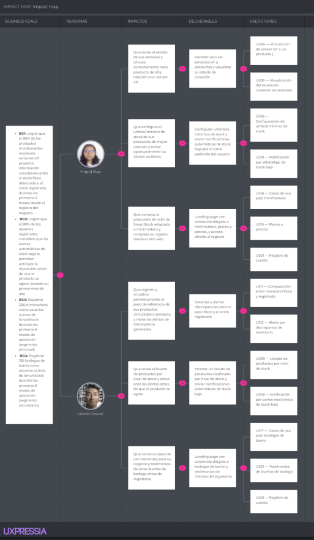
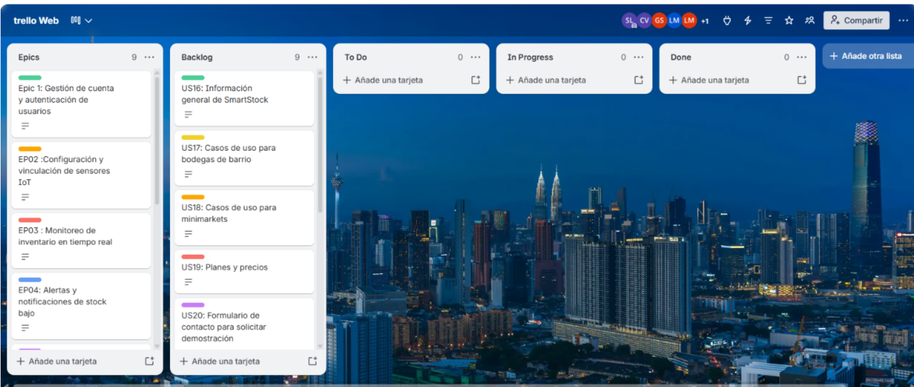
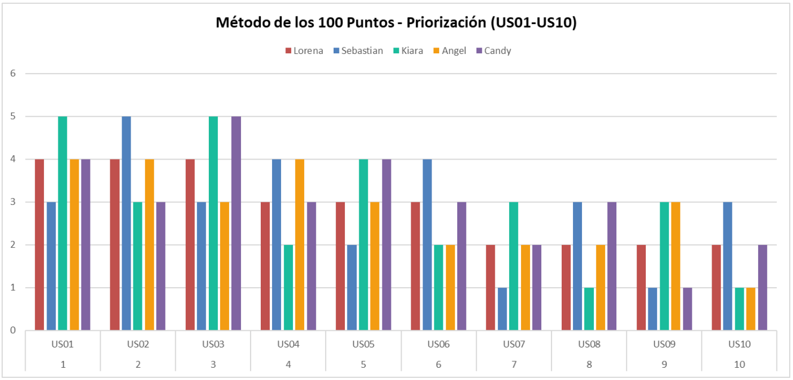
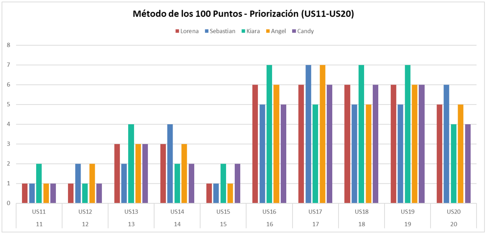
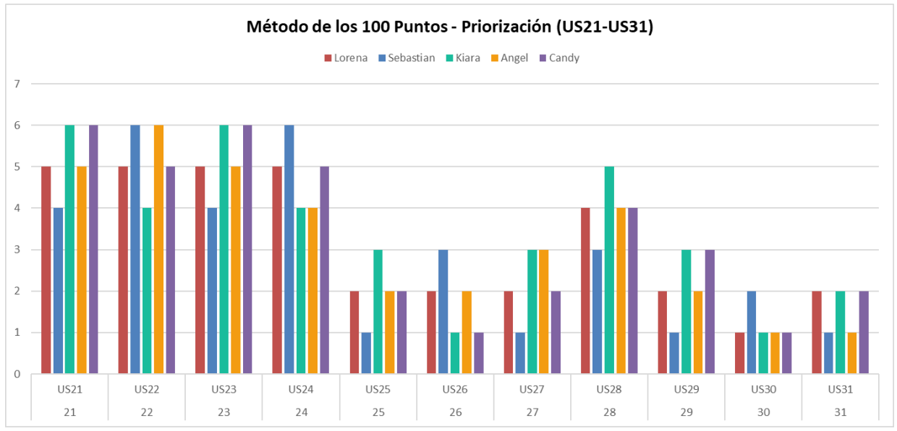

# Chapter III: Requirements Specification

## 3.1. User Stories

Nota sobre roles: SmartStock cuenta con un único actor real, el Store Owner/Manager
(Propietario/Administrador del negocio). Por ello, las historias cuyo comportamiento es
idéntico para bodega de barrio y minimarket usan el rol superior “administrador de mi
negocio”, evitando mezclar segmentos en una misma historia. Las historias cuyo
comportamiento sí difiere por segmento (US11, US31) especifican el rol concreto
(“administrador de minimarket”).

### Epics

| Epic ID | Título | Descripción |
| --- | --- | --- |
| EP01 | Gestión de cuenta y autenticación de usuarios | Como administrador de mi negocio, quiero registrarme, iniciar sesión y recuperar el acceso a mi cuenta de forma segura, para gestionar mi inventario en SmartStock en cualquier momento. |
| EP02 | Configuración y vinculación de sensores IoT | Como administrador de mi negocio, quiero vincular y configurar mis sensores de peso IoT sobre cada producto, para que el sistema monitoree automáticamente mi inventario físico. |
| EP03 | Monitoreo de inventario en tiempo real | Como administrador de mi negocio, quiero visualizar el nivel de stock de mis productos en tiempo real a partir de las lecturas de los sensores, para tomar decisiones oportunas de reposición. |
| EP04 | Alertas y notificaciones de stock bajo | Como administrador de mi negocio, quiero recibir notificaciones automáticas por correo electrónico o WhatsApp cuando el stock de un producto llegue al umbral mínimo, para coordinar su reposición a tiempo. |
| EP05 | Comparación de inventario físico vs. registrado | Como administrador de minimarket, quiero comparar el peso físico detectado por los sensores con la cantidad registrada en el sistema, para detectar mermas o errores de conteo a tiempo. Para bodegas de barrio, esta detección se resuelve de forma automática mediante alertas de discrepancia (EP04), sin necesidad de una pantalla de comparación dedicada. |
| EP06 | Gestión de catálogo de productos | Como administrador de mi negocio, quiero registrar y editar los productos de mi catálogo, para mantener actualizada la información monitoreada por SmartStock. |
| EP07 | Reportes y dashboard de inventario | Como administrador de mi negocio, quiero visualizar un dashboard con el resumen general del estado de mi inventario, para tener una vista rápida de mi negocio sin revisar producto por producto. Como administrador de minimarket, quiero además generar reportes de consumo y movimientos de inventario, para analizar tendencias y tomar mejores decisiones de reposición y compra. |
| EP08 | Sitio web estático (Landing Page) | Como visitante del sitio web de SmartStock, general o de un segmento específico (bodegas de barrio o minimarkets), quiero conocer la propuesta de valor, casos de uso, planes y evidencia social del producto, para decidir si me registro o solicito una demostración. |
| EP09 | Servicios RESTful de la API | Como developer, quiero exponer los servicios RESTful necesarios para la recepción de lecturas de sensores, autenticación, consulta de stock, estado de sensores, notificaciones y comparación de inventario, para soportar el funcionamiento de las aplicaciones web y de los dispositivos IoT. |

### User Stories

| Story ID | Título | Descripción | Criterios de Aceptación | Relacionado con (Epic ID) |
| --- | --- | --- | --- | --- |
| US01 | Registro de cuenta | Como administrador de mi negocio, quiero registrarme en la plataforma SmartStock con mi correo electrónico, los datos de mi negocio y el tipo de negocio (bodega de barrio o minimarket), para poder acceder a los servicios de monitoreo de inventario adecuados a mi negocio. | **Escenario 1: Registro exitoso** Dado que el usuario ingresa un correo electrónico válido, una contraseña y los datos de su negocio, Cuando el usuario confirma el registro, Entonces el sistema crea la cuenta y la asocia al negocio registrado, y envía un correo de confirmación de registro.  **Escenario 2: Correo ya registrado** Dado que el correo electrónico ingresado ya está registrado en el sistema, Cuando el usuario intenta completar el registro, Entonces el sistema rechaza el registro e indica que el correo ya se encuentra en uso.  **Escenario 3: Selección de tipo de negocio** Dado que el usuario selecciona el tipo de negocio (bodega de barrio o minimarket) durante el registro, Cuando el usuario confirma el registro, Entonces el sistema asocia el tipo de negocio a la cuenta y habilita el conjunto de funcionalidades correspondiente a dicho tipo de negocio. | EP01 |
| US02 | Inicio de sesión | Como administrador de mi negocio, quiero iniciar sesión con mi correo electrónico y contraseña, para acceder al panel de monitoreo de mi inventario. | **Escenario 1: Inicio de sesión exitoso** Dado que el usuario cuenta con una cuenta registrada y activa, Cuando el usuario ingresa su correo y contraseña correctos, Entonces el sistema lo autentica y otorga acceso al panel de monitoreo.  **Escenario 2: Credenciales incorrectas** Dado que el usuario ingresa una contraseña incorrecta, Cuando el usuario intenta iniciar sesión, Entonces el sistema rechaza el inicio de sesión e indica que las credenciales son incorrectas. | EP01 |
| US03 | Recuperación de contraseña | Como administrador de mi negocio, quiero recuperar mi contraseña mediante un enlace enviado a mi correo electrónico, para volver a acceder a mi cuenta cuando la olvide. | **Escenario 1: Solicitud de recuperación válida** Dado que el usuario ingresa el correo electrónico asociado a su cuenta, Cuando el usuario solicita la recuperación de contraseña, Entonces el sistema envía un enlace de restablecimiento al correo registrado, el cual expira transcurridas 24 horas desde su generación. | EP01 |
| US04 | Vinculación de sensor IoT a un producto | Como administrador de mi negocio, quiero vincular un sensor de peso IoT a un producto específico de mi inventario, para que el sistema registre su peso de referencia. | **Escenario 1: Vinculación exitosa** Dado que el usuario selecciona un sensor disponible y un producto sin sensor asignado, Cuando el usuario confirma la vinculación, Entonces el sistema asocia el sensor al producto y registra el peso inicial detectado como referencia.  **Escenario 2: Sensor ya vinculado** Dado que el sensor seleccionado ya está vinculado a otro producto, Cuando el usuario intenta vincularlo a un nuevo producto, Entonces el sistema rechaza la vinculación e indica que el sensor ya se encuentra en uso. | EP02 |
| US05 | Configuración de umbral mínimo de stock | Como administrador de mi negocio, quiero configurar el umbral mínimo de stock para cada producto vinculado a un sensor, para que el sistema me alerte cuando el nivel sea bajo. | **Escenario 1: Validación de umbral máximo permitido (Regla de negocio)** Dado que el usuario intenta configurar un umbral mínimo mayor a la capacidad máxima registrada para el producto, Cuando el usuario guarda la configuración, Entonces el sistema rechaza la configuración e indica que el umbral no puede superar la capacidad máxima del producto.  **Escenario 2: Configuración válida** Dado que el usuario ingresa un valor numérico mayor a cero y menor o igual a la capacidad máxima del producto, Cuando el usuario guarda la configuración, Entonces el sistema almacena el umbral y lo aplica para la generación de futuras alertas. | EP02 |
| US06 | Visualización del estado de conexión de sensores | Como administrador de mi negocio, quiero ver el estado de conexión de cada sensor IoT instalado, para saber si alguno requiere revisión técnica. | **Escenario 1: Sensor conectado** Dado que un sensor envió una lectura en los últimos 5 minutos, Cuando el usuario consulta el estado de sus sensores, Entonces el sistema muestra el sensor con estado "en línea".  **Escenario 2: Sensor desconectado** Dado que un sensor no envió ninguna lectura en los últimos 5 minutos, Cuando el usuario consulta el estado de sus sensores, Entonces el sistema muestra el sensor con estado "desconectado". | EP02 |
| US07 | Visualización del peso actual de un producto | Como administrador de mi negocio, quiero visualizar el peso actual registrado por el sensor de cada producto, para conocer el nivel de stock físico en tiempo real. | **Escenario 1: Lectura disponible** Dado que el sensor de un producto envió al menos una lectura de peso, Cuando el usuario consulta el nivel de stock del producto, Entonces el sistema muestra el peso más reciente recibido y su cantidad equivalente en unidades. | EP03 |
| US08 | Listado de productos por nivel de stock | Como administrador de mi negocio, quiero visualizar un listado de todos mis productos monitoreados junto con su nivel de stock actual, para identificar cuáles necesitan reposición. | **Escenario 1: Listado con productos en distintos niveles** Dado que el usuario tiene productos con sensores vinculados, Cuando el usuario consulta el listado de productos, Entonces el sistema muestra cada producto con su nivel de stock clasificado como bajo, normal o sin datos. | EP03 |
| US09 | Notificación por correo electrónico de stock bajo | Como administrador de mi negocio, quiero recibir una notificación por correo electrónico cuando el stock de un producto llegue al umbral mínimo, para coordinar su reposición con mi proveedor a tiempo. | **Escenario 1: Stock alcanza el umbral mínimo** Dado que el nivel de stock de un producto es igual o menor al umbral mínimo configurado, y el usuario tiene configurado el correo electrónico como canal de notificación, Cuando el sistema detecta la condición de stock bajo, Entonces el sistema envía una notificación por correo electrónico a la dirección registrada y registra la necesidad de reposición del producto. | EP04 |
| US10 | Notificación por WhatsApp de stock bajo | Como administrador de mi negocio, quiero recibir una notificación por WhatsApp cuando el stock de un producto llegue al umbral mínimo, para gestionar la reposición sin estar frente al sistema. | **Escenario 1: Stock alcanza el umbral mínimo** Dado que el nivel de stock de un producto es igual o menor al umbral mínimo configurado, y el usuario tiene configurado WhatsApp como canal de notificación, Cuando el sistema detecta la condición de stock bajo, Entonces el sistema envía una notificación por WhatsApp al número registrado y registra la necesidad de reposición del producto. | EP04 |
| US11 | Comparación entre inventario físico y registrado | Como administrador de minimarket, quiero comparar el peso físico detectado por los sensores con la cantidad registrada manualmente en el sistema, para detectar diferencias por mermas o errores de conteo. | **Escenario 1: Diferencia detectada** Dado que existe una cantidad registrada manualmente para un producto, Cuando el sistema recibe una nueva lectura del sensor asociado al producto, Entonces el sistema calcula la diferencia porcentual entre el peso físico y la cantidad registrada, y muestra el resultado al usuario. | EP05 |
| US12 | Alerta por discrepancia de inventario | Como administrador de mi negocio, quiero recibir una alerta automática cuando exista una discrepancia mayor al 10% entre el inventario físico y el registrado, para investigar la causa de la diferencia sin tener que revisarlo manualmente. | **Escenario 1: Discrepancia mayor al umbral** Dado que la diferencia calculada entre el inventario físico y el registrado supera el 10%, Cuando el sistema finaliza el cálculo de comparación, Entonces el sistema genera una alerta de discrepancia, notifica al usuario por su canal configurado y registra la necesidad de reposición del producto. | EP05 |
| US13 | Registro de nuevo producto en el catálogo | Como administrador de mi negocio, quiero registrar un nuevo producto en mi catálogo con su nombre, categoría y peso unitario, para empezar a monitorear su stock con un sensor IoT. | **Escenario 1: Registro exitoso** Dado que el usuario ingresa un nombre, categoría y peso unitario válidos para el producto, Cuando el usuario confirma el registro, Entonces el sistema agrega el producto al catálogo del negocio y queda disponible para ser vinculado a un sensor. | EP06 |
| US14 | Edición de producto del catálogo | Como administrador de mi negocio, quiero editar la información de un producto existente en mi catálogo, para mantener actualizados sus datos. | **Escenario 1: Edición exitosa** Dado que el usuario modifica uno o más datos de un producto existente, Cuando el usuario confirma los cambios, Entonces el sistema actualiza la información del producto y conserva el historial de lecturas asociado. | EP06 |
| US15 | Visualización de dashboard resumen de inventario | Como administrador de mi negocio, quiero visualizar un resumen con el estado general de mi inventario (productos en stock bajo, normal y sin sensor asignado), para tener una vista rápida de mi negocio sin revisar producto por producto. | **Escenario 1: Dashboard con datos disponibles** Dado que el negocio tiene al menos un producto registrado, Cuando el usuario consulta el dashboard, Entonces el sistema muestra la cantidad de productos en stock bajo, stock normal y sin sensor asignado. | EP07 |
| US16 | Información general de SmartStock | Como visitante, quiero conocer en la página de inicio qué es SmartStock y qué problema resuelve, para evaluar rápidamente si el producto es útil para mi negocio. | **Escenario 1: Consulta de la página de inicio** Dado que un visitante ingresa al sitio web de SmartStock, Cuando accede a la página de inicio, Entonces el sistema muestra una descripción del producto y del problema de control de inventario que resuelve.  **Escenario 2: Consulta de la sección de problemática** Dado que un visitante navega la página de inicio, Cuando llega a la sección de problemática, Entonces el sistema muestra los tres problemas principales del control manual de inventario (quiebres de stock detectados tarde, registros que no coinciden con la realidad, y tiempo perdido revisando estantes). | EP08 |
| US17 | Casos de uso para bodegas de barrio | Como visitante del segmento bodegas de barrio, quiero ver una sección con casos de uso enfocados en negocios pequeños, para identificar si SmartStock se ajusta al tamaño de mi negocio. | **Escenario 1: Consulta de la sección de casos de uso** Dado que un visitante del segmento bodegas de barrio navega el sitio web, Cuando accede a la sección de casos de uso, Entonces el sistema muestra, dentro de dicha sección, un apartado con contenido dirigido a negocios de tipo bodega de barrio, presentado junto al apartado de minimarkets. | EP08 |
| US18 | Casos de uso para minimarkets | Como visitante del segmento minimarkets, quiero ver una sección con casos de uso enfocados en negocios de mayor volumen, para evaluar si SmartStock puede manejar la escala de mi minimarket. | **Escenario 1: Consulta de la sección de casos de uso** Dado que un visitante del segmento minimarkets navega el sitio web, Cuando accede a la sección de casos de uso, Entonces el sistema muestra, dentro de dicha sección, un apartado con contenido dirigido a negocios de tipo minimarket, presentado junto al apartado de bodegas de barrio. | EP08 |
| US19 | Planes y precios | Como visitante, quiero ver una sección con los planes y precios de SmartStock, para decidir cuál se ajusta a mi presupuesto antes de contactar al equipo comercial. | **Escenario 1: Consulta de planes** Dado que un visitante navega el sitio web, Cuando el visitante accede a la sección de planes y precios, Entonces el sistema muestra los planes disponibles con sus características y costos. | EP08 |
| US20 | Formulario de contacto para solicitar demostración | Como visitante, quiero completar un formulario con mi nombre, negocio, correo electrónico y tipo de negocio, para solicitar una demostración del producto. | **Escenario 1: Envío exitoso del formulario** Dado que un visitante completa el nombre, el negocio, un correo electrónico válido y selecciona el tipo de negocio (bodega de barrio o minimarket) en el formulario de contacto, Cuando el visitante envía el formulario, Entonces el sistema registra la solicitud de demostración incluyendo el tipo de negocio y envía una confirmación al correo ingresado.  **Escenario 2: Datos incompletos** Dado que un visitante deja al menos un campo obligatorio vacío en el formulario de contacto, Cuando el visitante intenta enviar el formulario, Entonces el sistema rechaza el envío e indica qué campos faltan por completar. | EP08 |
| US21 | Preguntas frecuentes sobre instalación de sensores | Como visitante, quiero ver una sección de preguntas frecuentes sobre la instalación de los sensores IoT, para resolver mis dudas técnicas antes de contratar el servicio. | **Escenario 1: Consulta de preguntas frecuentes** Dado que un visitante navega el sitio web, Cuando el visitante accede a la sección de preguntas frecuentes, Entonces el sistema muestra las preguntas relacionadas con la instalación de sensores IoT junto con sus respuestas. | EP08 |
| US22 | Testimonios de dueños de bodega | Como visitante del segmento bodegas de barrio, quiero ver testimonios de otros dueños de bodega que usan SmartStock, para generar confianza antes de registrarme. | **Escenario 1: Consulta de testimonios** Dado que un visitante del segmento bodegas de barrio navega el sitio web, Cuando el visitante accede a la sección de testimonios, Entonces el sistema muestra, dentro de dicha sección, testimonios de clientes del segmento bodegas de barrio, presentados junto a los testimonios de minimarkets. | EP08 |
| US23 | Comparación frente a otras soluciones | Como visitante del segmento minimarkets, quiero ver una comparación de SmartStock frente a otras soluciones de control de inventario, para justificar la elección frente a mis socios o jefes. | **Escenario 1: Consulta de comparación** Dado que un visitante del segmento minimarkets navega el sitio web, Cuando el visitante accede a la sección de comparación de soluciones, Entonces el sistema muestra una tabla comparativa entre SmartStock y otras soluciones del mercado, visible también para visitantes de bodegas de barrio. | EP08 |
| US24 | Acceso a registro desde el sitio web | Como visitante, quiero acceder a la opción de registro desde cualquier sección del sitio web, para crear mi cuenta sin necesidad de buscarla. | **Escenario 1: Acceso a la opción de registro** Dado que un visitante se encuentra en cualquier sección del sitio web, Cuando el visitante selecciona la opción de registro, Entonces el sistema redirige al visitante al formulario de creación de cuenta. | EP08 |
| US25 | Endpoint de recepción de lecturas de sensores | Como developer, quiero exponer un endpoint POST `/api/sensores/{id}/lecturas` que reciba las lecturas de peso enviadas por el microcontrolador, para almacenar el dato en la base de datos. | **Escenario 1: Lectura válida recibida** Dado que el microcontrolador envía una solicitud POST a `/api/sensores/{id}/lecturas` con un valor de peso numérico y un identificador de sensor existente, Cuando el sistema procesa la solicitud, Entonces el sistema almacena la lectura asociada al sensor y responde con el código de estado 201 y el identificador de la lectura creada.  **Escenario 2: Sensor inexistente** Dado que el microcontrolador envía una solicitud POST a `/api/sensores/{id}/lecturas` con un identificador de sensor que no existe, Cuando el sistema procesa la solicitud, Entonces el sistema responde con el código de estado 404 y no almacena ninguna lectura. | EP09 |
| US26 | Endpoint de consulta de stock de un producto | Como developer, quiero exponer un endpoint GET `/api/productos/{id}/stock` que retorne el nivel de stock actual de un producto, para que el frontend lo muestre en el panel de monitoreo. | **Escenario 1: Producto existente con lecturas** Dado que el cliente envía una solicitud GET a `/api/productos/{id}/stock` con un identificador de producto existente, Cuando el sistema procesa la solicitud, Entonces el sistema responde con el código de estado 200 y el nivel de stock actual del producto.  **Escenario 2: Producto sin lecturas registradas** Dado que el producto consultado no tiene lecturas de sensor asociadas, Cuando el sistema procesa la solicitud GET a `/api/productos/{id}/stock`, Entonces el sistema responde con el código de estado 200 y un nivel de stock indicado como "sin datos". | EP09 |
| US27 | Endpoint de envío de notificaciones de stock bajo | Como developer, quiero exponer un endpoint POST `/api/notificaciones/stock-bajo` que dispare el envío de una alerta cuando el stock de un producto cruce el umbral mínimo, para automatizar las notificaciones del sistema. | **Escenario 1: Umbral cruzado** Dado que el sistema recibe una solicitud POST a `/api/notificaciones/stock-bajo` con un identificador de producto cuyo stock es igual o menor al umbral configurado, Cuando el sistema procesa la solicitud, Entonces el sistema envía la notificación por el canal configurado por el usuario y responde con el código de estado 200.  **Escenario 2: Umbral no cruzado** Dado que el sistema recibe una solicitud POST a `/api/notificaciones/stock-bajo` con un identificador de producto cuyo stock es mayor al umbral configurado, Cuando el sistema procesa la solicitud, Entonces el sistema no envía ninguna notificación y responde con el código de estado 200 indicando que no se cumple la condición de alerta. | EP09 |
| US28 | Endpoint de autenticación de usuarios | Como developer, quiero exponer un endpoint POST `/api/auth/login` que valide las credenciales del usuario y retorne un token de autenticación, para proteger el acceso a los servicios de la API. | **Escenario 1: Credenciales válidas** Dado que el cliente envía una solicitud POST a `/api/auth/login` con un correo electrónico y una contraseña que coinciden con una cuenta registrada, Cuando el sistema valida las credenciales, Entonces el sistema responde con el código de estado 200 y un token de autenticación.  **Escenario 2: Credenciales inválidas** Dado que el cliente envía una solicitud POST a `/api/auth/login` con una contraseña que no coincide con la cuenta registrada, Cuando el sistema valida las credenciales, Entonces el sistema responde con el código de estado 401 y no genera ningún token. | EP09 |
| US29 | Endpoint de estado de conexión de un sensor | Como developer, quiero exponer un endpoint GET `/api/sensores/{id}/estado` que retorne si un sensor está en línea o desconectado, para que el frontend muestre el estado de conexión en tiempo real. | **Escenario 1: Sensor con lectura reciente** Dado que el sensor consultado envió una lectura en los últimos 5 minutos, Cuando el cliente envía una solicitud GET a `/api/sensores/{id}/estado`, Entonces el sistema responde con el código de estado 200 y el estado "en línea".  **Escenario 2: Sensor sin lectura reciente** Dado que el sensor consultado no envió ninguna lectura en los últimos 5 minutos, Cuando el cliente envía una solicitud GET a `/api/sensores/{id}/estado`, Entonces el sistema responde con el código de estado 200 y el estado "desconectado". | EP09 |
| US30 | Endpoint de comparación de inventario físico y registrado | Como developer, quiero exponer un endpoint GET `/api/inventario/comparacion/{productoId}` que retorne la diferencia entre el peso físico detectado y la cantidad registrada, para que el sistema calcule automáticamente posibles mermas. | **Escenario 1: Diferencia calculada correctamente** Dado que el producto consultado tiene una cantidad registrada manualmente y al menos una lectura de sensor, Cuando el cliente envía una solicitud GET a `/api/inventario/comparacion/{productoId}`, Entonces el sistema responde con el código de estado 200 y el porcentaje de diferencia entre ambos valores.  **Escenario 2: Producto sin cantidad registrada** Dado que el producto consultado no tiene una cantidad registrada manualmente, Cuando el cliente envía una solicitud GET a `/api/inventario/comparacion/{productoId}`, Entonces el sistema responde con el código de estado 409 e indica que no puede calcularse la comparación sin una cantidad registrada. | EP09 |
| US31 | Reportes de consumo y movimientos de inventario | Como administrador de minimarket, quiero generar reportes de consumo y movimientos de inventario por periodo, para analizar tendencias y tomar mejores decisiones de reposición y compra. | **Escenario 1: Reporte con datos disponibles** Dado que existen movimientos de inventario registrados en el periodo seleccionado, Cuando el administrador solicita el reporte de consumo, Entonces el sistema muestra el consumo total y los movimientos por producto.  **Escenario 2: Periodo sin movimientos** Dado que no existen movimientos registrados en el periodo, Cuando el administrador solicita el reporte, Entonces el sistema indica que no hay datos disponibles para dicho periodo. | EP07 |

## 3.2. Impact Mapping

El Impact Mapping desarrollado para SmartStock tiene como propósito alinear las
funcionalidades del sistema con nuestros objetivos estratégicos de negocio, asegurando que
cada línea de código aporte valor real.

Para este mapa, hemos definido la siguiente estructura:

**Business Goal (¿Por qué?):** Mejorar la gestión del inventario físico en minimarkets y
bodegas de barrio mediante el monitoreo automatizado con sensores IoT, aumentando la
adopción de SmartStock y la confiabilidad de la información que reciben sus usuarios para
tomar decisiones de reposición.

**Actors (¿Quiénes?):** Propietarios y administradores de minimarkets (segmento principal) y
propietarios y administradores de bodegas de barrio (segmento secundario).

**Impacts (¿Cómo?):** Buscamos que ambos perfiles puedan vincular y monitorear sus
productos mediante sensores IoT sin fricción, configurar alertas que les permitan anticipar la
reposición antes de que un producto se agote, y conocer la propuesta de valor de SmartStock
desde el sitio web para decidir registrarse.

**Deliverables (¿Qué?):** Las soluciones técnicas que construirán este impacto incluyen la
vinculación y monitoreo de sensores de peso IoT, la comparación automática entre inventario
físico y registrado con alertas de discrepancia, las notificaciones automáticas de stock bajo
por correo electrónico y WhatsApp, y el sitio web estático (Landing Page) con contenido
diferenciado por segmento.

## 3.3. Product Backlog

El Product Backlog de SmartStock se estructuró a partir de las User Stories definidas para el
proyecto, organizándolas según sus funcionalidades y prioridades. Para la estimación del
esfuerzo se utilizó Planning Poker, empleando la secuencia de Fibonacci modificada
(1, 2, 3, 5 y 8 puntos), mientras que la priorización se realizó mediante el Método de los
100 Puntos, permitiendo identificar y consensuar las historias que tendrían mayor prioridad
dentro del desarrollo del producto.

Las 30 User Stories fueron organizadas en el Product Backlog y registradas en Trello,
incluyendo su respectiva descripción y Story Points. Asimismo, las historias relacionadas con
la construcción del sitio web estático (Landing Page) fueron consideradas dentro de las
prioridades iniciales debido a que forman parte del alcance establecido para el Sprint 1.

Como evidencia de la organización y gestión del Product Backlog, se presenta a continuación
la captura del tablero utilizado en Trello y el enlace de acceso correspondiente.

**Enlace del Product Backlog en Trello:**

https://trello.com/invite/b/6aa988a0941a5fb8c814af43/ATTI5eecabb28fdc9c85d7ba8336b688a97353B8B08C/trello

### Product Backlog priorizado

| # | User Story ID | Título | Descripción | Story Points |
| ---: | --- | --- | --- | ---: |
| 1 | US16 | Información general de SmartStock | Como visitante, deseo conocer qué es SmartStock y qué problema resuelve, para evaluar si es útil para mi negocio. | 2 |
| 2 | US17 | Casos de uso – bodegas de barrio | Como visitante del segmento bodegas, deseo ver casos de uso enfocados en negocios pequeños. | 2 |
| 3 | US18 | Casos de uso – minimarkets | Como visitante del segmento minimarkets, deseo ver casos de uso de mayor volumen. | 2 |
| 4 | US19 | Planes y precios | Como visitante, deseo ver los planes y precios, para decidir cuál se ajusta a mi presupuesto. | 3 |
| 5 | US20 | Formulario de contacto | Como visitante, deseo completar un formulario para solicitar una demostración. | 3 |
| 6 | US21 | FAQ instalación de sensores | Como visitante, deseo ver preguntas frecuentes sobre instalación de sensores. | 2 |
| 7 | US22 | Testimonios de dueños de bodega | Como visitante del segmento bodegas, deseo ver testimonios de otros clientes. | 2 |
| 8 | US23 | Comparación frente a otras soluciones | Como visitante del segmento minimarkets, deseo ver una comparación frente a otras soluciones. | 3 |
| 9 | US24 | Acceso a registro desde el sitio web | Como visitante, deseo acceder a la opción de registro desde cualquier sección. | 1 |
| 10 | US01 | Registro de cuenta | Como dueño de bodega/administrador, deseo registrarme con mi correo y datos de mi negocio. | 5 |
| 11 | US02 | Inicio de sesión | Como dueño de bodega/administrador, deseo iniciar sesión para acceder al panel. | 3 |
| 12 | US03 | Recuperación de contraseña | Como dueño de bodega/administrador, deseo recuperar mi contraseña vía correo. | 3 |
| 13 | US28 | Endpoint de autenticación (API) | Como developer, deseo exponer POST `/api/auth/login` para validar credenciales. | 3 |
| 14 | US13 | Registro de nuevo producto | Como dueño de bodega/administrador, deseo registrar un producto con nombre, categoría y peso. | 3 |
| 15 | US14 | Edición de producto del catálogo | Como dueño de bodega/administrador, deseo editar la información de un producto existente. | 2 |
| 16 | US04 | Vinculación de sensor IoT a un producto | Como dueño de bodega/administrador, deseo vincular un sensor de peso a un producto. | 5 |
| 17 | US05 | Configuración de umbral mínimo de stock | Como dueño de bodega/administrador, deseo configurar el umbral mínimo por producto. | 3 |
| 18 | US06 | Estado de conexión de sensores | Como dueño de bodega/administrador, deseo ver el estado de conexión de cada sensor. | 3 |
| 19 | US25 | Endpoint de recepción de lecturas (API) | Como developer, deseo exponer POST `/api/sensores/{id}/lecturas`. | 3 |
| 20 | US29 | Endpoint de estado de sensor (API) | Como developer, deseo exponer GET `/api/sensores/{id}/estado`. | 2 |
| 21 | US07 | Visualización del peso actual | Como dueño de bodega/administrador, deseo ver el peso actual registrado por el sensor. | 3 |
| 22 | US08 | Listado de productos por nivel de stock | Como dueño de bodega/administrador, deseo ver un listado con el nivel de stock de mis productos. | 3 |
| 23 | US26 | Endpoint de consulta de stock (API) | Como developer, deseo exponer GET `/api/productos/{id}/stock`. | 2 |
| 24 | US09 | Notificación por correo de stock bajo | Como dueño de bodega/administrador, deseo recibir un correo cuando el stock llegue al umbral. | 5 |
| 25 | US10 | Notificación por WhatsApp de stock bajo | Como dueño de bodega/administrador, deseo recibir WhatsApp cuando el stock llegue al umbral. | 5 |
| 26 | US27 | Endpoint de notificación de stock bajo (API) | Como developer, deseo exponer POST `/api/notificaciones/stock-bajo`. | 3 |
| 27 | US11 | Comparación inventario físico vs. registrado | Como administrador de minimarket, deseo comparar el peso físico con lo registrado. | 5 |
| 28 | US12 | Alerta por discrepancia de inventario | Como dueño de bodega/administrador, deseo recibir alerta si la discrepancia supera 10%. | 3 |
| 29 | US30 | Endpoint de comparación de inventario (API) | Como developer, deseo exponer GET `/api/inventario/comparacion/{productoId}`. | 3 |
| 30 | US15 | Dashboard resumen de inventario | Como dueño de bodega/administrador, deseo ver un dashboard resumen del inventario. | 5 |
| 31 | US31 | Reportes de consumo y movimientos de inventario | Como administrador de minimarket, deseo generar reportes de consumo y movimientos por periodo, para tomar mejores decisiones de reposición y compra. | 5 |

### Evidencia de la técnica de priorización — Método de los 100 puntos

El equipo aplicó Dot Voting mediante el Método de los 100 Puntos en 5 sesiones, una por
lote de historias.

Cada integrante distribuyó su propio total de 100 puntos entre las 31 historias. A
continuación, se muestra el detalle por lote, ordenado por ID de historia para facilitar la
lectura.

#### Lote 1: Método de los 100 puntos (US01–US11)

**Figura 1. Evidencia de priorización mediante el Método de los 100 puntos — Lote 1.**

#### Lote 2: Método de los 100 puntos (US11–US20)

**Figura 2. Evidencia de priorización mediante el Método de los 100 puntos — Lote 2.**

#### Lote 3: Método de los 100 puntos (US21–US31)

**Figura 3. Evidencia de priorización mediante el Método de los 100 puntos — Lote 3.**