# Capítulo V: Product Implementation, Validation & Deployment

En este capítulo se explica y evidencia el proceso de implementar, comprobar, desplegar y validar la solución de SmartStock, compuesta por el Landing Page, los RESTful Web Services y la Frontend Web Application, todos ellos con diseño web responsive. El Landing Page presenta el modelo de negocio y da acceso a la aplicación web. Los procesos del negocio digital, tanto los procesos core como los de soporte (autenticación y autorización, suscripciones, entre otros), están soportados por la Frontend Web Application y los RESTful Web Services.

## 5.1. Software Configuration Management

En esta sección se establecen las decisiones y convenciones que permiten mantener la consistencia del producto durante todo su ciclo de vida, abarcando la configuración del ambiente de desarrollo, la gestión del código fuente, las convenciones de estilo de código y la configuración del despliegue.

### 5.1.1. Software Development Environment Configuration

A continuación se detallan los productos de software que utilizan los miembros del equipo para colaborar en el ciclo de vida del producto digital, agrupados por tipo de actividad, indicando el propósito de uso en el proyecto y la ruta de referencia o de descarga según corresponda.

#### Project Management

| Producto | Propósito de uso en el proyecto | Ruta |
| --- | --- | --- |
| Trello | Gestión del Product Backlog y de los Sprint Backlogs mediante tableros por sprint, con el registro de los work-items y su estado. | https://trello.com |
| Microsoft Teams | Realización de las sesiones síncronas del equipo, incluyendo Sprint Planning, Sprint Review y Retrospective. | https://www.microsoft.com/microsoft-teams |

#### Requirements Management

| Producto | Propósito de uso en el proyecto | Ruta |
| --- | --- | --- |
| UXPressia | Elaboración de los User Personas, Empathy Maps, User Journey Maps e Impact Maps de los segmentos objetivo. | https://uxpressia.com |
| Miro | Realización de las sesiones de Big Picture Event Storming y Design-Level Event Storming. | https://miro.com |

#### Product UX/UI Design

| Producto | Propósito de uso en el proyecto | Ruta |
| --- | --- | --- |
| Figma | Elaboración de los wireframes, mock-ups y prototipos del Landing Page y de la Web Application, en sus versiones para Desktop y Mobile Web Browser. | https://www.figma.com |
| FigJam | Elaboración de los Wireflow Diagrams y de los User Flow Diagrams de la Web Application. | https://www.figma.com/figjam |
| LucidChart | Elaboración de los Class Diagrams de UML y de los Database Diagrams de cada bounded context. | https://www.lucidchart.com |
| Structurizr | Elaboración de los diagramas de C4 Model en sus niveles de Context, Container y Component. | https://structurizr.com |

#### Software Development

| Producto | Propósito de uso en el proyecto | Ruta |
| --- | --- | --- |
| IntelliJ IDEA Ultimate | Entorno de desarrollo integrado para la implementación de los Web Services en Java con Spring Boot. Disponible mediante la JetBrains Educational License. | https://www.jetbrains.com/idea/download |
| WebStorm | Entorno de desarrollo integrado para la implementación de la Frontend Web Application en Angular y del Landing Page. Disponible mediante la JetBrains Educational License. | https://www.jetbrains.com/webstorm/download |
| Java Development Kit (JDK) 21 LTS | Kit de desarrollo del lenguaje Java utilizado para la implementación de los Web Services. | https://adoptium.net/temurin/releases |
| Spring Boot | Framework open source utilizado para la implementación del RESTful API, junto con Spring Data JPA para la persistencia. | https://start.spring.io |
| Node.js y npm | Entorno de ejecución y gestor de paquetes requeridos por Angular CLI. | https://nodejs.org/en/download |
| Angular CLI | Herramienta de línea de comandos para la creación, ejecución y construcción de la Frontend Web Application. | https://angular.dev/tools/cli |
| Angular Material | Biblioteca de componentes de interfaz de usuario basada en Material Design, utilizada en la Web Application. | https://material.angular.io |
| MySQL Community Server | Sistema de gestión de base de datos relacional utilizado para la persistencia de los Web Services. | https://dev.mysql.com/downloads/mysql |
| Postman | Verificación manual de las solicitudes y respuestas de los endpoints del RESTful API durante el desarrollo. | https://www.postman.com/downloads |

#### Software Documentation

| Producto | Propósito de uso en el proyecto | Ruta |
| --- | --- | --- |
| Swagger UI (springdoc-openapi) | Generación y publicación de la documentación del RESTful API bajo la especificación OpenAPI. | https://springdoc.org |
| GitHub | Alojamiento del informe del proyecto en formato Markdown y de la documentación de cada repositorio. | https://github.com/NexoStock |

#### Software Deployment

| Producto | Propósito de uso en el proyecto | Ruta |
| --- | --- | --- |
| GitHub Pages | Publicación del sitio web estático correspondiente al Landing Page. | https://pages.github.com |
| Vercel | Despliegue continuo de la Frontend Web Application (Angular), con integración directa a GitHub para actualizar automáticamente cada nueva versión. | https://vercel.com |
| Railway | Despliegue de los Web Services (Spring Boot) y de la base de datos MySQL administrada utilizada para su persistencia. | https://railway.app |
| Git | Sistema de control de versiones utilizado localmente por cada miembro del equipo. | https://git-scm.com/downloads |

### 5.1.2. Source Code Management

El equipo utiliza GitHub como plataforma de alojamiento y Git como sistema de control de versiones. Los repositorios del proyecto pertenecen a la organización pública NexoStock y se organizan en un repositorio por producto, además del repositorio de documentación del informe.

| Producto | Repositorio |
| --- | --- |
| Project Report | https://github.com/NexoStock/smartstock-docs |
| Landing Page | https://github.com/NexoStock/smartstock-landing-page |
| Frontend Web Application | Pendiente de creación. |
| Web Services | Pendiente de creación. En este repositorio se incluye el proyecto junto con los archivos de pruebas, tanto unitarias como de integración y aceptación. |

#### GitFlow como workflow de control de versiones

El equipo aplica GitFlow, siguiendo el modelo de ramificación descrito por Vincent Driessen. Cada repositorio mantiene las siguientes ramas:

| Rama | Propósito | Convención de nombre |
| --- | --- | --- |
| `main` | Rama principal. Contiene únicamente las versiones entregadas y estables del producto. Cada integración a esta rama corresponde a un release etiquetado. | `main` |
| `develop` | Rama de integración. Concentra el avance acumulado de las features completadas que aún no forman parte de un release. | `develop` |
| Feature branches | Una rama por cada feature o sección en desarrollo. Nace de `develop` y se integra a `develop` mediante Pull Request. | `feature/<nombre-en-kebab-case>`, por ejemplo `feature/user-stories` o `feature/sensor-linking` |
| Release branches | Rama de preparación de una versión a entregar. Nace de `develop` y se integra tanto a `main` como a `develop`. | `release/<major>.<minor>.<patch>`, por ejemplo `release/1.0.0` |
| Hotfix branches | Rama de corrección urgente sobre una versión ya publicada. Nace de `main` y se integra tanto a `main` como a `develop`. | `hotfix/<nombre-en-kebab-case>`, por ejemplo `hotfix/broken-toc-links` |

#### Semantic Versioning

Los releases se nombran aplicando Semantic Versioning 2.0.0, bajo el formato `MAJOR.MINOR.PATCH`. Se incrementa la versión MAJOR ante cambios incompatibles con versiones previas, la versión MINOR ante la incorporación de funcionalidad compatible con versiones previas, y la versión PATCH ante correcciones compatibles con versiones previas.

Cada release se registra como un tag de Git sobre `main`, bajo el formato:

`vMAJOR.MINOR.PATCH`

#### Conventional Commits

Los mensajes de commit siguen la especificación de Conventional Commits, bajo la estructura:

`<type>(<scope>): <description>`

Los tipos utilizados por el equipo son los siguientes:

| Tipo | Uso |
| --- | --- |
| `feat` | Incorporación de una nueva funcionalidad al producto o de una nueva sección al informe. |
| `fix` | Corrección de un defecto en el producto o de un error en el informe. |
| `docs` | Cambios que afectan únicamente a la documentación. |
| `style` | Cambios que no alteran el significado del código, como formato o espaciado. |
| `refactor` | Cambios en el código que no corrigen defectos ni agregan funcionalidad. |
| `test` | Incorporación o corrección de pruebas. |
| `chore` | Cambios en la configuración del proyecto o en las herramientas de soporte. |

La descripción se redacta en inglés, en modo imperativo y en minúsculas, sin punto final. El scope identifica la sección del informe o el módulo del producto afectado.

### 5.1.3. Source Code Style Guide & Conventions

El equipo adopta la nomenclatura en inglés para todos los lenguajes utilizados en la solución, así como las siguientes convenciones estándar de codificación:

| Lenguaje | Convención adoptada |
| --- | --- |
| HTML | HTML Style Guide and Coding Conventions (W3Schools) / Google HTML/CSS Style Guide |
| CSS | Google HTML/CSS Style Guide |
| JavaScript | Google JavaScript Style Guide / MDN JavaScript Guidelines / Vue Style Guide |
| C# | C# Coding Conventions (Microsoft) / Microsoft ASP.NET Core Coding Guidelines |
| Gherkin (criterios de aceptación) | Gherkin Conventions for Readable Specifications |

### 5.1.4. Software Deployment Configuration

#### Landing Page

El Landing Page se publica como sitio web estático en GitHub Pages, a partir del repositorio correspondiente de la organización NexoStock. Los pasos de configuración son los siguientes:

1. Integrar a la rama `main` del repositorio del Landing Page la versión a publicar, mediante una release branch.
2. En la configuración del repositorio, acceder a la sección Pages y seleccionar como fuente la rama `main` y el directorio raíz.
3. Confirmar la publicación y verificar el sitio en el URL asignado por GitHub Pages.
4. Verificar el correcto funcionamiento de los call-to-action que redirigen a la Web Application, del selector de idioma y del enlace a los términos y condiciones del footer.

El Landing Page se encuentra desplegado y accesible públicamente en el siguiente URL:

https://nexostock.github.io/smartstock-landing-page/

Al no requerir el sitio un proceso de construcción, GitHub Pages publica directamente el contenido de la rama `main`, de modo que cada integración de una release branch a dicha rama genera una nueva versión publicada sin pasos adicionales.

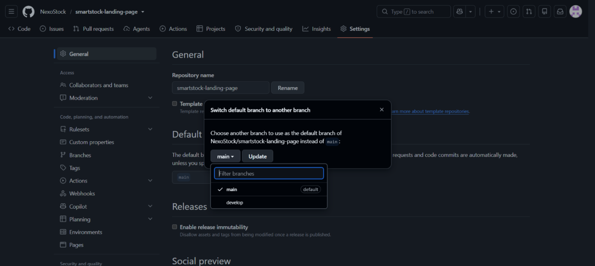

#### Frontend Web Application

> Pendiente de definir y documentar. Debe especificar los pasos necesarios para que, a partir del repositorio de código fuente, se logre la construcción de producción de la aplicación Angular y su publicación en el proveedor seleccionado, incluyendo la configuración del URL base del RESTful API por ambiente.

#### Web Services

> Pendiente de definir y documentar. Debe especificar los pasos necesarios para que, a partir del repositorio de código fuente, se logre la construcción del artefacto de la aplicación Spring Boot, su despliegue en el proveedor seleccionado, la configuración de las variables de entorno y de la conexión a la base de datos, y la publicación de la documentación OpenAPI mediante Swagger.

## 5.2. Landing Page, Services & Applications Implementation

En esta sección se explica y evidencia el proceso de implementación, pruebas, documentación y despliegue del Landing Page, los Web Services y la Frontend Web Application, organizado por sprints.

### 5.2.1. Sprint 1

#### 5.2.1.1. Sprint Planning 1

| Campo | Detalle |
| --- | --- |
| Sprint # | 1 |
| Date | 2026-09-12 |
| Time | 4:00 PM |
| Location | Reunión virtual |
| Prepared By | Vizcarra Mamani, Candy Milagros |
| Attendees | Crispin Valdivia, Angel Gabriel; Lopez Rimachi, Sebastian Leonardo; Montañez Salinas, Lorena Ariana; Tuesta Girón, Kiara Lucia; Vizcarra Mamani, Candy Milagros |
| Sprint 0 – Review Summary | N/A (Primer Sprint del proyecto. Se establecieron las bases de la arquitectura, infraestructura en la nube y repositorios). |
| Sprint 0 – Retrospective Summary | N/A (Primer Sprint. El equipo acordó usar GitFlow y Conventional Commits rigurosamente desde el primer día). |
| Sprint 1 Goal | Our focus is on delivering a fast, static Landing Page (HTML/CSS/JS) with language support to attract clients and validate our value proposition. We believe it delivers a clear, accessible introduction to our product's value proposition to minimarket and bodega owners exploring inventory solutions. This will be confirmed when the Landing Page is deployed and fully navigable by users, in both supported languages. |
| Sprint 1 Velocity | 10 Story Points (Velocidad estimada para el primer ciclo del equipo). |
| Sum of Story Points | 10 |

#### 5.2.1.2. Aspect Leaders and Collaborators

El alcance del Sprint 1 corresponde al Landing Page y a la puesta en marcha del ciclo de vida del proyecto. Sobre esa base, el equipo identificó cinco aspectos y designó un líder por cada uno, buscando que cada integrante condujera el área en la que aportaba mayor conocimiento y colaborara en las restantes. La designación se refleja en la selección de tasks del Sprint Backlog y en la autoría de los commits de los repositorios.

Los aspectos considerados son: el Design System, que define la identidad visual compartida por los productos; la Estructura y contenido visual del sitio, que abarca el encabezado principal y su propuesta de valor; la Redacción y prueba social, que cubre los textos de los segmentos y los testimonios; la Accesibilidad e internacionalización, que cubre los atributos ARIA y los idiomas `en_US` y `es_419`; y la Configuración y despliegue, que abarca el control de versiones, el despliegue y la elaboración del informe.

| Team Member (Last Name, First Name) | GitHub Username | Design System | Estructura y contenido visual | Redacción y prueba social | Accesibilidad e i18n | Configuración y despliegue |
| --- | --- | :---: | :---: | :---: | :---: | :---: |
| Crispin Valdivia, Angel Gabriel | @FaureGalliard | C | C | C | C | L |
| Lopez Rimachi, Sebastian Leonardo | @leonardoXd1323 | C | C | L | C | C |
| Montañez Salinas, Lorena Ariana | @Lore-MS | L | C | C | C | C |
| Tuesta Girón, Kiara Lucia | @kitu05g | C | C | C | L | C |
| Vizcarra Mamani, Candy Milagros | @candyvizz | C | L | C | C | C |

#### 5.2.1.3. Sprint Backlog 1

El Sprint Backlog 1 se estructuró en torno a la construcción del sitio web estático (Landing Page) de SmartStock, encargado de comunicar la propuesta de valor del producto, los casos de uso diferenciados para bodegas de barrio y minimarkets, los planes y precios, la comparación frente a otras soluciones del mercado, y el flujo de contacto y registro de nuevos usuarios. Cada User Story del Epic EP08 se descompuso en tareas técnicas concretas, asignadas a los integrantes del subequipo de Landing Page (Angel Crispin y Kiara Tuesta) según su rol de diseño y desarrollo dentro del proyecto.

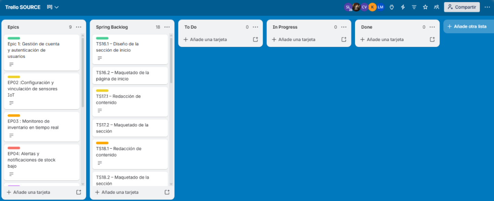

**Trello link:**  
https://trello.com/invite/b/6aa988a0941a5fb8c814af43/ATTI5eecabb28fdc9c85d7ba8336b688a97353B8B08C/trello

| Story Id | Story Title | Task Id | Task Title | Task Description | Estimation (h) | Assigned To | Status |
| --- | --- | --- | --- | --- | ---: | --- | --- |
| US16 | Información general de SmartStock | TS16.1 | Diseño de la sección de inicio (Hero) | Wireframe de la página de inicio con la propuesta de valor y el problema que resuelve SmartStock | 2 | Crispin Valdivia, Angel Gabriel (@FaureGalliard) | To-do |
| US16 | Información general de SmartStock | TS16.2 | Maquetado de la página de inicio | Implementación en HTML/CSS de la sección de inicio según el diseño aprobado | 3 | Tuesta Girón, Kiara Lucia (@kitu05g) | To-do |
| US17 | Casos de uso para bodegas de barrio | TS17.1 | Redacción de contenido — bodegas | Redactar los casos de uso enfocados en negocios pequeños (bodegas de barrio) | 1 | Montañez Salinas, Lorena Ariana (@Lore-MS) | To-do |
| US17 | Casos de uso para bodegas de barrio | TS17.2 | Maquetado de la sección — bodegas | Implementación en HTML/CSS de la sección de casos de uso para bodegas | 2 | Vizcarra Mamani, Candy Milagros (@candyvizz) | To-do |
| US18 | Casos de uso para minimarkets | TS18.1 | Redacción de contenido — minimarkets | Redactar los casos de uso enfocados en negocios de mayor volumen (minimarkets) | 1 | Montañez Salinas, Lorena Ariana (@Lore-MS) | To-do |
| US18 | Casos de uso para minimarkets | TS18.2 | Maquetado de la sección — minimarkets | Implementación en HTML/CSS de la sección de casos de uso para minimarkets | 2 | Vizcarra Mamani, Candy Milagros (@candyvizz) | To-do |
| US19 | Planes y precios | TS19.1 | Diseño de la sección de planes y precios | Wireframe de la tabla o cards de planes disponibles con sus características y costos | 2 | Crispin Valdivia, Angel Gabriel (@FaureGalliard) | To-do |
| US19 | Planes y precios | TS19.2 | Maquetado de la sección de planes y precios | Implementación en HTML/CSS de la sección de planes | 2 | Tuesta Girón, Kiara Lucia (@kitu05g) | To-do |
| US20 | Formulario de contacto para solicitar demostración | TS20.1 | Diseño del formulario de contacto | Wireframe del formulario (nombre, negocio, correo, tipo de negocio) con estados de error | 2 | Crispin Valdivia, Angel Gabriel (@FaureGalliard) | To-do |
| US20 | Formulario de contacto para solicitar demostración | TS20.2 | Implementación del formulario | Maquetado y validación de campos obligatorios del formulario | 3 | Tuesta Girón, Kiara Lucia (@kitu05g) | To-do |
| US20 | Formulario de contacto para solicitar demostración | TS20.3 | Envío de confirmación por correo | Configurar el envío del correo de confirmación al solicitar la demo | 2 | Lopez Rimachi, Sebastian Leonardo (@leonardoXd1323) | To-do |
| US21 | Preguntas frecuentes sobre instalación de sensores | TS21.1 | Redacción de FAQ | Redactar preguntas frecuentes sobre la instalación de los sensores IoT | 1 | Vizcarra Mamani, Candy Milagros (@candyvizz) | To-do |
| US21 | Preguntas frecuentes sobre instalación de sensores | TS21.2 | Maquetado de la sección de FAQ | Implementación en HTML/CSS de la sección de preguntas frecuentes | 1 | Tuesta Girón, Kiara Lucia (@kitu05g) | To-do |
| US22 | Testimonios de dueños de bodega | TS22.1 | Recopilación de testimonios | Redactar/recopilar testimonios representativos de bodegas y minimarkets | 1 | Vizcarra Mamani, Candy Milagros (@candyvizz) | To-do |
| US22 | Testimonios de dueños de bodega | TS22.2 | Maquetado de la sección de testimonios | Implementación en HTML/CSS de la sección de testimonios | 2 | Lopez Rimachi, Sebastian Leonardo (@leonardoXd1323) | To-do |
| US23 | Comparación frente a otras soluciones | TS23.1 | Elaboración de tabla comparativa | Construir la comparación de SmartStock frente a Trax Retail, Trigo Retail y Pensa Systems | 2 | Crispin Valdivia, Angel Gabriel (@FaureGalliard) | To-do |
| US23 | Comparación frente a otras soluciones | TS23.2 | Maquetado de la sección de comparación | Implementación en HTML/CSS de la sección de comparación de soluciones | 2 | Tuesta Girón, Kiara Lucia (@kitu05g) | To-do |
| US24 | Acceso a registro desde el sitio web | TS24.1 | Botón de registro persistente | Añadir el enlace/botón de registro visible en todas las secciones del sitio | 1 | Crispin Valdivia, Angel Gabriel (@FaureGalliard) | To-do |

#### 5.2.1.4. Development Evidence for Sprint Review

Durante el Sprint 1 se implementó la primera versión del sitio web estático (Landing Page) de SmartStock, cubriendo las secciones de propuesta de valor, problemática, casos de uso por segmento, comparación frente a otras soluciones, planes y precios, testimonios, preguntas frecuentes y formulario de contacto.

A continuación se presenta la tabla de commits relacionados con la implementación, organizados por rama según GitFlow y redactados bajo la convención de Conventional Commits.

| Repository | Branch | Commit Id | Commit Message | Commit Message Body | Committed on |
| --- | --- | --- | --- | --- | --- |
| NexoStock/smartstock-landing-page | `feature/landing-page` | `ca232bc` | `feat(landing): add base styles` | White as the dominant background, navy for headings and actions. Only the tokens the page actually uses are declared. | 14/09/2026 |
| NexoStock/smartstock-landing-page | `feature/landing-page` | `19a6acd` | `feat(landing): add the home page sections` | Cover the user stories of the static web site: general information and the problem it solves, use cases for corner stores and minimarkets, comparison against other solutions, plans and pricing, testimonials, FAQ, demo request form and sign-up access from the header. | 14/09/2026 |
| NexoStock/smartstock-landing-page | `feature/landing-page` | `60dba06` | `feat(landing): add language switch, menu, faq and form validation` | English como idioma por defecto en el markup; el español viene de un diccionario. Los enlaces al aplicativo se construyen desde una sola constante de URL. | 14/09/2026 |
| NexoStock/smartstock-landing-page | `feature/landing-page` | `f8c269e` | `feat(landing): add terms and conditions linked from the footer` | Redactado siguiendo el ACM/IEEE Software Engineering Code of Ethics y el código de ética del Colegio de Ingenieros del Perú. | 14/09/2026 |
| NexoStock/smartstock-landing-page | `fix/mobile-navbar` | `8a71b7f` | `fix(landing): repair the navigation bar on narrow screens` | Debajo de 720px el botón de registro pasa al menú colapsable; se mantiene accesible desde toda sección junto con el selector de idioma. | 14/09/2026 |
| NexoStock/smartstock-landing-page | `feature/visual-refresh` | `4d500bf` | `feat(styles): refresh the visual system with the new brand palette` | Deepen the navy, brighten the mid blue and raise the corner radius to 12px. Add gradients to the primary button and to the hero background, elevation and a hover accent to the cards, and enlarge the brand mark in the header. | 17/09/2026 |
| NexoStock/smartstock-landing-page | `feature/visual-refresh` | `fc1ed0c` | `feat(landing): add the hero image and the two column layout` | Split the hero into copy and image so the visitor sees the segment the product is for before reading a line. The photograph shows a store owner using SmartStock next to stocked shelves, and it carries a descriptive alternative text that is translated with the rest of the page. | 17/09/2026 |
| NexoStock/smartstock-landing-page | `feature/visual-refresh` | `bdc9591` | `feat(landing): redesign the testimonials and refine the use case copy` | Give the testimonials their own grid with a rating, an initials avatar and a lead paragraph. Rewrite the use case bullets so they speak about turnover and the catalogue instead of quoting a fixed number of products. | 17/09/2026 |
| NexoStock/smartstock-landing-page | `feature/visual-refresh` | `39e8f6d` | `feat(a11y): translate the aria labels and pin english as the default locale` | The navigation and the language selector exposed their aria-label only in english, so a screen reader announced them in english while reading the rest of the page in spanish. They are now translated like any other copy. The initial locale no longer follows the browser language: the project statement requires english to be the default language of the product. | 17/09/2026 |
| NexoStock/smartstock-landing-page | `feature/visual-refresh` | `60f268b` | `fix(landing): restore the hero route and consolidate the stylesheet` | The hero call to action lost its data-app attribute in the redesign, so it pointed nowhere. The project statement requires every call to action to redirect the visitor to the corresponding view of the web application, and US24 states it as an acceptance criterion. Merge the second :root into the original one so the palette has a single source of truth, and give the gradient heading a solid fallback colour: color:transparent applies unconditionally while background-clip:text does not, which left the main heading invisible in forced-colors mode and when printing. | 17/09/2026 |

#### 5.2.1.5. Execution Evidence for Sprint Review

Durante el Sprint 1 se implementó y desplegó la primera versión del Landing Page, que cubre las User Stories del sitio web estático especificadas en la sección 3.1. El sitio se encuentra accesible en:

https://nexostock.github.io/smartstock-landing-page/

A continuación se presentan las principales vistas implementadas.

##### Encabezado principal y propuesta de valor (US16, US24)

El encabezado principal se organiza en dos columnas: a la izquierda la propuesta de valor, que presenta qué es SmartStock y qué problema resuelve, y a la derecha una fotografía de un propietario de tienda utilizando la plataforma junto a sus estantes abastecidos. La imagen permite que el visitante reconozca el segmento al que se dirige el producto antes de leer una sola línea, y cuenta con un texto alternativo descriptivo que se traduce junto con el resto de la página.

La barra superior mantiene visibles de forma permanente el selector de idioma y la acción de crear cuenta, en cumplimiento de la regla de negocio de la US24.

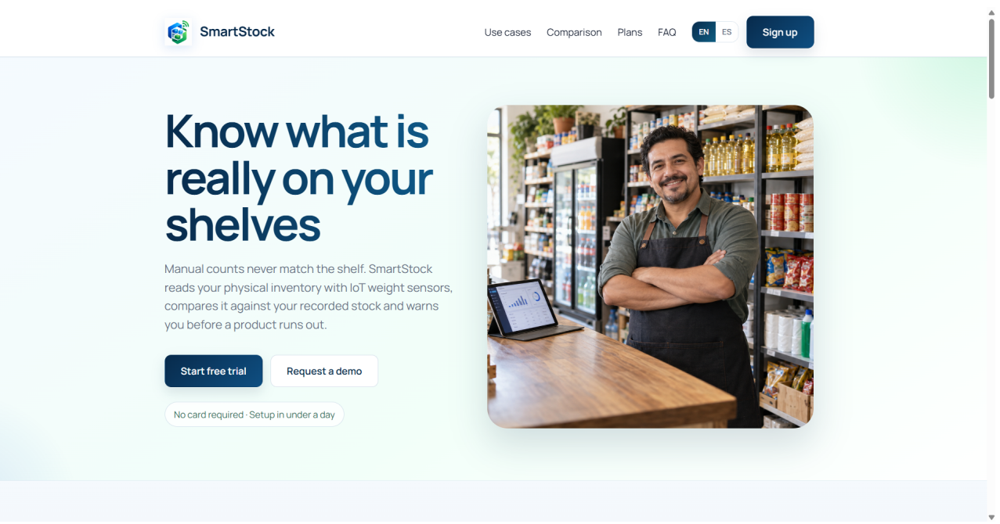

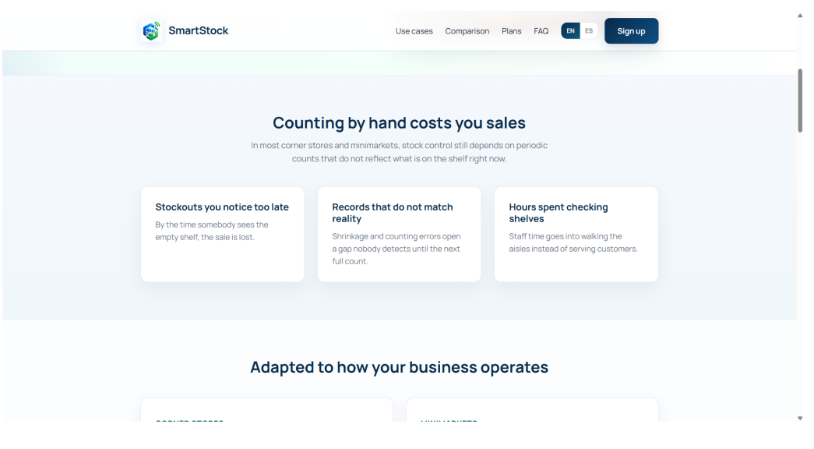

##### Casos de uso por segmento objetivo (US17, US18)

La sección de casos de uso separa el contenido dirigido a bodegas de barrio del dirigido a minimarkets. Cada bloque enumera los beneficios propios del segmento y cierra con un call-to-action que redirige a la vista de registro de la Web Application transportando el segmento correspondiente.

La captura se presenta con la experiencia conmutada a español latinoamericano, de modo que evidencie además el alcance de la traducción sobre el contenido de esta sección.

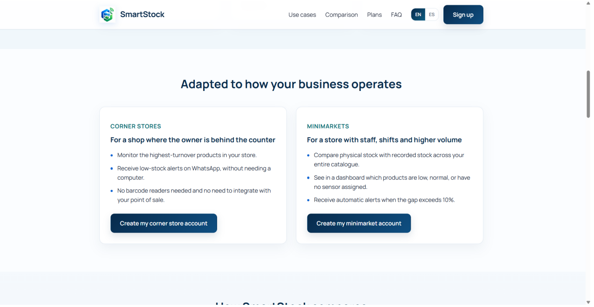

##### Comparación frente a otras soluciones

La Landing Page incluye una sección comparativa que permite visualizar las diferencias de SmartStock frente a otras soluciones del mercado.

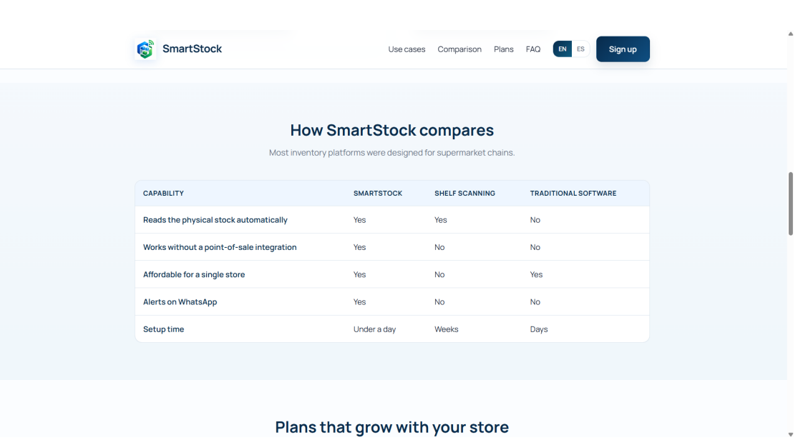

##### Planes y precios (US19)

Los tres planes se presentan sobre el mismo conjunto de características, ordenados de menor a mayor capacidad, y el plan intermedio se destaca mediante un borde de mayor peso. Cada plan conduce al registro con el plan preseleccionado.

Las tarjetas aplican el refresco visual del design system: radio de esquina de 14 píxeles, elevación tenue en reposo y un filete de acento que se revela al pasar el cursor.

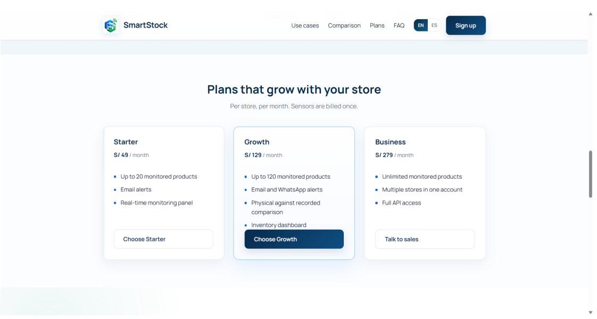

##### Testimonios de clientes (US22)

La sección de testimonios presenta las opiniones recogidas durante las entrevistas, cada una acompañada de una valoración y de un avatar con las iniciales del entrevistado. La valoración se expone además mediante `aria-label`, de modo que un lector de pantalla anuncie la calificación en lugar de leer una sucesión de símbolos.

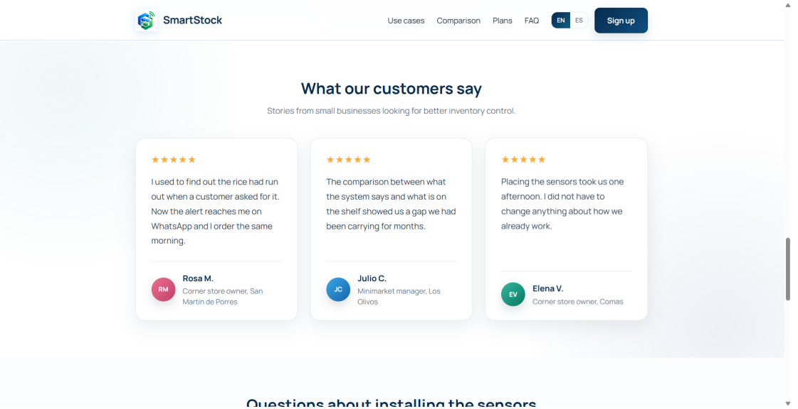

##### Formulario de solicitud de demostración (US20)

El formulario valida los campos obligatorios al abandonar cada campo y expone los mensajes de error mediante `role="alert"`, de modo que un lector de pantalla los anuncie.

Los campos adoptan el radio de esquina y el color de borde definidos en la sección 4.1, y el botón de envío emplea el degradado de marca.

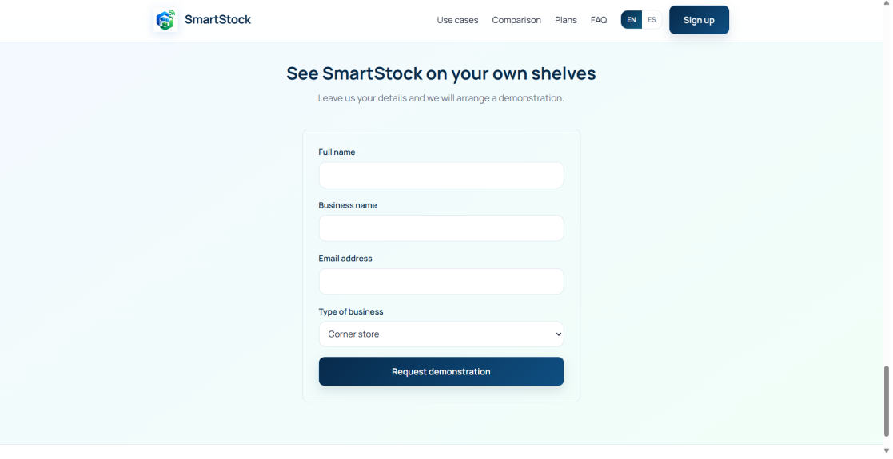

##### Internacionalización de la experiencia (en_US / es_419)

El idioma por defecto del sitio es el inglés, conforme a lo establecido en el enunciado. El sitio no adopta el idioma del navegador en la primera visita, precisamente para que el idioma por defecto del producto sea siempre el inglés; a partir de ahí, la preferencia elegida por el visitante queda registrada en el navegador.

El selector de idioma de la barra superior conmuta toda la experiencia al español latinoamericano, incluyendo el título del documento, los textos de la interfaz, los mensajes de validación del formulario y los atributos `aria-label` de la navegación, del selector de idioma y de la imagen del encabezado principal.

El atributo `lang` del documento se actualiza en cada conmutación, de modo que un lector de pantalla emplee la pronunciación correcta.

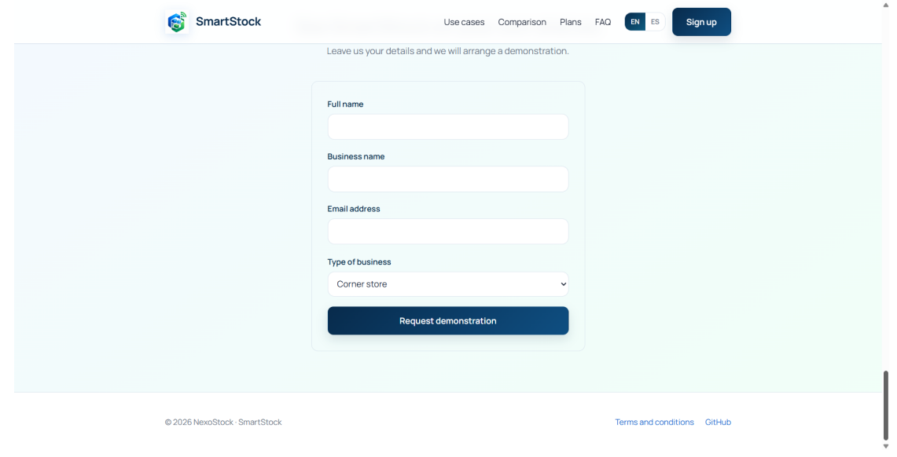

##### Diseño web adaptable (responsive web design)

La experiencia se adapta a las dimensiones del dispositivo cliente. En navegador móvil, las rejillas de tarjetas colapsan a una sola columna, la escala tipográfica de los titulares se reduce y la navegación se repliega tras un botón de menú.

La barra superior conserva en pantallas estrechas únicamente la marca, el selector de idioma y el botón de menú. La acción de crear cuenta se traslada al interior del menú desplegable, de modo que la barra no compita por el ancho disponible y se mantenga el cumplimiento de la regla de negocio de la US24, que establece que la opción de registro está disponible de forma permanente en todas las secciones del sitio web estático.

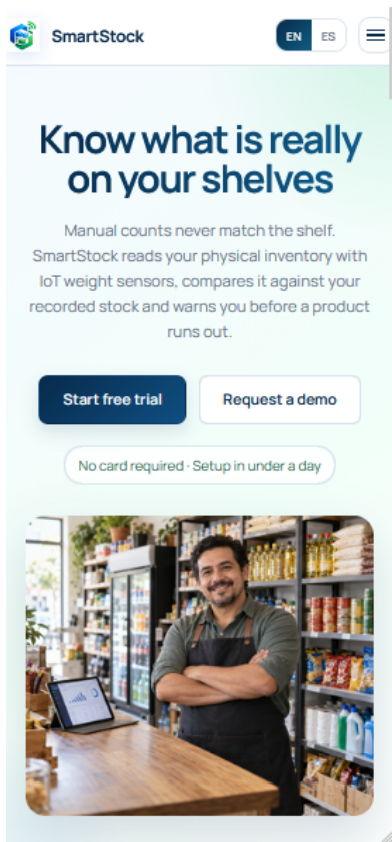

**Landing Page Demonstration Video:**  
SmartStock - Landing Page Review.mp4

#### 5.2.1.6. Services Documentation Evidence for Sprint Review

N/A. Durante el Sprint 1 el esfuerzo de desarrollo se enfocó exclusivamente en la creación del sitio web estático promocional (Landing Page), por lo que aún no se han implementado APIs RESTful ni Endpoints backend que requieran ser documentados a través de Swagger/OpenAPI.

Esta documentación se estructurará a partir del Sprint 2.

#### 5.2.1.7. Software Deployment Evidence for Sprint Review

Durante el Sprint 1, el alcance de despliegue correspondió al Landing Page. El equipo creó el repositorio `smartstock-landing-page` dentro de la organización NexoStock, aplicó sobre él el flujo de trabajo GitFlow e integró la versión `1.0.0` a la rama `main` mediante una release branch.

A continuación, habilitó GitHub Pages tomando como fuente dicha rama y el directorio raíz del repositorio.

| Producto | Repositorio | URL desplegado | Estado |
| --- | --- | --- | --- |
| Landing Page | https://github.com/NexoStock/smartstock-landing-page | https://nexostock.github.io/smartstock-landing-page/ | Desplegado |
| Frontend Web Application | Pendiente de despliegue. | — | Fuera del alcance del Sprint 1 |
| Web Services | Pendiente de despliegue. | — | Fuera del alcance del Sprint 1 |

La configuración aplicada en el repositorio se muestra a continuación. La fuente de publicación es la rama `main` y el directorio raíz, y GitHub confirma la publicación del sitio.

En el selector de ramas se aprecian además las ramas `main` y `develop`, que evidencian la aplicación de GitFlow sobre el repositorio.

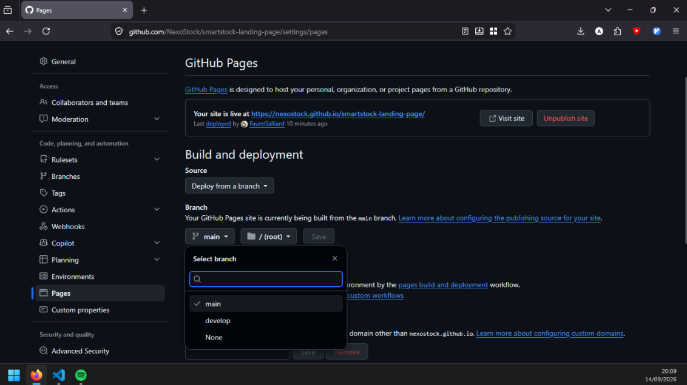

Se verificó que el sitio publicado responde correctamente tanto en la página de inicio como en la página de términos y condiciones, y que la hoja de estilos y el archivo de comportamiento se sirven sin errores.

#### 5.2.1.8. Team Collaboration Insights during Sprint

Durante el Sprint 1, el equipo organizó la implementación del Landing Page según los aspectos definidos en la sección 5.2.1.2. Cada integrante trabajó sobre el aspecto que lideraba y registró su aporte mediante commits propios en el repositorio `smartstock-landing-page`, aplicando GitFlow y Conventional Commits.

El flujo de trabajo seguido fue el siguiente: la rama `develop` concentró el avance acumulado, cada conjunto de cambios se desarrolló en una rama `feature/` que se integró a `develop` sin avance rápido (`--no-ff`), de modo que el historial conserve visible el punto de integración de cada aporte, y las versiones entregadas se publicaron desde `main` mediante ramas `release/` etiquetadas con versionado semántico.

##### Analíticos de colaboración del repositorio del Landing Page

La vista de contribuyentes evidencia la participación de los cinco integrantes del equipo, con el detalle de commits y de líneas agregadas y eliminadas por cada uno.

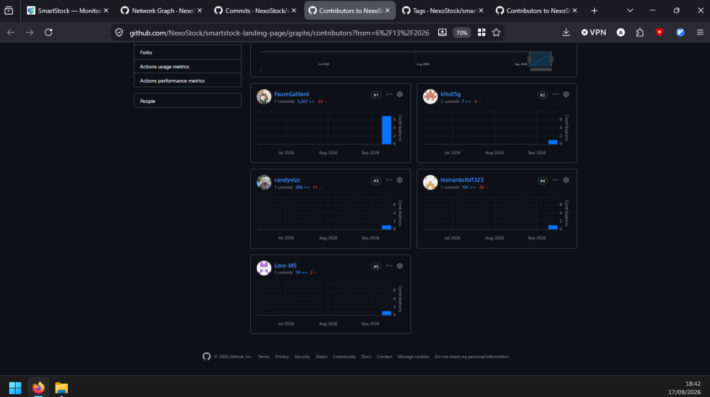

##### Historial de ramas del repositorio

El grafo de red muestra la aplicación efectiva de GitFlow: las ramas de feature nacen de `develop`, se integran nuevamente a ella y la rama `main` recibe únicamente las versiones publicadas.

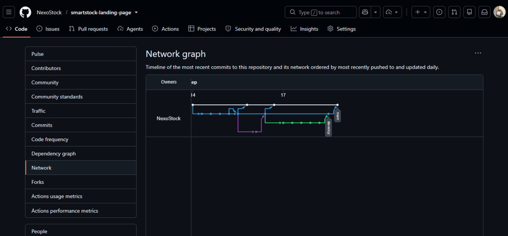 A