# Capítulo V: Product Implementation, Validation & Deployment

En este capítulo se explica y evidencia el proceso de implementar, comprobar, desplegar y validar la solución de SmartStock, compuesta por el Landing Page, los RESTful Web Services y la Frontend Web Application, todos ellos con diseño web responsive. El Landing Page presenta el modelo de negocio y da acceso a la aplicación web. Los procesos del negocio digital, tanto los procesos core como los de soporte (autenticación y autorización, suscripciones, entre otros), están soportados por la Frontend Web Application y los RESTful Web Services.

## 5.1. Software Configuration Management

En esta sección se establecen las decisiones y convenciones que permiten mantener la consistencia del producto durante todo su ciclo de vida, abarcando la configuración del ambiente de desarrollo, la gestión del código fuente, las convenciones de estilo de código y la configuración del despliegue.

### 5.1.1. Software Development Environment Configuration

A continuación se detallan los productos de software que utilizan los miembros del equipo para colaborar en el ciclo de vida del producto digital, agrupados por tipo de actividad, indicando el propósito de uso en el proyecto y la ruta de referencia o de descarga según corresponda.

#### Project Management

| Producto | Propósito de uso en el proyecto | Ruta |
| --- | --- | --- |
| Trello | Gestión del Product Backlog y de los Sprint Backlogs mediante tableros por sprint, con el registro de los work-items y su estado. | https://trello.com |
| Microsoft Teams | Realización de las sesiones síncronas del equipo, incluyendo Sprint Planning, Sprint Review y Retrospective. | https://www.microsoft.com/microsoft-teams |

#### Requirements Management

| Producto | Propósito de uso en el proyecto | Ruta |
| --- | --- | --- |
| UXPressia | Elaboración de los User Personas, Empathy Maps, User Journey Maps e Impact Maps de los segmentos objetivo. | https://uxpressia.com |
| Miro | Realización de las sesiones de Big Picture Event Storming y Design-Level Event Storming. | https://miro.com |

#### Product UX/UI Design

| Producto | Propósito de uso en el proyecto | Ruta |
| --- | --- | --- |
| Figma | Elaboración de los wireframes, mock-ups y prototipos del Landing Page y de la Web Application, en sus versiones para Desktop y Mobile Web Browser. | https://www.figma.com |
| FigJam | Elaboración de los Wireflow Diagrams y de los User Flow Diagrams de la Web Application. | https://www.figma.com/figjam |
| LucidChart | Elaboración de los Class Diagrams de UML y de los Database Diagrams de cada bounded context. | https://www.lucidchart.com |
| Structurizr | Elaboración de los diagramas de C4 Model en sus niveles de Context, Container y Component. | https://structurizr.com |

#### Software Development

| Producto | Propósito de uso en el proyecto | Ruta |
| --- | --- | --- |
| IntelliJ IDEA Ultimate | Entorno de desarrollo integrado para la implementación de los Web Services en Java con Spring Boot. Disponible mediante la JetBrains Educational License. | https://www.jetbrains.com/idea/download |
| WebStorm | Entorno de desarrollo integrado para la implementación de la Frontend Web Application en Angular y del Landing Page. Disponible mediante la JetBrains Educational License. | https://www.jetbrains.com/webstorm/download |
| Java Development Kit (JDK) 21 LTS | Kit de desarrollo del lenguaje Java utilizado para la implementación de los Web Services. | https://adoptium.net/temurin/releases |
| Spring Boot | Framework open source utilizado para la implementación del RESTful API, junto con Spring Data JPA para la persistencia. | https://start.spring.io |
| Node.js y npm | Entorno de ejecución y gestor de paquetes requeridos por Angular CLI. | https://nodejs.org/en/download |
| Angular CLI | Herramienta de línea de comandos para la creación, ejecución y construcción de la Frontend Web Application. | https://angular.dev/tools/cli |
| Angular Material | Biblioteca de componentes de interfaz de usuario basada en Material Design, utilizada en la Web Application. | https://material.angular.io |
| MySQL Community Server | Sistema de gestión de base de datos relacional utilizado para la persistencia de los Web Services. | https://dev.mysql.com/downloads/mysql |
| Postman | Verificación manual de las solicitudes y respuestas de los endpoints del RESTful API durante el desarrollo. | https://www.postman.com/downloads |

#### Software Documentation

| Producto | Propósito de uso en el proyecto | Ruta |
| --- | --- | --- |
| Swagger UI (springdoc-openapi) | Generación y publicación de la documentación del RESTful API bajo la especificación OpenAPI. | https://springdoc.org |
| GitHub | Alojamiento del informe del proyecto en formato Markdown y de la documentación de cada repositorio. | https://github.com/NexoStock |

#### Software Deployment

| Producto | Propósito de uso en el proyecto | Ruta |
| --- | --- | --- |
| GitHub Pages | Publicación del sitio web estático correspondiente al Landing Page. | https://pages.github.com |
| Vercel | Despliegue continuo de la Frontend Web Application (Angular), con integración directa a GitHub para actualizar automáticamente cada nueva versión. | https://vercel.com |
| Railway | Despliegue de los Web Services (Spring Boot) y de la base de datos MySQL administrada utilizada para su persistencia. | https://railway.app |
| Git | Sistema de control de versiones utilizado localmente por cada miembro del equipo. | https://git-scm.com/downloads |

### 5.1.2. Source Code Management

El equipo utiliza GitHub como plataforma de alojamiento y Git como sistema de control de versiones. Los repositorios del proyecto pertenecen a la organización pública NexoStock y se organizan en un repositorio por producto, además del repositorio de documentación del informe.

| Producto | Repositorio |
| --- | --- |
| Project Report | https://github.com/NexoStock/smartstock-docs |
| Landing Page | https://github.com/NexoStock/smartstock-landing-page |
| Frontend Web Application | Pendiente de creación. |
| Web Services | Pendiente de creación. En este repositorio se incluye el proyecto junto con los archivos de pruebas, tanto unitarias como de integración y aceptación. |

#### GitFlow como workflow de control de versiones

El equipo aplica GitFlow, siguiendo el modelo de ramificación descrito por Vincent Driessen. Cada repositorio mantiene las siguientes ramas:

| Rama | Propósito | Convención de nombre |
| --- | --- | --- |
| `main` | Rama principal. Contiene únicamente las versiones entregadas y estables del producto. Cada integración a esta rama corresponde a un release etiquetado. | `main` |
| `develop` | Rama de integración. Concentra el avance acumulado de las features completadas que aún no forman parte de un release. | `develop` |
| Feature branches | Una rama por cada feature o sección en desarrollo. Nace de `develop` y se integra a `develop` mediante Pull Request. | `feature/<nombre-en-kebab-case>`, por ejemplo `feature/user-stories` o `feature/sensor-linking` |
| Release branches | Rama de preparación de una versión a entregar. Nace de `develop` y se integra tanto a `main` como a `develop`. | `release/<major>.<minor>.<patch>`, por ejemplo `release/1.0.0` |
| Hotfix branches | Rama de corrección urgente sobre una versión ya publicada. Nace de `main` y se integra tanto a `main` como a `develop`. | `hotfix/<nombre-en-kebab-case>`, por ejemplo `hotfix/broken-toc-links` |

#### Semantic Versioning

Los releases se nombran aplicando Semantic Versioning 2.0.0, bajo el formato `MAJOR.MINOR.PATCH`. Se incrementa la versión MAJOR ante cambios incompatibles con versiones previas, la versión MINOR ante la incorporación de funcionalidad compatible con versiones previas, y la versión PATCH ante correcciones compatibles con versiones previas.

Cada release se registra como un tag de Git sobre `main`, bajo el formato:

`vMAJOR.MINOR.PATCH`

#### Conventional Commits

Los mensajes de commit siguen la especificación de Conventional Commits, bajo la estructura:

`<type>(<scope>): <description>`

Los tipos utilizados por el equipo son los siguientes:

| Tipo | Uso |
| --- | --- |
| `feat` | Incorporación de una nueva funcionalidad al producto o de una nueva sección al informe. |
| `fix` | Corrección de un defecto en el producto o de un error en el informe. |
| `docs` | Cambios que afectan únicamente a la documentación. |
| `style` | Cambios que no alteran el significado del código, como formato o espaciado. |
| `refactor` | Cambios en el código que no corrigen defectos ni agregan funcionalidad. |
| `test` | Incorporación o corrección de pruebas. |
| `chore` | Cambios en la configuración del proyecto o en las herramientas de soporte. |

La descripción se redacta en inglés, en modo imperativo y en minúsculas, sin punto final. El scope identifica la sección del informe o el módulo del producto afectado.

### 5.1.3. Source Code Style Guide & Conventions

El equipo adopta la nomenclatura en inglés para todos los lenguajes utilizados en la solución, así como las siguientes convenciones estándar de codificación:

| Lenguaje | Convención adoptada |
| --- | --- |
| HTML | HTML Style Guide and Coding Conventions (W3Schools) / Google HTML/CSS Style Guide |
| CSS | Google HTML/CSS Style Guide |
| JavaScript | Google JavaScript Style Guide / MDN JavaScript Guidelines / Vue Style Guide |
| C# | C# Coding Conventions (Microsoft) / Microsoft ASP.NET Core Coding Guidelines |
| Gherkin (criterios de aceptación) | Gherkin Conventions for Readable Specifications |

### 5.1.4. Software Deployment Configuration

#### Landing Page

El Landing Page se publica como sitio web estático en GitHub Pages, a partir del repositorio correspondiente de la organización NexoStock. Los pasos de configuración son los siguientes:

1. Integrar a la rama `main` del repositorio del Landing Page la versión a publicar, mediante una release branch.
2. En la configuración del repositorio, acceder a la sección Pages y seleccionar como fuente la rama `main` y el directorio raíz.
3. Confirmar la publicación y verificar el sitio en el URL asignado por GitHub Pages.
4. Verificar el correcto funcionamiento de los call-to-action que redirigen a la Web Application, del selector de idioma y del enlace a los términos y condiciones del footer.

El Landing Page se encuentra desplegado y accesible públicamente en el siguiente URL:

https://nexostock.github.io/smartstock-landing-page/

Al no requerir el sitio un proceso de construcción, GitHub Pages publica directamente el contenido de la rama `main`, de modo que cada integración de una release branch a dicha rama genera una nueva versión publicada sin pasos adicionales.

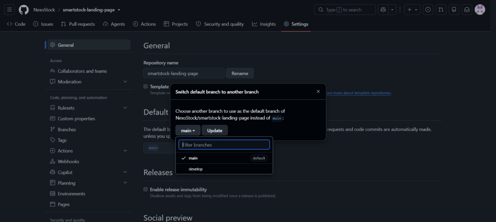

#### Frontend Web Application

> Pendiente de definir y documentar. Debe especificar los pasos necesarios para que, a partir del repositorio de código fuente, se logre la construcción de producción de la aplicación Angular y su publicación en el proveedor seleccionado, incluyendo la configuración del URL base del RESTful API por ambiente.

#### Web Services

> Pendiente de definir y documentar. Debe especificar los pasos necesarios para que, a partir del repositorio de código fuente, se logre la construcción del artefacto de la aplicación Spring Boot, su despliegue en el proveedor seleccionado, la configuración de las variables de entorno y de la conexión a la base de datos, y la publicación de la documentación OpenAPI mediante Swagger.

## 5.2. Landing Page, Services & Applications Implementation

En esta sección se explica y evidencia el proceso de implementación, pruebas, documentación y despliegue del Landing Page, los Web Services y la Frontend Web Application, organizado por sprints.

### 5.2.1. Sprint 1

#### 5.2.1.1. Sprint Planning 1

| Campo | Detalle |
| --- | --- |
| Sprint # | 1 |
| Date | 2026-09-12 |
| Time | 4:00 PM |
| Location | Reunión virtual |
| Prepared By | Vizcarra Mamani, Candy Milagros |
| Attendees | Crispin Valdivia, Angel Gabriel; Lopez Rimachi, Sebastian Leonardo; Montañez Salinas, Lorena Ariana; Tuesta Girón, Kiara Lucia; Vizcarra Mamani, Candy Milagros |
| Sprint 0 – Review Summary | N/A (Primer Sprint del proyecto. Se establecieron las bases de la arquitectura, infraestructura en la nube y repositorios). |
| Sprint 0 – Retrospective Summary | N/A (Primer Sprint. El equipo acordó usar GitFlow y Conventional Commits rigurosamente desde el primer día). |
| Sprint 1 Goal | Our focus is on delivering a fast, static Landing Page (HTML/CSS/JS) with language support to attract clients and validate our value proposition. We believe it delivers a clear, accessible introduction to our product's value proposition to minimarket and bodega owners exploring inventory solutions. This will be confirmed when the Landing Page is deployed and fully navigable by users, in both supported languages. |
| Sprint 1 Velocity | 10 Story Points (Velocidad estimada para el primer ciclo del equipo). |
| Sum of Story Points | 10 |

#### 5.2.1.2. Aspect Leaders and Collaborators

El alcance del Sprint 1 corresponde al Landing Page y a la puesta en marcha del ciclo de vida del proyecto. Sobre esa base, el equipo identificó cinco aspectos y designó un líder por cada uno, buscando que cada integrante condujera el área en la que aportaba mayor conocimiento y colaborara en las restantes. La designación se refleja en la selección de tasks del Sprint Backlog y en la autoría de los commits de los repositorios.

Los aspectos considerados son: el Design System, que define la identidad visual compartida por los productos; la Estructura y contenido visual del sitio, que abarca el encabezado principal y su propuesta de valor; la Redacción y prueba social, que cubre los textos de los segmentos y los testimonios; la Accesibilidad e internacionalización, que cubre los atributos ARIA y los idiomas `en_US` y `es_419`; y la Configuración y despliegue, que abarca el control de versiones, el despliegue y la elaboración del informe.

| Team Member (Last Name, First Name) | GitHub Username | Design System | Estructura y contenido visual | Redacción y prueba social | Accesibilidad e i18n | Configuración y despliegue |
| --- | --- | :---: | :---: | :---: | :---: | :---: |
| Crispin Valdivia, Angel Gabriel | @FaureGalliard | C | C | C | C | L |
| Lopez Rimachi, Sebastian Leonardo | @leonardoXd1323 | C | C | L | C | C |
| Montañez Salinas, Lorena Ariana | @Lore-MS | L | C | C | C | C |
| Tuesta Girón, Kiara Lucia | @kitu05g | C | C | C | L | C |
| Vizcarra Mamani, Candy Milagros | @candyvizz | C | L | C | C | C |

#### 5.2.1.3. Sprint Backlog 1

El Sprint Backlog 1 se estructuró en torno a la construcción del sitio web estático (Landing Page) de SmartStock, encargado de comunicar la propuesta de valor del producto, los casos de uso diferenciados para bodegas de barrio y minimarkets, los planes y precios, la comparación frente a otras soluciones del mercado, y el flujo de contacto y registro de nuevos usuarios. Cada User Story del Epic EP08 se descompuso en tareas técnicas concretas, asignadas a los integrantes del subequipo de Landing Page (Angel Crispin y Kiara Tuesta) según su rol de diseño y desarrollo dentro del proyecto.

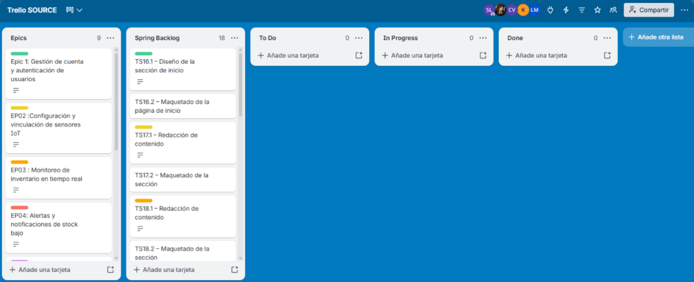

**Trello link:**  
https://trello.com/invite/b/6aa988a0941a5fb8c814af43/ATTI5eecabb28fdc9c85d7ba8336b688a97353B8B08C/trello

| Story Id | Story Title | Task Id | Task Title | Task Description | Estimation (h) | Assigned To | Status |
| --- | --- | --- | --- | --- | ---: | --- | --- |
| US16 | Información general de SmartStock | TS16.1 | Diseño de la sección de inicio (Hero) | Wireframe de la página de inicio con la propuesta de valor y el problema que resuelve SmartStock | 2 | Crispin Valdivia, Angel Gabriel (@FaureGalliard) | To-do |
| US16 | Información general de SmartStock | TS16.2 | Maquetado de la página de inicio | Implementación en HTML/CSS de la sección de inicio según el diseño aprobado | 3 | Tuesta Girón, Kiara Lucia (@kitu05g) | To-do |
| US17 | Casos de uso para bodegas de barrio | TS17.1 | Redacción de contenido — bodegas | Redactar los casos de uso enfocados en negocios pequeños (bodegas de barrio) | 1 | Montañez Salinas, Lorena Ariana (@Lore-MS) | To-do |
| US17 | Casos de uso para bodegas de barrio | TS17.2 | Maquetado de la sección — bodegas | Implementación en HTML/CSS de la sección de casos de uso para bodegas | 2 | Vizcarra Mamani, Candy Milagros (@candyvizz) | To-do |
| US18 | Casos de uso para minimarkets | TS18.1 | Redacción de contenido — minimarkets | Redactar los casos de uso enfocados en negocios de mayor volumen (minimarkets) | 1 | Montañez Salinas, Lorena Ariana (@Lore-MS) | To-do |
| US18 | Casos de uso para minimarkets | TS18.2 | Maquetado de la sección — minimarkets | Implementación en HTML/CSS de la sección de casos de uso para minimarkets | 2 | Vizcarra Mamani, Candy Milagros (@candyvizz) | To-do |
| US19 | Planes y precios | TS19.1 | Diseño de la sección de planes y precios | Wireframe de la tabla o cards de planes disponibles con sus características y costos | 2 | Crispin Valdivia, Angel Gabriel (@FaureGalliard) | To-do |
| US19 | Planes y precios | TS19.2 | Maquetado de la sección de planes y precios | Implementación en HTML/CSS de la sección de planes | 2 | Tuesta Girón, Kiara Lucia (@kitu05g) | To-do |
| US20 | Formulario de contacto para solicitar demostración | TS20.1 | Diseño del formulario de contacto | Wireframe del formulario (nombre, negocio, correo, tipo de negocio) con estados de error | 2 | Crispin Valdivia, Angel Gabriel (@FaureGalliard) | To-do |
| US20 | Formulario de contacto para solicitar demostración | TS20.2 | Implementación del formulario | Maquetado y validación de campos obligatorios del formulario | 3 | Tuesta Girón, Kiara Lucia (@kitu05g) | To-do |
| US20 | Formulario de contacto para solicitar demostración | TS20.3 | Envío de confirmación por correo | Configurar el envío del correo de confirmación al solicitar la demo | 2 | Lopez Rimachi, Sebastian Leonardo (@leonardoXd1323) | To-do |
| US21 | Preguntas frecuentes sobre instalación de sensores | TS21.1 | Redacción de FAQ | Redactar preguntas frecuentes sobre la instalación de los sensores IoT | 1 | Vizcarra Mamani, Candy Milagros (@candyvizz) | To-do |
| US21 | Preguntas frecuentes sobre instalación de sensores | TS21.2 | Maquetado de la sección de FAQ | Implementación en HTML/CSS de la sección de preguntas frecuentes | 1 | Tuesta Girón, Kiara Lucia (@kitu05g) | To-do |
| US22 | Testimonios de dueños de bodega | TS22.1 | Recopilación de testimonios | Redactar/recopilar testimonios representativos de bodegas y minimarkets | 1 | Vizcarra Mamani, Candy Milagros (@candyvizz) | To-do |
| US22 | Testimonios de dueños de bodega | TS22.2 | Maquetado de la sección de testimonios | Implementación en HTML/CSS de la sección de testimonios | 2 | Lopez Rimachi, Sebastian Leonardo (@leonardoXd1323) | To-do |
| US23 | Comparación frente a otras soluciones | TS23.1 | Elaboración de tabla comparativa | Construir la comparación de SmartStock frente a Trax Retail, Trigo Retail y Pensa Systems | 2 | Crispin Valdivia, Angel Gabriel (@FaureGalliard) | To-do |
| US23 | Comparación frente a otras soluciones | TS23.2 | Maquetado de la sección de comparación | Implementación en HTML/CSS de la sección de comparación de soluciones | 2 | Tuesta Girón, Kiara Lucia (@kitu05g) | To-do |
| US24 | Acceso a registro desde el sitio web | TS24.1 | Botón de registro persistente | Añadir el enlace/botón de registro visible en todas las secciones del sitio | 1 | Crispin Valdivia, Angel Gabriel (@FaureGalliard) | To-do |

#### 5.2.1.4. Development Evidence for Sprint Review

Durante el Sprint 1 se implementó la primera versión del sitio web estático (Landing Page) de SmartStock, cubriendo las secciones de propuesta de valor, problemática, casos de uso por segmento, comparación frente a otras soluciones, planes y precios, testimonios, preguntas frecuentes y formulario de contacto.

A continuación se presenta la tabla de commits relacionados con la implementación, organizados por rama según GitFlow y redactados bajo la convención de Conventional Commits.

| Repository | Branch | Commit Id | Commit Message | Commit Message Body | Committed on |
| --- | --- | --- | --- | --- | --- |
| NexoStock/smartstock-landing-page | `feature/landing-page` | `ca232bc` | `feat(landing): add base styles` | White as the dominant background, navy for headings and actions. Only the tokens the page actually uses are declared. | 14/09/2026 |
| NexoStock/smartstock-landing-page | `feature/landing-page` | `19a6acd` | `feat(landing): add the home page sections` | Cover the user stories of the static web site: general information and the problem it solves, use cases for corner stores and minimarkets, comparison against other solutions, plans and pricing, testimonials, FAQ, demo request form and sign-up access from the header. | 14/09/2026 |
| NexoStock/smartstock-landing-page | `feature/landing-page` | `60dba06` | `feat(landing): add language switch, menu, faq and form validation` | English como idioma por defecto en el markup; el español viene de un diccionario. Los enlaces al aplicativo se construyen desde una sola constante de URL. | 14/09/2026 |
| NexoStock/smartstock-landing-page | `feature/landing-page` | `f8c269e` | `feat(landing): add terms and conditions linked from the footer` | Redactado siguiendo el ACM/IEEE Software Engineering Code of Ethics y el código de ética del Colegio de Ingenieros del Perú. | 14/09/2026 |
| NexoStock/smartstock-landing-page | `fix/mobile-navbar` | `8a71b7f` | `fix(landing): repair the navigation bar on narrow screens` | Debajo de 720px el botón de registro pasa al menú colapsable; se mantiene accesible desde toda sección junto con el selector de idioma. | 14/09/2026 |
| NexoStock/smartstock-landing-page | `feature/visual-refresh` | `4d500bf` | `feat(styles): refresh the visual system with the new brand palette` | Deepen the navy, brighten the mid blue and raise the corner radius to 12px. Add gradients to the primary button and to the hero background, elevation and a hover accent to the cards, and enlarge the brand mark in the header. | 17/09/2026 |
| NexoStock/smartstock-landing-page | `feature/visual-refresh` | `fc1ed0c` | `feat(landing): add the hero image and the two column layout` | Split the hero into copy and image so the visitor sees the segment the product is for before reading a line. The photograph shows a store owner using SmartStock next to stocked shelves, and it carries a descriptive alternative text that is translated with the rest of the page. | 17/09/2026 |
| NexoStock/smartstock-landing-page | `feature/visual-refresh` | `bdc9591` | `feat(landing): redesign the testimonials and refine the use case copy` | Give the testimonials their own grid with a rating, an initials avatar and a lead paragraph. Rewrite the use case bullets so they speak about turnover and the catalogue instead of quoting a fixed number of products. | 17/09/2026 |
| NexoStock/smartstock-landing-page | `feature/visual-refresh` | `39e8f6d` | `feat(a11y): translate the aria labels and pin english as the default locale` | The navigation and the language selector exposed their aria-label only in english, so a screen reader announced them in english while reading the rest of the page in spanish. They are now translated like any other copy. The initial locale no longer follows the browser language: the project statement requires english to be the default language of the product. | 17/09/2026 |
| NexoStock/smartstock-landing-page | `feature/visual-refresh` | `60f268b` | `fix(landing): restore the hero route and consolidate the stylesheet` | The hero call to action lost its data-app attribute in the redesign, so it pointed nowhere. The project statement requires every call to action to redirect the visitor to the corresponding view of the web application, and US24 states it as an acceptance criterion. Merge the second :root into the original one so the palette has a single source of truth, and give the gradient heading a solid fallback colour: color:transparent applies unconditionally while background-clip:text does not, which left the main heading invisible in forced-colors mode and when printing. | 17/09/2026 |

#### 5.2.1.5. Execution Evidence for Sprint Review

Durante el Sprint 1 se implementó y desplegó la primera versión del Landing Page, que cubre las User Stories del sitio web estático especificadas en la sección 3.1. El sitio se encuentra accesible en:

https://nexostock.github.io/smartstock-landing-page/

A continuación se presentan las principales vistas implementadas.

##### Encabezado principal y propuesta de valor (US16, US24)

El encabezado principal se organiza en dos columnas: a la izquierda la propuesta de valor, que presenta qué es SmartStock y qué problema resuelve, y a la derecha una fotografía de un propietario de tienda utilizando la plataforma junto a sus estantes abastecidos. La imagen permite que el visitante reconozca el segmento al que se dirige el producto antes de leer una sola línea, y cuenta con un texto alternativo descriptivo que se traduce junto con el resto de la página.

La barra superior mantiene visibles de forma permanente el selector de idioma y la acción de crear cuenta, en cumplimiento de la regla de negocio de la US24.

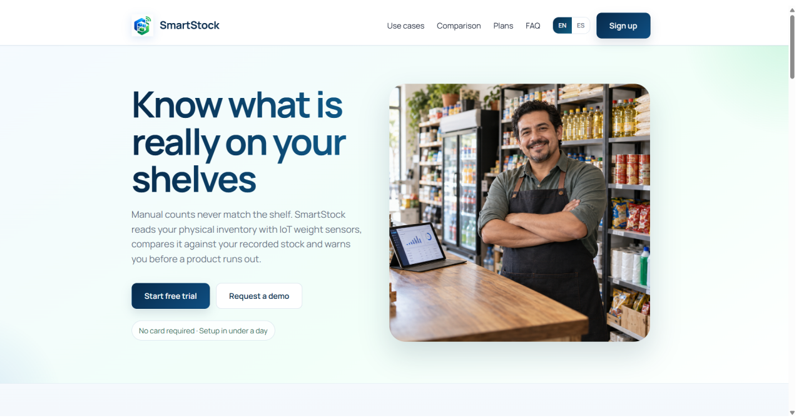

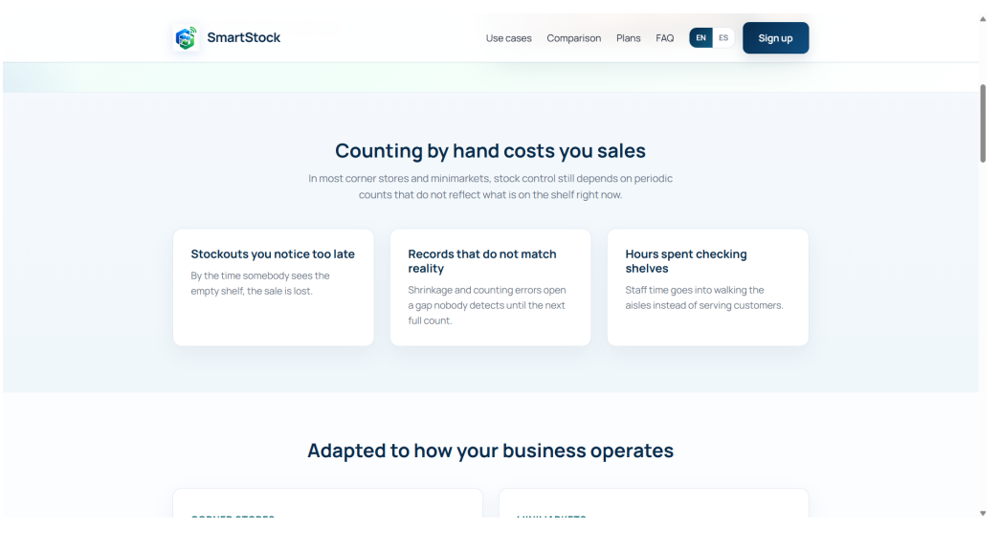

##### Casos de uso por segmento objetivo (US17, US18)

La sección de casos de uso separa el contenido dirigido a bodegas de barrio del dirigido a minimarkets. Cada bloque enumera los beneficios propios del segmento y cierra con un call-to-action que redirige a la vista de registro de la Web Application transportando el segmento correspondiente.

La captura se presenta con la experiencia conmutada a español latinoamericano, de modo que evidencie además el alcance de la traducción sobre el contenido de esta sección.

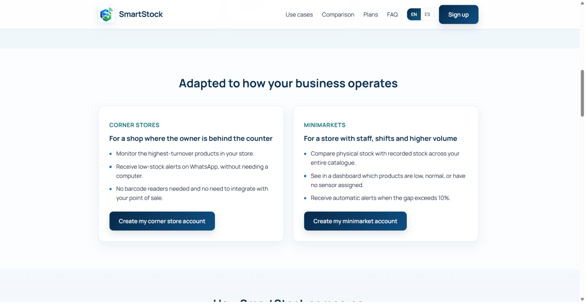

##### Comparación frente a otras soluciones

La Landing Page incluye una sección comparativa que permite visualizar las diferencias de SmartStock frente a otras soluciones del mercado.

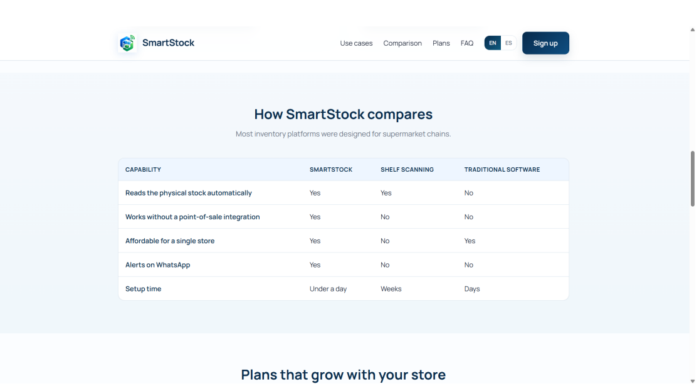

##### Planes y precios (US19)

Los tres planes se presentan sobre el mismo conjunto de características, ordenados de menor a mayor capacidad, y el plan intermedio se destaca mediante un borde de mayor peso. Cada plan conduce al registro con el plan preseleccionado.

Las tarjetas aplican el refresco visual del design system: radio de esquina de 14 píxeles, elevación tenue en reposo y un filete de acento que se revela al pasar el cursor.

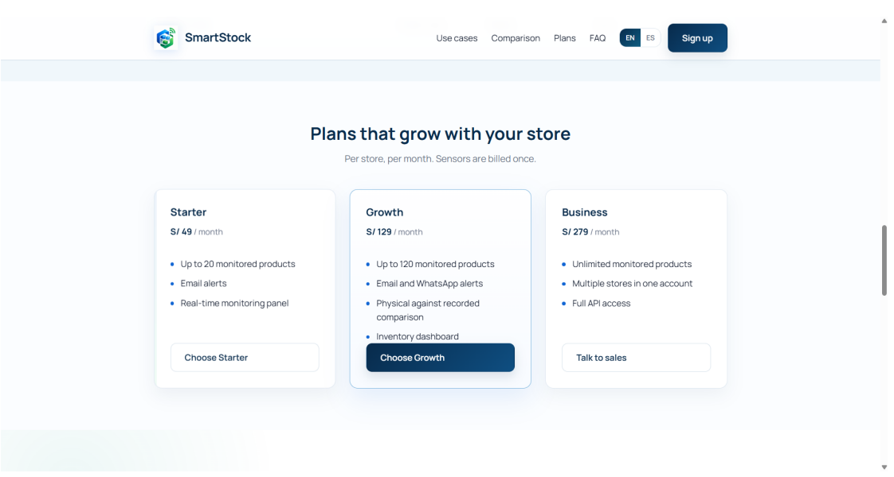

##### Testimonios de clientes (US22)

La sección de testimonios presenta las opiniones recogidas durante las entrevistas, cada una acompañada de una valoración y de un avatar con las iniciales del entrevistado. La valoración se expone además mediante `aria-label`, de modo que un lector de pantalla anuncie la calificación en lugar de leer una sucesión de símbolos.

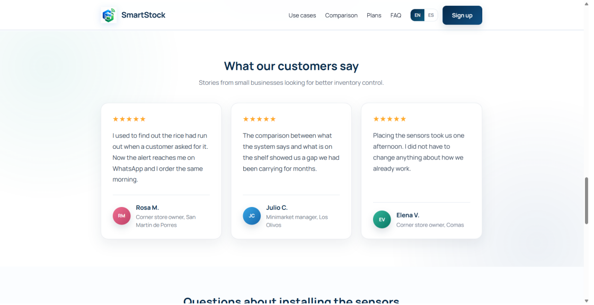

##### Formulario de solicitud de demostración (US20)

El formulario valida los campos obligatorios al abandonar cada campo y expone los mensajes de error mediante `role="alert"`, de modo que un lector de pantalla los anuncie.

Los campos adoptan el radio de esquina y el color de borde definidos en la sección 4.1, y el botón de envío emplea el degradado de marca.

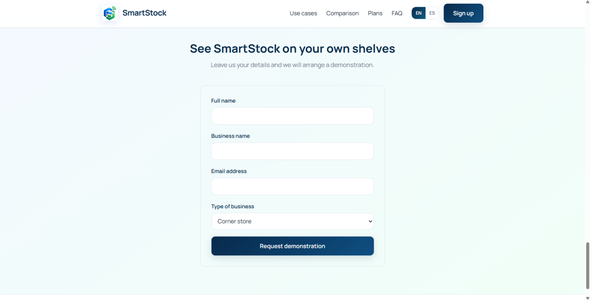

##### Internacionalización de la experiencia (en_US / es_419)

El idioma por defecto del sitio es el inglés, conforme a lo establecido en el enunciado. El sitio no adopta el idioma del navegador en la primera visita, precisamente para que el idioma por defecto del producto sea siempre el inglés; a partir de ahí, la preferencia elegida por el visitante queda registrada en el navegador.

El selector de idioma de la barra superior conmuta toda la experiencia al español latinoamericano, incluyendo el título del documento, los textos de la interfaz, los mensajes de validación del formulario y los atributos `aria-label` de la navegación, del selector de idioma y de la imagen del encabezado principal.

El atributo `lang` del documento se actualiza en cada conmutación, de modo que un lector de pantalla emplee la pronunciación correcta.

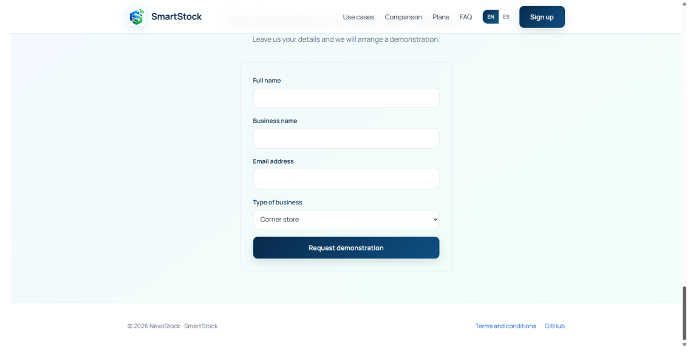

##### Diseño web adaptable (responsive web design)

La experiencia se adapta a las dimensiones del dispositivo cliente. En navegador móvil, las rejillas de tarjetas colapsan a una sola columna, la escala tipográfica de los titulares se reduce y la navegación se repliega tras un botón de menú.

La barra superior conserva en pantallas estrechas únicamente la marca, el selector de idioma y el botón de menú. La acción de crear cuenta se traslada al interior del menú desplegable, de modo que la barra no compita por el ancho disponible y se mantenga el cumplimiento de la regla de negocio de la US24, que establece que la opción de registro está disponible de forma permanente en todas las secciones del sitio web estático.

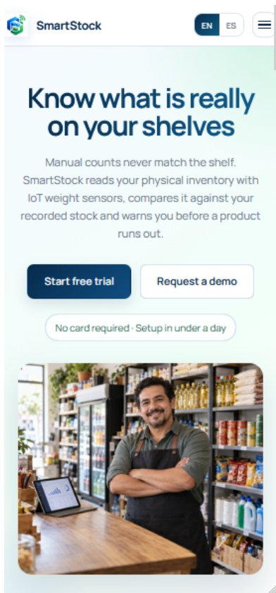

**Landing Page Demonstration Video:**  
SmartStock - Landing Page Review.mp4

#### 5.2.1.6. Services Documentation Evidence for Sprint Review

N/A. Durante el Sprint 1 el esfuerzo de desarrollo se enfocó exclusivamente en la creación del sitio web estático promocional (Landing Page), por lo que aún no se han implementado APIs RESTful ni Endpoints backend que requieran ser documentados a través de Swagger/OpenAPI.

Esta documentación se estructurará a partir del Sprint 2.

#### 5.2.1.7. Software Deployment Evidence for Sprint Review

Durante el Sprint 1, el alcance de despliegue correspondió al Landing Page. El equipo creó el repositorio `smartstock-landing-page` dentro de la organización NexoStock, aplicó sobre él el flujo de trabajo GitFlow e integró la versión `1.0.0` a la rama `main` mediante una release branch.

A continuación, habilitó GitHub Pages tomando como fuente dicha rama y el directorio raíz del repositorio.

| Producto | Repositorio | URL desplegado | Estado |
| --- | --- | --- | --- |
| Landing Page | https://github.com/NexoStock/smartstock-landing-page | https://nexostock.github.io/smartstock-landing-page/ | Desplegado |
| Frontend Web Application | Pendiente de despliegue. | — | Fuera del alcance del Sprint 1 |
| Web Services | Pendiente de despliegue. | — | Fuera del alcance del Sprint 1 |

La configuración aplicada en el repositorio se muestra a continuación. La fuente de publicación es la rama `main` y el directorio raíz, y GitHub confirma la publicación del sitio.

En el selector de ramas se aprecian además las ramas `main` y `develop`, que evidencian la aplicación de GitFlow sobre el repositorio.

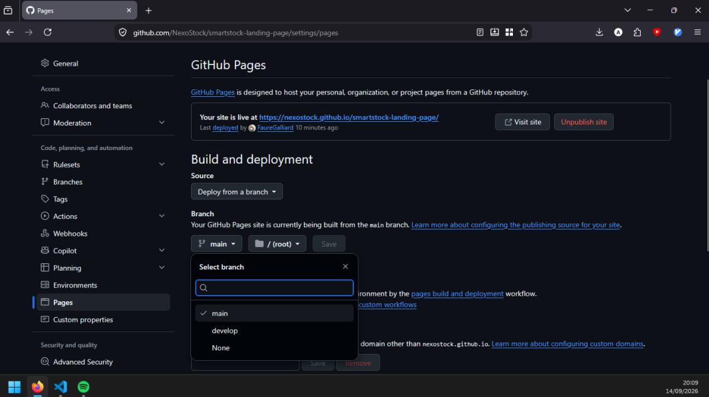

Se verificó que el sitio publicado responde correctamente tanto en la página de inicio como en la página de términos y condiciones, y que la hoja de estilos y el archivo de comportamiento se sirven sin errores.

#### 5.2.1.8. Team Collaboration Insights during Sprint

Durante el Sprint 1, el equipo organizó la implementación del Landing Page según los aspectos definidos en la sección 5.2.1.2. Cada integrante trabajó sobre el aspecto que lideraba y registró su aporte mediante commits propios en el repositorio `smartstock-landing-page`, aplicando GitFlow y Conventional Commits.

El flujo de trabajo seguido fue el siguiente: la rama `develop` concentró el avance acumulado, cada conjunto de cambios se desarrolló en una rama `feature/` que se integró a `develop` sin avance rápido (`--no-ff`), de modo que el historial conserve visible el punto de integración de cada aporte, y las versiones entregadas se publicaron desde `main` mediante ramas `release/` etiquetadas con versionado semántico.

##### Analíticos de colaboración del repositorio del Landing Page

La vista de contribuyentes evidencia la participación de los cinco integrantes del equipo, con el detalle de commits y de líneas agregadas y eliminadas por cada uno.

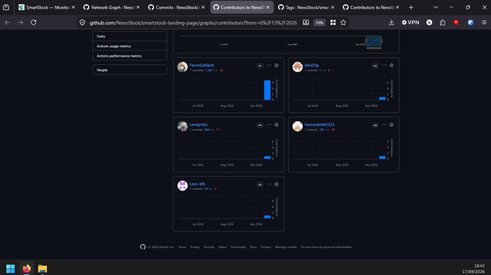

##### Historial de ramas del repositorio

El grafo de red muestra la aplicación efectiva de GitFlow: las ramas de feature nacen de `develop`, se integran nuevamente a ella y la rama `main` recibe únicamente las versiones publicadas.

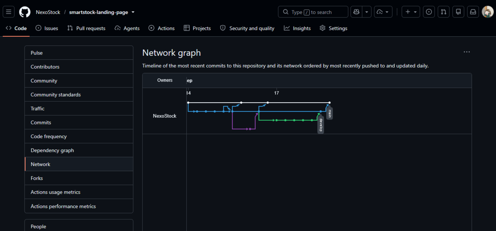 

### 5.2.2. Sprint 2

#### 5.2.2.1. Sprint Planning 2

**Tabla 35**  
*Sprint Planning 2 del equipo NexoStock*

| Campo | Detalle |
| --- | --- |
| Sprint # | 2 |
| Date | 2026-10-01 |
| Time | 02:00 PM |
| Location | Reunión virtual |
| Prepared By | Montañez Salinas, Lorena Ariana |
| Attendees | Crispin Valdivia, Angel Gabriel; Lopez Rimachi, Sebastian Leonardo; Montañez Salinas, Lorena Ariana; Tuesta Girón, Kiara Lucia; Vizcarra Mamani, Candy Milagros |
| Sprint 1 – Review Summary | Durante el Sprint 1 se implementó y desplegó la primera versión del Landing Page (versión 1.0.0) en GitHub Pages, cubriendo las User Stories US16 a US24. Aunque las historias se implementaron, durante la revisión se identificaron deficiencias en algunas de ellas. Entre las principales correcciones pendientes están ajustar las URLs de despliegue registradas en la sección 5.2.1.7, que mostraban error al abrirse, y hacer que el Landing Page cambie la moneda mostrada al seleccionar el idioma inglés. Ambas correcciones se incorporan al Sprint 2 junto con la actualización del Landing Page, cuyo botón de registro pasa a redirigir a la aplicación web desplegada. |
| Sprint 1 – Retrospective Summary | Durante el Sprint 1 funcionó bien la aplicación de GitFlow, con ramas de feature integradas a develop y la versión 1.0.0 publicada desde main mediante una release branch, así como el uso de Conventional Commits en los mensajes de commit y la organización del trabajo en Trello. Como aspecto a mejorar, el equipo identificó la necesidad de verificar las URLs y el comportamiento multilenguaje del Landing Page antes de cada entrega. |
| Sprint 2 Goal | Our focus is on delivering the core web application of SmartStock: sales and purchases registration that moves stock, plus account access, product catalog, sensor linking, real-time stock monitoring and low-stock alerts. We believe it lets minimarket and bodega owners record what comes in and goes out of their inventory, verify it against the physical stock measured by IoT sensors, and anticipate restocking. This will be confirmed when each bounded context is navigable and its User Stories meet their acceptance criteria. |
| Sprint 2 Velocity | 84 Story Points (User Stories). Frente a los 20 puntos del Sprint 1 (US16 a US24), limitados al Landing Page estático, el Sprint 2 abarca la Frontend Web Application. El trabajo se reparte entre los cinco integrantes según el bounded context que lideran, con tareas de 3 a 6 horas, e incluye las historias de Compras y Ventas definidas como núcleo del producto. |
| Sum of Story Points | 84 (User Stories: 84; las Technical Stories TS01 a TS15 se incluyen solo como tareas de simulación (mock), sin Story Points) |

*Nota.* Elaboración propia

Para el Sprint 2, el equipo acordó los siguientes puntos:

(1) Definir primero las historias de Compras y Ventas, por ser el núcleo del producto, antes de construir sus pantallas.

(2) Identificar las historias como US (User Stories) y TS (Technical Stories) y las tareas como `T-US##` y `T-TS##`.

(3) Trabajar cada tarea en una rama corta `feature/<contexto>-<tarea>` creada desde develop e integrada mediante pull request con merge commit (`--no-ff`), sin commits directos en main ni en develop.

(4) No modificar archivos compartidos (rutas, estilos, menú, modelos) sin avisar al equipo.

(5) Usar datos simulados con json-server (Fake API) mientras el Web Service real no esté disponible.

(6) Actualizar el Landing Page para que el registro redirija a la Frontend Web Application desplegada, en lugar de apuntar a una dirección local.

El Sprint Goal se redactó en inglés siguiendo el formato de la plantilla, y la velocidad se calculó sobre las 23 User Stories que no pertenecen al Landing Page, que suman 84 Story Points. Las Technical Stories pasan al Sprint 3 junto con los Web Services reales.

#### 5.2.2.2. Aspect Leaders and Collaborators

El alcance del Sprint 2 corresponde a la Frontend Web Application. Sobre esa base, el equipo identificó seis aspectos, correspondientes a los bounded contexts del producto, y designó un líder por cada uno, buscando que cada integrante condujera el área que había elegido y colaborara en las restantes. La designación se refleja en la selección de tasks del Sprint Backlog y en la autoría de los commits del repositorio.

Los aspectos considerados son: IAM, que cubre el registro, el inicio de sesión y la recuperación de contraseña; IoT Device, que cubre la vinculación de sensores, su estado de conexión y la recepción de lecturas; Alerts & Restocking, que cubre las notificaciones de stock bajo y las alertas de discrepancia; Product Catalog, que cubre el registro y la edición de productos y la configuración del umbral mínimo; Inventory Monitoring, que cubre el peso actual, el listado por nivel de stock, la comparación entre inventario físico y registrado, y el registro de ventas, compras y proveedores con sus movimientos de stock; y Analytics & Reporting, que cubre el dashboard y los reportes de consumo y movimientos.

**Tabla 36**  
*Matriz de líderes (L) y colaboradores (C) por aspecto del Sprint 2*

| Team Member (Last Name, First Name) | GitHub Username | IAM | IoT Device | Alerts & Restocking | Product Catalog | Inventory Monitoring | Analytics & Reporting |
| --- | --- | --- | --- | --- | --- | --- | --- |
| Crispin Valdivia, Angel Gabriel | @FaureGalliard | C | L | C | C | C | C |
| Lopez Rimachi, Sebastian Leonardo | @leonardoXd1323 | C | C | L | C | C | C |
| Montañez Salinas, Lorena Ariana | @Lore-MS | L | C | C | C | C | C |
| Tuesta Girón, Kiara Lucia | @kitu05g | C | C | C | C | L | L |
| Vizcarra Mamani, Candy Milagros | @candyvizz | C | C | C | L | C | C |

*Nota.* Elaboración propia

Según la matriz, Lorena lidera IAM; Ángel, IoT Device; Sebastián, Alerts & Restocking; Candy, Product Catalog; y Kiara, Inventory Monitoring y Analytics & Reporting. Además, las pantallas y servicios de ventas, compras y proveedores se desarrollaron en colaboración entre IAM, Product Catalog y Alerts & Restocking, como colaboradores del bounded context Inventory Monitoring: las ventas las implementó Lorena y las compras y proveedores, Candy.

#### 5.2.2.3. Sprint Backlog 2

El Sprint 2 contiene las 23 User Stories que no son del Landing Page (84 Story Points). Las Technical Stories TS01 a TS15 pasan al Sprint 3 con los Web Services reales; en este sprint solo se incluyen sus tareas de simulación (mock), marcadas "(mock)" y sin Story Points propios. El tablero está en Trello: https://trello.com/invite/b/6ac18a7abca5e0a5a2507958/ATTI5da625d2f61dff20dbdf0a2396f6b06f27A47625/sprint-backlog-2-source. La Figura 161 muestra el board del Sprint 2.

**Figura 161**  
*Board del Sprint 2 en Trello*

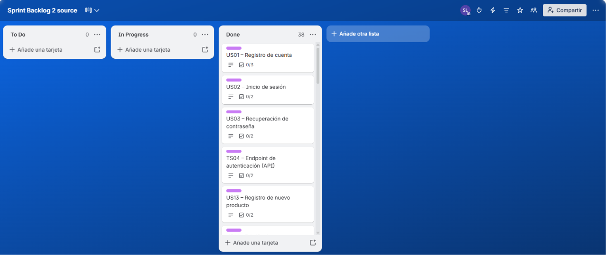

*Nota.* Elaboración propia

La carga de trabajo se distribuyó entre los cinco integrantes según el bounded context que lideran, como se muestra en la Tabla 37.

**Tabla 37**  
*Distribución de Story Points del Sprint 2 por integrante*

| Integrante | Contexto | User Stories | Story Points |
| --- | --- | --- | --- |
| Lorena | IAM y pantallas de Ventas | US01, US02, US03, US26, US27, US28 | 21 |
| Ángel | IoT Device (+ setup compartido y mock server) | US04, US06 | 8 |
| Sebastián | Alerts & Restocking | US09, US10, US12, US32 | 16 |
| Candy | Product Catalog, Proveedores y Compras | US05, US13, US14, US29, US30, US31 | 18 |
| Kiara | Inventory Monitoring y Analytics & Reporting | US07, US08, US11, US15, US25 | 21 |
| Total |  |  | 84 |

*Nota.* Elaboración propia

Las tareas se identifican como ``T-US##`.#` (historias de usuario), ``T-TS##`.#` (contratos de la Fake API, sin puntos) y `T-SH.#` (setup compartido de Ángel, sin historia). El detalle de cada tarea se presenta en la Tabla 38; todas finalizaron en estado Done.

**Tabla 38**  
*Sprint Backlog 2: historias, tareas, estimación y responsable*

| Sprint # | Story Id | Story Title | Task Id | Task Title | Task Description | Estimation (Hours) | Assigned To | Status |
| --- | --- | --- | --- | --- | --- | --- | --- | --- |
| 2 | Soporte | Setup compartido | T-SH.1 | Separar traducciones por contexto y ampliar el entorno | Una carpeta de traducciones por bounded context y endpoints del Sprint 2 en el environment. | 4 | Ángel | Done |
| 2 | Soporte | Setup compartido | T-SH.2 | Helpers y componentes compartidos | Helpers de error y rango de fechas; alert banner, summary card y page header; estilos compartidos. | 6 | Ángel | Done |
| 2 | Soporte | Setup compartido | T-SH.3 | Modelo de movimiento de stock | Entidad StockMovement (R17) usada por ventas, compras y reportes. | 4 | Ángel | Done |
| 2 | TS14 | Registro automático de movimientos (mock) | T-TS14.1 | Motor de movimientos y reglas de alerta del mock | Movimientos de stock, reglas de alerta R19–R21 y proyección de producto con estado del sensor. | 6 | Ángel | Done |
| 2 | TS01 | Recepción de lecturas (mock) | T-TS01.1 | Mock POST /sensores/{id}/lecturas | Servidor json-server con token, rutas automáticas y simulador IoT. | 5 | Ángel | Done |
| 2 | TS05 | Estado de sensor (mock) | T-TS05.1 | Mock GET /sensores/{id}/estado | Estado en línea/desconectado (R11) y endpoints de vinculación. | 4 | Ángel | Done |
| 2 | US04 | Vinculación de sensor IoT a un producto | T-US04.1 | Diseñar vista de vinculación | Sensores disponibles, flujo de vinculación y caso de sensor ya vinculado. | 5 | Ángel | Done |
| 2 | US04 | Vinculación de sensor IoT a un producto | T-US04.2 | Modelo, API y store de dispositivos | Entidades Sensor y LinkableProduct, DevicesApi y store (R9). | 6 | Ángel | Done |
| 2 | US04 | Vinculación de sensor IoT a un producto | T-US04.3 | Validar sensor ya en uso | Rechazar vinculación e indicar que el sensor ya está en uso. | 3 | Ángel | Done |
| 2 | US06 | Estado de conexión de sensores | T-US06.1 | Vista de listado de estado | Lista de sensores con estado en línea o desconectado. | 4 | Ángel | Done |
| 2 | US06 | Estado de conexión de sensores | T-US06.2 | Regla de 5 minutos | Desconectado si no hay lecturas en 5 minutos (R11). | 3 | Ángel | Done |
| 2 | US01 | Registro de cuenta | T-US01.1 | Formulario de registro | Datos del negocio y selector de tipo de negocio. | 5 | Lorena | Done |
| 2 | US01 | Registro de cuenta | T-US01.2 | Validaciones y correo repetido | Validar campos y mostrar error de correo ya registrado. | 4 | Lorena | Done |
| 2 | US01 | Registro de cuenta | T-US01.3 | Estado de registro exitoso | Mensaje de éxito y redirección. | 3 | Lorena | Done |
| 2 | US02 | Inicio de sesión | T-US02.1 | Vista de login | Formulario con mensaje de error genérico (R3). | 4 | Lorena | Done |
| 2 | US02 | Inicio de sesión | T-US02.2 | Modelo, API y store de IAM | UserSession, IamApi y store con signIn y signUp. | 6 | Lorena | Done |
| 2 | TS04 | Login (mock) | T-TS04.1 | Mock POST /auth/login | Endpoints de login, registro y recuperación en el mock. | 4 | Lorena | Done |
| 2 | US03 | Recuperación de contraseña | T-US03.1 | Formulario de recuperación | Solicitud con el mismo mensaje neutro para cualquier correo. | 4 | Lorena | Done |
| 2 | US03 | Recuperación de contraseña | T-US03.2 | Nueva contraseña y enlace vencido | Pantalla de nueva contraseña y caso de enlace expirado. | 4 | Lorena | Done |
| 2 | US26 | Registro de venta | T-US26.1 | Formulario de nueva venta | Productos, cantidades y total. | 6 | Lorena | Done |
| 2 | US26 | Registro de venta | T-US26.2 | Modelo y API de ventas | Sale, SaleItem, SaleProductOption y SalesApi. | 5 | Lorena | Done |
| 2 | US26 | Registro de venta | T-US26.3 | Store y validaciones de stock | Store de ventas; stock suficiente (R13) y producto sin precio (R14). | 5 | Lorena | Done |
| 2 | US27 | Historial de ventas | T-US27.1 | Listado de ventas | Lista con total del período. | 4 | Lorena | Done |
| 2 | US27 | Historial de ventas | T-US27.2 | Filtro por fechas y período vacío | Filtro por rango y estado vacío. | 3 | Lorena | Done |
| 2 | US28 | Detalle de una venta | T-US28.1 | Vista de detalle de venta | Detalle con los movimientos de stock generados. | 4 | Lorena | Done |
| 2 | TS07 | Registro de ventas (mock) | T-TS07.1 | Mock POST /ventas | Cada venta crea movimientos de salida (R17). | 4 | Lorena | Done |
| 2 | TS08 | Consulta de ventas (mock) | T-TS08.1 | Mock GET /ventas y /ventas/{id} | Listado y detalle de ventas. | 3 | Lorena | Done |
| 2 | US09 | Notificación por correo de stock bajo | T-US09.1 | Vista de configuración de notificaciones | Canal correo electrónico y textos en inglés y español. | 5 | Sebastián | Done |
| 2 | US09 | Notificación por correo de stock bajo | T-US09.2 | Store de alertas | Store con alertas y preferencias. | 4 | Sebastián | Done |
| 2 | US09 | Notificación por correo de stock bajo | T-US09.3 | Modelo y API de alertas | Alert, resource, assembler y AlertsApi. | 5 | Sebastián | Done |
| 2 | US10 | Notificación por WhatsApp de stock bajo | T-US10.1 | Canal WhatsApp en configuración | Preferencia de canal y número de WhatsApp. | 4 | Sebastián | Done |
| 2 | TS03 | Notificación de stock bajo (mock) | T-TS03.1 | Mock POST /notificaciones/stock-bajo | Endpoint de notificaciones en alerts.js. | 4 | Sebastián | Done |
| 2 | TS14 | Registro automático de movimientos (mock) | T-TS14.2 | Mock de alertas con movimientos | Alertas activas ligadas a los movimientos de stock. | 3 | Sebastián | Done |
| 2 | TS15 | Consulta de movimientos (mock) | T-TS15.1 | Mock GET /movimientos-stock | Listado de movimientos. | 3 | Sebastián | Done |
| 2 | US12 | Alerta por discrepancia de inventario | T-US12.2 | Lista de alertas activas | Alertas con discrepancia mayor al 10 %. | 5 | Sebastián | Done |
| 2 | US32 | Registro de compra desde una alerta de stock bajo | T-US32.1 | Botón de compra en la alerta | Acción desde la alerta de stock bajo. | 3 | Sebastián | Done |
| 2 | US32 | Registro de compra desde una alerta de stock bajo | T-US32.2 | Precarga de producto y proveedor | Enviar producto y proveedor al formulario de compra. | 4 | Sebastián | Done |
| 2 | US32 | Registro de compra desde una alerta de stock bajo | T-US32.3 | Marcar necesidad atendida | Actualizar el estado de la alerta tras registrar la compra. | 3 | Sebastián | Done |
| 2 | US13 | Registro de nuevo producto | T-US13.1 | Formulario de producto | Validaciones, precio de venta opcional y banner de error. | 5 | Candy | Done |
| 2 | US13 | Registro de nuevo producto | T-US13.2 | Modelo, API y store de catálogo | Product, CatalogApi y store (R5, R7). | 6 | Candy | Done |
| 2 | TS13 | Modelo de datos: productos (mock) | T-TS13.2 | Mock de productos (GET/POST/PUT /productos) | Validaciones R5 y R7 en el mock. | 4 | Candy | Done |
| 2 | US14 | Edición de producto | T-US14.1 | Formulario de edición | Precio de venta, costo de compra y proveedor habitual. | 4 | Candy | Done |
| 2 | US14 | Edición de producto | T-US14.2 | Stock de solo lectura | El stock solo cambia por movimientos (R17). | 3 | Candy | Done |
| 2 | US05 | Configuración de umbral mínimo de stock | T-US05.1 | Vista de umbral mínimo | Formulario por producto con sensor. | 4 | Candy | Done |
| 2 | US05 | Configuración de umbral mínimo de stock | T-US05.2 | Validar capacidad máxima | Rechazar umbral mayor a la capacidad (R7). | 3 | Candy | Done |
| 2 | US29 | Registro de proveedor | T-US29.1 | Formulario y listado de proveedores | Alta y lista de proveedores. | 5 | Candy | Done |
| 2 | US29 | Registro de proveedor | T-US29.2 | Proveedor duplicado | Error por proveedor repetido (R8). | 3 | Candy | Done |
| 2 | US30 | Registro y recepción de compra | T-US30.1 | Formulario de nueva compra | Productos, total y precarga desde reposición. | 6 | Candy | Done |
| 2 | US30 | Registro y recepción de compra | T-US30.2 | Modelo y API de compras | Purchase, PurchaseItem, Supplier y PurchasesApi. | 5 | Candy | Done |
| 2 | US30 | Registro y recepción de compra | T-US30.3 | Detalle y recepción | Recepción de mercadería que crea movimientos de entrada. | 6 | Candy | Done |
| 2 | US30 | Registro y recepción de compra | T-US30.4 | Store de compras | Compras, proveedores y recepción (R15, R16). | 4 | Candy | Done |
| 2 | US31 | Historial de compras | T-US31.1 | Listado de compras | Lista con filtro por fechas. | 4 | Candy | Done |
| 2 | US31 | Historial de compras | T-US31.2 | Estado vacío | Mensaje cuando no hay compras en el período. | 3 | Candy | Done |
| 2 | TS09 | Proveedores (mock) | T-TS09.1 | Mock POST/GET /proveedores | Alta y consulta de proveedores. | 3 | Candy | Done |
| 2 | TS10 | Registro de compras (mock) | T-TS10.1 | Mock POST /compras | Alta de compras. | 3 | Candy | Done |
| 2 | TS11 | Recepción de compras (mock) | T-TS11.1 | Mock PATCH /compras/{id}/recepcion | Recepción con movimientos de entrada. | 3 | Candy | Done |
| 2 | TS12 | Consulta de compras (mock) | T-TS12.1 | Mock GET /compras y /compras/{id} | Listado y detalle. | 3 | Candy | Done |
| 2 | US15 | Dashboard de inventario | T-US15.1 | Vista de dashboard | Tarjetas de resumen y Home de bodega. | 6 | Kiara | Done |
| 2 | US15 | Dashboard de inventario | T-US15.2 | Tarjetas de ventas y compras del día | Totales del día en el dashboard. | 4 | Kiara | Done |
| 2 | US15 | Dashboard de inventario | T-US15.3 | Modelo, API y store de analítica | DashboardSummary, Report y AnalyticsApi. | 5 | Kiara | Done |
| 2 | US15 | Dashboard de inventario | T-US15.4 | Traducciones y estados vacíos | Textos en inglés y español. | 3 | Kiara | Done |
| 2 | US15 | Dashboard de inventario | T-US15.5 | Mock GET /dashboard y /reportes | Reportes solo para minimarket. | 4 | Kiara | Done |
| 2 | US25 | Reportes de consumo y movimientos | T-US25.1 | Selector de período | Rango de fechas del reporte. | 3 | Kiara | Done |
| 2 | US25 | Reportes de consumo y movimientos | T-US25.2 | Reporte de consumo | Consumo por producto. | 5 | Kiara | Done |
| 2 | US25 | Reportes de consumo y movimientos | T-US25.3 | Movimientos con ventas y compras | Tabla de movimientos con ventas y compras. | 5 | Kiara | Done |
| 2 | US25 | Reportes de consumo y movimientos | T-US25.4 | Reporte sin datos | Estado vacío del período. | 3 | Kiara | Done |
| 2 | US11 | Comparación inventario físico vs. registrado | T-US11.1 | Vista de comparación | Peso del sensor frente al stock registrado. | 6 | Kiara | Done |
| 2 | US11 | Comparación inventario físico vs. registrado | T-US11.3 | Resaltar discrepancia | Diferencia mayor al 10 % resaltada. | 4 | Kiara | Done |
| 2 | US11 | Comparación inventario físico vs. registrado | T-US11.4 | Modelo, API y store de stock | Comparison, SensorReading y StockApi. | 5 | Kiara | Done |
| 2 | TS02 | Consulta de stock (mock) | T-TS02.1 | Mock GET /productos/{id}/stock | Stock y detalle de producto. | 3 | Kiara | Done |
| 2 | TS06 | Comparación de inventario (mock) | T-TS06.1 | Mock GET /inventario/comparacion/{productoId} | Comparación con ventas y compras. | 3 | Kiara | Done |
| 2 | US08 | Listado de productos por nivel de stock | T-US08.1 | Listado con búsqueda | Búsqueda y columna de sensor. | 4 | Kiara | Done |
| 2 | US08 | Listado de productos por nivel de stock | T-US08.2 | Filtro por nivel de stock | Bajo, normal o sin datos. | 3 | Kiara | Done |
| 2 | US08 | Listado de productos por nivel de stock | T-US08.3 | Columna de stock registrado | Stock actualizado por movimientos. | 3 | Kiara | Done |
| 2 | US07 | Visualización del peso actual de un producto | T-US07.1 | Detalle con peso actual | Peso del sensor y unidades equivalentes. | 4 | Kiara | Done |
| 2 | US07 | Visualización del peso actual de un producto | T-US07.2 | Últimas cinco lecturas | Historial corto de lecturas. | 3 | Kiara | Done |

*Nota.* Elaboración propia

#### 5.2.2.4. Development Evidence for Sprint Review

Durante el Sprint 2 se implementó la Frontend Web Application de SmartStock en el repositorio NexoStock/smartstock-frontend, con las vistas y servicios de IAM, IoT Device, Alerts & Restocking, Product Catalog, Inventory Monitoring (incluidas ventas, compras y proveedores) y Analytics & Reporting. Cada tarea del Sprint Backlog se desarrolló en una rama `feature/<contexto>-<tarea>` creada desde develop e integrada mediante pull request con merge commit.

A continuación se presenta la tabla de commits relacionados con la implementación, organizados por rama según el orden de integración del equipo y redactados bajo la convención de Conventional Commits, en inglés y en minúsculas, con el identificador de la tarea (por ejemplo T-US02.2) en el cuerpo del mensaje.

**Tabla 39**  
*Commits del Sprint 2 en el repositorio smartstock-frontend*

| Repository | Branch | Commit Id | Commit Message | Commit Message Body | Committed on (Date) |
| --- | --- | --- | --- | --- | --- |
| NexoStock/smartstock-frontend | `feature/shared-sprint2-setup` | `0b89e88` | `chore(shared): split translations per bounded context` | Replace the single en/es files with one folder per bounded context so each owner edits only their own translations.  Empty placeholders are replaced by each owner in their first branch.  Shared files change: team notified. | 04/10/2026 |
| NexoStock/smartstock-frontend | `feature/shared-sprint2-setup` | `ec54965` | `chore(shared): add sprint 2 endpoints to environment` | Add notifications, comparison, dashboard and reports endpoints.  Shared files change: team notified. | 04/10/2026 |
| NexoStock/smartstock-frontend | `feature/shared-sprint2-setup` | `c0e5957` | `feat(shared): add api error and date range helpers` | Add apiError/apiCode and the DateRange value helpers used by sales, purchases and reports.  Shared files change: team notified. | 04/10/2026 |
| NexoStock/smartstock-frontend | `feature/shared-sprint2-setup` | `266332a` | `feat(shared): add alert banner, summary card and page header` | Add reusable presentation components used by the sprint 2 views.  Shared files change: team notified. | 04/10/2026 |
| NexoStock/smartstock-frontend | `feature/shared-sprint2-setup` | `5018a72` | `refactor(shared): extend date range filter and status tag` | Add the initial input to the date range filter and new status tones.  Add shared card, form and table styles.  Shared files change: team notified. | 04/10/2026 |
| NexoStock/smartstock-frontend | `feature/shared-sprint2-setup` | `ecc15c1` | `feat(inventory): add stock movement model` | Add the StockMovement entity, resource and assembler (R17: stock only moves through movements).  Used by sales, purchases and reports. | 04/10/2026 |
| NexoStock/smartstock-frontend | `feature/shared-mock-server` | `a24c988` | `chore(shared): add json-server mock backend skeleton` | Add server.js with bearer token check, hidden users and automatic route loading.  Add helpers, seed markers and in-memory db.  Add server and server:sim scripts.  Shared files change: team notified. | 04/10/2026 |
| NexoStock/smartstock-frontend | `feature/shared-mock-server` | `d32e0fb` | `feat(shared): add stock movement, alert rules and product view for the mock` | Add the stock movement engine (R17), alert rules (R19-R21) and the product projection with sensor state.  Refs: T-TS14.1 | 04/10/2026 |
| NexoStock/smartstock-frontend | `feature/shared-mock-server` | `63660b3` | `feat(devices): add sensor readings and status mock endpoints` | POST /sensores/:id/lecturas, GET /sensores/:id/estado, link and unlink endpoints plus the IoT simulator.  Refs: T-TS01.1, T-TS05.1 | 04/10/2026 |
| NexoStock/smartstock-frontend | `feature/shared-mock-server` | `412f90f` | `chore(shared): point the production build to the fake api on render` | The json-server Fake API runs as a Render web service and serves its routes at the root, so the base url has no /api suffix. | 04/10/2026 |
| NexoStock/smartstock-frontend | `feature/catalog-register-product` | `7d1b23c` | `feat(catalog): add product model and api layer` | Product entity (nullable sale price, sensor state, stock level), resource, assembler and CatalogApi with the threshold target.  Task: T-US13.2 | 04/10/2026 |
| NexoStock/smartstock-frontend | `feature/catalog-register-product` | `50e28f2` | `feat(catalog): add catalog store` | Signals store: fetchProducts, fetchProduct, create, update, categories and threshold target (R5, R7).  Task: T-US13.2 | 04/10/2026 |
| NexoStock/smartstock-frontend | `feature/catalog-register-product` | `4072ec8` | `feat(catalog): add catalog translations` | English and Spanish texts of the product forms and the threshold view.  Task: T-US13.1 | 04/10/2026 |
| NexoStock/smartstock-frontend | `feature/catalog-register-product` | `431b5b7` | `feat(catalog): add register product view` | Product form with validations, optional sale price and error banner (M29, M30).  Tasks: T-US13.1, T-US13.2 | 04/10/2026 |
| NexoStock/smartstock-frontend | `feature/catalog-register-product` | `e7953c0` | `feat(catalog): add catalog mock endpoints` | GET/POST/PUT /productos and PUT /sensores/:id/umbral with R5 and R7 validations.  Refs: T-TS13.2 | 04/10/2026 |
| NexoStock/smartstock-frontend | `feature/inventory-purchases` | `39d3953` | `feat(inventory): add purchase and supplier model and api layer` | Add Purchase, PurchaseItem, Supplier and PurchaseProductOption, resources, assemblers and PurchasesApi.  Task: T-US30.2 | 04/10/2026 |
| NexoStock/smartstock-frontend | `feature/inventory-purchases` | `34a0d6e` | `feat(inventory): add purchases store` | Signals store for purchases, suppliers and goods receipt (R15, R16).  Task: T-US30.4 | 04/10/2026 |
| NexoStock/smartstock-frontend | `feature/inventory-purchases` | `64b596b` | `feat(inventory): add purchases translations` | English and Spanish texts of purchases and suppliers.  Task: T-US29.1 | 04/10/2026 |
| NexoStock/smartstock-frontend | `feature/inventory-purchases` | `2859f47` | `feat(inventory): add supplier list view` | Supplier form and list with duplicate supplier error (R8) (M7, M7A, M8, M7B).  Tasks: T-US29.1, T-US29.2 | 04/10/2026 |
| NexoStock/smartstock-frontend | `feature/inventory-purchases` | `962589d` | `feat(inventory): add purchase list view` | Purchase list with date filter and empty state (M1, M2).  Tasks: T-US31.1, T-US31.2 | 04/10/2026 |
| NexoStock/smartstock-frontend | `feature/inventory-purchases` | `121ead9` | `feat(inventory): add new purchase view` | Purchase form with total, validations and prefill from a restocking need (M3, M4, M16).  Tasks: T-US30.1, T-US30.2, T-US30.4 | 04/10/2026 |
| NexoStock/smartstock-frontend | `feature/inventory-purchases` | `4a61812` | `feat(inventory): add purchase details view` | Purchase detail and goods receipt that creates IN movements (M5, M5A, M6, M6A).  Task: T-US30.3 | 04/10/2026 |
| NexoStock/smartstock-frontend | `feature/inventory-purchases` | `2823ad9` | `feat(inventory): add purchases and suppliers mock endpoints` | POST/GET /compras, PATCH /compras/:id/recepcion, POST/GET /proveedores.  Refs: T-TS09.1, T-TS10.1, T-TS11.1, T-TS12.1 | 04/10/2026 |
| NexoStock/smartstock-frontend | `feature/catalog-edit-product` | `d30c159` | `feat(catalog): add edit product view` | Edit product data while keeping registered stock read-only (M19, R17).  Tasks: T-US14.1, T-US14.2 | 04/10/2026 |
| NexoStock/smartstock-frontend | `feature/catalog-edit-product` | `887fbd1` | `feat(catalog): add edit product view` | Edit form with sale price, purchase cost and usual supplier; stock is read-only (R17) (M19).  Tasks: T-US14.1, T-US14.2 | 04/10/2026 |
| NexoStock/smartstock-frontend | `feature/catalog-min-threshold` | `37a6a9b` | `feat(catalog): add minimum threshold view` | Threshold form bounded by the maximum capacity (R7) with the exceeds banner (M34, M35).  Tasks: T-US05.1, T-US05.2 | 04/10/2026 |
| NexoStock/smartstock-frontend | `feature/devices-sensor-linking` | `9f76d3b` | `feat(devices): add sensor domain model and api layer` | Add Sensor and LinkableProduct entities, resources, assembler and DevicesApi.  Task: T-US04.2 | 04/10/2026 |
| NexoStock/smartstock-frontend | `feature/devices-sensor-linking` | `55968ae` | `feat(devices): add devices store` | Signals store with fetchSensors, fetchLinkable and link (R9: one sensor, one product).  Task: T-US04.2 | 04/10/2026 |
| NexoStock/smartstock-frontend | `feature/devices-sensor-linking` | `e61b9ee` | `feat(devices): add devices translations` | English and Spanish texts of the IoT Device views.  Task: T-US04.1 | 04/10/2026 |
| NexoStock/smartstock-frontend | `feature/devices-sensor-linking` | `01c3191` | `feat(devices): add sensor linking view` | Available sensors and link flow, with the already linked sensor case (M32, M33).  Tasks: T-US04.1, T-US04.2, T-US04.3 | 04/10/2026 |
| NexoStock/smartstock-frontend | `feature/devices-sensor-status` | `93c2859` | `feat(devices): add sensor status list view` | List sensors with online/disconnected state; offline after 5 minutes without readings (R11).  Tasks: T-US06.1, T-US06.2 | 04/10/2026 |
| NexoStock/smartstock-frontend | `feature/analytics-dashboard` | `e63c75f` | `feat(analytics): add dashboard and report model and api layer` | Add DashboardSummary and Report entities, resources, assembler and AnalyticsApi.  Task: T-US15.3 | 05/10/2026 |
| NexoStock/smartstock-frontend | `feature/analytics-dashboard` | `e386af8` | `feat(analytics): add analytics store` | Signals store for the dashboard summary and the reports.  Task: T-US15.3 | 05/10/2026 |
| NexoStock/smartstock-frontend | `feature/analytics-dashboard` | `0adeea7` | `feat(analytics): add analytics translations` | English and Spanish texts of the dashboard and reports.  Task: T-US15.1 | 05/10/2026 |
| NexoStock/smartstock-frontend | `feature/analytics-dashboard` | `b118d27` | `feat(analytics): add dashboard view` | Summary cards including sales and purchases of the day; Home for bodega accounts (M17).  Tasks: T-US15.1, T-US15.2, T-US15.4 | 05/10/2026 |
| NexoStock/smartstock-frontend | `feature/analytics-dashboard` | `ae88276` | `feat(analytics): add dashboard and reports mock endpoints` | GET /dashboard and GET /reportes (minimarket only for reports).  Refs: T-US15.5 | 05/10/2026 |
| NexoStock/smartstock-frontend | `feature/analytics-dashboard` | `dcc60ff` | `feat(analytics): add dashboard and reports mock endpoints` | — | 05/10/2026 |
| NexoStock/smartstock-frontend | `feature/inventory-comparison` | `cf9f4db` | `feat(inventory): add stock comparison model and api layer` | Add Comparison and SensorReading entities, resources, assembler and StockApi.  Task: T-US11.4 | 05/10/2026 |
| NexoStock/smartstock-frontend | `feature/inventory-comparison` | `aa1541c` | `feat(inventory): add stock store` | Signals store for the comparison and the product stock detail.  Task: T-US11.4 | 05/10/2026 |
| NexoStock/smartstock-frontend | `feature/inventory-comparison` | `d40b60d` | `feat(inventory): add stock translations` | English and Spanish texts of the comparison, product list and product details.  Task: T-US11.1 | 05/10/2026 |
| NexoStock/smartstock-frontend | `feature/inventory-comparison` | `862f8ad` | `feat(inventory): add stock comparison view` | Sensor vs registered stock with discrepancy over 10 percent highlighted (M39).  Tasks: T-US11.1, T-US11.3 | 05/10/2026 |
| NexoStock/smartstock-frontend | `feature/inventory-comparison` | `19a724f` | `feat(inventory): add stock and comparison mock endpoints` | GET /productos/:id/stock, /productos/:id/detalle and /inventario/comparacion.  Refs: T-TS02.1, T-TS06.1 | 05/10/2026 |
| NexoStock/smartstock-frontend | `feature/inventory-comparison` | `1508e84` | `fix(inventory): fix api url template literals` | — | 05/10/2026 |
| NexoStock/smartstock-frontend | `feature/iam-login` | `ff50cdc` | `feat(iam): add user session model and auth api` | Add UserSession entity, auth resources, assembler and IamApi.  Task: T-US02.2 | 06/10/2026 |
| NexoStock/smartstock-frontend | `feature/iam-login` | `ba4716e` | `feat(iam): add iam store` | Signals store with signIn, signUp and requestPasswordReset (R3 generic credential error).  Task: T-US02.2 | 06/10/2026 |
| NexoStock/smartstock-frontend | `feature/iam-login` | `33eefba` | `feat(iam): add iam translations` | English and Spanish texts of the IAM views.  Task: T-US02.1 | 06/10/2026 |
| NexoStock/smartstock-frontend | `feature/iam-login` | `cb1d457` | `feat(iam): add login view` | Sign-in form with generic error message and redirect by business type (M20, M21).  Tasks: T-US02.1, T-US02.2 | 06/10/2026 |
| NexoStock/smartstock-frontend | `feature/iam-login` | `9705081` | `feat(iam): add auth mock endpoints` | POST /auth/login, /auth/register and /auth/forgot-password for the json-server mock.  Refs: T-TS04.1 | 06/10/2026 |
| NexoStock/smartstock-frontend | `feature/iam-register` | `45bf2d8` | `feat(iam): add registration view` | Registration form with business type toggle, taken email error and success state (M22, M23, M24).  Tasks: T-US01.1, T-US01.2, T-US01.3 | 06/10/2026 |
| NexoStock/smartstock-frontend | `feature/iam-password-recovery` | `1a4eeba` | `feat(iam): add password recovery view` | Reset request form with the same neutral message for any email (M25, M26).  Tasks: T-US03.1, T-US03.2 | 06/10/2026 |
| NexoStock/smartstock-frontend | `feature/analytics-reports` | `315626d` | `feat(analytics): add reports view` | Period selector, consumption and movements report with sales and purchases (M18).  Tasks: T-US25.1, T-US25.2, T-US25.3, T-US25.4 | 06/10/2026 |
| NexoStock/smartstock-frontend | `feature/alerts-email` | `a9e75e3` | `feat(alerts): add alert model and api layer` | Task: T-US09.3 | 06/10/2026 |
| NexoStock/smartstock-frontend | `feature/alerts-email` | `80aa572` | `feat(alerts): add alerts store` | Task: T-US09.2 | 06/10/2026 |
| NexoStock/smartstock-frontend | `feature/alerts-email` | `0bf8397` | `feat(alerts): add alerts translations` | Task: T-US09.1 | 06/10/2026 |
| NexoStock/smartstock-frontend | `feature/alerts-email` | `fce9c4f` | `feat(alerts): add notification settings view` | Tasks: T-US09.1, T-US10.1 | 06/10/2026 |
| NexoStock/smartstock-frontend | `feature/alerts-email` | `f3c9179` | `feat(alerts): add alerts and notifications mock endpoints` | Refs: T-TS03.1, T-TS14.2, T-TS15.1 | 06/10/2026 |
| NexoStock/smartstock-frontend | `feature/inventory-sales` | `7166452` | `feat(inventory): add sale model and api layer` | Add Sale, SaleItem and SaleProductOption (anti-corruption snapshot of the catalog), resources, assembler and SalesApi.  Task: T-US26.2 | 06/10/2026 |
| NexoStock/smartstock-frontend | `feature/inventory-sales` | `119ac81` | `feat(inventory): add sales store` | Signals store for sales list, detail and creation.  Task: T-US26.3 | 06/10/2026 |
| NexoStock/smartstock-frontend | `feature/inventory-sales` | `edfb39c` | `feat(inventory): add sales translations` | English and Spanish texts of the sales views.  Task: T-US26.1 | 06/10/2026 |
| NexoStock/smartstock-frontend | `feature/inventory-sales` | `138695e` | `feat(inventory): add sales list view` | Sales list with date filter, period total and empty period (M9, M10).  Tasks: T-US27.1, T-US27.2 | 06/10/2026 |
| NexoStock/smartstock-frontend | `feature/inventory-sales` | `ec4c9c7` | `feat(inventory): add new sale view` | Sale form with total, stock validation (R13) and no-price product block (R14) (M11, M12, M13).  Tasks: T-US26.1, T-US26.2, T-US26.3 | 06/10/2026 |
| NexoStock/smartstock-frontend | `feature/inventory-sales` | `2789e36` | `feat(inventory): add sale details view` | Sale detail with the generated stock movements (M14).  Task: T-US28.1 | 06/10/2026 |
| NexoStock/smartstock-frontend | `feature/inventory-sales` | `3308f37` | `feat(inventory): add sales mock endpoints` | POST /ventas, GET /ventas and GET /ventas/:id; each sale creates OUT movements (R17).  Refs: T-TS07.1, T-TS08.1 | 06/10/2026 |
| NexoStock/smartstock-frontend | `feature/inventory-stock-weight` | `0ed261b` | `feat(inventory): add product details view with current weight` | Current sensor weight, units and the last five readings (M28).  Tasks: T-US07.1, T-US07.2 | 06/10/2026 |
| NexoStock/smartstock-frontend | `feature/alerts-active-list` | `f1cf0fe` | `feat(alerts): add active alerts list view` | Tasks: T-US12.2, T-US32.1, T-US32.2, T-US32.3 | 06/10/2026 |
| NexoStock/smartstock-frontend | `feature/inventory-product-list` | `2016bb2` | `feat(inventory): add product list view with stock levels` | Search, stock level filter, sensor column and registered stock column (M27).  Tasks: T-US08.1, T-US08.2, T-US08.3 | 06/10/2026 |
| NexoStock/smartstock-frontend | `chore/gitignore-ide` | `e6b3df5` | `chore(shared): ignore ide files` | Task: T-SH.1 | 06/10/2026 |
| NexoStock/smartstock-frontend | `release/1.0.0` | `c0191a3` | `chore(release): point api to production fake api` | Task: T-SH.1 | 06/10/2026 |
| NexoStock/smartstock-frontend | `release/1.0.0` | `0814346` | `chore(release): use relative translations path for github pages` | Task: T-SH.1 | 06/10/2026 |
| NexoStock/smartstock-frontend | `release/1.0.0` | `0fb2331` | `chore(release): add github pages workflow` | Task: T-SH.1 | 06/10/2026 |
| NexoStock/smartstock-frontend | `release/1.0.0` | `735e144` | `chore(release): set version 1.0.0` | Task: T-SH.1 | 06/10/2026 |
| NexoStock/smartstock-landing-page | `feature/signup-frontend-link` | `45c0ab9` | `feat(landing): redirect sign up to deployed frontend` | — | 06/10/2026 |

*Nota.* Elaboración propia

La tabla sigue el orden de integración del equipo: primero feature/shared-sprint2-setup y feature/shared-mock-server, luego los contextos, y al final la rama chore/gitignore-ide y la rama release/1.0.0 con las que se cerró el sprint. En el repositorio del frontend son 21 ramas y 71 commits (se excluyen los commits de merge generados por GitHub al integrar cada pull request, así como el commit inicial de la base del frontend). Los pull requests del sprint van del #1 al #22.

En el repositorio NexoStock/smartstock-landing-page se registró además un commit en la rama feature/signup-frontend-link, que actualiza la variable APP_URL de script.js para que el botón de registro redirija a https://nexostock.github.io/smartstock-frontend. La rama se integró a develop mediante el PR #1 y develop se integró a main mediante el PR #2, con lo que el Landing Page actualizado quedó publicado.

#### 5.2.2.5. Execution Evidence for Sprint Review

En este sprint el frontend alcanzó las vistas de los seis contextos funcionando con datos simulados por la Fake API: registro e inicio de sesión, ventas, productos, proveedores y compras, sensores, alertas, stock, dashboard y reportes. La aplicación está desplegada y accesible en https://nexostock.github.io/smartstock-frontend/ (sección 5.2.2.7), con soporte para inglés y español. Cada captura se rotula con la historia que cubre. El video que muestra la visualización y la navegación logradas en el sprint está en [upc-pre202620-1asi0729-7729-nexostock-product-navigation-sprint-2.mp4](https://upcedupe-my.sharepoint.com/:v:/g/personal/u202421125_upc_edu_pe/IQAKt8LsBsB6TYBsqSsYvpp4ATF62ASTTiT9MA_hCLKuZrk?e=yaJRIY&nav=eyJyZWZlcnJhbEluZm8iOnsicmVmZXJyYWxBcHAiOiJTdHJlYW1XZWJBcHAiLCJyZWZlcnJhbFZpZXciOiJTaGFyZURpYWxvZy1MaW5rIiwicmVmZXJyYWxBcHBQbGF0Zm9ybSI6IldlYiIsInJlZmVycmFsTW9kZSI6InZpZXcifX0%3D).

**Tabla 40**  
*Evidencia de ejecución por contexto e historia de usuario del Sprint 2*

| Contexto | Historia | Ruta | La captura debe mostrar | Figura |
| --- | --- | --- | --- | --- |
| IAM | US01 Registro de cuenta | /sign-up | formulario con tipo de negocio y el error de correo en uso | 162 |
| IAM | US02 Inicio de sesión | /sign-in | login y el mensaje de credenciales incorrectas | 163 |
| IAM | US03 Recuperación de contraseña | /forgot-password | solicitud del enlace y confirmación de envío | 164 |
| Ventas | US26, US27 y US28 | /sales, /sales/new, /sales/:id | venta registrada, rechazo por stock insuficiente, historial por fechas y detalle | 165 |
| IoT Device | US04 Vinculación de sensor | /sensors/link | elección de sensor y producto, y error de sensor en uso | 166 |
| IoT Device | US06 y US07 Estado de conexión | /sensors | sensores en línea y desconectados | 167 |
| Alerts & Restocking | US09 y US10 Notificaciones | /settings | canales de correo y WhatsApp configurados | 168 |
| Alerts & Restocking | US12 y US32 Alertas y compra desde alerta | /alerts | alerta de stock bajo o discrepancia y el botón que abre el registro de compra | 169 |
| Product Catalog | US13, US14 y US05 Productos | /products/new, /products/:id/edit, /sensors/:id/threshold | registro, edición y umbral mínimo con su error de validación | 170 |
| Proveedores y Compras | US29, US30 y US31 | /purchases, /purchases/new, /purchases/suppliers, /purchases/:id | proveedor creado, compra pendiente, compra recibida e historial por fechas | 171 |
| Inventory Monitoring | US07, US08 y US11 | /products, /products/:id, /comparison | niveles de stock, detalle con peso actual y comparación físico vs. registrado | 172 |
| Analytics & Reporting | US15 y US25 | /dashboard, /reports | tarjetas del día con ventas y compras, y reporte por período | 173 |

*Nota.* Elaboración propia

**Figura 162**  
*Registro de cuenta con selección de tipo de negocio y error de correo en uso (US01)*

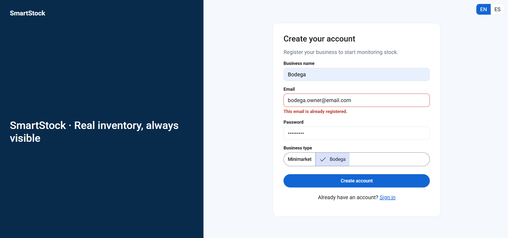

*Nota.* Elaboración propia

**Figura 163**  
*Inicio de sesión con mensaje de credenciales incorrectas (US02)*

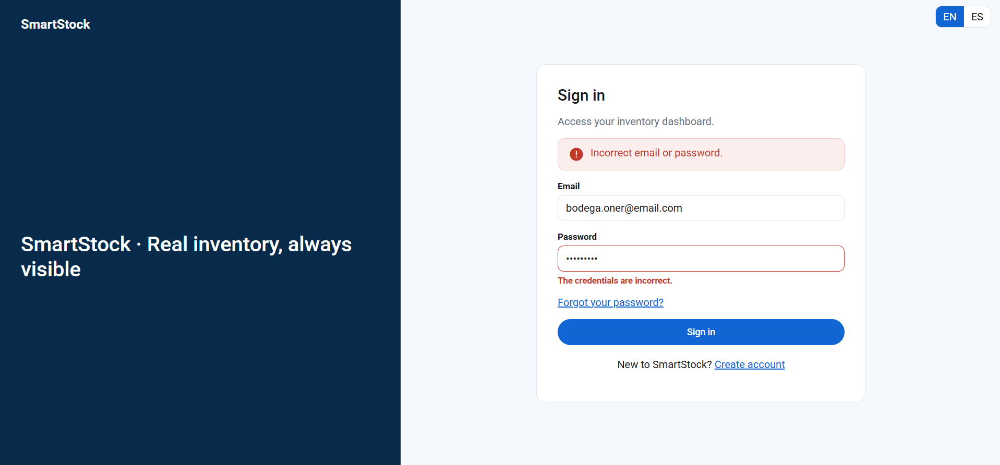

*Nota.* Elaboración propia

**Figura 164**  
*Recuperación de contraseña: solicitud del enlace y confirmación de envío (US03)*

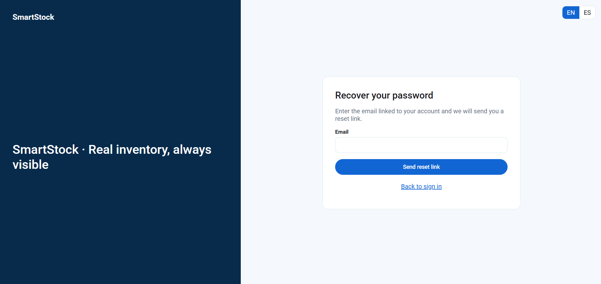

*Nota.* Elaboración propia

**Figura 165**  
*Ventas: (a) venta registrada, (b) rechazo por stock insuficiente, (c) historial por fechas y (d) detalle con movimiento de salida (US26, US27, US28)*

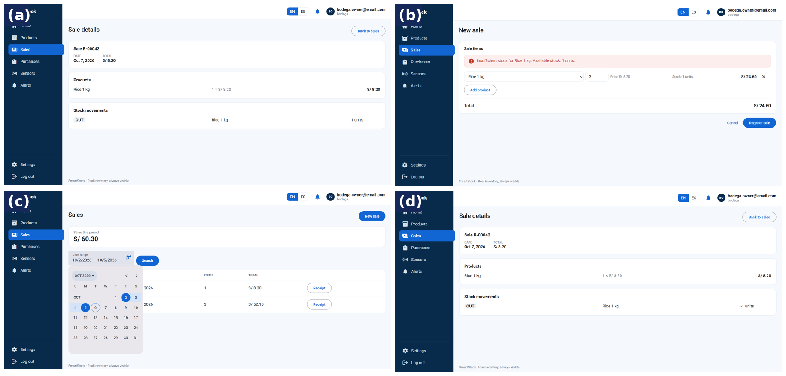

*Nota.* Elaboración propia

**Figura 166**  
*Vinculación de sensor a un producto y error de sensor en uso (US04)*

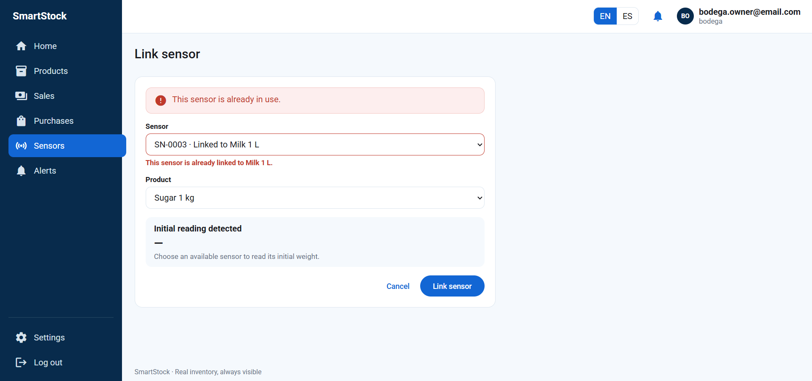

*Nota.* Elaboración propia

**Figura 167**  
*Estado de conexión de sensores en línea y desconectados (US06)*

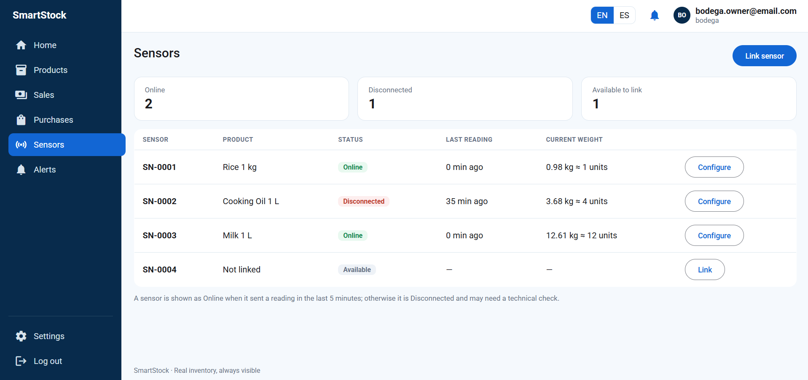

*Nota.* Elaboración propia

**Figura 168**  
*Configuración de notificaciones por correo y WhatsApp (US09, US10)*

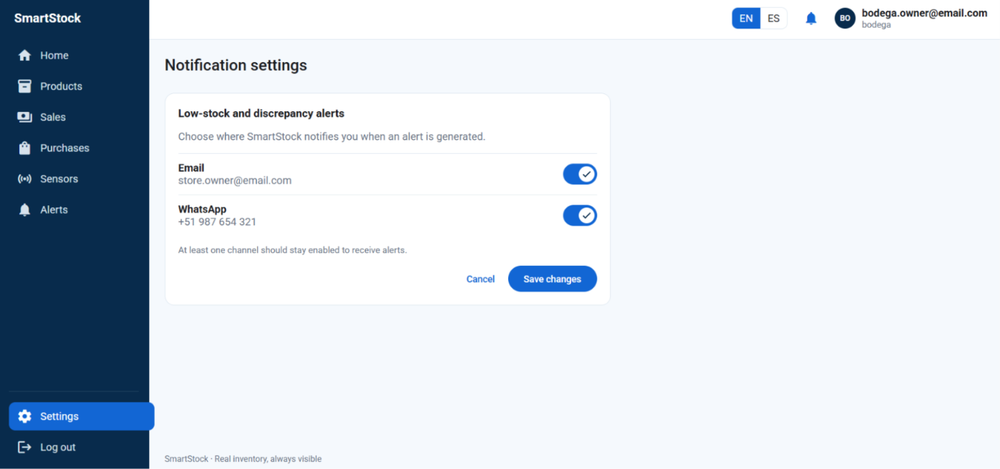

*Nota.* Elaboración propia

**Figura 169**  
*Alertas activas y botón de compra desde una alerta de stock bajo (US12, US32)*

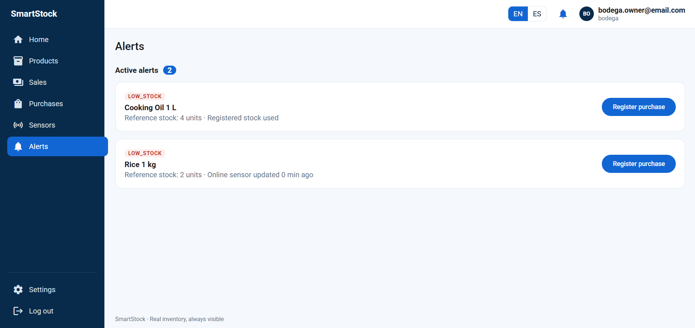

*Nota.* Elaboración propia

**Figura 170**  
*Catálogo: (a) registro de producto, (b) edición con stock de solo lectura y (c) umbral mínimo con error de capacidad máxima (US13, US14, US05)*

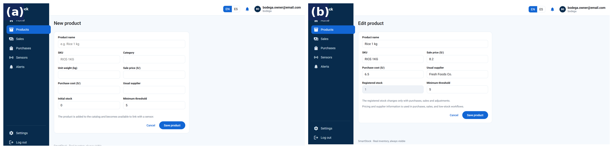

*Nota.* Elaboración propia

**Figura 171**  
*Proveedores y compras: (a) proveedor creado, (b) compra pendiente, (c) compra recibida y (d) historial por fechas (US29, US30, US31)*

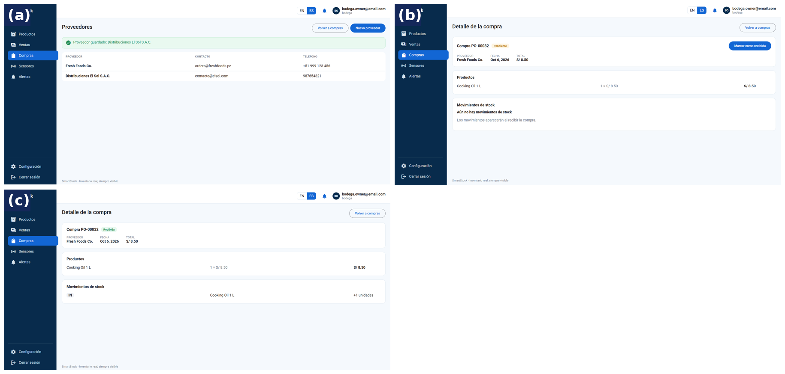

*Nota.* Elaboración propia

**Figura 172**  
*Monitoreo de inventario: (a) productos por nivel de stock, (b) detalle con peso actual y (c) comparación físico vs. registrado (US07, US08, US11)*

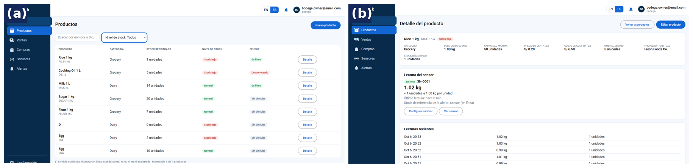

*Nota.* Elaboración propia

**Figura 173**  
*Dashboard con ventas y compras del día, y reporte por período (US15, US25)*

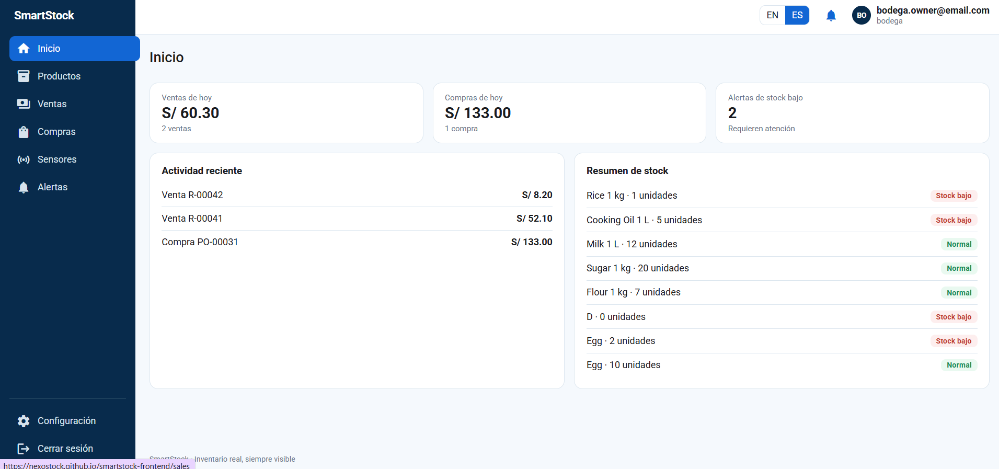

*Nota.* Elaboración propia

#### 5.2.2.6. Services Documentation Evidence for Sprint Review

En el Sprint 2 el equipo documentó con OpenAPI los contratos de los endpoints que las pantallas consumen a través de la Fake API: los de las Technical Stories TS01 a TS15 y los de autenticación que usan las pantallas de registro y recuperación. Los Web Services reales (Spring Boot) se implementarán en el Sprint 3 con el mismo contrato; por eso aún no existe el repositorio de Web Services ni hay commits de documentación en este sprint. La especificación se redactó en formato OpenAPI 3.0.3 utilizando Swagger Editor y se visualiza mediante Swagger UI (Figuras 186 y 187). Los contratos se documentan con el prefijo /api del backend real; la Fake API desplegada los expone en la raíz, sin ese prefijo (por ejemplo, POST /auth/login). Los códigos de error siguen el formato { code, ...detalle } que devuelve la Fake API.

**Tabla 41**  
*Documentación de los endpoints de la Fake API / Web Services del Sprint 2*

| Endpoint | Método | Acción | Parámetros | Ejemplo de request | Response y explicación | TS |
| --- | --- | --- | --- | --- | --- | --- |
| `/api/auth/register` | POST | Registra una cuenta | — | `{ "businessName": "Bodega Luna", "email": "ana@bodega.pe", "password": "•••", "businessType": "bodega" }` | 201 con la sesión { token, email, businessName, businessType }; 400 INCOMPLETE si faltan datos; 409 EMAIL_TAKEN si el correo ya está registrado | TS04 |
| `/api/auth/login` | POST | Valida credenciales | — | `{ "email": "ana@bodega.pe", "password": "•••" }` | 200 con la sesión; 401 INVALID_CREDENTIALS sin indicar qué dato falló (R3) | TS04 |
| `/api/auth/forgot-password` | POST | Solicita el enlace de recuperación | — | `{ "email": "ana@bodega.pe" }` | 200 con { sent: true, email, expiresInHours: 24 }; la respuesta es la misma si el correo no existe (R4) | TS04 |
| `/api/sensores/{id}/lecturas` | POST | Recibe una lectura de peso del sensor | id (ruta) | `{ "peso": 12.4 }` | 201 con { id }; 404 SENSOR_NOT_FOUND; 400 INVALID_WEIGHT | TS01 |
| `/api/sensores/{id}/estado` | GET | Retorna el estado de conexión del sensor | id (ruta) | — | 200 con { estado, ultimaLecturaAt, pesoKg }; desconectado tras 5 minutos sin lecturas (R11); 404 NOT_FOUND | TS05 |
| `/api/sensores` | GET | Lista los sensores con su producto vinculado | — | — | 200 con la lista de sensores | TS05 |
| `/api/sensores/vincular` | POST | Vincula un sensor a un producto | — | `{ "sensorId": 1, "productoId": 3 }` | 200 con el sensor vinculado; 409 SENSOR_IN_USE si el sensor ya está vinculado; 409 PRODUCT_HAS_SENSOR (R9) | TS05 |
| `/api/sensores/{id}/umbral` | PUT | Configura el umbral mínimo de stock | id (ruta) | `{ "umbralMinimo": 5 }` | 200 con el producto; 422 THRESHOLD_INVALID o THRESHOLD_EXCEEDS_CAPACITY (R7); 404 NOT_FOUND | TS13 |
| `/api/productos` | GET | Lista los productos | — | — | 200 con la lista, con stock registrado y sensor vinculado | TS13 |
| `/api/productos` | POST | Registra un producto | — | `{ "nombre": "Rice 1 kg", "categoria": "Grocery", "pesoUnitario": 1, "precioVenta": 4.5, "costoCompra": 3.2, "umbralMinimo": 5, "capacidadMaxima": 100 }` | 201 con el producto creado (stock inicial 0); 400 INVALID_PRODUCT con el detalle de errores por campo (R5, R7) | TS13 |
| `/api/productos/{id}` | GET / PUT | Consulta y edita un producto | id (ruta) | PUT: precio de venta, costo de compra y proveedor habitual | 200 con el producto; el stock no se edita (R17); 400 INVALID_PRODUCT; 404 NOT_FOUND | TS13 |
| `/api/productos/{id}/stock` | GET | Retorna el stock actual del producto | id (ruta) | — | 200 con peso y cantidad; 404 NOT_FOUND | TS02 |
| `/api/productos/{id}/detalle` | GET | Retorna el detalle con peso actual y últimas lecturas | id (ruta) | — | 200 con el producto y las últimas cinco lecturas; 404 NOT_FOUND | TS02 |
| `/api/inventario/comparacion/{productoId}` | GET | Compara el inventario físico con el registrado | productoId (ruta) | — | 200 con ambos valores, la diferencia y su porcentaje; 404 NOT_FOUND | TS06 |
| `/api/ventas` | POST | Registra una venta | — | `{ "items": [{ "productoId": 3, "cantidad": 2, "precioUnitario": 4.5 }] }` | 201 con { id }; 400 NO_ITEMS o INVALID_QUANTITY; 422 INSUFFICIENT_STOCK (producto y stock disponible) o NO_SALE_PRICE (R13, R14); crea movimientos de salida (R17) | TS07 |
| `/api/ventas` | GET | Lista las ventas | desde, hasta (fecha) | — | 200 con { ventas, total } del rango | TS08 |
| `/api/ventas/{id}` | GET | Detalle de una venta | id (ruta) | — | 200 con ítems, total y movimientos de stock; 404 NOT_FOUND | TS08 |
| `/api/proveedores` | POST | Registra un proveedor | — | `{ "nombre": "Distribuidora Sol", "telefono": "987654321" }` | 201 con el proveedor; 400 INCOMPLETE; 409 DUPLICATE_SUPPLIER (R8) | TS09 |
| `/api/proveedores` | GET | Lista los proveedores | — | — | 200 con la lista de proveedores | TS09 |
| `/api/compras` | POST | Registra una compra pendiente | — | `{ "proveedorId": 1, "items": [{ "productoId": 3, "cantidad": 24, "costoUnitario": 2.5 }] }` | 201 con la orden en estado pendiente, sin cambiar el stock; 400 NO_ITEMS o INVALID_QUANTITY; 404 SUPPLIER_NOT_FOUND o PRODUCT_NOT_FOUND | TS10 |
| `/api/compras/{id}/recepcion` | PATCH | Recibe la compra y suma el stock | id (ruta) | — | 200 con la compra recibida; crea movimientos de entrada (R15, R16); 409 ALREADY_RECEIVED; 404 NOT_FOUND | TS11 |
| `/api/compras` | GET | Lista las compras | desde, hasta (fecha) | — | 200 con la lista y el total del rango | TS12 |
| `/api/compras/{id}` | GET | Detalle de una compra | id (ruta) | — | 200 con ítems y estado; 404 NOT_FOUND | TS12 |
| `/api/movimientos-stock` | GET | Lista los movimientos de stock | desde, hasta (fecha) | — | 200 con movimientos (tipo, origen, cantidad) | TS15 |
| `/api/notificaciones/stock-bajo` | POST | Dispara el envío de una alerta de stock bajo | — | `{ "productoId": 3 }` | 202 con { sent: true, at }; 404 ALERT_NOT_FOUND | TS03 |
| `/api/canales-notificacion` | PUT | Guarda los canales de notificación | — | `[{ "id": 1, "activo": true }, { "id": 2, "activo": false }]` | 200 con los canales; 422 AT_LEAST_ONE_CHANNEL | TS03 |
| `/api/alertas` | GET | Lista las alertas activas | — | — | 200 con las alertas (stock bajo y discrepancia mayor al 10 %) | TS14 |
| `/api/dashboard` | GET | Resumen del dashboard | — | — | 200 con tarjetas de ventas y compras del día, alertas y productos | TS14 |
| `/api/reportes` | GET | Reporte de consumo y movimientos | desde, hasta (fecha) | — | 200 con el reporte del período (solo minimarket) | TS15 |

*Nota.* Los códigos de respuesta y de error fueron contrastados con el código de la Fake API (server/routes). Elaboración propia

La Tabla 42 resume la relación entre cada contexto, los recursos implementados y la Technical Story asociada.

**Tabla 42**  
*Relación de endpoints implementados por contexto*

| Contexto | Recurso (endpoint base) | Acciones implementadas | TS relacionadas |
| --- | --- | --- | --- |
| IAM | `/api/auth/login, /register, /forgot-password` | POST | TS04 |
| IoT Device | `/api/sensores, /api/sensores/{id}/lecturas, /estado, /vincular` | GET, POST | TS01, TS05 |
| Product Catalog | `/api/productos, /api/productos/{id}, /api/sensores/{id}/umbral` | GET, POST, PUT | TS13 |
| Inventory Monitoring | `/api/productos/{id}/stock, /detalle, /api/inventario/comparacion/{productoId}` | GET | TS02, TS06 |
| Inventory – Ventas | `/api/ventas, /api/ventas/{id}` | GET, POST | TS07, TS08 |
| Inventory – Compras | `/api/proveedores, /api/compras, /api/compras/{id}, /api/compras/{id}/recepcion` | GET, POST, PATCH | TS09, TS10, TS11, TS12 |
| Inventory – Movimientos | `/api/movimientos-stock` | GET | TS15 |
| Alerts & Restocking | `/api/alertas, /api/notificaciones/stock-bajo, /api/canales-notificacion` | GET, POST, PUT | TS03, TS14 |
| Analytics & Reporting | `/api/dashboard, /api/reportes` | GET | TS14, TS15 |

*Nota.* Elaboración propia

**Figura 174**  
*Especificación OpenAPI de la Fake API en Swagger Editor*

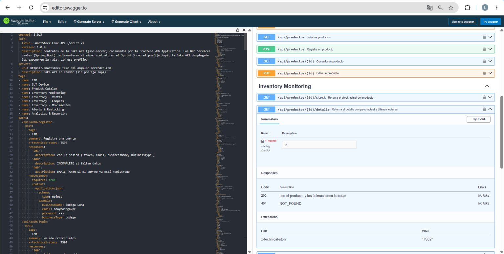

*Nota.* Elaboración propia

**Figura 175**  
*Documentación de los endpoints en Swagger UI*

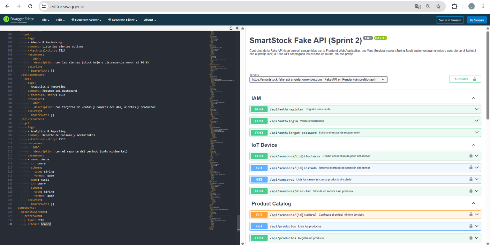

*Nota.* Elaboración propia

#### 5.2.2.7. Software Deployment Evidence for Sprint Review

Durante el Sprint 2 el alcance de despliegue correspondió a la primera versión de la Frontend Web Application, publicada en GitHub Pages desde la rama main, a la que se integró mediante la rama release/1.0.0 (PR #21) y quedó etiquetada como v1.0.0. El Landing Page, publicado en el Sprint 1, se actualizó para que su botón de registro redirija a la aplicación desplegada (PR #1 y PR #2 del repositorio del Landing Page). Los Web Services no forman parte de este sprint.

**Tabla 43**  
*Evidencia de despliegue del Sprint 2*

| Producto | Repositorio | URL desplegada | Versión | Estado |
| --- | --- | --- | --- | --- |
| Landing Page | https://github.com/NexoStock/smartstock-landing-page | https://nexostock.github.io/smartstock-landing-page/ | v1.1.0 | Desplegado en el Sprint 1; actualizado en el Sprint 2 (registro hacia el frontend) |
| Frontend Web Application | https://github.com/NexoStock/smartstock-frontend | https://nexostock.github.io/smartstock-frontend/ | v1.0.0 | Primera versión desplegada |
| Fake API (json-server) | https://github.com/NexoStock/smartstock-frontend/tree/main/server | https://smartstock-fake-api-angular.onrender.com | v1.0.0 | Desplegada |
| Web Services | [aún no creado; Spring Boot] | — | — | Previsto para el Sprint 3 |

*Nota.* Elaboración propia

Las actividades de despliegue fueron: (1) habilitar GitHub Pages con Source: GitHub Actions; (2) crear el workflow deploy.yml («Deploy to GitHub Pages»), que al integrar en main ejecuta un job build (Node 22, npm ci y ng build con --base-href /smartstock-frontend/, copia de index.html como 404.html para el enrutamiento) y un job deploy; (3) preparar la rama release/1.0.0 con cuatro commits de la tarea T-SH.1: versión 1.0.0 en package.json, el workflow, la ruta relativa de las traducciones (i18n/<contexto>/) para que funcionen bajo la ruta base de GitHub Pages, y la URL de la Fake API en environment.ts; (4) actualizar el Landing Page: en el repositorio del Landing Page se cambió APP_URL de http://localhost:4200 a https://nexostock.github.io/smartstock-frontend y se integró a main mediante los PR #1 y #2; y (5) verificar la URL pública. En la primera ejecución el job deploy fue rechazado por las reglas de protección del entorno github-pages, que no permitían la rama main; se agregó main a las ramas permitidas y la reejecución del workflow terminó con éxito. Finalmente se publicó la etiqueta v1.0.0 y la rama main se integró de vuelta en develop mediante el PR #22, de modo que ambas ramas quedaron con el mismo contenido.

Como json-server no corre en GitHub Pages, la Fake API se publicó como Web Service de Node en Render (plan gratuito): repositorio NexoStock/smartstock-frontend, rama main, comando de inicio node server/server.js --simulate y variable NODE_VERSION=22. Implementa los contratos documentados en 5.2.2.6 y, al ser plan gratuito, se suspende tras unos 15 minutos sin uso: la primera petición tarda cerca de un minuto y sus datos en memoria se reinician. Cuando exista el backend, solo cambia apiBaseUrl en src/environments/environment.ts.

El despliegue se verificó abriendo el Landing Page y comprobando que el botón de registro abre la pantalla /sign-up del frontend desplegado, y luego abriendo la URL pública del frontend, iniciando sesión con un usuario de prueba, navegando entre los contextos en inglés y español, recargando la página (lo que prueba el 404.html) y confirmando que las peticiones van a la Fake API.

**Figura 176**  
*Configuración de GitHub Pages con GitHub Actions como fuente*

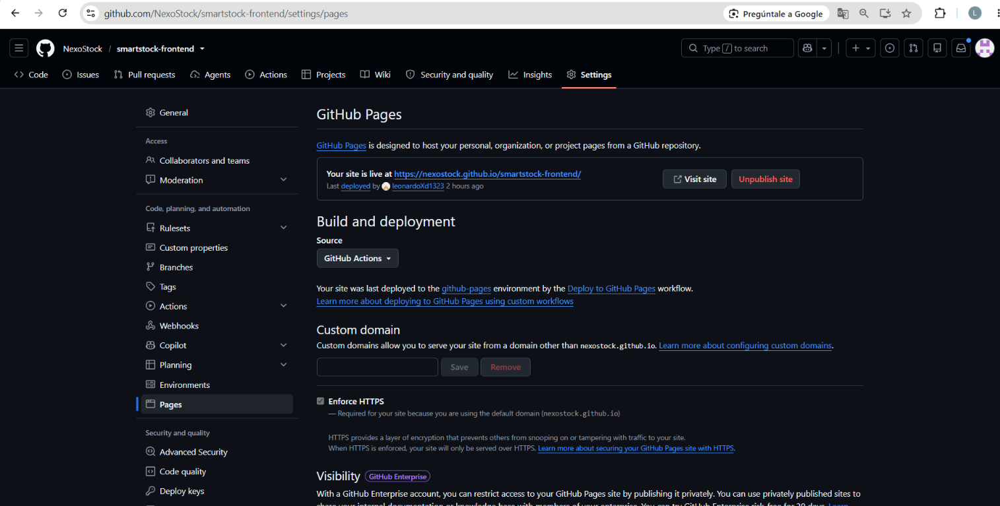

*Nota.* Pages del repositorio NexoStock/smartstock-frontend; la aplicación se publica con el workflow deploy.yml al integrar en main. Elaboración propia

**Figura 177**  
*Ejecución del workflow «Deploy to GitHub Pages» con los jobs build y deploy exitosos*

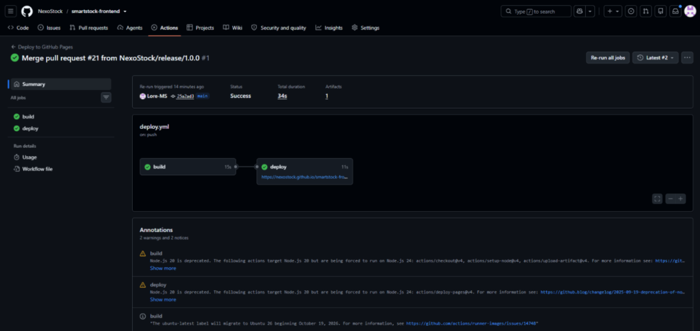

*Nota.* Ejecución disparada por el merge del PR #21 en main. En la primera corrida, deploy fue rechazado por las reglas del entorno github-pages (no permitían main); tras permitirla, la reejecución terminó con éxito. Elaboración propia

**Figura 178**  
*Fake API desplegada en Render (Live, rama main)*

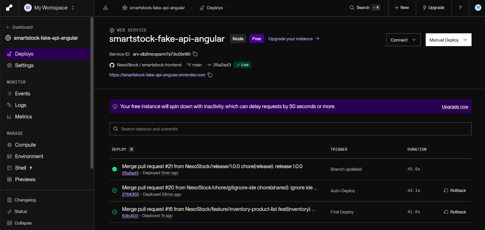

*Nota.* Web Service de Node, plan Free, repositorio NexoStock/smartstock-frontend, rama main, URL https://smartstock-fake-api-angular.onrender.com. Elaboración propia

**Figura 179**  
*Etiqueta v1.0.0 del repositorio*

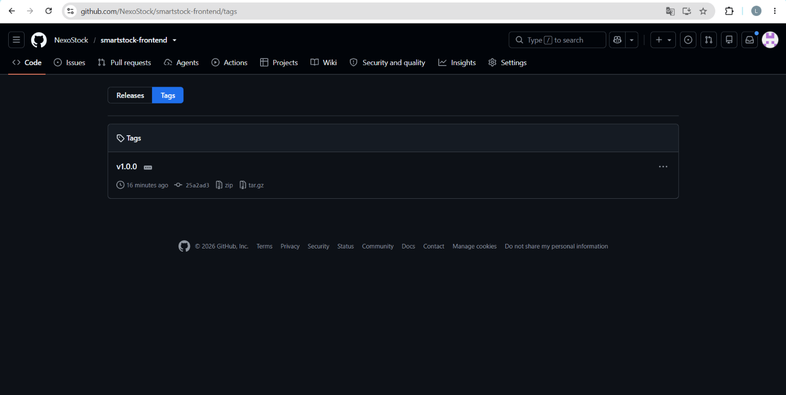

*Nota.* Elaboración propia

**Figura 180**  
*Frontend Web Application funcionando en su URL pública*

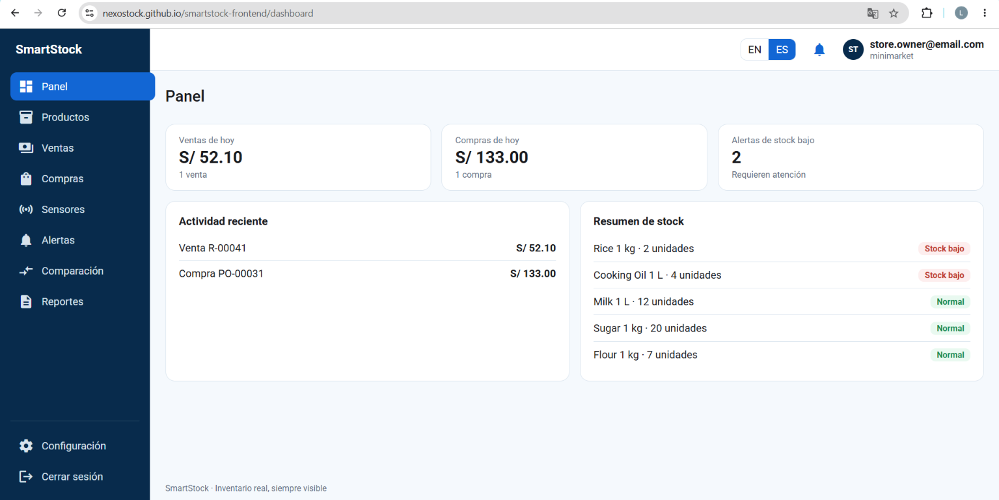

*Nota.* (a) Dashboard con datos de la Fake API en inglés; (b) el mismo dashboard en español. Elaboración propia

#### 5.2.2.8. Team Collaboration Insights during Sprint

Durante el Sprint 2, el equipo organizó la implementación según los aspectos definidos en la sección 5.2.2.2. Cada integrante trabajó sobre el contexto que lideraba y registró su aporte mediante commits propios en el repositorio NexoStock/smartstock-frontend, aplicando GitFlow y Conventional Commits. El flujo de trabajo seguido se resume en la Tabla 44.

**Tabla 44**  
*Flujo de ramas de GitFlow seguido en el Sprint 2*

| Rama | Nace de | Se integra en | Regla |
| --- | --- | --- | --- |
| main | — | — | Recibe únicamente las versiones publicadas; solo se modifica mediante pull request. |
| develop | — | — | Concentra el avance acumulado del sprint; solo se modifica mediante pull request. |
| `feature/<contexto>-<tarea>` | develop | develop | Una rama corta por tarea del Sprint Backlog; se integra mediante pull request revisado por otro integrante, con merge commit (`--no-ff`). |
| `release/<x.y.z>` | develop | main y de vuelta a develop | Prepara la versión a entregar; al integrarse en main se etiqueta con versionado semántico (vX.Y.Z). |

*Nota.* Elaboración propia

Los mensajes de commit siguen Conventional Commits (feat, fix, docs, refactor, test, chore), en inglés, con el contexto como alcance, por ejemplo feat(iam): add login view. El identificador de la tarea se registra en el cuerpo del mensaje.

##### Analíticos de colaboración de los repositorios

La vista de contribuyentes de GitHub y la vista Pulse muestran la participación de los cinco integrantes del equipo en el repositorio, con commits distribuidos entre los contextos que cada uno lideró (Figuras 181 y 182).

**Figura 181**  
*Contributors del repositorio NexoStock/smartstock-frontend*

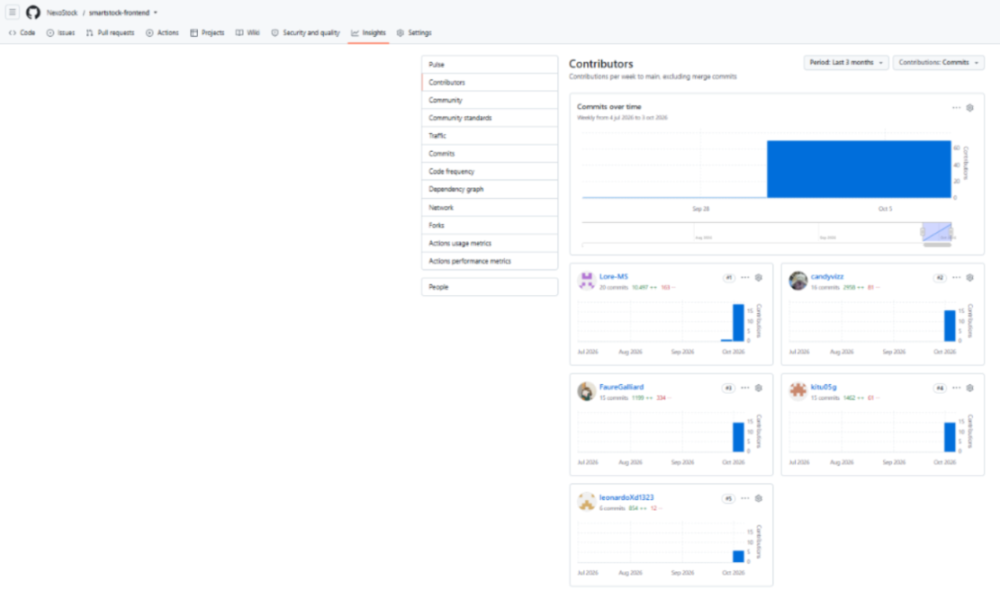

*Nota.* Elaboración propia

**Figura 182**  
*Pulse del repositorio NexoStock/smartstock-frontend*

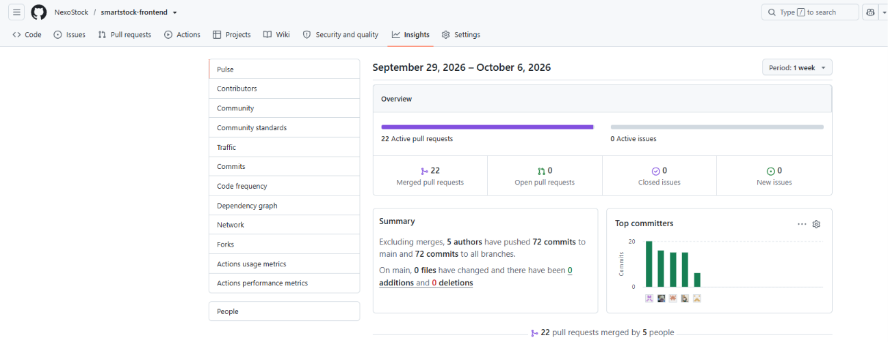

*Nota.* Elaboración propia

##### Historial de ramas de los repositorios

El grafo de red muestra la aplicación efectiva de GitFlow: las ramas de feature nacen de develop y se integran nuevamente a ella mediante merge commits, y la rama main recibe únicamente la versión publicada a través de release/1.0.0.

**Figura 183**  
*Network graph del repositorio NexoStock/smartstock-frontend*

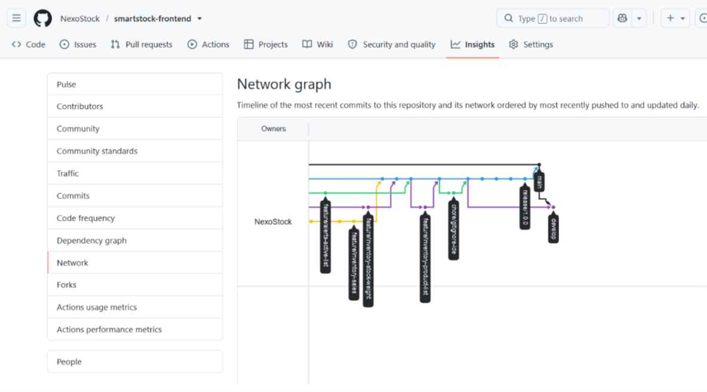

*Nota.* Elaboración propia